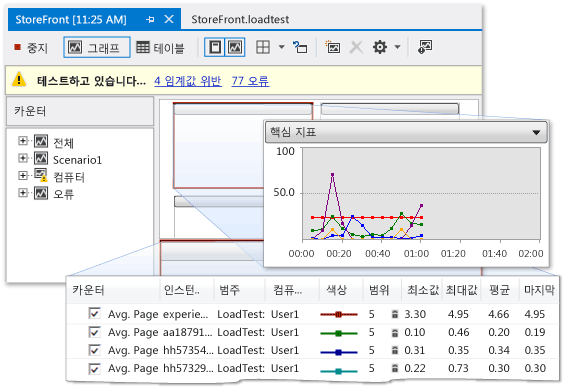

# SharePoint 응용 프로그램 성능 프로파일링
 
SharePoint 응용 프로그램 느리거나 비효율적으로 수행 하는 경우 Visual Studio에서 문제가 있는 코드 및 기타 요소를 식별 하는 프로 파일링 기능을 사용할 수 있습니다. 부하 테스트 기능을 사용 하 여 작업량이 많은 사용자에 액세스할 때 응용 프로그램이 동시에 같은 SharePoint 응용 프로그램이 수행 하는 방법을 확인할 수 있습니다. 웹 성능 테스트를 실행 하 여 웹 응용 프로그램 성능을 측정할 수 있습니다. 코딩 된 UI 테스트를 사용 하 여 전체 SharePoint 응용 프로그램을 해당 사용자 인터페이스를 포함 하 여 올바르게 작동 하는지 확인할 수 있습니다. 이러한 테스트를 함께 사용할 때는 응용 프로그램을 배포 하기 전에 성능 문제를 확인할 수 수 있습니다.

## 프로파일링 도구 개요

프로 파일링을 관찰 하 고이 실행 될 때 응용 프로그램의 성능 작동을 기록 하는 과정을 가리킵니다. 응용 프로그램 프로 파일링, 병목과 비효율적인 코드 때문에 느리게 실행 하거나 너무 많은 메모리를 사용 하 여 응용 프로그램이 메모리 할당 문제 등의 문제를 확인할 수 있습니다. 예를 들어 프로 파일링 코드 세그먼트를 자주 호출 되 고 응용 프로그램의 전반적인 성능이 저하 될 수 있는 코드에 핫스폿을 식별 하려면 사용할 수는 있습니다. 핫스팟을 식별 한 후 종종 최적화 하거나 제거할 수 있습니다.

확인 하 고 이러한 종류의 성능 문제를 찾이 통합된 개발 환경 (IDE)에서 여러 프로 파일링 도구를 사용할 수 있습니다. 이러한 도구는 방식은 다른 종류의 Visual Studio 프로젝트 SharePoint 프로젝트에서 동일한 방식으로 작동 합니다. 프로 파일링 도구 성능 마법사 지정 하는 테스트를 사용 하는 성능 세션을 만드는 과정을 안내 합니다. 성능 세션은 하나 이상의 프로 파일링 실행의 결과 함께 응용 프로그램에서 성능 정보 수집에 사용 되는 구성 데이터 집합입니다. 성능 세션 하면 프로젝트 폴더에 저장 되 고에서 볼 수 있습니다 **성능 탐색기**합니다. 자세한 내용은 [성능 컬렉션 메서드 이해](/visualstudio/profiling/understanding-performance-collection-methods)를 참조하세요.

만들고 응용 프로그램에 대 한 프로필 분석을 실행 한 후 보고서의 성능에 대 한 세부 정보를 제공 합니다. 이 보고서는 시간, 계층적 함수 호출 스택을 또는 호출 트리를 통해 CPU 사용량 그래프 등의 항목을 포함할 수 있습니다. 보고서의 정확한 내용을 샘플링 또는 계측 등 실행 하는 테스트의 유형에 따라 달라질 수 있습니다. 자세한 내용은 참조 [프로 파일링 도구 보고서 개요](http://go.microsoft.com/fwlink/?LinkId=224689)합니다.

## 성능 세션 프로세스

응용 프로그램을 프로 파일링 하려면 성능 세션을 만드는 프로 파일링 도구 성능 마법사를 사용 하 여 시작 합니다. 메뉴 모음에서 **분석**, **성능 마법사 시작**합니다. 마법사를 완료 한 후 성능 세션, 예: 원하는 프로필 방법 및 프로 파일링 할 응용 프로그램에 대 한 필요한 정보를 입력 합니다. 자세한 내용은 참조 [하는 방법: 성능 마법사 웹 사이트 또는 사용 하 여 웹 응용 프로그램을 프로 파일링](http://go.microsoft.com/fwlink/?LinkId=224692)합니다. 대신 명령줄 옵션을 설정 하 고 성능 세션 실행에 사용할 수 있습니다. 자세한 내용은 참조 [는 프로 파일링 도구에서의 명령줄을 사용 하 여](http://go.microsoft.com/fwlink/?LinkId=224703)합니다. 성능 세션의 모든 측면을 수동으로 구성 하려면 참조 [하는 방법: 수동으로 만드는 성능 세션 프로 파일링 도구와 함께](http://go.microsoft.com/fwlink/?LinkId=224691)합니다. By, 단위 테스트에서 성능 세션에서 만들 수도 **테스트 결과** 창, 단위 테스트에 대 한 바로 가기 메뉴를 열고 선택한 다음 **성능 세션 만들기**합니다.

성능 세션을 설정한 후 세션 구성이 저장, 프로 파일링 데이터를 제공 하도록 서버 구성 및 응용 프로그램을 실행 합니다. 응용 프로그램을 사용 하 여 성능 데이터 로그 파일에 기록 됩니다. 성능 세션에 나열 된 **성능 탐색기** 아래는 **대상** 폴더입니다. 성능 세션 완료 되 면 해당 보고서에 표시 된 **보고서** 폴더에 **성능 탐색기**합니다. 보고서를 표시 하려면 열 **성능 탐색기**합니다. 를 확인 하거나 성능 세션의 속성을 구성 하려면에서 해당 바로 가기 메뉴를 열고 **성능 탐색기**를 선택한 후 **속성**합니다. 성능 세션의 특정 속성에 대 한 자세한 내용은 참조 [프로 파일링 도구 성능 세션 구성](http://go.microsoft.com/fwlink/?LinkId=224694)합니다. 성능 세션의 결과 해석 하는 방법에 대 한 정보를 참조 하십시오. [프로 파일링 도구 데이터 분석](http://go.microsoft.com/fwlink/?LinkId=224704)합니다.

## 스트레스 테스트

Visual Studio에서 부하 테스트 및 웹 성능 테스트를 만들어 응용 프로그램의 스트레스 성능을 분석할 수 있습니다. Visual Studio에서 부하 테스트를 만들 때 호출에 대해 응용 프로그램을 테스트 하는 시나리오 요소의 조합을 지정 합니다. 이러한 요소는 부하 패턴, 테스트 조합 모델, 테스트 조합, 네트워크 목록 및 웹 브라우저 조합에 포함 됩니다. 부하 테스트 시나리오에는 단위 테스트 및 웹 성능 테스트를 모두 포함할 수 있습니다.

그림 1: 부하 테스트 결과 예

웹 성능 테스트는 최종 사용자는 SharePoint 응용 프로그램와 상호 작용할 수도 방법을 시뮬레이션 합니다. 브라우저 세션에서 HTTP 요청을 기록 하거나 사용 하 여 웹 성능 테스트를 만들 수는 **웹 성능 테스트 레코더**합니다. 웹 요청에 표시 된 **웹 성능 테스트 편집기** 브라우저 세션이 완료 된 후입니다. 결과 디버깅할 수 있습니다는 **웹 성능 테스트 결과 뷰어**합니다. 사용 하 여 웹 성능 테스트를 수동으로 빌드할 수는 **웹 성능 테스트 편집기**합니다.

## 사용자 인터페이스 테스트

코딩 된 UI 테스트는 자동으로 해당 사용자 인터페이스 (UI)를 통해 SharePoint 응용 프로그램을 구동 합니다. 이러한 테스트는 UI 컨트롤, 단추, 메뉴, 올바르게 작동 하는지 확인 하려면 등을 다룹니다. 이 유형의 테스트 유효성 검사 또는 기타 논리가 수행 되는 UI에서와 같은 웹 페이지에 특히 유용 합니다. 코딩 된 UI 테스트를 사용 하 여 수동 테스트를 자동화할 수 있습니다. 만드는 코딩 된 UI 테스트 SharePoint 응용 프로그램에 대 한 같은 방식으로 다른 유형의 응용 프로그램에 대 한 테스트를 만들 때. 자세한 내용은 참조 [테스트 SharePoint 2010 응용 프로그램을 코딩 된 UI 테스트](/visualstudio/test/testing-sharepoint-2010-applications-with-coded-ui-tests)합니다.

## 관련 항목

|제목|설명|
|-----------|-----------------|
|[연습: SharePoint 응용 프로그램 프로파일링](../sharepoint/walkthrough-profiling-a-sharepoint-application.md)|SharePoint 응용 프로그램에서 샘플링 프로필 분석을 수행 하는 방법을 보여 줍니다.|
|[릴리스 전에 앱 성능 테스트](https://www.visualstudio.com/docs/test/performance-testing/run-performance-tests-app-before-release)|SharePoint 응용 프로그램 스트레스 테스트 하는 데 있는 부하 테스트를 만드는 방법을 설명 합니다.|
|[코드 단위 테스트](/visualstudio/test/unit-test-your-code)|단위 테스트를 사용 하 여 코드에서 논리 오류를 확인 하는 방법에 설명 합니다.|
|[코딩된 UI 테스트를 사용하여 SharePoint 2010 응용 프로그램 테스트](/visualstudio/test/testing-sharepoint-2010-applications-with-coded-ui-tests)|SharePoint 응용 프로그램의 사용자 인터페이스를 테스트 하는 방법에 설명 합니다.|

## 참고자료

[SharePoint 솔루션 빌드 및 디버깅](../sharepoint/building-and-debugging-sharepoint-solutions.md)  
[코드 품질 향상](/visualstudio/test/improve-code-quality)