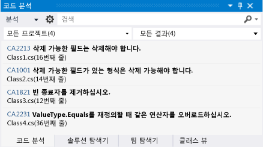
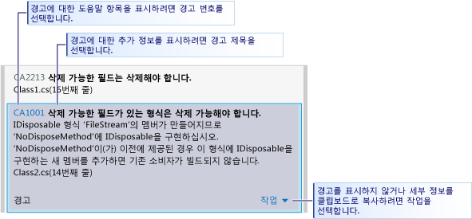
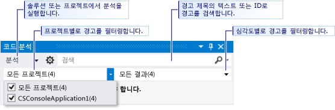

# Visual Studio 정적 코드 분석을 사용하여 스토어 앱의 Visual Basic 및 C# 코드 품질 분석
[!INCLUDE[vs2017banner](../code-quality/includes/vs2017banner.md)]

  
  
 Visual Studio Express의 코드 분석 도구는 코드에 일련의 일반적인 오류 및 바람직한 프로그래밍 관행의 위반 사항이 있는지 검사합니다.  코드 분석 도구는 올바르지만 해당 코드를 사용하는 당사자나 다른 사용자에게 문제를 일으킬 수 있는 특정 코드 패턴을 검색하므로 컴파일러 오류 및 경고와는 다릅니다.  코드 분석 시 테스트를 통해 검색하기 힘든 코드 오류도 찾을 수 있습니다.  개발 프로세스에서 코드 분석 도구를 정기적으로 실행하면 완성된 응용 프로그램의 품질을 향상시킬 수 있습니다.  
  
> [!NOTE]
>  Visual Studio Ultimate, Visual Studio Premium 및 Visual Studio Professional에서는 코드 분석 기능을 모두 사용할 수 있습니다.  MSDN 라이브러리의 [코드 분석 도구를 사용하여 응용 프로그램 품질 분석](http://msdn.microsoft.com/library/dd264897.aspx)을 참조하세요.  
  
## 항목 내용  
 다음 내용을 배울 수 있습니다.  
  
 [코드 분석 실행](../test/analyze-visual-basic-and-csharp-code-quality-in-store-apps-using-visual-studio-static-code-analysis.md#BKMK_Run)  
  
 [코드 분석 경고 분석 및 해결](../test/analyze-visual-basic-and-csharp-code-quality-in-store-apps-using-visual-studio-static-code-analysis.md#BKMK_Analyze)  
  
 [코드 분석 경고 표시하지 않기](../test/analyze-visual-basic-and-csharp-code-quality-in-store-apps-using-visual-studio-static-code-analysis.md#BKMK_Suppress)  
  
 [코드 분석 결과 검색 및 필터링](../test/analyze-visual-basic-and-csharp-code-quality-in-store-apps-using-visual-studio-static-code-analysis.md#BKMK_Search)  
  
 [Visual Basic 및 C# 코드 분석 경고](../test/analyze-visual-basic-and-csharp-code-quality-in-store-apps-using-visual-studio-static-code-analysis.md#BKMK_Warnings)  
  
##   코드 분석 실행  
 Visual Studio 솔루션에서 코드 문석을 실행하려면 다음을 수행합니다.  
  
-   **빌드** 메뉴에서 **솔루션에서 코드 분석 실행**을 선택합니다.  
  
 프로젝트를 빌드할 때마다 자동으로 코드 분석을 실행하려면 다음을 수행합니다.  
  
1.  솔루션 탐색기에서 프로젝트 이름을 마우스 오른쪽 단추로 클릭한 다음 **속성**을 선택합니다.  
  
2.  프로젝트 속성 페이지에서 **코드 분석**을 선택한 다음 **빌드에 코드 분석 사용\(CODE\_ANALYSIS 상수 정의\)**을 선택합니다.  
  
 솔루션이 컴파일되고 코드 분석이 실행됩니다.  코드 분석 창에 결과가 나타납니다.  
  
   
  
##   코드 분석 경고 분석 및 해결  
 특정 경고를 분석하려면 코드 분석 창에서 경고 제목을 클릭합니다.  경고가 확장되어 문제에 대한 자세한 정보가 표시됩니다.  
  
   
  
 경고를 확장하면 Visual Studio 코드 편집기에서 경고를 발생시킨 코드 줄이 강조 표시됩니다.  
  
   
  
 문제를 파악한 후 코드에서 문제를 해결할 수 있습니다.  그런 다음 코드 분석을 다시 실행하여 코드 분석 창에 더 이상 경고가 나타나지 않는지와 수정으로 인해 새로운 경고가 발생하지 않는지 확인합니다.  
  
> [!TIP]
>  코드 분석 창에서 코드 분석을 다시 실행할 수 있습니다.  **분석** 단추를 클릭한 다음 분석 범위를 선택합니다.  전체 솔루션 또는 선택한 프로젝트에 대한 분석을 다시 실행할 수 있습니다.  
  
##   코드 분석 경고 표시하지 않기  
 코드 분석 경고를 수정하지 않도록 결정하는 경우가 있습니다.  경고를 해결하려면 코드의 실제 구현에서 문제가 발생할 가능성과 관련하여 너무 많은 기록이 필요하다고 판단할 수 있습니다.  또는 경고에 사용되는 분석이 특정 컨텍스트에 적절하지 않다고 판단할 수도 있습니다.  코드 분석 창에 개별 경고가 나타나지 않도록 개별 경고를 표시하지 않을 수 있습니다.  
  
 경고를 표시하지 않으려면 다음을 수행합니다.  
  
1.  자세한 정보가 표시되지 않으면 경고 제목을 클릭하여 확장합니다.  
  
2.  경고 아래쪽에서 **작업** 링크를 선택합니다.  
  
3.  **메시지 표시 안 함**을 가리킨 다음 **소스** 또는 **비표시 오류\(Suppression\) 파일**을 선택합니다.  
  
    -   **소스**를 선택하면 경고를 생성시킨 메서드 위의 소스 파일에 `SuppressMessage` 특성이 삽입됩니다.  그러면 비표시 오류\(Suppression\)를 더 쉽게 검색할 수 있습니다.  
  
    -   **비표시 오류\(Suppression\) 파일**을 선택하면 프로젝트의 `SuppressMessage` 파일에 **GlobalSuppressions.cs**가 추가됩니다.  그러면 비표시 오류\(Suppression\)를 더 쉽게 관리할 수 있습니다.  또한 `SuppressMessage`에 추가된 **GlobalSuppression.cs** 특성은 경고를 발생시킨 메서드를 대상으로 합니다.  이 경우 경고가 표시되지 않는 현상이 전체적으로 적용되지는 않습니다.  
  
     경고를 소스 파일에서 표시하지 않을지 비표시 오류\(Suppression\) 파일에서 표시하지 않을지 여부는 해당 코딩 스타일과 요구에 따라 결정하면 됩니다.  
  
##   코드 분석 결과 검색 및 필터링  
 긴 경고 메시지 목록을 검색하고 다중 프로젝트 솔루션에서 경고를 필터링할 수 있습니다.  
  
   
  
 [!INCLUDE[vs_dev11_expwin_long](../porting/includes/vs_dev11_expwin_long_md.md)]에서는 모든 코드 분석 경고마다 경고의 심각도 수준이 있습니다.  
  
##   Visual Basic 및 C\# 코드 분석 경고  
 코드 분석 시 다음과 같은 경고가 발생합니다.  
  
 [CA1001: 삭제 가능한 필드가 있는 형식은 삭제 가능해야 합니다.](http://msdn.microsoft.com/library/ms182172.aspx)  
  
 [CA1821: 빈 종료자를 제거하세요.](http://msdn.microsoft.com/library/bb264476.aspx)  
  
 [CA2213: 삭제 가능한 필드는 삭제해야 합니다.](http://msdn.microsoft.com/library/ms182328.aspx)  
  
 [CA2229: serialization 생성자를 구현하세요.](http://msdn.microsoft.com/library/ms182343.aspx)  
  
 [CA2231: ValueType.Equals를 재정의할 때 같음 연산자를 오버로드하세요.](http://msdn.microsoft.com/library/ms182359.aspx)