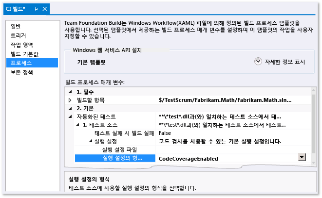

# 빌드 확인 테스트에서 코드 검사 분석
Microsoft Visual Studio의 코드 검사 분석에서는 자동화된 테스트에 의해 실행되는 코드의 양을 보여 줍니다. 자세한 내용은 [코드 검사를 사용하여 테스트할 코드 범위 결정](../test/using-code-coverage-to-determine-how-much-code-is-being-tested.md)을 참조하세요.  
  
 코드에 체크 인하면 테스트가 다른 팀원의 나머지 모든 테스트와 함께 빌드 서버에서 실행됩니다. (아직 설정하지 않은 경우 [빌드 프로세스에서 테스트 실행](http://msdn.microsoft.com/Library/d05743a1-c5cf-447e-bed9-bed3cb595e38)을 참조하세요.) 빌드 서비스에서 코드 검사를 분석하면 전체 프로젝트에 대한 최신 검사 정보를 전체적으로 파악할 수 있습니다. 또한 일반적으로 개발 컴퓨터에서 실행하지 않는 자동화된 시스템 테스트와 기타 코딩된 테스트도 포함됩니다.  
  
1.  팀 탐색기에서 **빌드**를 연 다음 빌드 정의를 추가하거나 편집합니다.  
  
2.  **프로세스** 페이지에서 **자동화된 테스트**, **테스트 소스**, **실행 설정**을 확장합니다. **실행 설정 파일 형식**을 **코드 검사 사용**으로 설정합니다.  
  
     테스트 소스 정의가 두 개 이상일 경우 각각에 대해 이 단계를 반복합니다.  
  
    -   *하지만 **실행 설정 파일 형식**이라는 필드는 없습니다.*  
  
         **자동화된 테스트**에서 **테스트 어셈블리**를 선택한 다음 줄임표 단추 **[...]**를 선택합니다. **테스트 실행 추가/편집** 대화 상자의 **Test Runner**에서 **Visual Studio Test Runner**를 선택합니다.  
  
   
  
 빌드 실행 후 코드 검사 결과가 빌드 요약에 나타납니다.  
  
## 참고 항목  
 [코드 검사를 사용하여 테스트할 코드 범위 결정](../test/using-code-coverage-to-determine-how-much-code-is-being-tested.md)

<!--HONumber=Feb17_HO4-->

