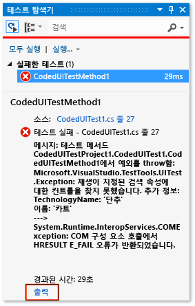
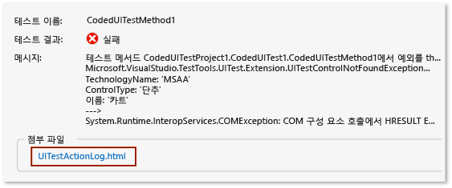

# <a name="analyzing-coded-ui-tests-using-coded-ui-test-logs"></a>코딩된 UI 테스트 로그를 사용하여 코딩된 UI 테스트 분석

코딩된 UI 테스트 로그는 코딩된 UI 테스트 실행에 대한 중요한 정보를 필터링하고 기록합니다. 로그는 문제를 신속하게 디버깅할 수 있는 형식으로 표시됩니다.

## <a name="step-1-enable-logging"></a>1단계: 로깅 사용

시나리오에 따라 다음 방법 중 하나를 사용하여 로그를 사용하도록 설정할 수 있습니다.

- 테스트 프로젝트에 *App.config* 파일이 없는 .NET Framework 버전 4를 대상으로 지정하는 경우.

   1. **QTAgent32_40.exe.config** 파일을 엽니다. 기본으로 이 파일은 *%ProgramFiles(x86)%\Microsoft Visual Studio\2017\Enterprise\Common7\IDE*에 있습니다.

   2. EqtTraceLevel의 값을 원하는 로그 수준으로 수정합니다.

   3. 파일을 저장합니다.

- 테스트 프로젝트에 *App.config* 파일이 없는 .NET Framework 버전 4.5를 대상으로 지정하는 경우.

   1. **QTAgent32.exe.config** 파일을 엽니다. 기본으로 이 파일은 *%ProgramFiles(x86)%\Microsoft Visual Studio\2017\Enterprise\Common7\IDE*에 있습니다.

   2. EqtTraceLevel의 값을 원하는 로그 수준으로 수정합니다.

   3. 파일을 저장합니다.

- 테스트 프로젝트에 *App.config* 파일이 있는 경우.

    - 프로젝트에서 *App.config* 파일을 열고 구성 노드 아래에 다음 코드를 추가합니다.

      ```xml
      <system.diagnostics>
        <switches>
          <add name="EqtTraceLevel" value="4" />
        </switches>
      </system.diagnostics>`
      ```

- 테스트 코드 자체에서 로깅을 사용하는 경우.

   <xref:Microsoft.VisualStudio.TestTools.UITesting.PlaybackSettings.LoggerOverrideState%2A> = HtmlLoggerState.AllActionSnapshot;

## <a name="step-2-run-your-coded-ui-test-and-view-the-log"></a>2단계: 코딩된 UI 테스트를 실행하고 로그 보기

현재 위치에서 **QTAgent32.exe.config** 파일을 적절하게 수정한 코딩된 UI 테스트를 실행하는 경우 테스트 탐색기 결과에 출력 링크가 표시됩니다. 로그 파일은 테스트에 실패한 경우뿐만 아니라 추적 수준이 “verbose”로 설정되었을 때 성공한 테스트의 경우에도 생성됩니다.

1.  **테스트** 메뉴에서 **창**을 선택한 다음, **테스트 탐색기**를 선택합니다.

2.  **빌드** 메뉴에서 **솔루션 빌드**를 선택합니다.

3.  테스트 탐색기에서 실행하려는 코딩된 UI 테스트를 선택하고 해당 테스트의 바로 가기 메뉴를 연 다음 **선택한 테스트 실행**을 선택합니다.

     자동화된 테스트가 실행되고 성공 또는 실패 여부를 나타냅니다.

    > [!TIP]
    > 테스트 탐색기를 보려면 **테스트** > **Windows**를 선택한 다음, **테스트 탐색기**를 선택합니다.

4.  테스트 탐색기 결과에서 **출력** 링크를 선택합니다.

     

     그러면 작업 로그에 대한 링크를 포함하는 테스트에 대한 출력이 표시됩니다.

     

5.  *UITestActionLog.html* 링크를 선택합니다.

     웹 브라우저에 로그가 표시됩니다.

     

## <a name="see-also"></a>참고 항목

- [UI 자동화를 사용하여 코드 테스트](../test/use-ui-automation-to-test-your-code.md)
- [방법: Microsoft Visual Studio에서 테스트 실행](http://msdn.microsoft.com/Library/1a1207a9-2a33-4a1e-a1e3-ddf0181b1046)