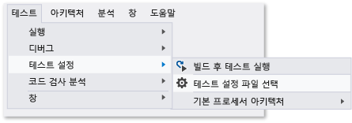

# <a name="configure-unit-tests-by-using-a-runsettings-file"></a>*.runsettings* 파일을 사용하여 단위 테스트 구성

*.runsettings* 파일을 사용하여 Visual Studio의 단위 테스트를 구성할 수 있습니다. 예를 들어, 테스트가 실행되는 .NET Framework 버전, 테스트 결과 디렉터리 또는 테스트 실행 중에 수집되는 데이터를 변경할 수 있습니다.

> [!NOTE]
> 확장명으로 '.runsettings'를 사용하면 파일 이름은 아무런 상관이 없습니다.

특별한 구성이 필요하지 않으면 *.runsettings* 파일이 필요하지 않습니다. *.runsettings* 파일은 [코드 검사 분석](../test/customizing-code-coverage-analysis.md)을 사용자 지정할 때 가장 자주 사용됩니다.

## <a name="customize-tests"></a>테스트 사용자 지정

1. XML 파일을 Visual Studio 솔루션에 추가하고 이름을 *test.runsettings*로 바꿉니다.

1. 다음에 나오는 예제에서 파일 내용을 XML 양식으로 바꾸고 필요에 따라 사용자 지정합니다.

1. **테스트** 메뉴에서 **테스트 설정** > **테스트 설정 파일 선택**을 차례로 선택합니다.

솔루션에 *.runsettings* 파일을 두 개 이상 만들고 **테스트 설정** 메뉴를 사용하여 다른 시간에 사용하거나 사용하지 않도록 설정할 수 있습니다.



## <a name="example-runsettings-file"></a>예제 *.runsettings* 파일

다음은 일반적인 *.runsettings* 파일입니다. 모든 값에는 기본값이 있으므로 파일의 각 요소는 선택 사항입니다.

```xml
<?xml version="1.0" encoding="utf-8"?>
<RunSettings>
  <!-- Configurations that affect the Test Framework -->
  <RunConfiguration>
    <MaxCpuCount>1</MaxCpuCount>
    <!-- Path relative to solution directory -->
    <ResultsDirectory>.\TestResults</ResultsDirectory>

    <!-- x86 or x64
      - You can also change it from menu Test, Test Settings, Default Processor Architecture -->
    <TargetPlatform>x86</TargetPlatform>

    <!-- Framework35 | [Framework40] | Framework45 -->
    <TargetFrameworkVersion>Framework40</TargetFrameworkVersion>

    <!-- Path to Test Adapters -->
    <TestAdaptersPaths>%SystemDrive%\Temp\foo;%SystemDrive%\Temp\bar</TestAdaptersPaths>

     <!--TestSessionTimeout is only available with Visual Studio 2017 version 15.5 and higher -->
     <!-- Specify timeout in milliseconds. A valid value should be greater than 0 -->
     <TestSessionTimeout>10000</TestSessionTimeout>
  </RunConfiguration>

  <!-- Configurations for data collectors -->
  <DataCollectionRunSettings>
    <DataCollectors>
      <DataCollector friendlyName="Code Coverage" uri="datacollector://Microsoft/CodeCoverage/2.0" assemblyQualifiedName="Microsoft.VisualStudio.Coverage.DynamicCoverageDataCollector, Microsoft.VisualStudio.TraceCollector, Version=11.0.0.0, Culture=neutral, PublicKeyToken=b03f5f7f11d50a3a">
        <Configuration>
          <CodeCoverage>
            <ModulePaths>
              <Exclude>
                <ModulePath>.*CPPUnitTestFramework.*</ModulePath>
              </Exclude>
            </ModulePaths>

            <!-- We recommend you do not change the following values: -->
            <UseVerifiableInstrumentation>True</UseVerifiableInstrumentation>
            <AllowLowIntegrityProcesses>True</AllowLowIntegrityProcesses>
            <CollectFromChildProcesses>True</CollectFromChildProcesses>
            <CollectAspDotNet>False</CollectAspDotNet>

          </CodeCoverage>
        </Configuration>
      </DataCollector>

      <!--Video data collector is only available with Visual Studio 2017 version 15.5 and higher -->
      <DataCollector uri="datacollector://microsoft/VideoRecorder/1.0" assemblyQualifiedName="Microsoft.VisualStudio.TestTools.DataCollection.VideoRecorder.VideoRecorderDataCollector, Microsoft.VisualStudio.TestTools.DataCollection.VideoRecorder, Version=15.0.0.0, Culture=neutral, PublicKeyToken=b03f5f7f11d50a3a" friendlyName="Screen and Voice Recorder">
      </DataCollector>

    </DataCollectors>
  </DataCollectionRunSettings>

  <!-- Parameters used by tests at runtime -->
  <TestRunParameters>
    <Parameter name="webAppUrl" value="http://localhost" />
    <Parameter name="webAppUserName" value="Admin" />
    <Parameter name="webAppPassword" value="Password" />
  </TestRunParameters>

  <!-- Adapter Specific sections -->

  <!-- MSTest adapter -->
  <MSTest>
    <MapInconclusiveToFailed>True</MapInconclusiveToFailed>
    <CaptureTraceOutput>false</CaptureTraceOutput>
    <DeleteDeploymentDirectoryAfterTestRunIsComplete>False</DeleteDeploymentDirectoryAfterTestRunIsComplete>
    <DeploymentEnabled>False</DeploymentEnabled>
    <AssemblyResolution>
      <Directory Path="D:\myfolder\bin\" includeSubDirectories="false"/>
    </AssemblyResolution>
  </MSTest>

</RunSettings>
```

*.runsettings* 파일도 [코드 검사 분석](../test/customizing-code-coverage-analysis.md)을 구성하는 데 사용됩니다.

이 아티클의 나머지 부분은 파일 콘텐츠에 대해 설명합니다.

## <a name="edit-your-runsettings-file"></a>*.runsettings* 파일을 편집합니다.

다음 섹션은 *.runsettings* 파일의 요소에 대해 자세히 설명합니다.

### <a name="test-run-configuration"></a>테스트 실행 구성

|노드|기본|값|
|----------|-------------|------------|
|`ResultsDirectory`||테스트 결과가 배치될 디렉터리입니다.|
|`TargetFrameworkVersion`|Framework40|Framework35, Framework40, Framework45<br /><br /> 이 설정은 테스트를 검색하고 실행하는 데 사용할 단위 테스트 프레임워크의 버전을 지정합니다. 이 버전은 단위 테스트 프로젝트의 빌드 속성에 지정하는 .NET 플랫폼의 버전과 다를 수 있습니다.|
|`TargetPlatform`|x86|x86, x64|
|`TreatTestAdapterErrorsAsWarnings`|False|false, true|
|`TestAdaptersPaths`||TestAdapters가 있는 디렉터리에 대한 하나 또는 여러 경로|
|`MaxCpuCount`|1|이 설정은 단위 테스트를 실행하는 경우 시스템에서 사용 가능한 코어를 사용하여 병렬 테스트 실행의 정도를 제어합니다. 테스트 실행 엔진이 사용 가능한 각 코어에서 별도의 프로세스로 시작되며, 실행할 테스트가 있는 컨테이너를 각 코어에 제공합니다. 컨테이너는 어셈블리, DLL 또는 관련 아티팩트일 수 있습니다. 테스트 컨테이너는 예약 단위입니다. 각 컨테이너에서 테스트는 테스트 프레임워크에 따라 실행됩니다. 많은 컨테이너가 있는 경우 프로세스가 컨테이너 내의 테스트 실행을 마치면 사용 가능한 다음 컨테이너가 제공됩니다.<br /><br /> MaxCpuCount는 다음과 같을 수 있습니다.<br /><br /> n, 여기서 1 < = n < = 코어 수에 해당하며 최대 n개의 프로세스가 시작됩니다.<br /><br /> n, 여기서 n = 다른 모든 값이 되며, 시작되는 프로세스의 수는 컴퓨터에서 사용 가능한 코어 수까지입니다.|
|`TestSessionTimeout`||사용자가 지정된 시간 제한을 초과하는 테스트 세션을 종료할 수 있도록 합니다. 시간 제한을 설정하면 리소스가 효율적으로 사용되고 테스트 세션이 설정된 시간으로 제한됩니다. 이 설정은 **Visual Studio 2017 버전 15.5** 이상에서 사용할 수 있습니다.

### <a name="diagnostic-data-adapters-data-collectors"></a>진단 데이터 어댑터(데이터 수집기)

`DataCollectors` 요소는 진단 데이터 어댑터의 설정을 지정합니다. 진단 데이터 어댑터는 테스트 환경 및 응용 프로그램에 대한 추가 정보를 수집합니다. 각 어댑터에는 기본 설정이 있으며 기본 설정을 사용하지 않으려는 경우에만 설정을 제공해야 합니다.

#### <a name="code-coverage-adapter"></a>코드 검사 어댑터

코드 검사 데이터 수집기는 테스트에서 응용 프로그램 코드 중 실행된 부분에 대한 로그를 만듭니다. 코드 검사의 설정을 사용자 지정하는 방법에 대한 자세한 내용은 [코드 검사 분석 사용자 지정](../test/customizing-code-coverage-analysis.md)을 참조하세요.

#### <a name="video-data-collector"></a>비디오 데이터 수집기

비디오 데이터 수집기는 테스트를 실행할 때 기록되는 화면을 캡처합니다. 이 기록은 UI 테스트 문제 해결에 유용합니다. 비디오 데이터 수집기는 **Visual Studio 2017 버전 15.5** 이상에서 제공됩니다.

다른 형식의 진단 데이터 어댑터를 사용자 지정하려면 [테스트 설정 파일](../test/collect-diagnostic-information-using-test-settings.md)을 사용해야 합니다.

### <a name="testrunparameters"></a>TestRunParameters

TestRunParameters는 런타임에 테스트에서 사용할 수 있는 변수 및 값을 정의하는 방법을 제공합니다. 이러한 변수는 [TestContext](https://msdn.microsoft.com/library/microsoft.visualstudio.testtools.unittesting.testcontext(v=vs.140).aspx) 개체를 사용하여 액세스될 수 있습니다.

```csharp
[TestMethod]
public void HomePageTest()
{
    string appURL = TestContext.Properties["webAppUrl"];
```

TestContext를 사용하려면 개인 [TestContext](https://msdn.microsoft.com/library/microsoft.visualstudio.testtools.unittesting.testcontext(v=vs.140).aspx) 필드 및 공용 `TestContext` 속성을 테스트 클래스에 추가합니다.

### <a name="mstest-run-settings"></a>MSTest 실행 설정

이러한 설정은 `[TestMethod]` 특성을 가진 테스트 메서드를 실행하는 테스트 어댑터에 따라 달라집니다.

|구성|기본|값|
|-------------------|-------------|------------|
|ForcedLegacyMode|False|Visual Studio 2012에서 MSTest 어댑터는 더욱 빠르고 확장성 가능하도록 최적화되었습니다. 테스트가 실행되는 순서와 같은 일부 동작은 이전 버전 Visual Studio처럼 정확하지 않을 수 있습니다. 이전 테스트 어댑터를 사용하려면 이 값을 `true` 로 설정합니다.<br /><br /> 예를 들어, 단위 테스트에 대해 *app.config* 파일을 지정한 경우 이 설정을 사용할 수 있습니다.<br /><br /> 새 어댑터를 사용할 수 있도록 테스트를 리팩터링하는 것이 좋습니다.|
|IgnoreTestImpact|False|테스트 영향 기능은 MSTest 또는 Microsoft Test Manager에서 실행할 때 최근 변경 내용의 영향을 받는 테스트의 우선 순위를 지정합니다. 이 설정에서는 이 기능이 비활성화됩니다. 자세한 내용은 [방법: 코드 변경 후 실행할 테스트를 확인하기 위해 데이터 수집](http://msdn.microsoft.com/Library/2f921ea1-9bb0-4870-a30f-0521fc22cb47)을 참조하세요.|
|SettingsFile||여기에서 MS 테스트 어댑터와 함께 사용할 테스트 설정 파일을 지정할 수 있습니다. **테스트**, **테스트 설정**, **테스트 설정 파일 선택**메뉴를 사용하여 테스트 설정 파일을 지정할 수도 있습니다.<br /><br /> 이 값을 지정하면 **ForcedlegacyMode** 도 **true**로 설정해야 합니다.<br /><br /> `<RunSettings>   <MSTest>     <SettingsFile>my.testsettings</SettingsFile>      <ForcedLegacyMode>true</ForcedLegacyMode>    </MSTest> </RunSettings>`|
|KeepExecutorAliveAfterLegacyRun|False|테스트 실행이 완료되면 MSTest가 종료됩니다. 테스트의 일부로 시작된 프로세스도 종료됩니다. 테스트 Executor를 활성 상태로 유지하려면 이 구성을 true로 전환합니다.<br /><br /> 예를 들어, 이 설정을 사용하여 브라우저가 코딩된 UI 테스트 사이에서 계속 실행되도록 할 수 있습니다.|
|DeploymentEnabled|true|값을 false로 설정할 경우 테스트 메서드에서 지정한 배포 항목이 배포 디렉터리로 복사되지 않습니다.|
|CaptureTraceOutput|true|Trace.WriteLine을 사용하여 테스트 메서드에서 디버그 추적으로 쓸 수 있습니다. 이 구성을 사용하여 이러한 디버그 추적을 해제할 수 있습니다.|
|DeleteDeploymentDirectoryAfterTestRunIsComplete|true|이 값을 false로 설정하여 테스트를 실행한 후 배포 디렉터리를 유지할 수 있습니다.|
|MapInconclusiveToFailed|False|테스트가 불충분한 상태로 반환되는 경우 일반적으로 테스트 탐색기에서 생략된 상태로 매핑됩니다. 결과가 불충분한 테스트를 실패로 표시하려는 경우 이 구성을 사용합니다.|
|InProcMode|False|테스트를 MS 테스트 어댑터와 동일한 프로세스에서 실행하려면 이 값을 true로 설정합니다. 이 설정을 사용하면 성능이 약간 향상됩니다. 하지만 테스트가 종료될 때 예외가 발생하면 다른 테스트를 계속할 수 없습니다.|
|AssemblyResolution|false|단위 테스트를 찾아서 실행하는 경우 추가 어셈블리에 대한 경로를 지정할 수 있습니다. 예를 들어 테스트 어셈블리와 동일한 디렉터리에 존재하지 않는 종속성 어셈블리에 대해 이러한 경로를 사용합니다. 경로를 지정하려면 "디렉터리 경로" 요소를 사용합니다. 경로는 환경 변수를 포함할 수 있습니다.<br /><br /> `<AssemblyResolution>  <Directory Path="D:\myfolder\bin\" includeSubDirectories="false"/> </AssemblyResolution>`|

## <a name="see-also"></a>참고 항목

- [코드 검사 분석 사용자 지정](../test/customizing-code-coverage-analysis.md)