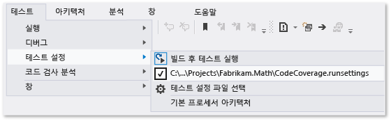
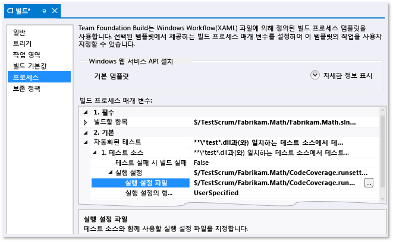

# <a name="customizing-code-coverage-analysis"></a>코드 검사 분석 사용자 지정

기본적으로 Visual Studio Code 검사 도구는 단위 테스트 중 로드된 모든 솔루션 어셈블리(.exe/.dll)를 분석합니다. 이 기본값은 대부분은 문제 없이 작동하므로 유지하는 것이 좋습니다. 자세한 내용은 [코드 검사를 사용하여 테스트할 코드 범위 결정](../test/using-code-coverage-to-determine-how-much-code-is-being-tested.md)을 참조하세요.  
  
코드 검사 동작을 사용자 지정하기 전에 몇 가지 다른 방법을 고려하세요.  
  
-   *코드 검사 결과에서 테스트 코드를 제외하고 응용 프로그램 코드만 포함하려고 합니다.*  
  
     테스트 클래스에 `ExcludeFromCodeCoverage Attribute`를 추가합니다.  
  
-   *솔루션에 속하지 않는 어셈블리를 포함하려고 합니다.*  
  
     이러한 어셈블리에 대한 .pdb 파일을 얻어서 어셈블리 .dll 파일과 동일한 폴더에 복사합니다.  
  
코드 검사 동작을 사용자 지정하려면 [이 항목 끝 부분에 있는 샘플](#sample)을 복사한 다음 .runsettings 파일 확장명을 사용하여 솔루션에 추가합니다. 자신의 요구 사항에 맞게 편집한 다음 **테스트** 메뉴에서 **테스트 설정**, **테스트 설정 선택** 파일을 선택합니다. 이 항목의 나머지 부분에서는 이 절차에 대해 자세히 설명합니다.  
  
## <a name="the-runsettings-file"></a>.runsettings 파일

고급 코드 검사 설정은 .runsettings 파일에서 지정합니다. 이 파일은 유닛 테스트 도구에서 사용하는 구성 파일입니다. [이 항목의 끝 부분에 있는 샘플](#sample)을 복사한 다음 자신의 요구 사항에 맞게 편집하는 것이 좋습니다.  
  
-   *Visual Studio 2010에서 사용한 .testsettings 파일은 어떻게 됩니까?*  
  
     Visual Studio 2010에서 .testsettings 파일은 MSTest 프레임워크에 따라 단위 테스트에만 적용됩니다. Visual Studio 2012 테스트 도구는 MSTest뿐만 아니라 NUnit, xUnit.net 등 다른 프레임워크에도 적용됩니다. .testsettings 파일은 여기에서 사용할 수 없습니다. .runsettings 파일은 모든 테스트 프레임워크에서 사용할 수 있는 테스트 도구를 사용자 지정할 수 있도록 설계되었습니다.  
  
 코드 검사를 사용자 지정하려면 .runsettings 파일을 솔루션에 추가해야 합니다.  
  
1.  .xml 파일을 `.runsettings` 확장명으로 솔루션 항목으로 추가합니다.  
  
     솔루션 탐색기의 솔루션 바로 가기 메뉴에서 **추가**, **새 항목**, **XML 파일**을 차례로 선택합니다. 파일을 `CodeCoverage.runsettings`로 끝나는 이름으로 저장합니다.  
  
2.  이 항목 끝 부분에 있는 샘플의 콘텐츠를 추가한 다음 다음 섹션에 설명된 대로 각자의 요구 사항에 맞게 사용자 지정합니다.  
  
3.  **테스트** 메뉴에서 **테스트 설정**, **테스트 설정 파일 선택**을 차례로 선택하고 파일을 선택합니다.  
  
4.  이제 **코드 검사 분석**을 실행하면 `.runsettings` 파일이 해당 동작을 제어합니다. 코드 검사를 반드시 다시 실행해야 합니다. 테스트를 실행하거나 코드를 업데이트하면 이전 검사 결과 및 코드 강조가 자동으로 숨겨지지 않습니다.  
  
5.  사용자 지정 설정을 해제했다 다시 사용하도록 설정하려면 **테스트**, **테스트 설정** 메뉴에서 파일을 선택 취소 또는 선택합니다.  
  
   
  
 유닛 테스트의 다른 측면은 동일한 .runsettings 파일에서 구성할 수 있습니다. 자세한 내용은 [코드 단위 테스트](../test/unit-test-your-code.md)를 참조하세요.  
  
### <a name="specifying-symbol-search-paths"></a>기호 검색 경로 지정

어셈블리가 존재하려면 코드 검사에 기호(.pdb 파일)가 필요합니다. 솔루션에서 빌드한 어셈블리의 경우 기호 파일은 일반적으로 이진 파일과 함께 있으며 코드 검사는 자동으로 실행됩니다. 하지만 코드 검사 분석에 참조된 어셈블리를 포함하려는 경우가 있습니다. 이런 경우에 .pdb 파일이 이진 파일과 가깝지 않을 수 있지만 .runsettings 파일에서 기호 검색 경로를 지정할 수 있습니다.  
  
```xml  
<SymbolSearchPaths>                
      <Path>\\mybuildshare\builds\ProjectX</Path>  
      <!--More paths if required-->  
</SymbolSearchPaths>  
  
```  
  
> [!WARNING]
>  기호 확인은 어셈블리가 많은 원격 파일 위치를 사용할 경우 특히 오래 걸릴 수 있습니다. 따라서 원격 .pdb 파일을 이진(.dll 및.exe) 파일과 같은 로컬 위치에 복사하는 것이 좋습니다.  
  
### <a name="excluding-and-including"></a>제외 및 포함

코드 검사 분석에서 지정한 어셈블리를 제외할 수 있습니다. 예:  
  
```minterastlib  
<ModulePaths>  
  <Exclude>  
   <ModulePath>Fabrikam.Math.UnitTest.dll</ModulePath>  
   <!-- Add more ModulePath nodes here. -->  
  </Exclude>  
</ModulePaths>  
```  
  
 대신 포함할 어셈블리를 지정할 수 있습니다. 이 방법은 솔루션에 어셈블리를 추가할 경우 목록에 추가해야 하는 점을 기억해야 한다는 단점이 있습니다.  
  
```minterastlib  
<ModulePaths>  
  <Include>  
   <ModulePath>Fabrikam.Math.dll</ModulePath>  
   <!-- Add more ModulePath nodes here. -->  
  </Include>  
</ModulePaths>  
```  
  
 `<Include>`가 비어 있을 경우, 코드 검사 처리에는 `<Exclude>` 목록의 절과 일치하는 항목을 제외하고 로드된 모든 어셈블리(.dll 및 .exe 파일) 및 **.pdb** 파일이 검색되는 어셈블리가 포함됩니다.  
  
 `Include`는 `Exclude`보다 먼저 처리됩니다.  
  
### <a name="regular-expressions"></a>정규식

Include 및 exclude 노드는 정규식을 사용합니다. 자세한 내용은 [Visual Studio에서 정규식 사용](../ide/using-regular-expressions-in-visual-studio.md)을 참조하세요. 정규식은 와일드 카드와 다릅니다. 특히 다음과 같습니다.  
  
1.  **.\***은(는) 모든 문자의 문자열과 일치합니다.  
  
2.  **\\.** 점 “.”과 일치합니다.  
  
3.  **\\(   \\)**는 괄호 “(  )”와 일치합니다.  
  
4.  **\\\\**파일 경로 구분 기호 “\\”와 일치합니다.  
  
5.  **^**는 문자열의 시작과 일치합니다.  
  
6.  **$**는 문자열의 끝과 일치합니다.  
  
 모든 일치 항목은 대소문자를 구분하지 않습니다.  
  
 예:  
  
```xml  
<ModulePaths>  
  <Include>  
    <!-- Include all loaded .dll assemblies (but not .exe assemblies): -->  
    <ModulePath>.*\.dll$</ModulePath>  
  </Include>  
  <Exclude>  
    <!-- But exclude some assemblies: -->  
    <ModulePath>.*\\Fabrikam\.MyTests1\.dll$</ModulePath>  
    <!-- Exclude all file paths that contain "Temp": -->  
    <ModulePath>.*Temp.*</ModulePath>   
  </Exclude>  
</ModulePaths>  
  
```  
  
> [!WARNING]
>  이스케이프되지 않은 괄호, 일치하지 않는 괄호와 같이 정규식에 오류가 있는 경우 코드 검사 분석이 실행되지 않습니다.  
  
### <a name="other-ways-to-include-or-exclude-elements"></a>요소를 포함 또는 제외하는 다른 방법  
 예제를 보려면 [이 항목의 끝 부분에 있는 샘플](#sample)을 참조하세요.  
  
-   `ModulePath` - 어셈블리 파일 경로로 지정한 어셈블리입니다.  
  
-   `CompanyName` – 어셈블리를 회사 특성으로 일치시킵니다.  
  
-   `PublicKeyToken` – 서명된 어셈블리를 공개 키 토큰으로 일치시킵니다. 예를 들어, 모든 Visual Studio 구성 요소 및 확장과 일치시키려면 `<PublicKeyToken>^B03F5F7F11D50A3A$</PublicKeyToken>`을 사용합니다.  
  
-   `Source` – 요소를 소스 파일이 정의된 경로 이름으로 일치시킵니다.  
  
-   `Attribute` – 특정 특성이 연결된 요소에 일치시킵니다. 이름 끝의 "특성"을 포함하여 특성의 전체 이름을 지정합니다.  
  
-   `Function` – 절차, 함수 또는 메서드를 정규화된 이름으로 일치시킵니다.  
  
 **함수 이름 일치**  
  
 정규식은 네임스페이스, 클래스 이름, 메서드 이름, 매개 변수 목록을 포함한 함수의 정규화된 이름과 일치해야 합니다. 예를 들어 개체에 적용된  
  
-   C# 또는 Visual Basic의 경우: `Fabrikam.Math.LocalMath.SquareRoot(double)`입니다.  
  
-   C++:  `Fabrikam::Math::LocalMath::SquareRoot(double)`  
  
```xml  
<Functions>  
  <Include>  
    <!-- Include methods in the Fabrikam namespace: -->  
    <Function>^Fabrikam\..*</Function>  
    <!-- Include all methods named EqualTo: -->  
    <Function>.*\.EqualTo\(.*</Function>  
  </Include>  
  <Exclude>  
    <!-- Exclude methods in a class or namespace named UnitTest: -->  
    <Function>.*\.UnitTest\..*</Function>  
  </Exclude>  
</Functions>  
  
```  
  
## <a name="how-to-specify-runsettings-files-while-running-tests"></a>테스트 실행 중 .runsettings 파일을 지정하는 방법  
  
### <a name="to-customize-runsettings-in-visual-studio-tests"></a>Visual Studio 테스트에서 runsettings를 사용자 지정하려면

**테스트** > **테스트 설정** > **테스트 설정 파일 선택**을 차례로 선택하고 .runsettings 파일을 선택합니다. 테스트 설정 메뉴에 파일이 나타나고 해당 파일을 선택 또는 취소할 수 있습니다. 파일이 선택된 상태에서 **코드 검사 분석**을 사용할 때마다 .runsettings 파일이 적용됩니다.

### <a name="to-customize-run-settings-in-a-command-line-test"></a>명령줄 테스트에서 실행 설정을 사용자 지정하려면

명령줄에서 테스트를 실행하려면 vstest.console.exe를 사용합니다. 설정 파일은 이 유틸리티의 매개 변수입니다.

1.  Visual Studio 개발자 명령 프롬프트를 시작합니다.

    Windows **시작** 메뉴에서 **Visual Studio 2017** > **VS 2017용 개발자 명령 프롬프트**를 선택합니다.

2.  다음 명령을 실행합니다.

    `vstest.console.exe MyTestAssembly.dll /EnableCodeCoverage /Settings:CodeCoverage.runsettings`

### <a name="to-customize-run-settings-in-a-build-definition"></a>빌드 정의에서 실행 설정을 사용자 지정하려면

팀 빌드에서 코드 검사 데이터를 가져올 수 있습니다.

  

1.  .runsettings 파일이 체크 인되었는지 확인하세요.  
  
2.  팀 탐색기에서 **빌드**를 연 다음 빌드 정의를 추가하거나 편집합니다.  
  
3.  **프로세스** 페이지에서 **자동화된 테스트** > **테스트 소스** > **실행 설정**을 확장합니다. **.runsettings** 파일을 선택합니다.
  
    -   *하지만 **테스트 소스**대신 **테스트 어셈블리**가 나타납니다. **실행 설정** 필드를 설정하려고 하면 .testsettings 파일만 선택할 수 있습니다.*  
  
         **자동화된 테스트**에서 **테스트 어셈블리**를 선택한 다음 줄 끝에서 **[...]**를 선택합니다. **테스트 실행 추가/편집** 대화 상자에서 **Test Runner**를 **Visual Studio Test Runner**로 설정합니다.  
  
빌드 보고서의 요약 섹션에 결과가 표시됩니다.
  
##  <a name="sample"></a> 샘플 .runsettings 파일

이 코드를 복사하고 자신의 필요에 따라 편집합니다. 이 파일은 기본 .runsettings 파일입니다.

(.runsettings 파일의 다른 용도에 대해서는 [.runsettings 파일을 사용하여 단위 테스트 구성](../test/configure-unit-tests-by-using-a-dot-runsettings-file.md)을 참조하세요.)

```xml
<?xml version="1.0" encoding="utf-8"?>  
<!-- File name extension must be .runsettings -->  
<RunSettings>  
  <DataCollectionRunSettings>  
    <DataCollectors>  
      <DataCollector friendlyName="Code Coverage" uri="datacollector://Microsoft/CodeCoverage/2.0" assemblyQualifiedName="Microsoft.VisualStudio.Coverage.DynamicCoverageDataCollector, Microsoft.VisualStudio.TraceCollector, Version=11.0.0.0, Culture=neutral, PublicKeyToken=b03f5f7f11d50a3a">  
        <Configuration>  
          <CodeCoverage>  
<!--  
Additional paths to search for .pdb (symbol) files. Symbols must be found for modules to be instrumented.  
If .pdb files are in the same folder as the .dll or .exe files, they are automatically found. Otherwise, specify them here.  
Note that searching for symbols increases code coverage runtime. So keep this small and local.  
-->   
<!--             
            <SymbolSearchPaths>                
                   <Path>C:\Users\User\Documents\Visual Studio 2012\Projects\ProjectX\bin\Debug</Path>  
                   <Path>\\mybuildshare\builds\ProjectX</Path>  
            </SymbolSearchPaths>  
-->  
  
<!--  
About include/exclude lists:  
Empty "Include" clauses imply all; empty "Exclude" clauses imply none.  
Each element in the list is a regular expression (ECMAScript syntax). See http://msdn.microsoft.com/library/2k3te2cs.aspx.  
An item must first match at least one entry in the include list to be included.  
Included items must then not match any entries in the exclude list to remain included.  
-->  
  
            <!-- Match assembly file paths: -->  
            <ModulePaths>  
              <Include>  
                <ModulePath>.*\.dll$</ModulePath>  
                <ModulePath>.*\.exe$</ModulePath>  
              </Include>  
              <Exclude>  
                <ModulePath>.*CPPUnitTestFramework.*</ModulePath>  
              </Exclude>  
            </ModulePaths>  
  
            <!-- Match fully qualified names of functions: -->  
            <!-- (Use "\." to delimit namespaces in C# or Visual Basic, "::" in C++.)  -->  
            <Functions>  
              <Exclude>  
                <Function>^Fabrikam\.UnitTest\..*</Function>           
                <Function>^std::.*</Function>  
                <Function>^ATL::.*</Function>  
                <Function>.*::__GetTestMethodInfo.*</Function>  
                <Function>^Microsoft::VisualStudio::CppCodeCoverageFramework::.*</Function>  
                <Function>^Microsoft::VisualStudio::CppUnitTestFramework::.*</Function>  
              </Exclude>  
            </Functions>  
  
            <!-- Match attributes on any code element: -->  
            <Attributes>  
              <Exclude>  
                <!-- Don't forget "Attribute" at the end of the name -->  
                <Attribute>^System\.Diagnostics\.DebuggerHiddenAttribute$</Attribute>  
                <Attribute>^System\.Diagnostics\.DebuggerNonUserCodeAttribute$</Attribute>  
                <Attribute>^System\.Runtime\.CompilerServices.CompilerGeneratedAttribute$</Attribute>  
                <Attribute>^System\.CodeDom\.Compiler.GeneratedCodeAttribute$</Attribute>  
                <Attribute>^System\.Diagnostics\.CodeAnalysis.ExcludeFromCodeCoverageAttribute$</Attribute>  
              </Exclude>  
            </Attributes>  
  
            <!-- Match the path of the source files in which each method is defined: -->  
            <Sources>  
              <Exclude>  
                <Source>.*\\atlmfc\\.*</Source>  
                <Source>.*\\vctools\\.*</Source>  
                <Source>.*\\public\\sdk\\.*</Source>  
                <Source>.*\\microsoft sdks\\.*</Source>  
                <Source>.*\\vc\\include\\.*</Source>  
              </Exclude>  
            </Sources>  
  
            <!-- Match the company name property in the assembly: -->  
            <CompanyNames>  
              <Exclude>  
                <CompanyName>.*microsoft.*</CompanyName>  
              </Exclude>  
            </CompanyNames>  
  
            <!-- Match the public key token of a signed assembly: -->  
            <PublicKeyTokens>  
              <!-- Exclude Visual Studio extensions: -->  
              <Exclude>  
                <PublicKeyToken>^B77A5C561934E089$</PublicKeyToken>  
                <PublicKeyToken>^B03F5F7F11D50A3A$</PublicKeyToken>  
                <PublicKeyToken>^31BF3856AD364E35$</PublicKeyToken>  
                <PublicKeyToken>^89845DCD8080CC91$</PublicKeyToken>  
                <PublicKeyToken>^71E9BCE111E9429C$</PublicKeyToken>  
                <PublicKeyToken>^8F50407C4E9E73B6$</PublicKeyToken>  
                <PublicKeyToken>^E361AF139669C375$</PublicKeyToken>  
              </Exclude>  
            </PublicKeyTokens>  
  
            <!-- We recommend you do not change the following values: -->  
            <UseVerifiableInstrumentation>True</UseVerifiableInstrumentation>  
            <AllowLowIntegrityProcesses>True</AllowLowIntegrityProcesses>  
            <CollectFromChildProcesses>True</CollectFromChildProcesses>  
            <CollectAspDotNet>False</CollectAspDotNet>  
  
          </CodeCoverage>  
        </Configuration>  
      </DataCollector>  
    </DataCollectors>  
  </DataCollectionRunSettings>  
</RunSettings>
```

## <a name="see-also"></a>참고 항목

[코드 검사를 사용하여 테스트할 코드 범위 결정](../test/using-code-coverage-to-determine-how-much-code-is-being-tested.md)  
[코드 단위 테스트](../test/unit-test-your-code.md)
