# 코딩된 UI 테스트 편집기를 사용하여 코딩된 UI 테스트 편집
코딩된 UI 테스트 편집기에서는 코딩된 UI 테스트를 쉽게 수정할 수 있습니다. 코딩된 UI 테스트 편집기를 사용하여 테스트 메서드 및 UI 작업의 속성을 찾고 보고 편집할 수 있습니다. 또한 UI 컨트롤 맵을 사용하여 해당 컨트롤을 보고 편집할 수 있습니다.  
  
 **요구 사항**  
  
-   Visual Studio Enterprise  
  
## 이 작업을 수행해야 하는 이유  
 코딩된 UI 테스트 편집기를 사용하면 코딩된 UI 테스트 메서드의 코드를 코드 편집기를 사용해 편집하는 방식에 비해 빠르고 효율적입니다. 코딩된 UI 테스트 편집기를 사용하면 도구 모음 및 바로 가기 메뉴를 사용하여 UI 작업 및 컨트롤과 관련된 속성 값을 빠르게 찾고 수정할 수 있습니다. 예를 들어 코딩된 UI 테스트 편집기의 도구 모음을 사용하여 다음 명령을 수행할 수 있습니다.  
  
 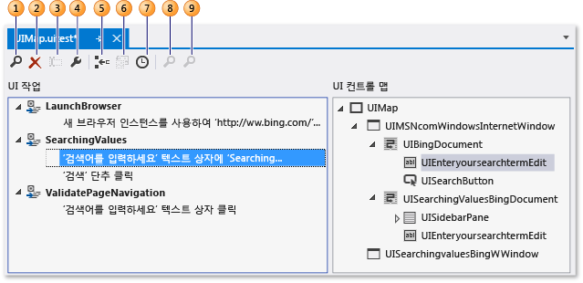  
  
1.  [찾기](../ide/finding-and-replacing-text.md) - UI 작업 및 컨트롤을 찾을 수 있습니다.  
  
2.  [삭제](#CodedUITestEditor_DeleteUIActions) - 원치 않는 UI 작업을 제거합니다.  
  
3.  **이름 바꾸기** - 테스트 메서드 및 컨트롤의 이름을 변경합니다.  
  
4.  **속성** - 선택한 항목에 대한 속성 창을 엽니다.  
  
5.  [새 메서드로 분할](#CodedUITestEditor_SplitMethods) - UI 작업을 모듈화할 수 있습니다.  
  
6.  [코드 이동](#CodedUITestEditor_MoveMethods) - 테스트 메서드에 사용자 지정 코드를 추가합니다.  
  
7.  [다음 항목 앞에 지연 삽입](#CodedUITestEditor_InsertDelay) - 특정 UI 작업 앞에 일시 중지(밀리초 단위)를 추가합니다.  
  
8.  [UI 컨트롤 찾기](#CodedUITestEditor_LocateUIControl) - 테스트 중인 응용 프로그램의 UI에서 컨트롤의 위치를 식별합니다.  
  
9. [모두 찾기](#CodedUITestEditor_LocateDecendants) - 응용 프로그램의 컨트롤의 컨트롤 속성 및 중요한 변경을 확인할 수 있습니다.  
  
## 문제 해결 방법  
 [!INCLUDE[vs_dev11_long](../data-tools/includes/vs_dev11_long_md.md)]에서는 코딩된 UI 테스트 프로젝트에 있는 코딩된 UI 테스트와 연결된 UIMap.uitest 파일을 열면 코딩된 UI 테스트가 코딩된 UI 테스트 편집기에 자동으로 표시됩니다. 다음 절차에서는 테스트가 표시된 후에 편집기 도구 모음 및 바로 가기 메뉴를 사용해 테스트 메서드, UI 작업 속성, 컨트롤 등을 찾고 편집할 수 있는 방법을 설명합니다.  
  
## 코딩된 UI 테스트 열기  
 Visual C# 및 Visual Basic 기반의 코딩된 UI 테스트를 코딩된 UI 테스트 편집기를 사용해서 보고 편집할 수 있습니다.  
  
 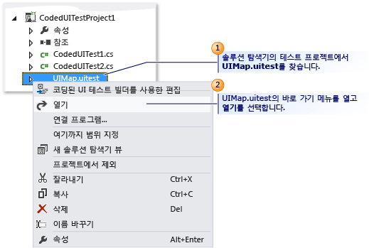  
  
 솔루션 탐색기에서 **UIMap.uitest** 에 대한 바로 가기 메뉴를 열고 **열기**를 선택합니다. 코딩된 UI 테스트가 코딩된 UI 테스트 편집기에 표시됩니다. 이제 코딩된 UI 테스트에서 기록된 메서드, 작업 및 해당 컨트롤을 보고 편집할 수 있습니다.  
  
> [!TIP]
>  메서드에 있는 UI 작업을 **UI 작업** 창에서 선택하면 해당 컨트롤이 강조 표시됩니다. 또한 UI 작업 또는 컨트롤 속성을 수정할 수도 있습니다.  
  
 코딩된 UI 테스트 편집기가*표시되지 않는* 경우  
 2012 이전 버전의 Visual Studio Enterprise를 사용하는 중일 수 있습니다. 코딩된 UI 테스트 편집기는 MSDN 구독이 포함된 Visual Studio 2010 Feature Pack 2에서도 사용할 수 있습니다. [!INCLUDE[crdefault](../test/includes/crdefault_md.md)][Microsoft Visual Studio 2010 Feature Pack 2](http://go.microsoft.com/fwlink/?LinkID=204119)을 참조하세요.  
  
##   UI 작업 속성 및 해당 컨트롤 속성 수정  
 코딩된 UI 테스트 편집기를 사용하면 테스트 메서드의 모든 UI 작업을 빠르게 찾고 볼 수 있습니다. 편집기에서 UI 작업을 선택하면 해당 컨트롤리 자동으로 강조 표시됩니다. 마찬가지로, 컨트롤을 선택하면 관련된 UI 작업이 강조 표시됩니다. UI 작업이나 컨트롤을 선택하고 나면 속성 창을 사용하여 해당하는 속성을 쉽게 수정할 수 있습니다.  
  
 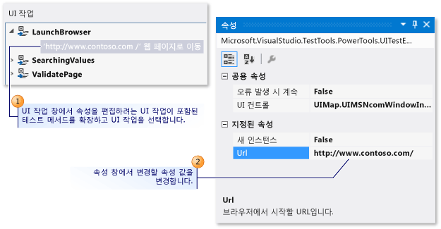  
UI 작업 속성 편집  
  
 UI 작업에 대한 속성을 수정하려면 **UI 작업** 창에서 속성을 편집하려는 UI 작업이 포함된 테스트 메서드를 확장하고, 해당 UI 작업을 선택한 다음, 속성 창을 사용해 속성을 수정합니다.  
  
 예를 들어 서버를 사용할 수 없는 상황이며 웹 브라우저에 나오는 **웹 페이지 ‘http://Contoso1/default.aspx’로 이동**과 관련된 UI 작업이 있는 경우 이 URL을 `'http://Contoso2/default.aspx'`로 변경할 수 있습니다.  
  
 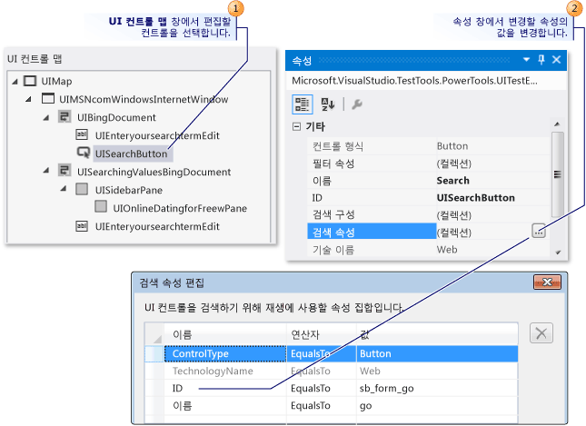  
컨트롤 속성 편집  
  
 컨트롤에 대한 속성을 수정하는 일은 UI 작업과 동일한 방식으로 이루어집니다. **UI 컨트롤 맵** 에서 속성 창을 사용해 속성을 편집 및 수정하려는 컨트롤을 선택합니다.  
  
 예를 들어 개발자가 테스트 대상 응용 프로그램의 소스 코드에서 단추 컨트롤에 대한 **(ID)** 속성을 “idSubmit”에서 “idLogin”으로 변경했을 수 있습니다. 응용 프로그램에서 **(ID)** 속성이 변경되면 코딩된 UI 테스트에서 단추를 찾을 수 없고 테스트가 실패합니다. 이런 경우, 테스터는 **검색 속성** 모음을 열어 개발자가 응용 프로그램에서 사용한 새 값에 일치하도록 **Id** 속성을 변경할 수 있습니다. 테스터는 또한 **이름** 속성 값을 “제출”에서 “로그인”으로 변경할 수도 있습니다. 이렇게 변경하면 코딩된 UI 테스트 편집기의 관련된 UI 작업이 “’제출’ 단추 선택”에서 “’로그인’ 단추 선택”으로 업데이트됩니다.  
  
 수정을 완료한 후에는 **도구 모음에 있는** 저장 [!INCLUDE[vsprvs](../code-quality/includes/vsprvs_md.md)] 을 선택하여 변경 내용을 UIMap.Designer 파일에 저장합니다.  
  
 *그 외 무엇을 알아야 하나요?*  
 **팁**  
  
-    속성 창이 표시되지 않으면 **Alt** 키를 누른 채 **Enter** 키를 누르거나 **F4** 키를 누릅니다.  
  
-    수행한 속성 변경을 실행 취소하려면 **편집** 메뉴에서 **실행 취소**를 선택하거나 Ctrl+Z를 누릅니다.  
  
-    코딩된 UI 테스트 편집기 도구 모음에 있는 **찾기** 단추를 사용하여 Visual Studio의 찾기 및 바꾸기 도구를 열 수 있습니다. 그런 다음, 찾기 컨트롤을 사용하여 코딩된 UI 테스트 편집기에서 UI 작업을 찾을 수 있습니다. 예를 들어 “’로그인’ 단추 클릭”을 찾아볼 수 있습니다. 대규모 테스트에 유용할 수 있는 기능입니다. 코딩된 UI 테스트 편집기에서는 찾기 및 바꾸기 도구의 바꾸기 기능을 사용할 수 없습니다. 자세한 내용은 [텍스트 찾기 및 바꾸기](../ide/finding-and-replacing-text.md)의 컨트롤 찾기를 참조하세요.  
  
-    경우에 따라 테스트 중인 응용 프로그램의 UI에서 컨트롤이 위치한 지점을 시각화하기 어려울 수 있습니다. 코딩된 UI 테스트 편집기의 기능 중 하나를 사용하면, UI 컨트롤 맵에 나열된 컨트롤을 선택하고 테스트 중인 응용 프로그램에서 해당 컨트롤의 위치를 볼 수 있습니다. [!INCLUDE[crdefault](../test/includes/crdefault_md.md)][테스트 중인 응용 프로그램에서 UI 컨트롤 찾기](#CodedUITestEditor_LocateUIControl)를 이 항목 아래쪽에서 설명합니다.  
  
-    편집하려는 컨트롤이 포함된 컨테이너 컨트롤을 확장해야 할 수도 있습니다. [!INCLUDE[crdefault](../test/includes/crdefault_md.md)][컨트롤 및 해당 하위 요소 찾기](#CodedUITestEditor_LocateDecendants)를 이 항목 아래쪽에서 설명합니다.  
  
##   원치 않는 UI 작업 삭제  
 코딩된 UI 테스트에서 원치 않는 UI 작업을 쉽게 제거할 수 있습니다.  
  
 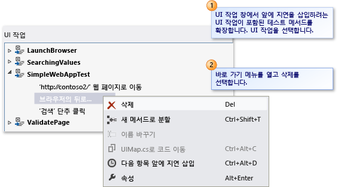  
  
 **UI 작업** 창에서 삭제하려는 UI 작업이 포함된 테스트 메서드를 확장합니다. UI 작업에 대한 바로 가기 메뉴를 열고 **삭제**를 선택합니다.  
  
##   테스트 메서드를 별도의 메서드 두 개로 분할  
 테스트 메서드를 분할하여 UI 작업을 구체화하거나 모듈화할 수 있습니다. 예를 들어 테스트 메서드에 두 컨테이너 컨트롤의 UI 작업이 포함되어 있을 수 있습니다. 하나의 컨테이너에 해당하는 두 메서드를 사용하면 UI 작업을 더 효율적으로 모듈화할 수 있습니다.  
  
 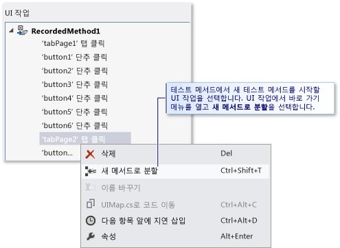  
  
 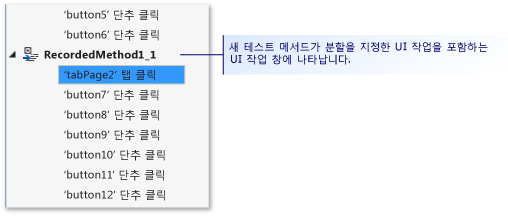  
  
 **UI 작업** 창에서 두 개의 별도 메서드로 분할하려는 테스트 메서드를 확장하고 새 테스트 메서드가 시작되도록 지정할 UI 작업을 선택합니다. UI 작업에 대한 바로 가기 메뉴를 열어 **새 메서드로 분할**을 선택하거나, 코딩된 UI 테스트 편집기 도구 모음에서 **새 메서드로 분할** 단추를 선택합니다. 새 테스트 메서드가 UI 작업 창에 나타납니다. 여기에는 분할을 지정한 위치에 해당하는 작업 이후로 나오는 UI 작업이 포함됩니다.  
  
 메서드 분할을 완료한 후에는 **도구 모음에서** 저장 [!INCLUDE[vsprvs](../code-quality/includes/vsprvs_md.md)] 을 선택하여 변경 내용을 UIMap.Designer 파일에 저장합니다.  
  
 *그 외 무엇을 알아야 하나요?*  
 **중요한 문제**  
  
-    **경고:** 메서드를 분할하는 경우, 해당 UI 작업을 포함하기를 원한다면 기존 메서드를 호출하는 코드가 새로 만들어지는 메서드도 호출하도록 코드를 수정해야 합니다. 메서드를 분할할 때 Microsoft Visual Studio 대화 상자가 표시됩니다. 여기에, 기존 메서드를 호출하는 코드가 새로 만들어지는 메서드도 호출하도록 코드를 수정해야 한다는 경고가 나타납니다. **예**를 선택합니다.  
  
 **팁**  
  
-    분할을 실행 취소하려면 **편집** 메뉴에서 **실행 취소**를 선택하거나 Ctrl+Z를 누릅니다.  
  
-    새 메서드의 이름을 바꿀 수 있습니다. UI 작업 창에서 메서드를 선택하고 코딩된 UI 테스트 편집기 도구 모음에서 **이름 바꾸기** 단추를 선택합니다.  
  
     또는  
  
     새 테스트 메서드에 대한 바로 가기 메뉴를 열고 **이름 바꾸기**를 선택합니다.  
  
     Microsoft Visual Studio 대화 상자가 표시됩니다. 해당 메서드를 참조하는 코드를 수정해야 한다는 경고가 나타납니다. **예**를 선택합니다.  
  
##   테스트 메서드를 UIMap 파일로 이동하여 사용자 지정 지원  
 코딩된 UI 테스트의 테스트 메서드 중 하나에 사용자 지정 코드가 필요하다고 판단하는 경우 해당 메서드를 UIMap.cs 또는 UIMap.vb 파일로 이동해야 합니다. 이동하지 않으면, 코딩된 UI 테스트가 다시 컴파일될 때마다 코드를 덮어쓰게 됩니다. 메서드를 이동하지 않으면 테스트가 다시 컴파일될 때마다 사용자 지정 코드를 덮어쓰게 됩니다.  
  
 **UI 작업** 창에서 UIMap.cs 또는 UIMap.vb 파일로 이동하려는 테스트 메서드를 선택하여 테스트 코드가 다시 컴파일되더라도 덮어써지지 않는 사용자 지정 코드 기능을 확보해 둡니다. 그런 다음, 코딩된 UI 테스트 편집기 도구 모음에서 **코드 이동** 단추를 선택하거나 테스트 메서드에 대한 바로 가기 메뉴를 열어 **코드 이동**을 선택합니다. 테스트 메서드가 UIMap.uitest 파일에서 제거되고 더 이상 UI 작업 창에 표시되지 않습니다. 이동한 테스트 파일을 편집하려면 솔루션 탐색기에서 UIMap.cs 또는 UIMap.vb 파일을 엽니다.  
  
 메서드를 이동한 후에는 **도구 모음에서** 저장 [!INCLUDE[vsprvs](../code-quality/includes/vsprvs_md.md)] 을 선택하여 변경 내용을 UIMap.Designer 파일에 저장합니다.  
  
 *그 외 무엇을 알아야 하나요?*  
 **중요한 문제**  
  
-    **경고:** 메서드를 이동하면 더 이상 코딩된 UI 테스트 편집기를 사용하여 편집할 수 없습니다. 코드 편집기를 사용하여 사용자 지정 코드를 추가하고 유지 관리해야 합니다. 메서드를 이동할 때 Microsoft Visual Studio 대화 상자가 표시됩니다. 메서드가 UIMap.uitest 파일에서 UIMap.cs 또는 UIMap.vb 파일로 이동하며 더 이상 코딩된 UI 테스트 편집기를 사용하여 메서드를 편집할 수 없다는 경고가 나타납니다. **예**를 선택합니다.  
  
 **팁**  
  
-    이동을 실행 취소하려면 **편집** 메뉴에서 **실행 취소**를 선택하거나 Ctrl+Z를 누릅니다. 하지만 그런 다음에 반드시 수동으로 UIMap.cs 또는 UIMap.vb 파일에서 코드를 제거해야 합니다.  
  
##   Locating a UI Control in the application under test  
 경우에 따라 테스트 중인 응용 프로그램의 UI에서 컨트롤이 위치한 지점을 시각화하기 어려울 수 있습니다. 코딩된 UI 테스트 편집기의 기능 중 하나를 사용하면, UI 컨트롤 맵에 나열된 컨트롤을 선택하고 테스트 중인 응용 프로그램에서 해당 컨트롤의 위치를 볼 수 있습니다. 테스트 중인 응용 프로그램의 **UI 컨트롤 찾기** 기능을 사용해서도 컨트롤의 검색 속성 수정 사항을 확인할 수 있습니다.  
  
 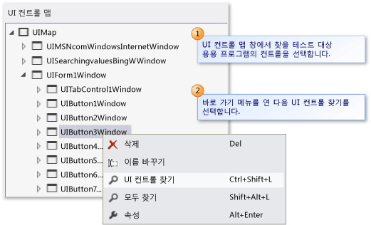  
  
 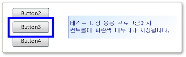  
  
 **UI 컨트롤 맵** 창에서 테스트와 관련하여 응용 프로그램에 배치할 컨트롤을 선택합니다. 다음으로, 해당 컨트롤에 대한 바로 가기 메뉴를 연 다음 **UI 컨트롤 찾기**를 선택합니다. 테스트 중인 응용 프로그램에서 해당 컨트롤에 파란색 테두리가 지정됩니다.  
  
 *그 외 무엇을 알아야 하나요?*  
 **중요한 문제**  
  
-    **경고:** UI 컨트롤을 찾기 전에 먼저, 테스트에 연결된 응용 프로그램이 실행 중인지 확인합니다.  
  
 **팁**  
  
-    또는 **모두 찾기** 옵션을 사용하여 컨테이너 아래의 모든 컨트롤을 제대로 찾을 수 있는지 확인합니다. 이 옵션에 대해서는 다음 섹션에서 설명합니다.  
  
##   컨트롤 및 해당 하위 요소 찾기  
 테스트 중인 응용 프로그램의 UI에서 컨테이너 아래의 모든 컨트롤을 제대로 찾을 수 있는지 확인할 수 있습니다. 이 기능은 컨테이너에 대해 수행한 검색 속성 변경을 확인하는 데 유용할 수 있습니다. 또한 테스트 중인 응용 프로그램의 UI에 중요한 변경 내용이 있는 경우에는 기존 컨트롤 검색 속성이 여전히 올바른지 확인할 수 있습니다.  
  
 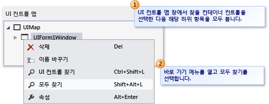  
  
 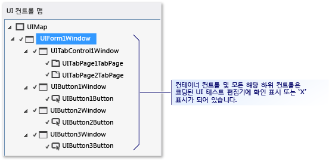  
  
 **UI 컨트롤 맵** 창에서 찾으려는 컨테이너 컨트롤을 선택하고 해당되는 모든 하위 항목을 봅니다. 다음으로, 컨트롤에 대한 바로 가기 메뉴를 열고 **모두 찾기**를 선택합니다. 컨테이너 컨트롤 및 모든 하위 컨트롤이 코딩된 UI 테스트 편집기에서 녹색 확인 표시나 빨간색 ‘X’로 표시됩니다. 이 표시를 통해 테스트 중인 응용 프로그램에서 컨트롤을 성공적으로 찾을 수 있는지 여부를 확인할 수 있습니다.  
  
 *그 외 무엇을 알아야 하나요?*  
 **중요한 문제**  
  
-    **경고:** UI 컨트롤을 찾기 전에 먼저, 테스트에 연결된 응용 프로그램이 실행 중인지 확인합니다.  
  
##   UI 작업 앞에 지연 삽입  
 창이 나타나거나 진행률 표시줄이 사라지는 등 특정 이벤트가 발생할 때까지 테스트가 대기하도록 해야 하는 경우가 있습니다. 코딩된 UI 테스트 편집기를 사용하여 UI 작업 앞에 지연을 삽입하면 됩니다. 원하는 지연 시간을 지정할 수 있습니다(초 단위).  
  
 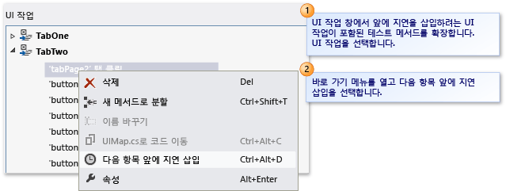  
  
 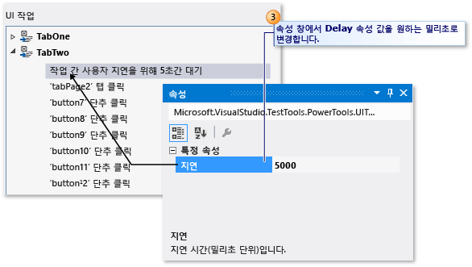  
  
 **UI 작업** 창에서, 앞에 지연을 삽입하려는 UI 작업이 포함된 테스트 메서드를 확장합니다. UI 작업을 선택합니다. 다음으로, UI 작업에 대한 바로 가기 메뉴를 열고 **다음 항목 앞에 지연 삽입**을 선택합니다. 선택한 UI 작업 앞에 지연이 삽입되고 **1초 동안 작업 간 사용자 지연 대기**라는 텍스트로 강조 표시됩니다. 속성 창에서 **지연** 속성의 값을 원하는 시간(밀리초)로 변경합니다.  
  
 지연을 삽입한 후에는 **도구 모음에서** 저장 [!INCLUDE[vsprvs](../code-quality/includes/vsprvs_md.md)] 을 선택하여 변경 내용을 UIMap.Designer 파일에 저장합니다.  
  
 *그 외 무엇을 알아야 하나요?*  
 **참고**  
  
-    UI 작업 앞에 특정 컨트롤을 사용할 수 있도록 만들어야 하는 경우 테스트 메서드에 사용자 지정 코드를 추가해야 합니다. 이때 적절한 UITestControl.WaitForControlXXX() 메서드를 사용하면 됩니다. [!INCLUDE[crdefault](../test/includes/crdefault_md.md)][코딩된 UI 테스트가 재생 중 특정 이벤트를 기다리도록 지정](../test/making-coded-ui-tests-wait-for-specific-events-during-playback.md).  
  
 **팁**  
  
-    속성 창이 표시되지 않으면 F4 키를 누르거나 Alt 키를 누른 채로 Enter 키를 누릅니다.  
  
## 외부 리소스  
  
### 지침  
 [Visual Studio 2012를 사용한 지속적인 업데이트 테스트 - 2장: 유닛 테스트: 내부 테스트](http://go.microsoft.com/fwlink/?LinkID=255188)  
  
### FAQ  
 [코딩된 UI 테스트 FAQ - 1](http://go.microsoft.com/fwlink/?LinkID=230576)  
  
 [코딩된 UI 테스트 FAQ - 2](http://go.microsoft.com/fwlink/?LinkID=230578)  
  
### 포럼  
 [Visual Studio UI 자동화 테스트(CodedUI 포함)](http://go.microsoft.com/fwlink/?LinkID=224497)  
  
## 참고 항목  
 [UI 자동화를 사용하여 코드 테스트](../test/use-ui-automation-to-test-your-code.md)   
 [코딩된 UI 테스트 만들기](../test/use-ui-automation-to-test-your-code.md#VerifyingCodeUsingCUITCreate)   
 [데이터 기반의 코딩된 UI 테스트 만들기](../test/creating-a-data-driven-coded-ui-test.md)   
 [기존 작업 기록에서 코딩된 UI 테스트 생성](/devops-test-docs/test/generating-a-coded-ui-test-from-an-existing-action-recording)   
 [연습: 코딩된 UI 테스트 만들기, 편집 및 유지 관리](../test/walkthrough-creating-editing-and-maintaining-a-coded-ui-test.md)

