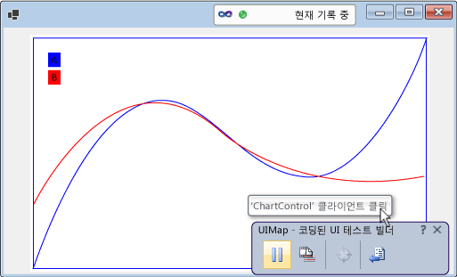
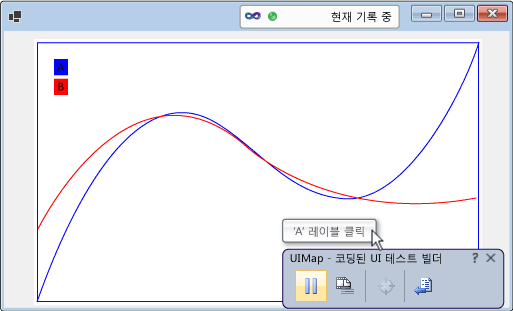
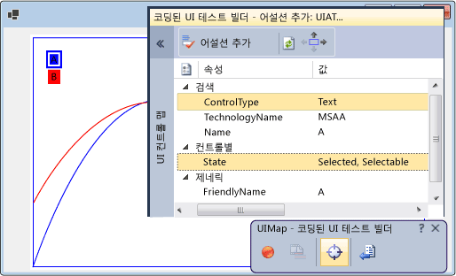

# <a name="enable-coded-ui-testing-of-your-controls"></a>컨트롤의 코딩된 UI 테스트 사용
코딩된 UI 테스트 프레임워크에 대한 지원을 구현하면 컨트롤을 보다 쉽게 테스트할 수 있습니다. 지원 수준 증가는 점진적으로 추가할 수 있습니다. 이를 위해서는 먼저 기록 및 재생 및 속성 유효성 검사 지원부터 시작합니다. 이를 기반으로 사용해서 코딩된 UI 테스트 빌더가 사용자 컨트롤의 사용자 지정 속성을 인식하도록 허용하고 생성된 코드에서 이러한 속성에 액세스하기 위한 사용자 지정 클래스를 제공할 수 있습니다. 또한 기록 중인 작업의 의도와 가까운 방식으로 코딩된 UI 테스트 빌더가 작업을 캡처하도록 할 수 있습니다.  
  
 **항목 내용:**  
  
1.  [접근성을 구현하여 기록 및 재생, 속성 유효성 검사를 지원](../test/enable-coded-ui-testing-of-your-controls.md#recordandplayback)  
  
2.  [속성 공급자를 구현하여 사용자 지정 속성의 유효성 검사를 지원](../test/enable-coded-ui-testing-of-your-controls.md#customproprties)  
  
3.  [사용자 지정 속성에 액세스하기 위해 클래스를 구현하여 코드 생성을 지원](../test/enable-coded-ui-testing-of-your-controls.md#codegeneration)  
  
4.  [작업 필터를 구현하여 의도 인식 작업을 지원](../test/enable-coded-ui-testing-of-your-controls.md#intentawareactions)  
  
   
  
##  <a name="recordandplayback"></a> 접근성을 구현하여 기록 및 재생, 속성 유효성 검사를 지원  
 코딩된 UI 테스트 빌더는 기록 중 발견된 컨트롤에 대한 정보를 캡처하고 해당 세션을 재생하기 위한 코드를 생성합니다. 컨트롤이 액세스 가능성을 지원하지 않을 경우, 코딩된 UI 테스트 빌더는 화면 좌표를 사용하여 작업(예: 마우스 클릭)을 캡처합니다. 테스트를 재생하면 생성된 코드가 동일 화면 좌표에서 이러한 마우스 클릭을 실행합니다. 테스트를 재생할 때 컨트롤이 화면의 다른 위치에 표시되면 생성된 코드가 컨트롤에 대해 해당 작업을 수행하는 데 실패합니다. 다른 화면 구성 또는 다른 환경에서 테스트를 재생하거나 UI 레이아웃이 변경된 다음에 재생할 경우에는 작업이 실패할 수 있습니다.  
  
   
  
 그래도 액세스 가능성을 구현할 경우, 코딩된 UI 테스트 빌더는 테스트를 기록하고 코드를 생성할 때 이를 사용해서 컨트롤에 대한 정보를 캡처합니다. 그런 다음 테스트를 실행하면 컨트롤이 사용자 인터페이스에서 다른 위치에 있더라도 생성된 코드가 컨트롤에 대해 해당 이벤트를 재생합니다. 테스트 작성자는 또한 컨트롤의 기본 속성을 사용해서 어설션을 만들 수 있습니다.  
  
   
  
### <a name="to-support-record-and-playback-property-validation-and-navigation-for-a-windows-forms-control"></a>Windows Forms 컨트롤의 기록 및 재생, 속성 유효성 검사 및 탐색을 지원하려면  
 다음 절차의 개요 및 <xref:System.Windows.Forms.AccessibleObject>의 자세한 설명에 따라 컨트롤에 대해 액세스 가능성을 구현합니다.  
  
   
  
1.  <xref:System.Windows.Forms.Control.ControlAccessibleObject>에서 파생되는 클래스를 구현하고 클래스의 개체를 반환하도록 <xref:System.Windows.Forms.Control.AccessibilityObject%2A> 속성을 재정의합니다.  
  
    ```csharp  
    public partial class ChartControl : UserControl  
    {  
        // Overridden to return the custom AccessibleObject for the control.  
        protected override AccessibleObject CreateAccessibilityInstance()  
        {  
            return new ChartControlAccessibleObject(this);  
        }  
  
        // Inner class ChartControlAccessibleObject represents accessible information  
        // associated with the ChartControl and is used when recording tests.  
        public class ChartControlAccessibleObject : ControlAccessibleObject  
        {  
            ChartControl myControl;  
            public ChartControlAccessibleObject(ChartControl ctrl)  
                : base(ctrl)  
            {  
                myControl = ctrl;  
            }  
        }  
    }  
    ```  
  
2.  액세스 가능한 개체의 <xref:System.Windows.Forms.AccessibleObject.Role%2A>, <xref:System.Windows.Forms.AccessibleObject.State%2A>, <xref:System.Windows.Forms.AccessibleObject.GetChild%2A> 및 <xref:System.Windows.Forms.AccessibleObject.GetChildCount%2A> 속성과 메서드를 재정의합니다.  
  
3.  자식 컨트롤에 대해 또 다른 접근성 개체를 구현하고 이 접근성 개체를 반환하도록 자식 컨트롤의 <xref:System.Windows.Forms.Control.AccessibilityObject%2A> 속성을 재정의합니다.  
  
4.  자식 컨트롤의 접근성 개체에 대해 <xref:System.Windows.Forms.AccessibleObject.Bounds%2A>, <xref:System.Windows.Forms.AccessibleObject.Name%2A>, <xref:System.Windows.Forms.AccessibleObject.Parent%2A>, <xref:System.Windows.Forms.AccessibleObject.Role%2A>, <xref:System.Windows.Forms.AccessibleObject.State%2A>, <xref:System.Windows.Forms.AccessibleObject.Navigate%2A> 및 <xref:System.Windows.Forms.AccessibleObject.Select%2A> 속성과 메서드를 재정의합니다.  
  
> [!NOTE]
>  이 항목에서는 이 절차의 <xref:System.Windows.Forms.AccessibleObject>에 있는 액세스 가능성 샘플로부터 시작해서 남은 절차의 설명에 따라 빌드합니다. 액세스 가능성 샘플의 작동 가능 버전을 만들려면 콘솔 응용 프로그램을 만들고 Program.cs의 코드를 샘플 코드로 바꿉니다. Accessibility, System.Drawing 및 System.Windows.Forms에 대한 참조를 추가해야 합니다. 빌드 경고를 제거하려면 Accessibility에 대한 **Interop 형식 포함**을 **False**로 변경해야 합니다. 프로젝트의 출력 형식을 **콘솔 응용 프로그램**에서 **Windows 응용 프로그램**으로 변경하면 응용 프로그램을 실행할 때 콘솔 창이 표시되지 않습니다.  
  
##  <a name="customproprties"></a> 속성 공급자를 구현하여 사용자 지정 속성의 유효성 검사를 지원  
 기록 및 재생과 속성 유효성 검사를 위한 기본 지원을 구현한 다음에는 <xref:Microsoft.VisualStudio.TestTools.UITesting.UITestPropertyProvider> 플러그 인을 구현해서 코딩된 UI 테스트에서 컨트롤의 사용자 지정 속성을 사용할 수 있도록 지정할 수 있습니다. 예를 들어 다음 절차에서는 코딩된 UI 테스트가 차트 컨트롤의 CurveLegend 자식 컨트롤의 State 속성에 액세스할 수 있도록 속성 공급자를 만듭니다.  
  
   
  
### <a name="to-support-custom-property-validation"></a>사용자 지정 속성의 유효성 검사를 지원하려면  
   
  
1.  Curve Legend 액세스 가능한 개체의 <xref:System.Windows.Forms.AccessibleObject.Description%2A> 속성을 재정의해서 기본 설명(다중 속성을 구현하는 경우에는 여러 설명)과는 세미콜론(;)으로 구분된 설명 문자열에 다양한 속성 값을 전달합니다.  
  
    ```csharp  
    public class CurveLegendAccessibleObject : AccessibleObject  
    {  
        // add the state property value to the description  
        public override string Description  
        {  
            get  
            {  
                // Add ";" and the state value to the end  
                // of the curve legend's description  
                return "CurveLegend; " + State.ToString();  
            }  
        }  
    }  
    ```  
  
2.  클래스 라이브러리 프로젝트를 만들어서 컨트롤에 대한 UI 테스트 확장명 패키지를 만들고 Accessibility, Microsoft.VisualStudio.TestTools.UITesting, Microsoft.VisualStudio.TestTools.UITest.Common 및 Microsoft.VisualStudio.TestTools.Extension에 대한 참조를 추가합니다. Accessibility에 대한 **Interop 형식 포함**을 **False**로 변경합니다.  
  
3.  <xref:Microsoft.VisualStudio.TestTools.UITesting.UITestPropertyProvider>에서 파생되는 속성 공급자 클래스를 추가합니다.  
  
    ```csharp  
    using System;  
    using System.Collections.Generic;  
    using Accessibility;  
    using Microsoft.VisualStudio.TestTools.UITesting;  
    using Microsoft.VisualStudio.TestTools.UITest.Extension;  
    using Microsoft.VisualStudio.TestTools.UITesting.WinControls;  
    using Microsoft.VisualStudio.TestTools.UITest.Common;  
  
    namespace ChartControlExtensionPackage  
    {  
        public class ChartControlPropertyProvider : UITestPropertyProvider  
        {  
        }  
    }  
    ```  
  
4.  <xref:System.Collections.Generic.Dictionary%602>에 속성 이름 및 속성 설명을 배치하여 속성 공급자를 구현합니다.  
  
<CodeContentPlaceHolder>3</CodeContentPlaceHolder>  
5.  어셈블리가 컨트롤 및 해당 자식 항목에 대한 컨트롤 특정 지원을 제공함을 나타내도록 <xref:Microsoft.VisualStudio.TestTools.UITesting.UITestPropertyProvider.GetControlSupportLevel%2A?displayProperty=fullName>을 재정의합니다.  
  
<CodeContentPlaceHolder>4</CodeContentPlaceHolder>  
6.  <xref:Microsoft.VisualStudio.TestTools.UITesting.UITestPropertyProvider?displayProperty=fullName>의 남아 있는 추상 메서드를 재정의합니다.  
  
<CodeContentPlaceHolder>5</CodeContentPlaceHolder>  
7.  <xref:Microsoft.VisualStudio.TestTools.UITest.Extension.UITestExtensionPackage>에서 파생된 확장명 패키지 클래스를 추가합니다.  
  
<CodeContentPlaceHolder>6</CodeContentPlaceHolder>  
8.  어셈블리에 대한 `UITestExtensionPackage` 특성을 정의합니다.  
  
<CodeContentPlaceHolder>7</CodeContentPlaceHolder>  
9. 확장 패키지 클래스에서 속성 공급자가 요청될 때 속성 공급자 클래스를 반환하도록 <xref:Microsoft.VisualStudio.TestTools.UITest.Extension.UITestExtensionPackage.GetService%2A?displayProperty=fullName>를 재정의합니다.  
  
<CodeContentPlaceHolder>8</CodeContentPlaceHolder>  
10. <xref:Microsoft.VisualStudio.TestTools.UITest.Extension.UITestExtensionPackage>의 남은 추상 메서드 및 속성을 재정의합니다.  
  
<CodeContentPlaceHolder>9</CodeContentPlaceHolder>  
11. 바이너리를 빌드하고 이를 **%ProgramFiles%\Common\Microsoft Shared\VSTT\10.0\UITestExtensionPackages**에 복사합니다.  
  
> [!NOTE]
>  이 확장명 패키지는 “Text” 형식의 모든 컨트롤에 적용됩니다. 같은 형식의 여러 컨트롤을 테스트할 경우, 개별적으로 테스트하고 테스트를 기록할 때 배포되는 확장명 패키지를 관리해야 합니다.  
  
##  <a name="codegeneration"></a> 사용자 지정 속성에 액세스하기 위해 클래스를 구현하여 코드 생성을 지원  
 코딩된 UI 테스트 빌더는 세션 기록에서 코드를 생성할 때 <xref:Microsoft.VisualStudio.TestTools.UITesting.UITestControl> 클래스를 사용해서 컨트롤에 액세스합니다.  
  
<CodeContentPlaceHolder>10</CodeContentPlaceHolder>  
 컨트롤의 사용자 지정 속성에 대한 액세스를 제공하기 위해 속성 공급자를 구현한 경우 생성된 코드가 간소화되도록 해당 속성에 액세스하는 데 사용되는 특수한 클래스를 추가할 수 있습니다.  
  
<CodeContentPlaceHolder>11</CodeContentPlaceHolder>  
### <a name="to-add-a-specialized-class-to-access-your-control"></a>컨트롤에 액세스하는 특수화 클래스를 추가하려면  
   
  
1.  <xref:Microsoft.VisualStudio.TestTools.UITesting.WinControls.WinControl>에서 파생된 클래스를 구현하고 생성자의 검색 속성 컬렉션에 이 컨트롤의 형식을 추가합니다.  
  
<CodeContentPlaceHolder>12</CodeContentPlaceHolder>  
2.  컨트롤의 사용자 지정 속성을 클래스의 속성으로 구현합니다.  
  
<CodeContentPlaceHolder>13</CodeContentPlaceHolder>  
3.  Curve Legend 자식 컨트롤에 대한 새 클래스의 형식을 반환하도록 속성 공급자의 <xref:Microsoft.VisualStudio.TestTools.UITesting.UITestPropertyProvider.GetSpecializedClass%2A?displayProperty=fullName> 메서드를 재정의합니다.  
  
<CodeContentPlaceHolder>14</CodeContentPlaceHolder>  
4.  새로운 클래스의 PropertyNames 메서드의 형식을 반환하도록 속성 공급자의 <xref:Microsoft.VisualStudio.TestTools.UITesting.UITestPropertyProvider.GetPropertyNamesClassType%2A> 메서드를 재정의합니다.  
  
<CodeContentPlaceHolder>15</CodeContentPlaceHolder>  
##  <a name="intentawareactions"></a> 작업 필터를 구현하여 의도 인식 작업을 지원  
 Visual Studio는 테스트를 기록할 때 각 마우스 및 키보드 이벤트를 캡처합니다. 하지만 일부 경우에는 너무 많은 마우스 및 키보드 이벤트가 포함됨에 따라 작업의 목적이 손실될 수 있습니다. 예를 들어 컨트롤에 자동 완성이 지원될 경우 동일한 마우스 및 키보드 이벤트 집합으로도 다른 환경에서는 테스트를 재생할 때 다른 값이 발생할 수 있습니다. 일련의 키보드 및 마우스 이벤트를 단일 작업으로 대체하는 작업 필터 플러그인을 추가할 수 있습니다. 이 방식을 사용하면 특정 값을 선택하는 일련의 마우스 및 키보드 이벤트를 해당 값을 설정하는 단일 작업으로 대체할 수 있습니다. 이렇게 하면 각 환경 간에 달라지는 자동 완성 기능으로부터 코딩된 UI 테스트를 보호할 수 있습니다.  
  
### <a name="to-support-intent-aware-actions"></a>의도 인식 작업을 지원하려면  
   
  
1.  <xref:Microsoft.VisualStudio.TestTools.UITest.Common.UITestActionFilter.ApplyTimeout%2A>, <xref:Microsoft.VisualStudio.TestTools.UITest.Common.UITestActionFilter.Category%2A>, <xref:Microsoft.VisualStudio.TestTools.UITest.Common.UITestActionFilter.Enabled%2A>, <xref:Microsoft.VisualStudio.TestTools.UITest.Common.UITestActionFilter.FilterType%2A>, <xref:Microsoft.VisualStudio.TestTools.UITest.Common.UITestActionFilter.Group%2A> 및 <xref:Microsoft.VisualStudio.TestTools.UITest.Common.UITestActionFilter.Name%2A> 속성을 재정의하여 <xref:Microsoft.VisualStudio.TestTools.UITest.Common.UITestActionFilter>에서 파생된 작업 필터 클래스를 구현합니다.  
  
<CodeContentPlaceHolder>16</CodeContentPlaceHolder>  
2.  <xref:Microsoft.VisualStudio.TestTools.UITest.Common.UITestActionFilter.ProcessRule%2A>을 재정의합니다. 이 예제에서는 두 번 클릭 작업을 단일 클릭 작업으로 바꿉니다.  
  
<CodeContentPlaceHolder>17</CodeContentPlaceHolder>  
3.  확장 패키지의 <xref:Microsoft.VisualStudio.TestTools.UITest.Extension.UITestExtensionPackage.GetService%2A> 메서드에 작업 필터를 추가합니다.  
  
<CodeContentPlaceHolder>18</CodeContentPlaceHolder>  
4.  바이너리를 빌드하고 이를 %ProgramFiles%\Common Files\Microsoft Shared\VSTT\10.0\UITestExtensionPackages에 복사합니다.  
  
> [!NOTE]
>  작업 필터는 액세스 가능성 구현 또는 속성 공급자에 종속되지 않습니다.  
  
## <a name="debug-your-property-provider-or-action-filter"></a>속성 공급자 또는 작업 필터 디버그  
 속성 공급자 및 작업 필터는 응용 프로그램과 별도의 프로세스에서 코딩된 UI 테스트 빌더에 의해 로드 및 실행되는 확장 패키지에 구현됩니다.  
  
#### <a name="to-debug-your-property-provider-or-action-filter"></a>속성 공급자 또는 작업 필터를 디버그하려면  
  
1.  확장명 패키지의 디버그 버전을 빌드하고, .dll 및 .pdb 파일을 %ProgramFiles%\Common Files\Microsoft Shared\VSTT\10.0\UITestExtensionPackages에 복사합니다.  
  
2.  (디버거가 아닌 위치에서) 응용 프로그램을 실행합니다.  
  
3.  코딩된 UI 테스트 빌더를 실행합니다.  
  
     `codedUITestBuilder.exe  /standalone`  
  
4.  디버거를 codedUITestBuilder 프로세스에 연결합니다.  
  
5.  코드에 중단점을 설정합니다.  
  
6.  코딩된 UI 테스트 빌더에서, 속성 공급자를 실행하기 위한 어설션을 만들고, 작업 필터를 실행하기 위한 작업을 기록합니다.  
  
## <a name="external-resources"></a>외부 리소스  
  
### <a name="guidance"></a>지침  
 [Visual Studio 2012를 사용한 지속적인 업데이트 테스트 - 2장: 유닛 테스트: 내부 테스트](http://go.microsoft.com/fwlink/?LinkID=255188)  
  
## <a name="see-also"></a>참고 항목  
 <xref:System.Windows.Forms.AccessibleObject>   
 [UI 자동화를 사용하여 코드 테스트](../test/use-ui-automation-to-test-your-code.md)
