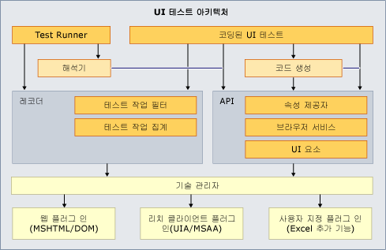

# Microsoft Excel을 지원하도록 코딩된 UI 테스트 및 작업 기록 확장
코딩된 UI 테스트 및 작업 기록에 대한 테스트 프레임워크는 가능한 사용자 인터페이스를 일부 지원하지 않습니다. 테스트하려는 특정 UI를 지원하지 않을 수 있습니다. 예를 들어 [!INCLUDE[ofprexcel](../test/includes/ofprexcel_md.md)] 스프레드시트에 대한 작업 기록 또는 코딩된 UI 테스트는 바로 만들 수 없습니다. 그러나 코딩된 UI 테스트 프레임워크의 확장성을 이용하여 특정 UI를 지원할 코딩된 UI 테스트 프레임워크에 대한 고유한 확장을 만들 수 있습니다. 다음 항목에서는 프레임워크를 확장하여 [!INCLUDE[ofprexcel](../test/includes/ofprexcel_md.md)]에 대한 작업 기록 및 코딩된 UI 테스트 생성을 지원하는 방법을 제공합니다. 지원되는 플랫폼에 대한 자세한 내용은 [코딩된 UI 테스트 및 작업 기록에 지원되는 구성 및 플랫폼](../test/supported-configurations-and-platforms-for-coded-ui-tests-and-action-recordings.md)을 참조하세요.  
  
 **Requirements**  
  
-   Visual Studio Enterprise  
  
 이 단원에서는 Excel 워크시트의 테스트를 기록하고 재생할 수 있는 코딩된 UI 테스트 확장을 제공합니다. 확장의 각 부분은 이 단원과 그러한 확장을 생성하려는 개발자를 위한 코드 설명에서 설명됩니다.  
  
   
아키텍처 개요  
  
## 샘플 다운로드  
 이 샘플은 `CodedUIExtensibilitySample.sln` 솔루션에서 네 개의 프로젝트로 구성되어 있습니다.  
  
-   CodedUIextensibilitySample  
  
-   ExcelCodedUIAddInHelper  
  
-   ExcelUICommunicationHelper  
  
-   SampleTestProject  
  
 이 [블로그 게시물](http://go.microsoft.com/fwlink/?LinkID=185592)에서 샘플을 다운로드하세요.  
  
> [!NOTE]
>  샘플은 Microsoft Excel 2010에서 사용하도록 제공됩니다. 다른 버전의 Microsoft Excel에서도 샘플이 작동할 수 있지만 현재 지원되지 않습니다.  
  
## 샘플에 대한 정보  
 다음 단원에서는 샘플과 구조에 대한 정보를 제공합니다.  
  
### Microsoft Excel 추가 기능: ExcelCodedUIAddinHelper  
 이 프로젝트에는 Excel 프로세스에서 실행되는 추가 기능이 포함됩니다. 추가 기능 프로젝트에 대한 간략한 개요는 [코딩된 UI 테스트에 대한 샘플 Excel 추가 기능](../test/sample-excel-add-in-for-coded-ui-testing.md)을 참조하세요.  
  
 자세한 내용은 [연습: Excel용 첫 VSTO 추가 기능 만들기](http://msdn.microsoft.com/Library/a855e2be-3ecf-4112-a7f5-ec0f7fad3b5f)를 참조하세요.  
  
### Excel UI 통신: ExcelUIcommunicationHelper  
 이 프로젝트에는 코딩된 UI 테스트 프레임워크와 Excel 간 데이터를 전달하기 위해 사용되는 `IExcelUICommunication` 인터페이스 및 정보 클래스가 포함되어 있습니다. 자세한 내용은 [샘플 Excel Communicator 인터페이스](../test/sample-excel-communicator-interface.md)를 참조하세요.  
  
### 코딩된 UI 테스트 확장: CodedUIExentsibilitySample  
 이 프로젝트에는 Excel 워크시트 테스트에 사용되는 사용자 지정 클래스가 포함됩니다. 이 클래스의 각 코드는 별도의 설명 없이도 바로 이해할 수 있습니다. 그러나 각 사용자 지정 클래스에 대해 간단한 설명을 제공합니다. 자세한 내용은 [Excel용 샘플 코딩된 UI 테스트 확장명](../test/sample-coded-ui-test-extension-for-excel.md)을 참조하세요.  
  
### 추가 기능 및 확장명 프로그램 배포  
 모든 프로젝트 및 개체를 만든 후, 제공된 `CopyDrop.bat` 파일을 관리자 권한으로 실행합니다. 이 파일은 `ExcelCodedUIAddinHelper` DLL 및 PDB 파일을 다음으로 복사합니다.  
  
 "`%CommonProgramFiles(x86)%\Microsoft Shared\VSTT\<version number>\UITestExtensionPackages\*.*`". 여기서 버전 번호는 Visual Studio 버전에 따라 11.0, 12.0 등이 될 수 있습니다.  
  
 `ExcelUICommunicationHelper`DLL 및 PDB 파일이 `"%ProgramFiles(x86)%\Microsoft Visual Studio <version number>\Common7\IDE\PrivateAssemblies”`로 복사됩니다.  
  
 정확한 복사 경로를 조정해야 할 수 있지만 추가 설치는 필요하지 않습니다. 64비트 컴퓨터에서 32비트 Visual Studio Enterprise 명령 프롬프트를 사용해 `CopyDrop.bat` 파일을 실행합니다.  
  
### SampleTestProject를 사용하여 Excel 테스트  
 가지고 있거나 가지고 있지 않은 특정 버전의 Excel을 사용하는 제공된 테스트 프로젝트에서 테스트를 실행하거나 고유한 테스트 프로젝트를 만들어 자신만의 테스트를 기록할 수 있습니다. 자세한 내용은 [코딩된 UI 테스트 만들기](../test/use-ui-automation-to-test-your-code.md#VerifyingCodeUsingCUITCreate)를 참조하세요.  
  
## 참고 항목  
 <xref:Microsoft.VisualStudio.TestTools.UITesting.UITestPropertyProvider>   
 <xref:Microsoft.VisualStudio.TestTools.UITest.Extension.UITechnologyElement>   
 <xref:Microsoft.VisualStudio.TestTools.UITest.Common.UITestActionFilter>   
 <xref:Microsoft.VisualStudio.TestTools.UITest.Extension.UITestExtensionPackage>   
 [UI 자동화를 사용하여 코드 테스트](../test/use-ui-automation-to-test-your-code.md)   
 [코딩된 UI 테스트에 대한 모범 사례](../test/best-practices-for-coded-ui-tests.md)   
 [코딩된 UI 테스트 및 작업 기록에 지원되는 구성 및 플랫폼](../test/supported-configurations-and-platforms-for-coded-ui-tests-and-action-recordings.md)

