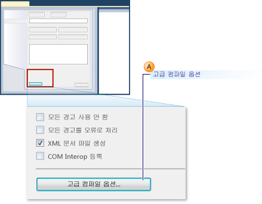
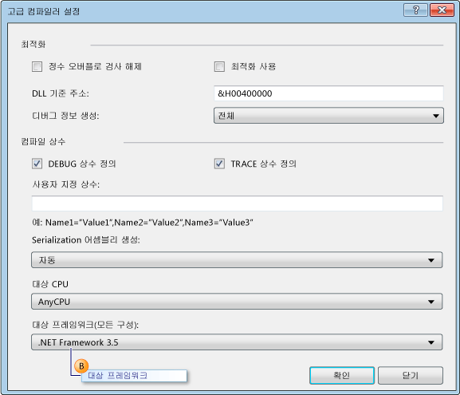
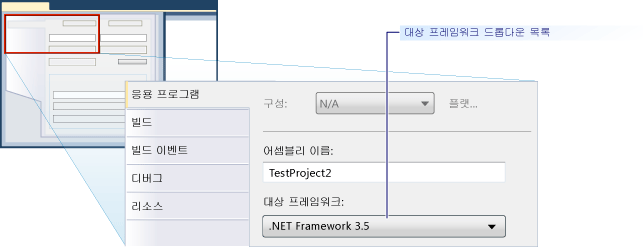

# 방법: 이전 버전의 .NET Framework를 대상으로 사용하도록 단위 테스트 구성
[!INCLUDE[vs2017banner](../code-quality/includes/vs2017banner.md)]

Microsoft Visual Studio에서 테스트 프로젝트를 만들 때 기본적으로 가장 최신 버전의.NET Framework 대상으로 설정 됩니다.  또한 테스트 프로젝트를 Visual Studio 이전 버전에서 업그레이드할 때 가장 최신 버전의.NET Framework 대상으로 업그레이드 됩니다.  프로젝트 속성을 편집하여 프로젝트 대상을 이전 버전의 .NET Framework로 명시적으로 다시 지정할 수 있습니다.  
  
 단위 특정 버전의.NET Framework 대상으로 하는 테스트 프로젝트를 만들 수 있습니다.  대상된 버전 3.5 이상 이어야 하 고 클라이언트 버전이 될 수 없습니다.  Visual Studio는 지정된 버전의 단위 테스트에 대해 다음과 같은 기본 지원을 제공합니다.  
  
-   단위 테스트 프로젝트를 만들고 .특정 버전의 NET Framework를 대상으로 할 수 있습니다.  
  
-   로컬 컴퓨터에서 Visual Studio로 부터 지정된 버전의 NET Framework를 대상으로 하는 단위 테스트를 실행할 수 있습니다.  
  
-   명령줄에서 MSTest.exe를 사용하여 .지정된 버전의 NET Framework를 대상으로 하는 단위 테스트를 실행할 수 있습니다.  
  
-   빌드의 일부로 빌드 에이전트에 대한 단위 테스트를 실행할 수 있습니다.  
  
 **SharePoint 응용 프로그램 테스트**  
  
 위의 기능들을 사용하여 Visual Studio 2010을 사용하여 SharePoint 응용 프로그램에 대한 단위 테스트 및 통합 테스트를 작성할 수도 있습니다.  [!INCLUDE[crabout](../test/includes/crabout_md.md)] Visual Studio를 사용하는 Share Point 응용프로그램을 개발하는 지에 대하여 [SharePoint 솔루션 만들기](/office-dev/office-dev/create-sharepoint-solutions), [SharePoint 솔루션 빌드 및 디버깅](/office-dev/office-dev/building-and-debugging-sharepoint-solutions) 및 [SharePoint 코드 확인 및 디버깅](/office-dev/office-dev/verifying-and-debugging-sharepoint-code)을 참조하십시오.  
  
 **제한**  
  
 .NET Framework의 이전버전을 사용하도록 테스트 프로젝트 대상을 다시 지정할 경우 다음과 같은 제한 사항이 적용됩니다.  
  
-   .NET Framework 3.5에서는 단위 테스트만 포함하는 테스트 프로젝트에 대해 다중 대상 지정이 지원됩니다.  .NET Framework 3.5에서는 코드 UI나 로드 테스트와 같은 다른 테스트 형식을 지원하지 않습니다.  단위 테스트 외의 테스트 형식에 대해서는 대상을 다시 지정할 수 없습니다.  
  
-   .NET Framework 이전 버전에서 테스트를 실행하는 것은 기본 호스트 어댑터에서만 지원 됩니다.  그러나 ASP.NET 호스트 어댑터에서는 실행할 수 없습니다.  ASP.NET Development Server 컨텍스트에서 실행해야 하는 ASP.NET 응용 프로그램은 이전 버전의 NET Framework와 호환되어야 합니다.  
  
-   .NET Framework 3.5 다중 대상 지정을 지원하는 테스트를 실행할 경우 데이터 수집이 지원되지 않습니다.  Visual Studio 명령줄 도구를 사용하여 코드 검사를 실행할 수 있습니다.  
  
-   .NET Framework 3.5를 사용하는 단위 테스트는 원격 컴퓨터에서 실행할 수 없습니다.  
  
-   단위 테스트 프레임 워크의 이전 버전의 클라이언트를 대상으로 수 없습니다.  
  
### Visual Basic 단위 테스트 프로젝트용 특정 버전 .NET Framework로 대상 다시 지정  
  
1.  Visual Basic 단위 테스트 프로젝트를 새로 만듭니다.  **파일** 메뉴에서 **새로 만들기**를 선택한 다음 **프로젝트**를 선택합니다.  
  
     **새 프로젝트** 대화 상자가 표시됩니다.  
  
2.  **설치된 템플릿**에서 **Visual Basic**을 확장합니다.  **테스트**를 선택한 다음 **테스트 프로젝트** 템플릿을 선택합니다.  
  
3.  **이름** 텍스트 상자에 Visual Basic 테스트 프로젝트 이름을 입력한 다음 **확인**을 클릭합니다.  
  
4.  솔루션 탐색기의 새로운 기본 테스트 프로젝트의 바로 가기 메뉴에서 **속성**을 선택합니다.  
  
     Visual Basic 테스트 프로젝트의 속성이 표시됩니다.  
  
5.  **컴파일** 탭에서 다음 그림과 같이 **고급 컴파일 옵션** 을 선택합니다.  
  
       
  
6.  다음 그림과 같이 **대상 프레임워크\(모든 구성\)** 드롭다운 목록을 사용하여 대상 프레임워크를 **.NET Framework** 또는 이후 버전으로 변경합니다.  클라이언트 버전을 지정할 수 없습니다.  
  
       
  
### Visual C\# 단위 테스트 프로젝트용 특정 버전 .NET Framework로 대상 다시 지정  
  
1.  Visual C\# 단위 테스트 프로젝트를 새로 만듭니다.  **파일** 메뉴에서 **새로 만들기**를 선택한 다음 **프로젝트**를 선택합니다.  
  
     **새 프로젝트** 대화 상자가 표시됩니다.  
  
2.  **설치된 템플릿**에서 **Visual C\#**을 확장합니다.  **테스트**를 선택한 다음 **테스트 프로젝트** 템플릿을 선택합니다.  
  
3.  **이름** 텍스트 상자에 Visual C\# 테스트 프로젝트 이름을 입력한 다음 **확인**을 클릭합니다.  
  
4.  솔루션 탐색기의 새로운 Visual C\# 테스트 프로젝트의 바로 가기 메뉴에서 **속성** 을 선택합니다.  
  
     Visual C\# 테스트 프로젝트의 속성이 표시됩니다.  
  
5.  **응용 프로그램** 탭에서 **대상 프레임워크** 를 선택한 다음 **.NET Framework 3.5** 또는 드롭다운 목록을 사용하여 다음 그림에서 보여지는 것과 같이 대상 프레임워크를 .이후 버전으로 변경합니다.  클라이언트 버전을 지정하면 안 됩니다.  
  
       
  
### C\+\+\/CLI 단위 테스트 프로젝트용 특정 버전 .NET Framework로 대상 다시 지정  
  
1.  C\+\+ 단위 테스트 프로젝트를 새로 만듭니다.  **파일** 메뉴에서 **새로 만들기**를 선택한 다음 **프로젝트**를 클릭합니다.  
  
     **새 프로젝트** 대화 상자가 표시됩니다.  
  
    > [!WARNING]
    >  Visual C\+\+에 대해 이번 버전의 .NET framework에 대해 C\+\+\/CLI 단위를 빈드하기 위해 이전 버전과 일치하는 Visual Studio를 사용해야 합니다.  예를 들어,.NET Framework 3.5를 대상으로 [!INCLUDE[vs_orcas_long](../debugger/includes/vs_orcas_long_md.md)] 및 [!INCLUDE[vs_orcas_long](../debugger/includes/vs_orcas_long_md.md)] 서비스 팩 1을 설치해야 합니다.  
  
2.  **설치된 템플릿**에서 **Visual C \+\+**을 확장합니다.  **테스트**를 선택한 다음 **테스트 프로젝트** 템플릿을 선택합니다.  
  
3.  **이름** 텍스트 상자에 Visual C\+\+ 테스트 프로젝트 이름을 입력한 다음 **확인**을 클릭합니다.  
  
4.  솔루션 탐색기에서 새 Visual C\+\+ 테스트 프로젝트에서 **프로젝트 언로드** 를 선택합니다.  
  
5.  솔루션 탐색기에서 언로드된 Visual C\+\+ 테스트 프로젝트를 마우스 오른쪽 단추로 클릭하고 **프로젝트 이름\>편집 \<.vcxproj**을 선택합니다.  
  
     .vcxproj 파일이 편집기에서 열립니다.  
  
6.  `TargetFrameworkVersion` 을 3.5 버전 또는 이후 버전의 `PropertyGroup` 라는 `"Globals"`으로 설정합니다.  클라이언트 버전을 지정하면 안 됩니다.  
  
    ```  
    <PropertyGroup Label="Globals">  
        <TargetName>DefaultTest</TargetName>  
        <ProjectTypes>{3AC096D0-A1C2-E12C-1390-A8335801FDAB};{8BC9CEB8-8B4A-11D0-8D11-00A0C91BC942}</ProjectTypes>  
        <ProjectGUID>{CE16D77A-E364-4ACD-948B-1EB6218B0EA3}</ProjectGUID>  
        <TargetFrameworkVersion>3.5</TargetFrameworkVersion>  
        <Keyword>ManagedCProj</Keyword>  
        <RootNamespace>CPP_Test</RootNamespace>  
      </PropertyGroup>  
  
    ```  
  
7.  .vcxproj 파일을 저장하고 닫습니다.  
  
8.  솔루션 탐색기에서 새 Visual C\+\+ 테스트 프로젝트의 바로 가기 메뉴에서 **프로젝트 다시 로드** 를 선택합니다.  
  
## 참고 항목  
 [Creating and Running Unit Tests for Existing Code](http://msdn.microsoft.com/ko-kr/e8370b93-085b-41c9-8dec-655bd886f173)   
 [SharePoint 솔루션 만들기](/office-dev/office-dev/create-sharepoint-solutions)   
 [SharePoint 솔루션 빌드 및 디버깅](/office-dev/office-dev/building-and-debugging-sharepoint-solutions)   
 [고급 컴파일러 설정 대화 상자\(Visual Basic\)](../ide/reference/advanced-compiler-settings-dialog-box-visual-basic.md)