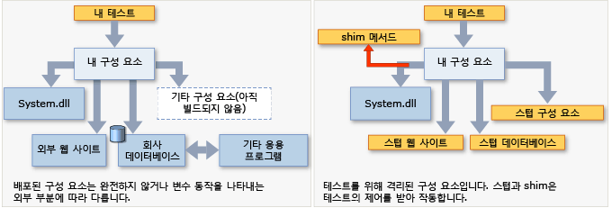

# <a name="isolating-code-under-test-with-microsoft-fakes"></a>Microsoft Fakes를 사용하여 테스트 중인 코드 격리
Microsoft Fakes는 *스텁* 또는 *shim*을 사용하는 응용 프로그램의 다른 부분을 교체함으로써 사용자가 테스트 중인 코드를 격리시켜 줍니다. 테스트에서 제어하는 작은 코드 조각입니다. 테스트를 위해 코드를 격리하여 테스트가 실패할 경우 원인이 어디에 있는지 파악합니다. 응용 프로그램의 다른 부분이 아직 작동하지 않더라도 스텁 및 shim을 사용해서 코드를 테스트할 수도 있습니다.  
  
 Fakes는 두 가지 버전이 있습니다.  
  
-   [스텁](#stubs)은 클래스를 동일한 인터페이스를 구현하는 작은 대안으로 바뀝니다.  스텁을 사용하려면 각 구성 요소가 다른 구성 요소에 종속되는 것이 아니라 인터페이스에만 종속되도록 응용 프로그램을 설계해야 합니다. ("구성 요소"란 함께 설계되어 업데이트되고 대개 하나의 어셈블리에 포함되는 클래스 또는 클래스의 그룹을 의미합니다.)  
  
-   [shim](#shims)은 지정된 메서드 콜을 실행하는 대신 테스트에서 제공하는 shim 코드를 실행할 수 있도록 런타임에 응용 프로그램의 컴파일된 코드를 수정합니다. shim은 .NET 어셈블리와 같이 수정할 수 없는 어셈블리에 대한 호출을 바꾸는 데 사용할 수 있습니다.  
  
   
  
 **Requirements**  
  
-   Visual Studio Enterprise  
  
## <a name="choosing-between-stub-and-shim-types"></a>스텁 및 shim 형식 중에 선택  
 일반적으로 이러한 클래스를 동시에 개발하고 업데이트했으므로 Visual Studio 프로젝트를 구성 요소라고 생각할 수 있습니다. 프로젝트가 솔루션의 다른 프로젝트에 대해 만드는 호출 또는 프로젝트가 참조하는 다른 어셈블리에 대해 만드는 호출에 스텁 또는 shim을 사용하는 것을 고려할 수 있습니다.  
  
 일반적으로, Visual Studio 솔루션에 포함된 호출에는 스텁을 사용하고 그 밖의 참조된 어셈블리 호출에는 shim을 사용합니다. 고유 솔루션 내에서는 스텁에 필요한 방식으로 인터페이스를 정의하여 구성 요소를 분리하는 것이 좋기 때문입니다. 그러나 System.dll 등의 외부 어셈블리에는 별도의 인터페이스 정의가 제공되지 않는 것이 일반적이므로 대신 shim을 사용해야 합니다.  
  
 기타 고려 사항:  
  
 **성능.** shim은 런타임에 코드를 다시 작성하기 때문에 느리게 실행됩니다. 스텁은 이러한 성능 오버헤드가 없고 가상 메서드처럼 빠릅니다.  
  
 **sealed 형식의 정적 메서드.** 인터페이스를 구현할 때는 스텁만 사용할 수 있습니다. 따라서 스텁 형식은 정적 메서드, 비가상 메서드, 봉인된 가상 메서드, 봉인된 형식의 메서드 등에 사용할 수 없습니다.  
  
 **내부 형식.** 스텁과 shim 둘 다 어셈블리 특성 <xref:System.Runtime.CompilerServices.InternalsVisibleToAttribute>를 사용하여 액세스할 수 있는 내부 형식에 사용할 수 있습니다.  
  
 **전용 메서드.** 메서드 시그니처의 모든 형식이 표시되는 경우 shim은 개인 메서드에 대한 호출을 대체할 수 있습니다. 스텁은 표시되는 메서드만 바꿀 수 있습니다.  
  
 **인터페이스 및 추상 메서드.** 스텁은 테스트에서 사용할 수 있는 추상 메서드의 구현 및 인터페이스를 제공합니다. shim에는 메서드 본문이 없기 때문에 인터페이스 및 추상 메서드를 계측할 수 없습니다.  
  
 일반적으로 코드베이스 안의 종속성에서 격리하려면 스텁 형식을 사용하는 것이 좋습니다. 인터페이스 뒤에 구성 요소를 숨기면 됩니다. shim 형식을 사용하여 테스트 가능한 API를 제공하지 않는 타사 구성 요소에서 격리할 수 있습니다.  
  
##  <a name="stubs"></a> 스텁 시작  
 자세한 내용은 [스텁을 사용하여 유닛 테스트를 위한 응용 프로그램의 여러 부분을 서로 격리](../test/using-stubs-to-isolate-parts-of-your-application-from-each-other-for-unit-testing.md)를 참조하세요.  
  
1.  **인터페이스 삽입**  
  
     스텁을 사용하려면 응용 프로그램의 다른 구성 요소에서 클래스를 명시적으로 지정하지 않는 방식으로 테스트할 코드를 작성해야 합니다. "구성 요소"란 함께 개발되어 업데이트되며 일반적으로 하나의 Visual Studio 프로젝트에 포함되는 클래스를 의미합니다. 변수 및 매개 변수는 인터페이스를 사용하여 선언해야 하며 다른 구성 요소의 인스턴스는 팩터리를 사용하여 전달하거나 만들어야 합니다. 예를 들어, StockFeed가 응용 프로그램의 다른 구성 요소에 있는 클래스인 경우 잘못된 것으로 간주됩니다.  
  
     `return (new StockFeed()).GetSharePrice("COOO"); // Bad`  
  
     대신, 다른 구성 요소가 실행하고 테스트 용도로 스텁이 실행할 수 있는 인터페이스를 정의합니다.  
  
    ```c#  
    public int GetContosoPrice(IStockFeed feed)  
    { return feed.GetSharePrice("COOO"); }  
  
    ```  
  
    ```vb#  
    Public Function GetContosoPrice(feed As IStockFeed) As Integer  
     Return feed.GetSharePrice("COOO")  
    End Function  
  
    ```  
  
2.  **Fakes 어셈블리 추가**  
  
    1.  솔루션 탐색기에서 테스트 프로젝트의 참조 목록을 확장합니다. Visual Basic에서 작업하는 경우 참조 목록을 보기 위해 **모든 파일 표시**를 선택해야 합니다.  
  
    2.  인터페이스(예: IStockFeed)를 정의한 어셈블리에 대한 참조를 선택합니다. 이 참조의 바로 가기 메뉴에서 **Fakes 어셈블리 추가**를 선택합니다.  
  
    3.  솔루션을 다시 빌드합니다.  
  
3.  테스트에서 스텁 인스턴스를 생성하고 해당 메서드에 대한 코드를 제공합니다.  
  
    ```c#  
    [TestClass]  
    class TestStockAnalyzer  
    {  
        [TestMethod]  
        public void TestContosoStockPrice()  
        {  
          // Arrange:  
  
            // Create the fake stockFeed:  
            IStockFeed stockFeed =   
                 new StockAnalysis.Fakes.StubIStockFeed() // Generated by Fakes.  
                     {  
                         // Define each method:  
                         // Name is original name + parameter types:  
                         GetSharePriceString = (company) => { return 1234; }  
                     };  
  
            // In the completed application, stockFeed would be a real one:  
            var componentUnderTest = new StockAnalyzer(stockFeed);  
  
          // Act:  
            int actualValue = componentUnderTest.GetContosoPrice();  
  
          // Assert:  
            Assert.AreEqual(1234, actualValue);  
        }  
        ...  
    }  
    ```  
  
    ```vb#  
    <TestClass()> _  
    Class TestStockAnalyzer  
  
        <TestMethod()> _  
        Public Sub TestContosoStockPrice()  
            ' Arrange:  
            ' Create the fake stockFeed:  
            Dim stockFeed As New StockAnalysis.Fakes.StubIStockFeed  
            With stockFeed  
                .GetSharePriceString = Function(company)  
                                           Return 1234  
                                       End Function  
            End With  
            ' In the completed application, stockFeed would be a real one:  
            Dim componentUnderTest As New StockAnalyzer(stockFeed)  
            ' Act:  
            Dim actualValue As Integer = componentUnderTest.GetContosoPrice  
            ' Assert:  
            Assert.AreEqual(1234, actualValue)  
        End Sub  
    End Class  
  
    ```  
  
     여기에서 특별한 부분은 `StubIStockFeed` 클래스입니다. Microsoft Fakes는 참조된 어셈블리의 모든 인터페이스에 대해 스텁 클래스를 생성합니다. 스텁 클래스의 이름은 인터페이스의 이름에서 파생되며 "`Fakes.Stub`"가 접두사가 되고 매개 변수 형식 이름이 추가됩니다.  
  
     스텁은 속성, 이벤트 및 제네릭 메서드의 getter와 setter에 대해서도 생성됩니다. 자세한 내용은 [스텁을 사용하여 유닛 테스트를 위한 응용 프로그램의 여러 부분을 서로 격리](../test/using-stubs-to-isolate-parts-of-your-application-from-each-other-for-unit-testing.md)를 참조하세요.  
  
##  <a name="shims"></a> shim 시작  
 (자세한 내용은 [shim을 사용하여 유닛 테스트를 위한 다른 어셈블리에서 응용 프로그램 격리](../test/using-shims-to-isolate-your-application-from-other-assemblies-for-unit-testing.md)를 참조하세요.)  
  
 구성 요소에 `DateTime.Now`에 대한 호출이 포함된 경우를 가정합니다.  
  
```c#  
// Code under test:  
    public int GetTheCurrentYear()  
    {  
       return DateTime.Now.Year;  
    }  
  
```  
  
 실제 버전은 호출할 때마다 매번 다른 값을 반환하므로 테스트하는 동안에는 `Now` 속성을 shim하려고 합니다.  
  
 shim을 사용하려면 응용 프로그램 코드를 수정하거나 특정 방식으로 쓰지 않아도 됩니다.  
  
1.  **Fakes 어셈블리 추가**  
  
     솔루션 탐색기에서 단위 테스트 프로젝트의 참조를 열고 모조하려는 메서드가 포함된 어셈블리에 대한 참조를 선택합니다. 이 예제에서 `DateTime` 클래스는 **System.dll**에 있습니다.  Visual Basic 프로젝트에서 참조를 보려면 **모든 파일 표시**를 클릭합니다.  
  
     **Fakes 어셈블리 추가**를 선택합니다.  
  
2.  **ShimsContext에 shim 삽입**  
  
    ```c#  
    [TestClass]  
    public class TestClass1  
    {   
            [TestMethod]  
            public void TestCurrentYear()  
            {  
                int fixedYear = 2000;  
  
                // Shims can be used only in a ShimsContext:  
                using (ShimsContext.Create())  
                {  
                  // Arrange:  
                    // Shim DateTime.Now to return a fixed date:  
                    System.Fakes.ShimDateTime.NowGet =   
                    () =>  
                    { return new DateTime(fixedYear, 1, 1); };  
  
                    // Instantiate the component under test:  
                    var componentUnderTest = new MyComponent();  
  
                  // Act:  
                    int year = componentUnderTest.GetTheCurrentYear();  
  
                  // Assert:   
                    // This will always be true if the component is working:  
                    Assert.AreEqual(fixedYear, year);  
                }  
            }  
    }  
  
    ```  
  
    ```vb#  
    <TestClass()> _  
    Public Class TestClass1  
        <TestMethod()> _  
        Public Sub TestCurrentYear()  
            Using s = Microsoft.QualityTools.Testing.Fakes.ShimsContext.Create()  
                Dim fixedYear As Integer = 2000  
                ' Arrange:  
                ' Detour DateTime.Now to return a fixed date:  
                System.Fakes.ShimDateTime.NowGet = _  
                    Function() As DateTime  
                        Return New DateTime(fixedYear, 1, 1)  
                    End Function  
  
                ' Instantiate the component under test:  
                Dim componentUnderTest = New MyComponent()  
                ' Act:  
                Dim year As Integer = componentUnderTest.GetTheCurrentYear  
                ' Assert:   
                ' This will always be true if the component is working:  
                Assert.AreEqual(fixedYear, year)  
            End Using  
        End Sub  
    End Class  
    ```  
  
     shim 클래스 이름은 원래 형식 이름에 `Fakes.Shim` 접두사를 추가하여 구성합니다. 매개 변수 이름이 메서드 이름에 추가됩니다. (System.Fakes에는 어셈블리 참조를 추가할 필요가 없습니다.)  
  
 이전 예제에서는 정적 메서드에 대해 shim을 사용합니다. 인스턴스 메서드에 shim을 사용하려면 형식 이름과 메서드 이름 사이에 `AllInstances`를 씁니다.  
  
```  
System.IO.Fakes.ShimFile.AllInstances.ReadToEnd = ...  
```  
  
 (참조할 ‘System.IO.Fakes’ 어셈블리가 없습니다. 네임스페이스는 shim 만들기 프로세스에서 생성됩니다. 그러나 일반적인 방법으로 ‘using’ 또는 ‘Import’를 사용할 수 있습니다.)  
  
 또한 특정 인스턴스, 생성자 및 속성에 대한 shim을 만들 수 있습니다. 자세한 내용은 [shim을 사용하여 유닛 테스트를 위한 다른 어셈블리에서 응용 프로그램 격리](../test/using-shims-to-isolate-your-application-from-other-assemblies-for-unit-testing.md)를 참조하세요.  
  
## <a name="in-this-section"></a>단원 내용  
 [스텁을 사용하여 단위 테스트를 위한 응용 프로그램의 여러 부분을 서로 격리](../test/using-stubs-to-isolate-parts-of-your-application-from-each-other-for-unit-testing.md)  
  
 [shim을 사용하여 단위 테스트를 위한 다른 어셈블리에서 응용 프로그램 격리](../test/using-shims-to-isolate-your-application-from-other-assemblies-for-unit-testing.md)  
  
 [Microsoft Fakes의 코드 생성, 컴파일 및 명명 규칙](../test/code-generation-compilation-and-naming-conventions-in-microsoft-fakes.md)

