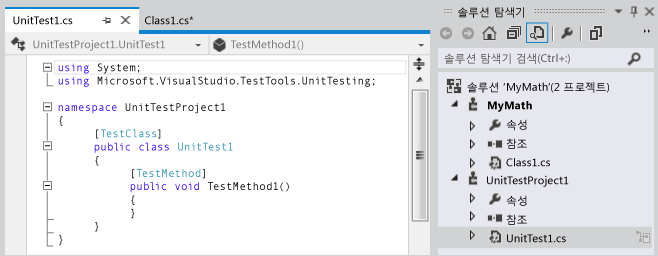
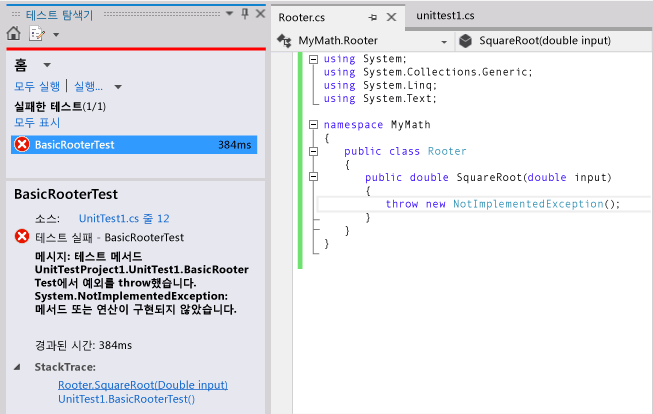
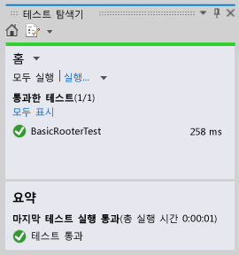
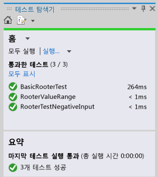

# <a name="quick-start-test-driven-development-with-test-explorer"></a>퀵 스타트: 테스트 탐색기를 사용한 테스트 기반 개발
여러 개발 증분 단계를 통해 코드 작업을 올바른 상태로 유지하는 데 도움을 줄 단위 테스트를 작성하는 것이 좋습니다. 타사에서 개발된 것을 비롯하여 단위 테스트를 작성하는 데 사용할 수 있는 프레임워크에는 여러 가지가 있습니다. 일부 테스트 프레임워크는 다른 언어 또는 플랫폼의 테스트로 전문화되어 있습니다. 테스트 탐색기는 이러한 프레임워크 중 하나에서 단위 테스트를 위한 단일 인터페이스를 제공합니다. 어댑터는 일반적으로 사용되는 프레임워크에 사용할 수 있으며, 다른 프레임워크용 고유 어댑터를 작성할 수 있습니다.  
  
 테스트 탐색기는 이전 Visual Studio 버전의 단위 테스트 창을 대체합니다. 테스트 탐색기의 이점은 다음과 같습니다.  
  
-   .NET, 관리되지 않은 데이터베이스 및 단일 인터페이스를 사용하는 다양한 종류의 테스트를 실행합니다.  
  
-   NUnit 또는 MSTest 프레임워크 등의 선택한 단위 테스트 프레임워크를 사용합니다.  
  
-   필요한 모든 정보를 하나의 창에서 확인합니다.  
  
## <a name="using-test-explorer"></a>테스트 탐색기 사용  
 ")  
  
#### <a name="to-run-unit-tests-by-using-test-explorer"></a>테스트 탐색기를 사용하여 단위 테스트를 실행하려면  
  
1.  선택한 테스트 프레임워크를 사용하는 단위 테스트를 만듭니다.  
  
     예를 들어, MSTest Framework를 사용하는 테스트를 만듭니다.  
  
    1.  테스트 프로젝트를 만듭니다.  
  
         **새 프로젝트** 대화 상자에서 **Visual Basic**, **Visual C#**또는 **Visual C++**를 확장한 다음 **테스트**를 선택합니다.  
  
         **단위 테스트 프로젝트**를 선택합니다.  
  
    2.  각 단위 테스트를 메서드로 작성합니다. 각 테스트 메서드 앞에 `[TestMethod]` 특성을 접두사로 지정합니다.  
  
2.  개별 테스트에 종속성이 없어 임의 순서로 실행할 수 있는 경우 도구 모음의  토글 단추를 사용하여 병렬 테스트 실행을 켭니다. 이렇게 하면 모든 테스트를 실행하는 데 걸리는 시간을 훨씬 줄일 수 있습니다.  
  
3.  메뉴 모음에서 **테스트**, **단위 테스트 실행**, **모든 테스트**를 선택합니다.  
  
     솔루션이 빌드되고 테스트가 실행됩니다.  
  
     테스트 탐색기가 열리고 결과 요약이 표시됩니다.  
  
 **전체 테스트 목록을 보려면** 아무 범주에서나 **모두 표시** 를 선택합니다.  
  
 **테스트 결과의 세부 정보를 보려면** 세부 정보 창에서 예외 메시지와 같은 세부 정보를 표시할 테스트를 테스트 탐색기에서 선택합니다.  
  
 **테스트 코드로 이동하려면** 테스트 탐색기에서 테스트를 두 번 클릭하거나 바로 가기 메뉴에서 **테스트 열기** 를 선택합니다.  
  
 **테스트를 디버깅하려면** 하나 이상의 테스트에 대한 바로 가기를 열고 나서 **선택한 테스트 디버그**를 선택합니다.  
  
> [!IMPORTANT]
>  표시되는 결과는 최근 실행에 대한 결과입니다. 결과 색상 막대에는 실행된 테스트에 대한 결과만 표시됩니다. 예를 들어, 여러 테스트를 실행했지만 그 중 일부가 실패하고 성공한 테스트만 실행할 경우 결과 모음에 모두 녹색으로 표시됩니다.  
  
> [!NOTE]
>  테스트가 표시되지 않으면 어댑터를 설치하여 테스트 탐색기를 사용 중인 테스트 프레임워크에 연결했는지 확인하십시오. 자세한 내용은 [테스트 탐색기에서 다양한 테스트 프레임워크 사용](#frameworks)을 참조하십시오.  
  
##  <a name="walkthrough"></a> 연습: 단위 테스트를 사용하여 메서드 개발  
 이 연습에서는 Microsoft 단위 테스트 프레임워크를 사용하여 C#에서 테스트 메서드를 개발하는 방법을 보여 줍니다. 다른 언어에 맞게 쉽게 조정할 수 있으며 NUnit과 같은 다른 테스트 프레임워크에도 사용할 수 있습니다. 자세한 내용은 [다양한 테스트 프레임워크 사용](#frameworks)을 참조하십시오.  
  
#### <a name="creating-the-test-and-method"></a>테스트 및 메서드 만들기  
  
1.  Visual C# 클래스 라이브러리 프로젝트를 만듭니다. 이 프로젝트에는 전달할 코드가 포함됩니다. 이 예제에서는 `MyMath`이라는 이름으로 지정됩니다.  
  
2.  테스트 프로젝트를 만듭니다.  
  
    -   **새 프로젝트** 대화 상자에서 **Visual C#**을 선택하고 **테스트** 를 선택한 다음 **단위 테스트 프로젝트**를 선택합니다.  
  
           
  
3.  기본 테스트 메서드를 작성합니다. 특정 입력에 대해 얻은 결과를 확인합니다.  
  
    ```csharp  
  
    [TestMethod]  
    public void BasicRooterTest()  
    {  
      // Create an instance to test:  
      Rooter rooter = new Rooter();  
      // Define a test input and output value:  
      double expectedResult = 2.0;  
      double input = expectedResult * expectedResult;  
      // Run the method under test:  
      double actualResult = rooter.SquareRoot(input);  
      // Verify the result:  
      Assert.AreEqual(expectedResult, actualResult,  
          delta: expectedResult / 100);  
    }  
    ```  
  
4.  테스트에서 메서드를 생성합니다.  
  
    1.  커서를 `Rooter`에 놓고 나서 바로 가기 메뉴에서 **생성**, **새 형식**을 선택합니다.  
  
    2.  **새 형식 생성** 대화 상자에서 **프로젝트** 를 클래스 라이브러리 프로젝트로 설정합니다. 이 예제에서는 `MyMath`입니다.  
  
    3.  커서를 `SquareRoot`에 놓고 나서 바로 가기 메뉴에서 **생성**, **메서드 스텁**을 선택합니다.  
  
5.  단위 테스트를 실행합니다.  
  
    1.  **테스트** 메뉴에서 **단위 테스트 실행**, **모든 테스트**를 선택합니다.  
  
         솔루션이 빌드되고 실행됩니다.  
  
         테스트 탐색기가 열리고 결과가 표시됩니다.  
  
         **실패한 테스트**에 테스트가 나타납니다.  
  
6.  테스트의 이름을 선택합니다.  
  
     테스트의 세부 정보가 테스트 탐색기 아래 부분에 나타납니다.  
  
7.  **스택 추적** 에서 테스트가 실패한 위치를 확인할 항목을 선택합니다.  
  
   
  
 이제 테스트를 만들었으며 테스트를 통과하도록 수정할 스텁을 만들었습니다.  
  
#### <a name="after-every-change-make-all-the-tests-pass"></a>변경할 때마다 모든 테스트를 통과하도록 만들기  
  
1.  `MyMath\Rooter.cs`에서 `SquareRoot`의 코드를 향상시킵니다.  
  
    ```csharp  
    public double SquareRoot(double input)  
     {  
       return input / 2;  
     }  
    ```  
  
2.  테스트 탐색기에서 **모두 실행**을 선택합니다.  
  
     코드가 빌드되고 테스트가 실행됩니다.  
  
     테스트가 통과됩니다.  
  
       
  
#### <a name="add-tests-to-extend-the-range-of-inputs"></a>테스트를 추가하여 입력 범위 확장  
  
1.  코드가 모든 경우에 작동한다는 확신을 높이기 위해 보다 광범위한 입력 값 범위를 시도하는 테스트를 추가합니다.  
  
    > [!TIP]
    >  통과한 기존 테스트를 변경하지 마십시오. 대신에 새 테스트를 추가합니다. 사용자 요구 사항이 변경될 때만 기존 테스트를 변경합니다. 이 정책을 적용하면 코드를 확장할 때 기존 기능이 손실되지 않습니다.  
  
     테스트 클래스에서 입력 값 범위를 시도하는 다음 테스트를 추가합니다.  
  
    ```csharp  
    [TestMethod]  
    public void RooterValueRange()  
    {  
      // Create an instance to test:  
      Rooter rooter = new Rooter();  
      // Try a range of values:  
      for (double expectedResult = 1e-8;  
          expectedResult < 1e+8;  
          expectedResult = expectedResult * 3.2)  
      {  
        RooterOneValue(rooter, expectedResult);  
      }  
    }  
  
    private void RooterOneValue(Rooter rooter, double expectedResult)  
    {  
      double input = expectedResult * expectedResult;  
      double actualResult = rooter.SquareRoot(input);  
      Assert.AreEqual(expectedResult, actualResult,  
          delta: expectedResult / 1000);  
    }  
    ```  
  
2.  테스트 탐색기에서 **모두 실행**을 선택합니다.  
  
     첫 번째 테스트는 여전히 통과하지만 새 테스트는 실패합니다.  
  
     실패 지점을 찾기 위해 실패 테스트를 선택하고 테스트 탐색기의 아래 부분에서 **스택 추적**의 맨 위 항목을 선택합니다.  
  
3.  테스트 아래 메서드를 검사하여 잘못된 부분이 무엇인지 알아봅니다. `MyMath.Rooter` 클래스에서 코드를 다시 작성합니다.  
  
    ```  
    public double SquareRoot(double input)  
    {  
      double result = input;  
      double previousResult = -input;  
      while (Math.Abs(previousResult - result) > result / 1000)  
      {  
        previousResult = result;  
        result = result - (result * result - input) / (2 * result);  
      }  
      return result;  
    }  
    ```  
  
4.  테스트 탐색기에서 **모두 실행**을 선택합니다.  
  
     이제 두 테스트를 모두 통과합니다.  
  
#### <a name="add-tests-for-exceptional-cases"></a>예외 경우에 대한 테스트 추가  
  
1.  음수 입력에 대한 테스트를 추가합니다.  
  
    ```csharp  
    [TestMethod]  
     public void RooterTestNegativeInputx()  
     {  
         Rooter rooter = new Rooter();  
         try  
         {  
             rooter.SquareRoot(-10);  
         }  
         catch (ArgumentOutOfRangeException e)  
         {  
             return;  
         }  
         Assert.Fail();  
     }  
    ```  
  
2.  테스트 탐색기에서 **모두 실행**을 선택합니다.  
  
     테스트 아래 메서드가 반복적으로 실행되므로 수동으로 취소해야 합니다.  
  
3.  **취소**를 선택합니다.  
  
     테스트가 10초 후에 중지됩니다.  
  
4.  메서드 코드를 수정합니다.  
  
    ```csharp  
  
    public double SquareRoot(double input)  
    {  
      if (input <= 0.0)   
      {  
        throw new ArgumentOutOfRangeException();  
      }   
    ...  
    ```  
  
5.  테스트 탐색기에서 **모두 실행**을 선택합니다.  
  
     모든 테스트를 통과합니다.  
  
#### <a name="refactor-without-changing-tests"></a>테스트를 변경하지 않고 리팩터링  
  
1.  코드를 간소화하되, 테스트를 변경하지 마십시오.  
  
    > [!TIP]
    >  *리팩터링* 은 코드가 더 잘 수행되도록 하거나 코드를 좀더 쉽게 이해할 수 있도록 하기 위한 변경입니다. 코드의 동작을 변경하기 위한 것이 아니므로 테스트는 변경되지 않습니다.  
    >   
    >  기능을 확장하는 단계와 별도로 리팩터링 단계를 수행하는 것이 좋습니다. 테스트를 변경되지 않은 상태로 유지하면 리팩터링 중에 실수로 버그가 발생되지 않았다는 확신을 가질 수 있습니다.  
  
    ```csharp  
    public class Rooter  
    {  
      public double SquareRoot(double input)  
      {  
        if (input <= 0.0)   
        {  
          throw new ArgumentOutOfRangeException();  
        }  
        double result = input;  
        double previousResult = -input;  
        while (Math.Abs(previousResult - result) > result / 1000)  
        {  
          previousResult = result;  
          result = (result + input / result) / 2;  
          //was: result = result - (result * result - input) / (2*result);  
        }  
        return result;  
      }  
    }  
    ```  
  
2.  **모두 실행**을 선택합니다.  
  
     이번에도 모든 테스트를 통과합니다.  
  
     

