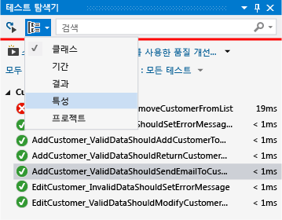
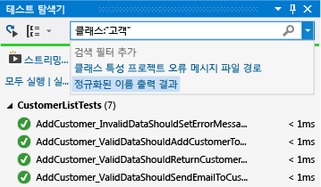
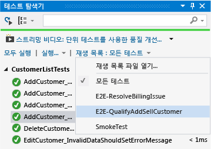

# <a name="run-unit-tests-with-test-explorer"></a>테스트 탐색기를 사용하여 단위 테스트 실행

**테스트 탐색기**를 사용하여 Visual Studio 또는 타사 단위 테스트 프로젝트에서 단위 테스트를 실행합니다. 테스트를 범주로 그룹화하고 테스트 목록을 필터링하고 테스트 재생 목록을 만들고 저장하고 실행하기 위해 **테스트 탐색기**를 사용할 수 있습니다. 테스트를 디버그하고 테스트 성능 및 코드 검사를 분석할 수 있습니다.

Visual Studio에는 관리 코드 및 네이티브 코드에 대한 Microsoft 단위 테스트 프레임워크가 있습니다. 그러나 **테스트 탐색기**도 테스트 탐색기 어댑터를 구현한 단위 테스트 프레임워크를 실행할 수 있습니다. 타사 단위 테스트 프레임워크를 설치하는 방법에 대한 자세한 내용은 [타사 단위 테스트 프레임워크 설치](../test/install-third-party-unit-test-frameworks.md)를 참조하세요.

**테스트 탐색기**는 솔루션의 여러 테스트 프로젝트 및 프로덕션 코드 프로젝트의 일부인 테스트 클래스에서 테스트를 실행할 수 있습니다. 테스트 프로젝트에 서로 다른 단위 테스트 프레임워크를 사용할 수 있습니다. 테스트 중인 코드가 .NET Framework용으로 작성된 경우 테스트 프로젝트는 대상 코드의 언어에 관계없이 .NET Framework를 대상으로 하는 임의의 언어로 작성할 수 있습니다. 네이티브 C/C++ 코드 프로젝트는 C++ 단위 테스트 프레임워크를 사용하여 테스트해야 합니다. 자세한 내용은 [C/C++에 대한 단위 테스트 작성](writing-unit-tests-for-c-cpp.md)을 참조하세요.

## <a name="run-tests-in-test-explorer"></a>테스트 탐색기에서 테스트 실행

테스트 프로젝트를 빌드하면 테스트가 테스트 탐색기에 나타납니다. 테스트 탐색기가 표시되지 않는 경우 Visual Studio 메뉴에서 **테스트** 를 선택하고 **Windows**를 선택한 다음 **테스트 탐색기**를 선택합니다.


테스트를 실행하고 작성하고 다시 실행하면 테스트 탐색기는 **실패한 테스트**, **통과한 테스트**, **건너뛴 테스트** 및 **실행하지 않은 테스트**의 기본 그룹에 결과를 표시합니다. 테스트 탐색기의 테스트 그룹화 방식을 변경할 수 있습니다.

테스트 탐색기 도구 모음에서 테스트를 찾고 구성하고 실행하는 작업 중 많은 부분을 수행할 수 있습니다.


### <a name="run-tests"></a>테스트 실행

솔루션의 모든 테스트, 그룹의 모든 테스트 또는 선택한 테스트 집합을 실행할 수 있습니다. 다음 작업 중 하나를 수행합니다.

- 솔루션의 모든 테스트를 실행하려면 **모두 실행**을 선택합니다.

- 기본 그룹의 모든 테스트를 실행하려면 **실행...** 을 선택한 다음 메뉴에서 그룹을 선택합니다.

- 실행할 개별 테스트를 선택하고 선택한 테스트에 대한 상황에 맞는 메뉴를 연 다음 **선택한 테스트 실행**을 선택합니다.

- 개별 테스트에 종속성이 없어 임의 순서로 실행할 수 있는 경우 도구 모음의  토글 단추를 사용하여 병렬 테스트 실행을 켭니다. 이렇게 하면 모든 테스트를 실행하는 데 걸리는 시간을 훨씬 줄일 수 있습니다.

테스트가 실행되면 테스트 탐색기 창 위쪽의 통과/실패 표시줄에 애니메이션 효과가 적용됩니다. 테스트 실행이 끝날 때 통과/실패 표시줄은 모든 테스트가 통과했으면 녹색이 되고 실패한 테스트가 있으면 빨간색이 됩니다.

### <a name="run-tests-after-every-build"></a>각 빌드 후 테스트 실행

|||
|-|-|
||각 로컬 빌드 후 단위 테스트를 실행하려면 표준 메뉴에서 **테스트** 를 선택한 다음 테스트 탐색기 도구 모음에서 **빌드 후 테스트 실행** 을 선택합니다.|

## <a name="view-test-results"></a>테스트 결과 보기

테스트를 실행하고 작성하고 다시 실행하면 테스트 탐색기는 **실패한 테스트**, **통과한 테스트**, **건너뛴 테스트** 및 **실행하지 않은 테스트**의 그룹에 결과를 표시합니다. 테스트 탐색기 아래쪽의 세부 정보 창에 테스트 실행에 대한 요약이 표시됩니다.

### <a name="view-test-details"></a>테스트 정보 보기

개별 테스트의 정보를 보려면 해당 테스트를 선택합니다.


테스트 정보 창에는 다음 정보가 표시됩니다.

- 테스트 메서드의 소스 파일 이름 및 줄 번호

- 테스트의 상태입니다.

- 테스트 메서드가 실행되는 데 걸린 시간

테스트가 실패할 경우 세부 정보 창에는 다음과 같은 정보도 표시됩니다.

- 단위 테스트 프레임워크에서 테스트에 대해 반환된 메시지

- 테스트 실패 시의 스택 추적

### <a name="view-the-source-code-of-a-test-method"></a>테스트 메서드의 소스 코드 보기

 Visual Studio 편집기에서 테스트 메서드의 소스 코드를 표시하려면 테스트를 선택한 다음, 상황에 맞는 메뉴에서 **테스트 열기** (키보드: **F12**)를 선택합니다.

## <a name="group-and-filter-the-test-list"></a>테스트 목록 그룹화 및 필터링

테스트 탐색기를 사용하면 미리 정의된 범주로 테스트를 그룹화할 수 있습니다. 테스트 탐색기에서 실행되는 대부분의 단위 테스트 프레임워크에서는 고유의 범주 및 범주/값 쌍을 정의하여 테스트를 그룹화할 수 있습니다. 또한 테스트 속성과 비교하여 일치하는 문자열을 찾아 테스트 목록을 필터링할 수도 있습니다.

### <a name="group-tests-in-the-test-list"></a>테스트 목록에서 테스트 그룹화

 테스트 구성 방식을 변경하려면 **그룹화 방법** 단추  옆에 있는 아래쪽 화살표를 선택하고 새 그룹화 기준을 선택합니다.

 

### <a name="test-explorer-groups"></a>테스트 탐색기 그룹

|그룹화|설명|
|-----------|-----------------|
|**기간**|실행 시간을 기준으로 **빠름**, **보통**, **느림**으로 테스트를 그룹화합니다.|
|**결과**|실행 결과를 기준으로 **실패한 테스트**, **건너뛴 테스트**, **통과한 테스트**로 테스트를 그룹화합니다.|
|**특성**|정의한 범주/값 쌍을 기준으로 테스트를 그룹화합니다. 특성(trait) 범주 및 값을 지정하는 구문은 단위 테스트 프레임워크에 의해 정의됩니다.|
|**프로젝트**|프로젝트 이름을 기준으로 테스트를 그룹화합니다.|

### <a name="group-by-traits"></a>특성(trait)별 그룹화

 특성(trait)은 일반적으로 범주 이름/값 쌍이지만 단일 범주일 수도 있습니다. 특성(trait)은 단위 테스트 프레임워크에서 테스트 메서드로 식별하는 메서드에 할당할 수 있습니다. 단위 테스트 프레임워크는 특성(trait) 범주를 정의할 수 있습니다. 특성(trait) 범주에 고유한 범주 이름/값 쌍을 정의하는 값을 추가할 수 있습니다. 특성(trait) 범주 및 값을 지정하는 구문은 단위 테스트 프레임워크에 의해 정의됩니다.

 **Microsoft 단위 테스트 프레임워크의 관리 코드 관련 특성(trait)**

 관리되는 앱에 대한 Microsoft 단위 테스트 프레임워크에서 특성(trait) 이름/값 쌍을  <xref:Microsoft.VisualStudio.TestTools.UnitTesting.TestPropertyAttribute> 특성에 정의합니다. 테스트 프레임워크에는 다음과 같은 미리 정의된 특성(trait)이 있습니다.

|특성|설명|
|-----------|-----------------|
|<xref:Microsoft.VisualStudio.TestTools.UnitTesting.OwnerAttribute>|소유자 범주는 단위 테스트 프레임워크에 의해 정의되며, 소유자의 문자열 값을 제공해야 합니다.|
|<xref:Microsoft.VisualStudio.TestTools.UnitTesting.PriorityAttribute>|우선순위 범주는 단위 테스트 프레임워크에 의해 정의되며, 우선순위의 정수 값을 제공해야 합니다.|
|<xref:Microsoft.VisualStudio.TestTools.UnitTesting.TestCategoryAttribute>|TestCategory 특성을 사용하면 값이 없는 범주를 제공할 수 있습니다. TestCategory 특성으로 정의된 범주는 TestProperty 특성의 범주도 될 수 있습니다.|
|<xref:Microsoft.VisualStudio.TestTools.UnitTesting.TestPropertyAttribute>|TestProperty 특성을 사용하여 특성(trait) 범주/값 쌍을 정의할 수 있습니다.|

 **C++용 Microsoft 단위 테스트 프레임워크 특성(trait)** 에 대해서는 [C++용 Microsoft 단위 테스트 프레임워크 사용 방법](how-to-use-microsoft-test-framework-for-cpp.md)을 참조합니다.

### <a name="search-and-filter-the-test-list"></a>테스트 목록 검색 및 필터링

테스트 탐색기 필터를 사용하여 프로젝트에서 보고 실행하는 테스트 메서드를 제한할 수 있습니다.

테스트 탐색기 검색 상자에 문자열을 입력하고 Enter 키를 선택하면 테스트 목록이 필터링되어 정규화된 이름에 문자열이 포함된 테스트만 표시됩니다.

다른 기준으로 필터링하려면

1. 검색 상자 오른쪽에 있는 드롭다운 목록을 엽니다.

2. 새 조건을 선택합니다.

3. 필터 값을 따옴표 사이에 입력합니다.



> [!NOTE]
> 검색은 대/소문자를 구분하지 않으며 지정된 문자열이 조건 값의 어느 부분에라도 일치하는지 확인합니다.

|한정자|설명|
|---------------|-----------------|
|**특성**|특성(trait) 범주와 일치 항목의 값을 검색합니다. 특성(trait) 범주와 값을 지정하는 구문은 단위 테스트 프레임워크에 의해 정의됩니다.|
|**프로젝트**|테스트 프로젝트 이름에서 일치 항목을 검색합니다.|
|**오류 메시지**|어설션 오류에 의해 반환되는 사용자 정의 오류 메시지에서 일치 항목을 검색합니다.|
|**파일 경로**|테스트 소스 파일의 정규화된 파일 이름에서 일치 항목을 검색합니다.|
|**정규화된 이름**|테스트 네임스페이스, 클래스 및 메서드의 정규화된 파일 이름에서 일치 항목을 검색합니다.|
|**출력**|표준 출력(stdout) 또는 표준 오류(stderr)에 기록된 사용자 정의 오류 메시지를 검색합니다. 출력 메시지를 지정하는 구문은 단위 테스트 프레임워크에 의해 정의됩니다.|
|**결과**|테스트 탐색기 범주 이름에서 **실패한 테스트**, **건너뛴 테스트**, **통과한 테스트**등의 일치 항목을 검색합니다.|

필터 결과의 하위 집합을 제외하려면 다음 구문을 사용합니다.

```
FilterName:"Criteria" -FilterName:"SubsetCriteria"
```

예를 들어 `FullName:"MyClass" - FullName:"PerfTest"`은 이름에 "PerfTest"가 들어 있는 경우를 제외하고 "MyClass"가 들어 있는 모든 테스트를 반환합니다.

## <a name="create-custom-playlists"></a>사용자 지정 재생 목록 만들기

 실행하거나 그룹으로 보려는 테스트 목록을 만들어 저장할 수 있습니다. 재생 목록을 선택하면 목록의 테스트가 테스트 탐색기에 표시됩니다. 두 개 이상의 재생 목록에 테스트를 추가할 수 있으며 기본 재생 목록인 **모든 테스트** 를 선택하면 프로젝트의 모든 테스트를 사용할 수 있습니다.

 

 **재생 목록을 만들려면**테스트 탐색기에서 하나 이상의 테스트를 선택합니다. 상황에 맞는 메뉴에서 **재생 목록에 추가**, **새 재생 목록**을 선택합니다. **새 재생 목록 만들기** 대화 상자에서 지정한 이름과 위치를 사용해 파일을 저장합니다.

 **재생 목록에 테스트를 추가하려면**테스트 탐색기에서 하나 이상의 테스트를 선택합니다. 상황에 맞는 메뉴에서 **재생 목록에 추가**를 선택한 다음 테스트를 추가할 재생 목록을 선택합니다.

 **재생 목록을 열려면**Visual Studio 메뉴에서 테스트, 재생 목록을 선택한 다음 최근에 사용한 재생 목록 중에서 선택하거나 재생 목록 열기를 선택하여 재생 목록의 이름과 위치를 지정합니다.

 개별 테스트에 종속성이 없어 임의 순서로 실행할 수 있는 경우 도구 모음의  토글 단추를 사용하여 병렬 테스트 실행을 켭니다. 이렇게 하면 모든 테스트를 실행하는 데 걸리는 시간을 훨씬 줄일 수 있습니다.

## <a name="debug-and-analyze-unit-tests"></a>단위 테스트 디버그 및 분석

### <a name="debug-unit-tests"></a>단위 테스트 디버그

테스트 탐색기를 사용하여 테스트에 대한 디버깅 세션을 시작할 수 있습니다. Visual Studio 디버거에서 코드를 단계별로 실행하면 단위 테스트 및 테스트 중인 프로젝트 간을 앞뒤로 매끄럽게 이동할 수 있습니다. 디버깅을 시작하려면

1. Visual Studio 편집기에서 디버그하려는 하나 이상의 테스트 메서드에서 중단점을 설정합니다.

    > [!NOTE]
    > 테스트 메서드는 순서에 관계 없이 실행할 수 있기 때문에 디버그하려는 모든 테스트 메서드에 중단점을 설정합니다.

2. 테스트 탐색기에서 테스트 메서드를 선택한 다음 상황에 맞는 메뉴에서 **선택한 테스트 디버그** 를 선택합니다.

 디버거에 대한 자세한 내용은 [Debugging in Visual Studio](../debugger/debugging-in-visual-studio.md)항목을 참조하세요.

### <a name="diagnose-test-method-performance-issues"></a>테스트 메서드 성능 문제 진단

 테스트 메서드에 너무 많은 시간이 소요되는 이유를 진단하려면 테스트 탐색기에서 메서드를 선택하고 상황에 맞는 메뉴에서 프로필을 선택합니다. [성능 탐색기](../profiling/performance-explorer.md)를 참조하세요.

### <a name="analyze-unit-test-code-coverage"></a>단위 테스트 코드 검사 분석

Visual Studio 코드 검사 도구를 사용하여 실제로 단위 테스트를 통해 테스트되는 제품 코드의 양을 결정할 수 있습니다. 솔루션의 선택된 테스트 또는 모든 테스트에 대해 코드 검사를 실행할 수 있습니다.

솔루션에서 테스트 메서드에 대한 코드 검사를 실행하려면

1. Visual Studio 메뉴에서 **테스트** 를 선택한 다음 **코드 검사 분석**을 선택합니다.

2. 하위 메뉴에서 다음 명령 중 하나를 선택합니다.

    - **선택한 테스트** 는 테스트 탐색기에서 선택한 테스트 메서드를 실행합니다.

    - **모든 테스트** 는 솔루션의 모든 테스트 메서드를 실행합니다.

코드 검사 결과 창에는 실행된 제품 코드 블록의 백분율이 줄, 함수, 클래스, 네임스페이스 및 모듈별로 표시됩니다.

자세한 내용은 [코드 검사를 사용하여 테스트할 코드 범위 결정](../test/using-code-coverage-to-determine-how-much-code-is-being-tested.md)을 참조하세요.

## <a name="test-shortcuts"></a>바로 가기 테스트

테스트 코드 편집기에서 마우스 오른쪽 단추로 클릭하고 **테스트 실행**을 선택하거나 또는 Visual Studio에서 기본 [테스트 탐색기 바로 가기](../ide/default-keyboard-shortcuts-in-visual-studio.md#bkmk_testexplorerGLOBAL)를 사용하여 **테스트 탐색기**에서 테스트를 실행할 수 있습니다. 바로 가기 중 일부는 컨텍스트를 기반으로 합니다. 이는 바로 가기가 코드 편집기에서 커서의 위치에 따라 테스트를 디버그하거나 실행하는 것을 의미합니다. 커서가 테스트 메서드 내에 있는 경우 해당 테스트 메서드가 실행됩니다. 커서가 클래스 수준에 있는 경우 해당 클래스의 모든 테스트가 실행됩니다. 이는 네임스페이스 수준에 대해서도 동일합니다.

|자주 사용하는 명령| 바로 가기 키|
|--------------|------------------------|
|TestExplorer.DebugAllTestsInContext|Ctrl+R, Ctrl+T|
|TestExplorer.RunAllTestsInContext|Ctrl+R, T|

> [!NOTE]
> 테스트는 추상 클래스에서 인스턴트화되지 않고 정의되기 때문에 추상 클래스에서 테스트를 실행할 수 없습니다. 추상 클래스에서 테스트를 실행하려면 추상 클래스에서 파생되는 클래스를 만듭니다.

## <a name="see-also"></a>참고 항목

- [코드 단위 테스트](../test/unit-test-your-code.md)
- [단위 테스트를 64비트 프로세스로 실행](../test/run-a-unit-test-as-a-64-bit-process.md)
