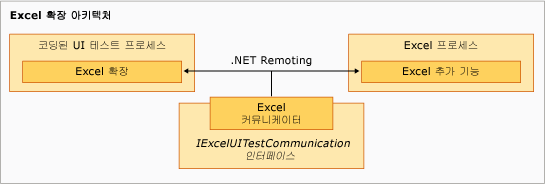

# Excel용 샘플 코딩된 UI 테스트 확장명
샘플의 확장 구성 요소는 [!INCLUDE[vsprvs](../code-quality/includes/vsprvs_md.md)] 코딩된 UI 테스트 프로세스에서 실행되며, 기본 수준에 `ExtensionPackage` 클래스가 있는 다소 계층적인 구조입니다. 다음 수준에는 `TechnologyManager`, `ActionFilter` 및 `PropertyProvider` 클래스가 있고 최상위 수준에는 컨트롤 요소가 있습니다.  
  
   
Excel 확장 아키텍처  
  
## 확장점  
 이러한 클래스는 [!INCLUDE[ofprexcel](../test/includes/ofprexcel_md.md)]에 대해 코딩된 UI 테스트를 사용할 수 있도록 샘플에서 구현되는 확장점을 나타냅니다.  
  
### ExtensionPackage  
 <xref:Microsoft.VisualStudio.TestTools.UITest.Extension.UITestExtensionPackage> 클래스에서 상속되는 이 클래스는 코딩된 UI 테스트 확장의 진입점입니다. 이 추상 클래스를 구현하면 코딩된 UI 테스트 프레임워크가 새 UI 테스트를 위한 UI 테스트 작업 필터, UI 테스트 속성 공급자 및 사용자 지정 UI 테스트 기술 관리자에 내부에서 액세스할 수 있습니다. 자세한 내용은 [ExtensionPackage 클래스](../test/sample-excel-extension-extensionpackage-class.md)를 참조하세요.  
  
### TechnologyManager  
 <xref:Microsoft.VisualStudio.TestTools.UITest.Extension.UITechnologyManager> 클래스에서 상속되는 이 클래스는 테스트 기록 및 재상을 위한 기술 관리자를 제공합니다. 자세한 내용은 [TechnologyManager 클래스](../test/sample-excel-extension-technologymanager-class.md)를 참조하세요.  
  
### ActionFilter  
 <xref:Microsoft.VisualStudio.TestTools.UITest.Common.UITestActionFilter> 클래스에서 상속되는 이 클래스는 유사한 테스트 작업을 단일 테스트 결과로 집계하는 기본 클래스를 제공합니다. 자세한 내용은 [ActionFilter 클래스](../test/sample-excel-extension-actionfilter-class.md)를 참조하세요.  
  
### 기술 요소  
 <xref:Microsoft.VisualStudio.TestTools.UITest.Extension.UITechnologyElement> 클래스에서 상속되는 기본 클래스는 기록 및 재생 가능한 UI 테스트의 기술 요소에 대한 토대를 제공합니다. 자세한 내용은 [Element 클래스](../test/sample-excel-extension-element-classes.md)를 참조하세요.  
  
### PropertyProvider  
 <xref:Microsoft.VisualStudio.TestTools.UITesting.UITestPropertyProvider> 클래스에서 상속되는 이 클래스는 테스트 기록 및 재생을 위한 UI 요소의 속성을 지원하는 기본 클래스를 제공합니다. 자세한 내용은 [PropertyProvider 클래스](../test/sample-excel-extension-propertyprovider-class.md)를 참조하세요.  
  
## 참고 항목  
 <xref:Microsoft.VisualStudio.TestTools.UITesting.UITestPropertyProvider>   
 <xref:Microsoft.VisualStudio.TestTools.UITest.Extension.UITechnologyElement>   
 <xref:Microsoft.VisualStudio.TestTools.UITest.Common.UITestActionFilter>   
 <xref:Microsoft.VisualStudio.TestTools.UITest.Extension.UITestExtensionPackage>   
 [ExtensionPackage 클래스](../test/sample-excel-extension-extensionpackage-class.md)   
 [TechnologyManager 클래스](../test/sample-excel-extension-technologymanager-class.md)   
 [ActionFilter 클래스](../test/sample-excel-extension-actionfilter-class.md)   
 [Element 클래스](../test/sample-excel-extension-element-classes.md)   
 [PropertyProvider 클래스](../test/sample-excel-extension-propertyprovider-class.md)
