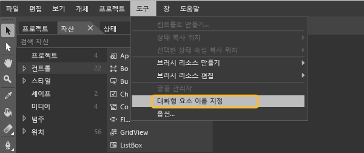
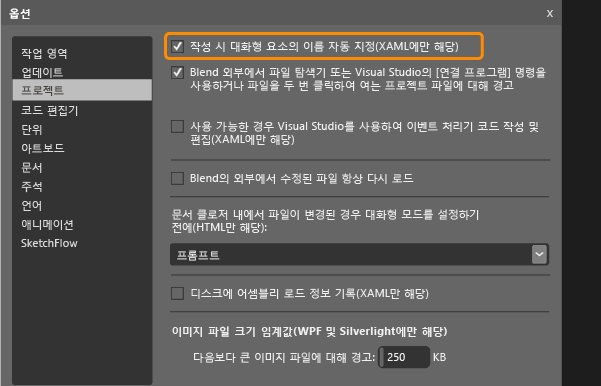

# 테스트를 위해 Windows 스토어 컨트롤에 대한 고유 자동화 속성 설정
[!INCLUDE[vs2017banner](../code-quality/includes/vs2017banner.md)]

XAML 기반 Windows Store 응용 프로그램을 위해 코딩된 UI 테스트를 실행하려면 각 컨트롤을 식별하는 고유한 자동화 속성을 설정해야 합니다.  
  
 응용 프로그램에서 XAML 컨트롤 형식에 따라 고유한 자동화 속성을 할당할 수 있습니다.  이 항목에서는 다음 상황에서 이 고유한 자동화 속성을 할당하는 방법을 설명합니다.  
  
-   [컨트롤의 정적 XAML 정의](#UniquePropertyWindowsStoreControlsStaticXAML)  
  
-   [Visual Studio 또는 Visual Studio Blend를 사용하는 고유한 자동화 속성을 할당](#UniquePropertyWindowsStoreControlsExpressionBlend)  
  
-   [DataTemplate 사용](#UniquePropertyWindowsStoreControlsDataTemplate)  
  
-   [컨트롤 템플릿 사용](#UniquePropertyWindowsStoreControlsControlTemplate)  
  
-   [동적 컨트롤](#UniquePropertyWindowsStoreControlsDynamicControls)  
  
## 고유한 자동화 속성을 할당하는데 메서드를 사용합니다.  
  
###  <a name="UniquePropertyWindowsStoreControlsStaticXAML"></a> 정적 XAML 정의  
 XAML 파일에 정의된 컨트롤의 고유한 자동화 속성을 지정하기 위해 다음 예제와 같이 AutomationProperties.AutomationId 또는 AutomationProperties.Name을 암시적으로 또는 명시적으로 설정할 수 있습니다.  이 값 중 하나를 설정하면 코딩된 UI 테스트나 작업 기록을 만들 때 컨트롤을 식별하는 데 사용할 수 있는 고유한 자동화 속성이 컨트롤에 제공됩니다.  
  
 **암시적으로 속성을 설정**  
  
 컨트롤의 XAML에서 Name 속성을 사용하여 AutomationProperties.AutomationId를 ButtonX로 설정합니다.  
  
```xaml  
<Button Name="ButtonX" Height="31" HorizontalAlignment="Left" Margin="23,26,0,0"  VerticalAlignment="Top" Width="140" Click="ButtonX_Click" />  
  
```  
  
 컨트롤의 XAML에서 Content 속성을 사용하여 AutomationProperties.Name을 ButtonY로 설정합니다.  
  
```xaml  
<Button Content="ButtonY" Height="31" HorizontalAlignment="Left" Margin="23,76,0,0" VerticalAlignment="Top" Width="140" Click="ButtonY_Click" />  
  
```  
  
 **명시적으로 속성을 설정**  
  
 컨트롤의 XAML에서 명시적으로 AutomationProperties.AutomationId를 ButtonX로 설정합니다.  
  
```xaml  
<Button AutomationProperties.AutomationId=“ButtonX” Height="31" HorizontalAlignment="Left" Margin="23,26,0,0"  VerticalAlignment="Top" Width="140" Click="ButtonX_Click" />  
  
```  
  
 컨트롤의 XAML에서 명시적으로 AutomationProperties.Name을 ButtonY로 설정합니다.  
  
```  
<Button AutomationProperties.Name="ButtonY" Height="31" HorizontalAlignment="Left" Margin="23,76,0,0" VerticalAlignment="Top" Width="140" Click="ButtonY_Click" />  
```  
  
###  <a name="UniquePropertyWindowsStoreControlsExpressionBlend"></a> Visual Studio 또는 Visual Studio Blend를 사용하는 고유한 자동화 속성을 할당  
 Visual Studio 또는 Visual Studio Blend를 사용하여 단추, 목록 상자, 콤보 상자 및 텍스트 상자와 같은 대화형 요소에 고유한 이름을 할당할 수도 있습니다.  그러면 AutomationProperties.Name에 대한 고유한 값이 컨트롤에 제공됩니다.  
  
 **Visual Studio:** 다음 **도구** 메뉴에서, **옵션** 을 선택하고, **텍스트 편집기**를 선택하고, **XAML**과 마지막으로 **기타**를 선택합니다.  
  
 **생성시 대화형 요소에 자동으로 이름 지정** 을 선택하고 **확인**을 선택합니다.  
  
   
  
 **Blend for Visual Studio:**  Blend for Visual Studio에 대한 이 작업을 수행 하려면 다음 방법 중 하나를 사용합니다.  
  
> [!NOTE]
>  XAML을 사용하여 정적으로 만들어진 컨트롤에는 이 방법만 사용할 수 있습니다.  
  
 **기존의 컨트롤에 고유한 이름을 제공하려면**  
  
 **도구** 메뉴에서, **대화형 요소 이름**을 다음과 같이 선택합니다.:  
  
   
  
 **만들려는 컨트롤에 자동으로 고유한 이름을 제공하려면**  
  
 **도구** 메뉴에서 **옵션**을 가리키고 **프로젝트**를 클릭합니다.  **생성시 대화형 요소에 자동으로 이름 지정** 을 선택하고, 다음과 같이 **확인**을 선택합니다.:  
  
   
  
###  <a name="UniquePropertyWindowsStoreControlsDataTemplate"></a> 데이터 템플릿 사용  
 다음 XAML을 사용하면 ItemTemplate을 사용해 목록 상자의 값을 변수에 바인딩하여 간단한 템플릿을 정의할 수 있습니다.  
  
```xaml  
  
<ListBox Name="listBox1" ItemsSource="{Binding Source={StaticResource employees}}">  
   <ListBox.ItemTemplate>  
      <DataTemplate>  
         <StackPanel Orientation="Horizontal">  
            <TextBlock Text="{Binding EmployeeName}" />  
            <TextBlock Text="{Binding EmployeeID}" />  
         </StackPanel>  
      </DataTemplate>  
   </ListBox.ItemTemplate>  
</ListBox>  
```  
  
 또한 다음 XAML을 사용하면 템플릿에 ItemContainerStyle을 사용하여 값을 변수에 바인딩할 수도 있습니다.  
  
```xaml  
  
      <ListBox Name="listBox1" ItemsSource="{Binding Source={StaticResource employees}}">  
            <ListBox.ItemContainerStyle>  
                <Style TargetType="ListBoxItem">  
                    <Setter Property="Template">  
                        <Setter.Value>  
                            <ControlTemplate TargetType="ListBoxItem">  
                                <Grid>  
                                    <Button Content="{Binding EmployeeName}" AutomationProperties.AutomationId="{Binding EmployeeID}"/>  
                                </Grid>  
                            </ControlTemplate>  
                        </Setter.Value>  
                    </Setter>  
                </Style>  
            </ListBox.ItemContainerStyle>           
        </ListBox>  
  
```  
  
 다음 코드를 사용하는 것처럼 두 예제 모두 ItemSource의 ToString\(\) 메서드를 재정의해야 합니다.  이 코드를 사용하면 바인딩을 사용하는 각각의 데이터 바운드 목록 항목에 대해 고유한 자동화 속성을 설정할 수 없으므로 AutomationProperties.Name 값이 설정되고 고유하게 지정됩니다.  이 경우에는 AutomationProperties.Name에 고유한 값을 설정하는 것으로 충분합니다.  
  
> [!NOTE]
>  이 방법을 사용하면 바인딩을 통해 Employee 클래스에서 목록 항목의 내부 내용을 문자열로 설정할 수 있습니다.  예제에서와 같이 각 목록 항목 내부의 단추 컨트롤에 Employee ID인 고유한 자동화 ID가 할당됩니다.  
  
```  
  
Employee[] employees = new Employee[]   
{  
   new Employee("john", "4384"),  
   new Employee("margaret", "7556"),  
   new Employee("richard", "8688"),  
   new Employee("george", "1293")  
};  
  
listBox1.ItemsSource = employees;  
  
public override string ToString()  
{  
    return EmployeeName + EmployeeID; // Unique Identification to be set as the AutomationProperties.Name  
}  
  
```  
  
###  <a name="UniquePropertyWindowsStoreControlsControlTemplate"></a> 컨트롤 템플릿 사용  
 코드에서 정의될 때 특정 형식의 각 인스턴스가 고유한 자동화 속성을 갖도록 컨트롤 템플릿을 사용할 수 있습니다.  컨트롤 인스턴스에서 AutomationProperty가 고유한 ID에 바인딩되도록 템플릿을 만들어야 합니다.  다음 XAML에서는 컨트롤 템플릿을 사용하여 이 바인딩을 만드는 방법 한 가지를 보여 줍니다.  
  
```xaml  
  
<Style x:Key="MyButton" TargetType="Button">  
<Setter Property="Template">  
   <Setter.Value>  
<ControlTemplate TargetType="Button">  
   <Grid>  
      <CheckBox HorizontalAlignment="Left" AutomationProperties.AutomationId="{TemplateBinding Content}"></CheckBox>  
      <Button Width="90" HorizontalAlignment="Right" Content="{TemplateBinding Content}" AutomationProperties.AutomationId="{TemplateBinding Content}"></Button>  
   </Grid>  
</ControlTemplate>  
   </Setter.Value>  
</Setter>  
</Style>  
  
```  
  
 이 컨트롤 템플릿을 사용하여 단추 인스턴스 두 개를 정의할 때 다음 XAML에서와 같이 자동화 ID가 템플릿에서 컨트롤에 대해 고유한 내용 문자열로 설정됩니다.  
  
```xaml  
  
<Button Content=”Button1” Style="{StaticResource MyButton}" Width="140"/>  
<Button Content=”Button2” Style="{StaticResource MyButton}" Width="140"/>  
```  
  
###  <a name="UniquePropertyWindowsStoreControlsDynamicControls"></a> 동적 컨트롤  
 코드에서 동적으로 만들어지고 정적으로 만들어지지 않거나 XAML 파일에서 템플릿을 통해 만들어진 컨트롤이 있을 경우 컨트롤의 Content 또는 Name 속성을 설정해야 합니다.  그러면 각 동적 컨트롤에 고유한 자동화 속성이 지정됩니다.  예를 들어, 목록 항목을 선택할 때 확인란을 표시하려면 다음 코드 예제와 같이 이러한 속성을 설정할 수 있습니다.:  
  
```c#  
  
private void CreateCheckBox(string txt, StackPanel panel)  
   {  
      CheckBox cb = new CheckBox();  
      cb.Content = txt; // Sets the AutomationProperties.Name  
      cb.Height = 50;  
      cb.Width = 100;  
      cb.Name = "DynamicCheckBoxAid"+ txt; // Sets the AutomationProperties.AutomationId  
      panel.Children.Add(cb);  
    }  
  
```  
  
## 참고 항목  
 [코딩된 UI 테스트를 사용하여 Windows 스토어 8.1 앱 테스트](../test/test-windows-store-8-1-apps-with-coded-ui-tests.md)