# <a name="test-windows-uwp-and-81-phone-apps-with-coded-ui-tests"></a>코딩된 UI 테스트를 사용하여 Windows UWP 및 8.1 Phone 앱 테스트

모바일 장치 또는 에뮬레이터에서 실행되는 UWP 앱 및 XAML 기반 Phone 8.1 앱에 대한 UI 테스트를 만드는 데 이 연습을 사용합니다.

## <a name="create-a-simple-windows-phone-app"></a>간단한 Windows Phone 앱 만들기

1.  Visual C# 또는 Visual Basic 템플릿을 사용하여 빈 Windows Phone 앱을 위한 새 프로젝트를 만듭니다.

     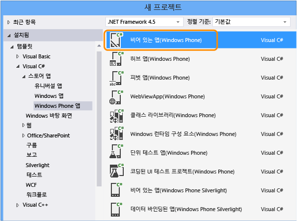

2.  솔루션 탐색기에서 MainPage.xaml을 엽니다. 도구 상자에서 단추 컨트롤과 textbox 컨트롤을 디자인 화면으로 끕니다.

     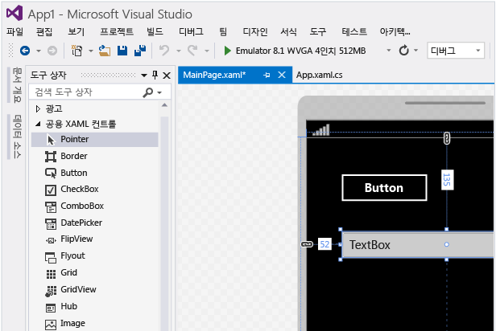

3.  속성 창에서 단추 컨트롤의 이름을 지정합니다.

     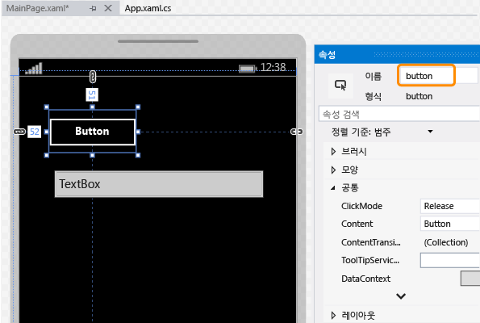

4.  textbox 컨트롤의 이름을 지정합니다.

     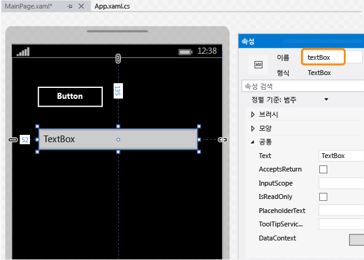

5.  디자이너 화면에서 단추 컨트롤을 두 번 클릭하여 다음 코드를 추가합니다.

    ```csharp
    private void button_Click_1(object sender, RoutedEventArgs e)
    {
        this.textBox.Text = this.button.Name;
    }

    ```

    ```vb
    Public NotInheritable Class MainPage
        Inherits Page

        Private Sub button_Click(sender As Object, e As RoutedEventArgs) Handles Button.Click
            Me.textBox.Text = Me.button.Name
        End Sub
    End Class
    ```

6.  F5 키를 눌러 에뮬레이터에서 Windows Phone 앱을 실행하고 제대로 작동하는지 확인합니다.

     

7.  에뮬레이터를 종료합니다.

## <a name="deploy-the-windows-phone-app"></a>Windows Phone 앱 배포

1.  코딩된 UI 테스트에서 앱의 컨트롤을 매핑하려면 앱을 배포해야 합니다.

     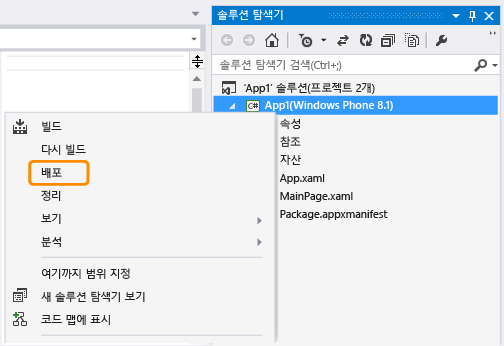

     에뮬레이터를 시작합니다. 이제 앱을 테스트할 수 있습니다.

     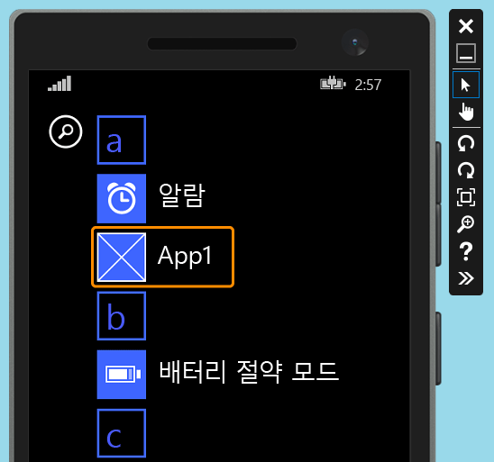

     코딩된 UI 테스트를 만드는 동안 에뮬레이터를 계속해서 실행합니다.

## <a name="create-a-coded-ui-test-for-the-windows-phone-app"></a>Windows Phone 앱용 코딩된 UI 테스트 만들기

[UWP(유니버설 Windows 플랫폼) 앱을 위한 코딩된 UI 테스트를 만들려면 어떻게 하나요?](#uwpapps)

1.  Windows Phone 앱을 사용하여 솔루션에 새로 코딩된 UI 테스트 프로젝트를 추가합니다.

     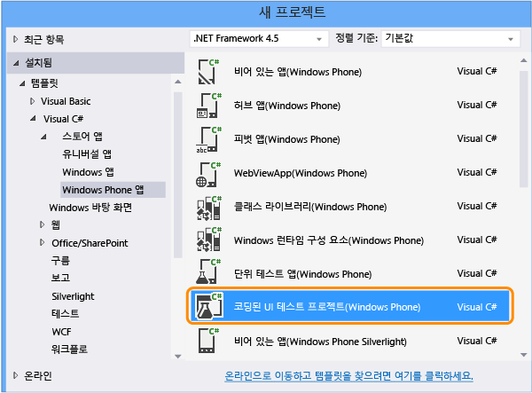

2.  십자선 도구를 사용하여 UI 맵을 편집하도록 선택합니다.

     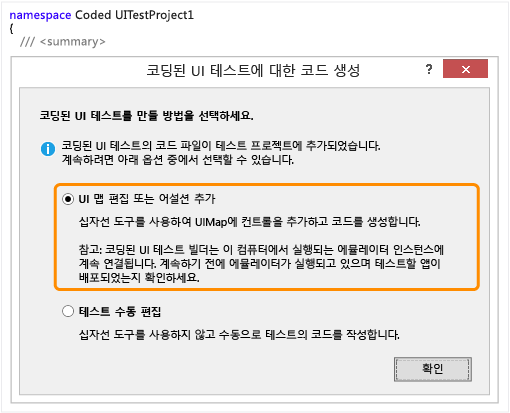

3.  십자선 도구를 사용하여 앱을 선택한 다음 나중에 테스트에서 앱을 시작하는 데 사용하게 될 앱의 **AutomationId** 속성 값을 복사합니다.

     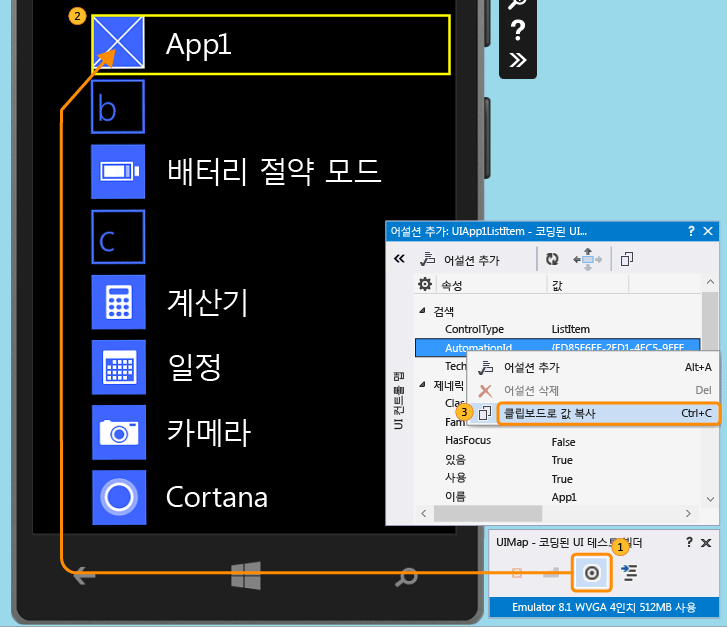

4.  에뮬레이터에서 앱을 시작하고 십자선 도구를 사용하여 단추 컨트롤을 선택합니다. 그런 다음 UI 컨트롤 맵에 단추 컨트롤을 추가합니다.

     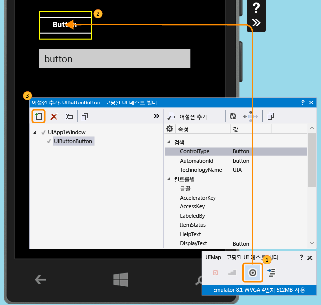

5.  UI 컨트롤 맵에 textbox 컨트롤을 추가하려면 이전 단계를 반복합니다.

     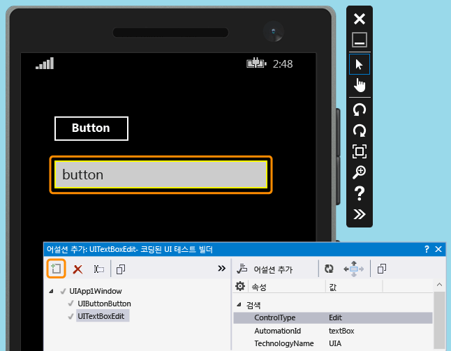

6.  코드를 생성하여 UI 컨트롤 맵 변경을 위한 코드를 작성합니다.

     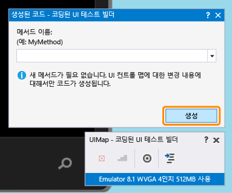

7.  십자선 도구를 사용하여 textbox 컨트롤을 선택한 다음 **텍스트** 속성을 선택합니다.

     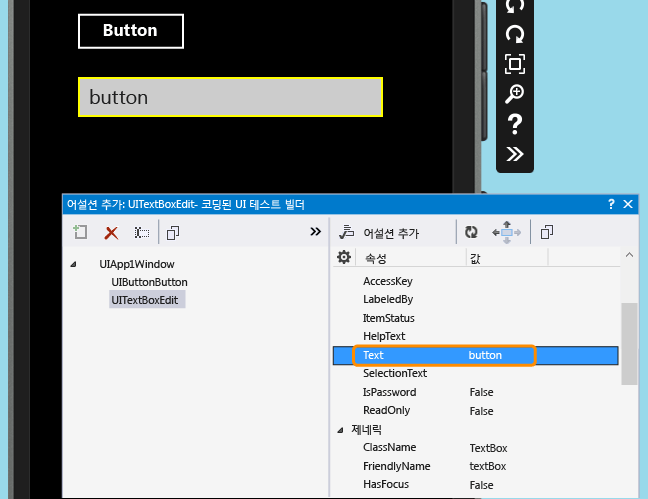

8.  어설션을 추가합니다. 이 어설션은 값이 올바른지 확인하는 테스트에 사용됩니다.

     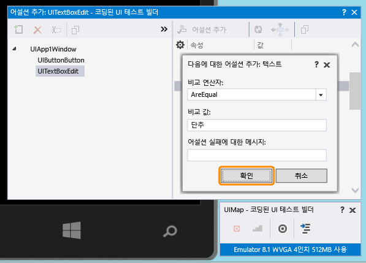

9. assert 메서드에 대한 코드를 추가하고 생성합니다.

     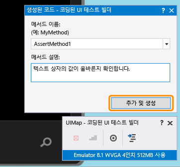

10. **Visual C#**

     솔루션 탐색기에서 UIMap.Designer.cs 파일을 열어 assert 메서드 및 컨트롤에 대해 방금 추가한 코드를 확인합니다.

     **Visual Basic**

     솔루션 탐색기에서 CodedUITest1.vb 파일을 엽니다. CodedUITestMethod1() 테스트 메서드 코드에서 자동으로 추가된 `Me.UIMap.AssertMethod1()` 인 어설션 메서드에 대한 호출을 마우스 오른쪽 단추로 클릭한 다음 **정의로 이동**을 선택합니다. 그러면 코드 편집기에서 UIMap.Designer.vb 파일이 열려 assert 메서드 및 해당 컨트롤에 대해 추가한 코드를 확인할 수 있습니다.

    > [!WARNING]
    > UIMap.designer.cs 파일 또는 UIMap.Designer.vb 파일은 직접 수정하지 마세요. 수정하면 테스트를 생성할 때마다 파일에 대한 변경 내용을 덮어씁니다.

     **Assert 메서드**

    ```csharp
    public void AssertMethod1()
    {
        #region Variable Declarations
        XamlEdit uITextBoxEdit = this.UIApp1Window.UITextBoxEdit;
        #endregion

        // Verify that the 'Text' property of 'textBox' text box equals 'button'
        Assert.AreEqual(this.AssertMethod1ExpectedValues.UITextBoxEditText, uITextBoxEdit.Text);
    }
    ```

    ```vb
    Public Sub AssertMethod1()
        Dim uITextBoxEdit As XamlEdit = Me.UIApp1Window.UITextBoxEdit

        'Verify that the 'Text' property of 'textBox' text box equals 'button'
        Assert.AreEqual(Me.AssertMethod1ExpectedValues.UITextBoxEditText, uITextBoxEdit.Text)
    End Sub
    ```

     **컨트롤**

    ```csharp
    #region Properties
    public virtual AssertMethod1ExpectedValues AssertMethod1ExpectedValues
    {
        get
        {
            if ((this.mAssertMethod1ExpectedValues == null))
            {
                this.mAssertMethod1ExpectedValues = new AssertMethod1ExpectedValues();
            }
            return this.mAssertMethod1ExpectedValues;
        }
    }

    public UIApp1Window UIApp1Window
    {
        get
        {
            if ((this.mUIApp1Window == null))
            {
                this.mUIApp1Window = new UIApp1Window();
            }
            return this.mUIApp1Window;
        }
    }
    #endregion

    #region Fields
    private AssertMethod1ExpectedValues mAssertMethod1ExpectedValues;

    private UIApp1Window mUIApp1Window;
    #endregion
    ```

    ```vb
    #Region "Properties"
    Public ReadOnly Property UIButtonButton() As XamlButton
        Get
            If (Me.mUIButtonButton Is Nothing) Then
                Me.mUIButtonButton = New XamlButton(Me)
                Me.mUIButtonButton.SearchProperties(XamlButton.PropertyNames.AutomationId) = "button"
            End If
            Return Me.mUIButtonButton
        End Get
    End Property

    Public ReadOnly Property UITextBoxEdit() As XamlEdit
        Get
            If (Me.mUITextBoxEdit Is Nothing) Then
                Me.mUITextBoxEdit = New XamlEdit(Me)
                Me.mUITextBoxEdit.SearchProperties(XamlEdit.PropertyNames.AutomationId) = "textBox"
            End If
            Return Me.mUITextBoxEdit
        End Get
    End Property
    #End Region

    #Region "Fields"
    Private mUIButtonButton As XamlButton

    Private mUITextBoxEdit As XamlEdit
    #End Region
    ```

11. 솔루션 탐색기에서 CodedUITest1.cs 또는 CodedUITest1.vb 파일을 엽니다. 이제 테스트 실행에 필요한 작업을 위한 CodedUTTestMethod1 메서드에 코드를 추가할 수 있습니다. UIMap에 추가한 컨트롤을 사용하여 다음과 같이 코드를 추가합니다.

    1.  이전에 클립보드에 복사한 AutomationId 속성을 사용하여 Windows Phone 앱을 시작합니다.

        ```csharp
        XamlWindow myAppWindow = XamlWindow.Launch("ed85f6ff-2fd1-4ec5-9eef-696026c3fa7b_cyrqexqw8cc7c!App");
        ```

        ```vb
        XamlWindow.Launch("ed85f6ff-2fd1-4ec5-9eef-696026c3fa7b_cyrqexqw8cc7c!App");
        ```

    2.  다음과 같이 단추 컨트롤을 누르는 제스처를 추가합니다.

        ```csharp
        Gesture.Tap(this.UIMap.UIApp1Window.UIButtonButton);
        ```

        ```vb
        Gesture.Tap(Me.UIMap.UIApp1Window.UIButtonButton)
        ```

    3.  앱과 단추 탭하기 제스처 시작 후 자동으로 생성된 assert 메서드가 호출되는지 확인합니다.

        ```csharp
        this.UIMap.AssertMethod1();
        ```

        ```vb
        Me.UIMap.AssertMethod1()
        ```

     코드가 추가된 후 CodedUITestMethod1 테스트 메서드의 모양은 다음과 같아야 합니다.

    ```csharp
    [TestMethod]
    public void CodedUITestMethod1()
    {
        // To generate code for this test, select "Generate Code for Coded UI Test" from the shortcut menu and select one of the menu items.

        // Launch the app.
        XamlWindow myAppWindow = XamlWindow.Launch("ed85f6ff-2fd1-4ec5-9eef-696026c3fa7b_cyrqexqw8cc7c!App");

        // Tap the button.
        Gesture.Tap(this.UIMap.UIApp1Window.UIButtonButton);

        this.UIMap.AssertMethod1();
    }
    ```

    ```vb
    <CodedUITest>
    Public Class CodedUITest1

        <TestMethod()>
        Public Sub CodedUITestMethod1()
            '
            ' To generate code for this test, select "Generate Code for Coded UI Test" from the shortcut menu and select one of the menu items.
            '
            ' Launch the app.
            XamlWindow.Launch("ed85f6ff-2fd1-4ec5-9eef-696026c3fa7b_cyrqexqw8cc7c!App")

            '// Tap the button.
            Gesture.Tap(Me.UIMap.UIApp1Window.UIButtonButton)

            Me.UIMap.AssertMethod1()
        End Sub
    ```

## <a name="run-the-coded-ui-test"></a>코딩된 UI 테스트 실행

1.  테스트를 빌드한 다음 테스트 탐색기를 사용하여 테스트를 실행합니다.

     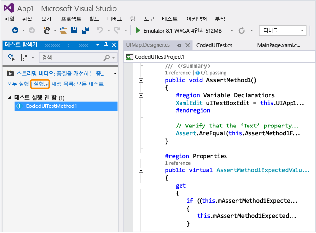

     Windows Phone 앱이 시작되고 단추 탭하기 작업이 완료되며 assert 메서드를 사용하여 텍스트 상자의 텍스트 속성이 채워지고 확인됩니다.

     

     테스트를 마치면 테스트 탐색기에서 테스트를 통과했음을 확인합니다.

     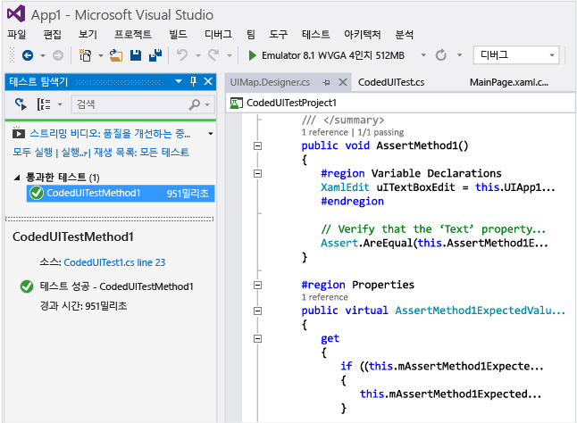

##  <a name="TestingPhoneAppsCodedUI_DataDriven"></a> Windows Phone 앱에서 데이터 기반의 코딩된 UI 테스트 사용
 여러 조건을 테스트하기 위해 코딩된 UI 테스트를 여러 데이터 집합을 사용하여 여러 번 실행할 수 있습니다.

 Windows Phone용 코딩된 데이터 기반 UI 테스트는 테스트 메서드의 DataRow 특성을 사용하여 정의됩니다. 다음 예에서 x와 y는 첫 번째 반복에는 값 1 및 2를 사용하고 테스트의 두 번째 반복에는 값 -1 및 -2를 사용합니다.

```
[DataRow(1, 2, DisplayName = "Add positive numbers")]
[DataRow(-1, -2, DisplayName = "Add negative numbers")]
[TestMethod]
public void DataDrivingDemo_MyTestMethod(int x, int y)

```

## <a name="q--a"></a>Q&A

### <a name="q-do-i-have-to-deploy-the-windows-phone-app-in-the-emulator-in-order-to-map-ui-controls"></a>Q: UI 컨트롤을 매핑하려면 에뮬레이터에서 Windows Phone 앱을 배포해야 하나요?
 **A**: 예, 코딩된 UI 테스트 빌더를 사용하려면 에뮬레이터가 실행 중이고 애뮬레이터에 앱을 배포해야 합니다. 그렇지 않으면 실행 중인 에뮬레이터가 없다는 오류 메시지가 throw됩니다.

###  <a name="TestingPhoneAppsCodedUI_EmulatorDevice"></a> Q: 테스트는 에뮬레이터에서만 실행할 수 있나요? 아니면 실제 장치에서도 할 수 있나요?
 **A**: 두 옵션 모두 지원됩니다. 에뮬레이터 유형을 변경하거나 장치 도구 모음에서 장치를 선택하여 테스트 실행 대상을 선택합니다. 장치를 선택하면 컴퓨터의 USB 포트 중 하나에 Phone Blue 장치를 연결해야 합니다.

 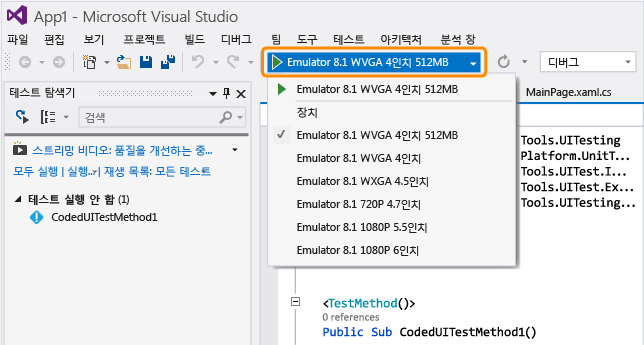

### <a name="q-why-dont-i-see-the-option-to-record-my-coded-ui-test-in-the-generate-code-for-a-coded-ui-test-dialog"></a>Q: [코딩된 UI 테스트용으로 코드 생성] 대화 상자에 나의 코딩된 UI 테스트를 기록할 수 있는 옵션이 표시되지 않는 이유는 무엇인가요?
 **A**: Windows Phone 앱의 경우 기록 옵션이 지원되지 않습니다.

### <a name="q-can-i-create-a-coded-ui-test-for-my-windows-phone-apps-based-on-winjs-silverlight-or-html5"></a>Q: WinJS, Silverlight 또는 HTML5를 기반으로 Windows Phone 앱용 코딩된 UI 테스트를 만들 수 있나요?
 **A**: 아니요, XAML 기반 앱만 지원됩니다.

### <a name="q-can-i-create-coded-ui-tests-for-my-windows-phone-apps-on-a-system-that-is-not-running-windows-81-or-windows-10"></a>Q: Windows 8.1 또는 Windows 10이 실행되고 있지 않은 시스템에서 Windows Phone 앱을 위한 코딩된 UI 테스트를 만들 수 있나요?
 **A**: 아니요, 코딩된 UI 테스트 프로젝트 템플릿은 Windows 8.1 및 Windows 10에서만 사용할 수 있습니다. UWP(유니버설 Windows 플랫폼) 앱에 대한 자동화를 만들려면 Windows 10이 필요합니다.

<a name="uwpapps"></a>
### <a name="q-how-do-i-create-coded-ui-tests-for-universal-windows-platform-uwp-apps"></a>Q: UWP(유니버설 Windows 플랫폼) 앱을 위한 코딩된 UI 테스트를 만들려면 어떻게 하나요?
 **A**: UWP 앱을 테스트하는 플랫폼에 따라 다음 중 한 가지 방법으로 코딩된 UI 테스트 프로젝트를 만듭니다.

-   로컬 컴퓨터에서 실행 중인 UWP 앱이 UWP 앱으로 실행되는 경우. 이를 테스트하려면 **코딩된 UI 테스트 프로젝트(Windows)** 템플릿을 사용해야 합니다. 새 프로젝트를 만들 때 이 템플릿을 찾으려면 **Windows**, **범용** 노드로 이동합니다. 또는 **Windows**, **Windows 8**, **Windows** 노드로 이동합니다.

-   모바일 장치 또는 에뮬레이터에서 실행 중인 UWP 앱이 휴대폰 앱으로 실행되는 경우. 이를 테스트하려면 **코딩된 UI 테스트 프로젝트(Windows Phone)** 템플릿을 사용해야 합니다. 새 프로젝트를 만들 때 이 템플릿을 찾으려면 **Windows**, **범용** 노드로 이동합니다. 또는 **Windows**, **Windows 8**, **Windows Phone** 노드로 이동합니다.

 프로젝트를 만든 후의 테스트 작성은 이전과 동일합니다.

### <a name="q-can-i-select-controls-that-are-outside-the-emulator"></a>Q: 에뮬레이터 외부에 있는 컨트롤을 선택할 수 있나요?
 **A**: 아니요, 빌더가 이러한 컨트롤은 검색하지 않습니다.

### <a name="q-can-i-use-the-coded-ui-test-builder-to-map-controls-using-a-physical-phone-device"></a>Q: 코딩된 UI 테스트 빌더를 사용하여 실제 휴대폰 장치에 컨트롤을 매핑할 수 있나요?
 **A**: 아니요, 빌더는 앱을 에뮬레이터에 배포한 경우에만 UI 요소를 매핑할 수 있습니다.

### <a name="q-why-cant-i-modify-the-code-in-the-uimapdesigner-file"></a>Q: UIMap.Designer 파일에서 코드를 수정할 수 없는 이유는 무엇인가요?
 **A**: UIMap - 코딩된 UI 테스트 빌더를 사용하여 코드를 생성할 때마다 UIMapDesigner.cs 파일에서 수정된 코드 변경 내용을 덮어씁니다. 기록된 메서드를 수정해야 하는 경우에는 해당 메서드를 UIMap.cs 파일에 복사한 후 이름을 바꾸어야 합니다. UIMap.cs 파일을 사용하여 UIMapDesigner.cs 파일의 메서드와 속성을 재정의할 수 있습니다. 코딩된 UITest.cs 파일에서 원래 메서드에 대한 참조를 제거하고 이름을 바꾼 메서드 이름으로 바꾸어야 합니다.

### <a name="q-can-i-run-a-coded-ui-test-on-my-windows-phone-app-from-the-command-line"></a>Q: Windows Phone 앱의 명령줄에서 코딩된 UI 테스트를 실행할 수 있나요?
 **A**: 예, runsettings 파일을 사용하여 테스트를 실행할 대상 장치를 지정할 수 있습니다. 예:

 **vstest.console.exe "pathToYourCodedUITestDll" /settings:devicetarget.runsettings**

 샘플 runsettings 파일:

```
<?xml version="1.0" encoding="utf-8"?>
<RunSettings>
<MSPhoneTest>
<!--to specify test execution on device, use a TargetDevice option as follows-->
<TargetDevice>Device</TargetDevice>
<!--to specify an emulator instead, use a TargetDevice option like below-->
<!--<TargetDevice>Emulator 8.1 WVGA 4 inch 512MB</TargetDevice>-->
</MSPhoneTest>
</RunSettings>
```

### <a name="q-what-are-the-differences-between-coded-ui-tests-for-xaml-based-uwp-apps-and-windows-phone-apps"></a>Q: XAML 기반 UWP 스토어 앱과 Windows Phone 앱용 코딩된 UI 테스트 간의 차이점은 무엇인가요?
 **A**: 다음과 같은 몇 가지 주요한 차이점이 있습니다.

|기능|UWP 앱|Windows Phone 앱|
|-------------|------------------------|------------------------|
|테스트 실행 대상|로컬 또는 원격 컴퓨터. 자동화된 테스트 사례를 사용하여 테스트를 실행하는 경우 원격 컴퓨터를 지정할 수 있습니다.|에뮬레이터 또는 장치. 이 항목의 [Q: 테스트는 에뮬레이터에서만 실행할 수 있나요? 아니면 실제 장치에서도 할 수 있나요?](#TestingPhoneAppsCodedUI_EmulatorDevice) 를 참조하세요.|
|명령줄에서 실행|대상을 지정하는 데 Settings 파일이 필요 없습니다.|대상을 지정하는 데에는 Runsettings 파일이 필요합니다.|
|셸 컨트롤의 특수화 클래스|<xref:Microsoft.VisualStudio.TestTools.UITesting.DirectUIControls.DirectUIControl>|<xref:Microsoft.VisualStudio.TestTools.UITesting.UITestControl>|
|XAML 앱의 WebView 컨트롤|Html* 특수화 클래스를 사용하여 HTML 요소와 상호 작용하는 경우 지원됩니다. <xref:Microsoft.VisualStudio.TestTools.UITesting.HtmlControls>을 참조하세요.|지원되지 않습니다.|
|MTM에서 자동화된 테스트 실행|지원됩니다.|지원되지 않습니다.|
|데이터 기반 테스트|외부 데이터 소스 사용 및 테스트 메서드에 DataSource 특성 사용에 대한 자세한 내용은 [데이터 기반 테스트](../test/creating-a-data-driven-coded-ui-test.md) 를 참조하세요.|데이터는 테스트 메서드에 DataRow 특성을 사용하여 인라인으로 지정됩니다. 이 항목의 [Windows Phone 앱에서 데이터 기반의 코딩된 UI 테스트 사용](#TestingPhoneAppsCodedUI_DataDriven) 을 참조하세요.|

 UWP 앱용 코딩된 UI 테스트에 대한 자세한 내용은 [코딩된 UI 테스트를 사용하여 Windows UWP 앱 테스트](../test/test-windows-store-8-1-apps-with-coded-ui-tests.md)를 참조하세요.

## <a name="external-resources"></a>외부 리소스
 Microsoft Visual Studio 애플리케이션 수명 주기 관리 블로그: [코딩된 UI를 사용하여 XAML 기반 Windows Phone 앱 테스트](http://blogs.msdn.com/b/visualstudioalm/archive/2014/04/05/using-coded-ui-to-test-xaml-based-windows-phone-apps.aspx?PageIndex=2#comments)

## <a name="see-also"></a>참고 항목

- [UI 자동화를 사용하여 코드 테스트](../test/use-ui-automation-to-test-your-code.md)
