# <a name="test-windows-uwp-apps-with-coded-ui-tests"></a>코딩된 UI 테스트를 사용하여 Windows UWP 앱 테스트

UWP 앱 및 XAML 기반 8.1 앱에 대한 UI 테스트를 만들기 위해 이 연습을 사용합니다.

## <a name="create-a-simple-uwp-app"></a>간단한 UWP 앱 만들기

1.  XAML 기반 UWP 앱용 코딩된 UI 테스트를 실행하려는 경우 [각 컨트롤을 식별하는 고유한 자동화 속성을 설정해야 합니다](../test/set-a-unique-automation-property-for-windows-store-controls-for-testing.md).

     **도구** 메뉴에서 **옵션** 을 가리킨 다음 **텍스트 편집기**, **XAML**및 **기타**를 차례대로 선택합니다.

     만들 때 대화형 요소의 이름을 자동으로 지정하려면 이 확인란을 선택합니다.

     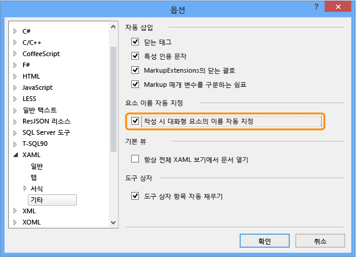

2.  Visual C# 또는 Visual Basic 템플릿을 사용하여 빈 XAML 기반 UWP 앱용 새 프로젝트를 만듭니다.

     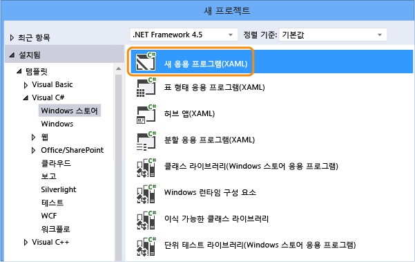

3.  솔루션 탐색기에서 MainPage.xaml을 엽니다. 도구 상자에서 단추 컨트롤과 textbox 컨트롤을 디자인 화면으로 끕니다.

     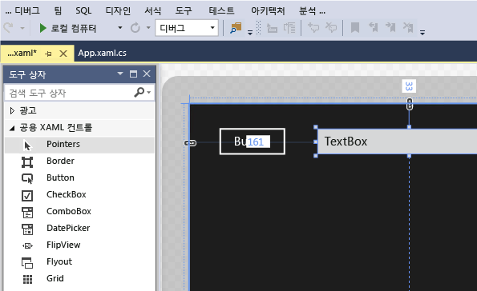

4.  단추 컨트롤을 두 번 클릭하여 다음 코드를 추가합니다.

    ```csharp
    private void button_Click_1(object sender, RoutedEventArgs e)
    {
        this.textBox.Text = this.button.Name;
    }

    ```

    ```vb
    Public NotInheritable Class MainPage
        Inherits Page

        Private Sub button_Click(sender As Object, e As RoutedEventArgs) Handles Button.Click
            Me.textBox.Text = Me.button.Name
        End Sub
    End Class
    ```

5.  **F5** 키를 선택해 UWP 앱을 실행합니다.

## <a name="create-and-run-a-coded-ui-test-for-the-uwp-app"></a>UWP 앱에 대해 코딩된 UI 테스트 만들기 및 실행

[UWP(유니버설 Windows 플랫폼) 앱을 위한 코딩된 UI 테스트를 만들려면 어떻게 하나요?](#uwpapps)

1.  UWP 앱에 사용할 코딩된 UI 테스트 프로젝트를 새로 만듭니다.

     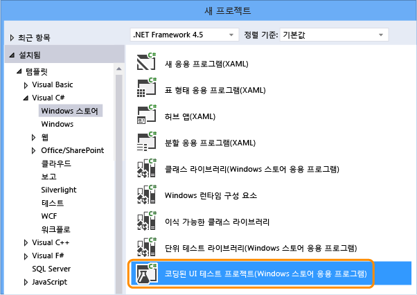

2.  십자선 도구를 사용하여 UI 맵을 편집하도록 선택합니다.

     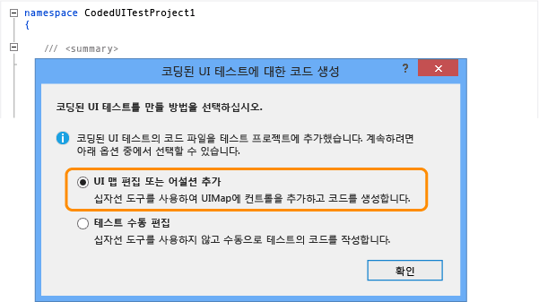

3.  코딩된 UI 테스트 빌더에서 십자선 도구를 사용하여 앱 타일을 선택하고 **AutomationId** 를 마우스 오른쪽 단추로 클릭한 다음 **값을 클립보드로 복사**를 선택합니다. 나중에 테스트용으로 앱을 시작하는 작업을 작성할 때 클립보드의 값이 사용됩니다.

     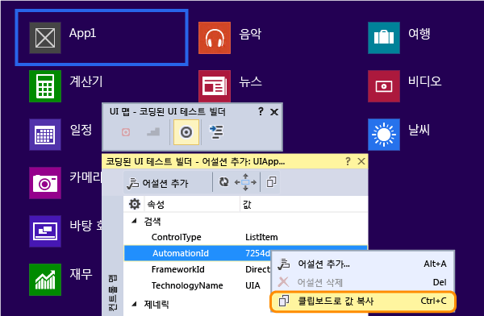

4.  실행 중인 UWP 앱에서 십자선 도구를 사용하여 단추 컨트롤 및 확인란 컨트롤을 선택합니다. 각 컨트롤을 추가한 후 코딩된 UI 테스트 빌더 도구 모음에서 **UI 컨트롤 맵에 컨트롤 추가** 단추를 선택합니다.

     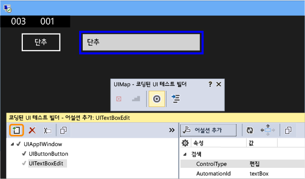

5.  코딩된 UI 테스트 빌더 도구 모음에서 **코드 생성** 단추를 선택한 다음 **생성** 을 선택하여 UI 컨트롤 맵 변경을 위한 코드를 만듭니다.

     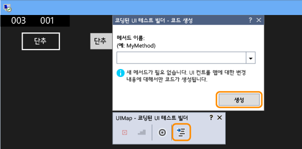

6.  단추를 선택하여 텍스트 상자에서 값을 설정합니다.

     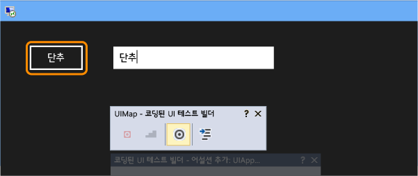

7.  십자선 도구를 사용하여 textbox 컨트롤을 선택한 다음 **텍스트** 속성을 선택합니다.

     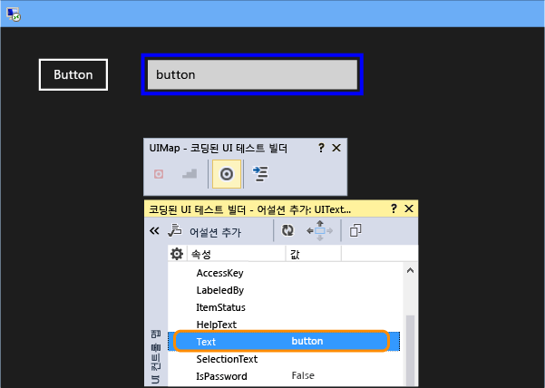

8.  어설션을 추가합니다. 이 어설션은 값이 올바른지 확인하는 테스트에 사용됩니다.

     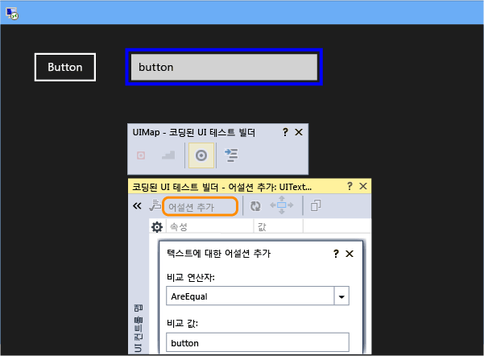

9. 어설션에 대한 코드를 추가 및 생성합니다.

     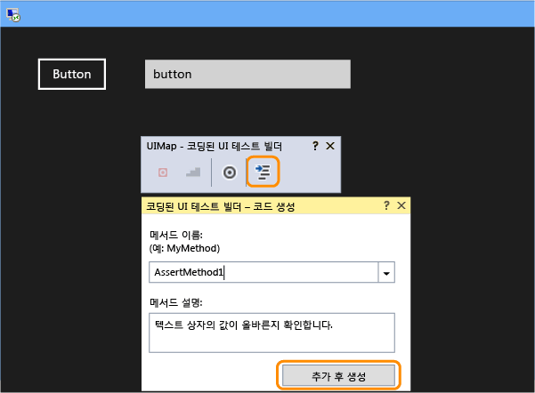

10. **Visual C#**

     솔루션 탐색기에서 *UIMap.Designer.cs* 파일을 열어 assert 메서드 및 컨트롤에 대해 추가한 코드를 확인합니다.

     **Visual Basic**

     솔루션 탐색기에서 *CodedUITest1.vb* 파일을 연 다음, CodedUITestMethod1() 테스트 메서드 코드에서 자동으로 추가된 `Me.UIMap.AssertMethod1()` 인 어설션 메서드에 대한 호출을 마우스 오른쪽 단추로 클릭한 다음, **정의로 이동**을 선택합니다. 그러면 assert 메서드 및 해당 컨트롤에 대해 추가한 코드를 확인할 수 있도록 코드 편집기에서 *UIMap.Designer.vb* 파일이 열립니다.

    > [!WARNING]
    > *UIMap.designer.cs* 파일 또는 *UIMap.Designer.vb* 파일은 직접 수정하지 마세요. 수정하면 테스트를 생성할 때마다 파일에 대한 변경 내용을 덮어씁니다.

    **Assert 메서드**

    ```csharp
    public void AssertMethod1()
    {
        #region Variable Declarations
        XamlEdit uITextBoxEdit = this.UIApp1Window.UITextBoxEdit;
        #endregion

        // Verify that the 'Text' property of 'textBox' text box equals 'button'
        Assert.AreEqual(this.AssertMethod3ExpectedValues.UITextBoxEditText, uITextBoxEdit.Text);
    }
    ```

    ```vb
    Public Sub AssertMethod1()
        Dim uITextBoxEdit As XamlEdit = Me.UIApp2Window.UITextBoxEdit

        'Verify that the 'Text' property of 'textBox' text box equals 'button'
        Assert.AreEqual(Me.AssertMethod1ExpectedValues.UITextBoxEditText, uITextBoxEdit.Text)
    End Sub
    ```

    **컨트롤**

    ```csharp
    #region Properties
    public XamlButton UIButtonButton
    {
        get
        {
            if ((this.mUIButtonButton == null))
            {
                this.mUIButtonButton = new XamlButton(this);
                #region Search Criteria
                this.mUIButtonButton.SearchProperties[XamlButton.PropertyNames.AutomationId] = "button";
                this.mUIButtonButton.WindowTitles.Add("App1");
                #endregion
            }
            return this.mUIButtonButton;
        }
    }

    public XamlEdit UITextBoxEdit
    {
        get
        {
            if ((this.mUITextBoxEdit == null))
            {
                this.mUITextBoxEdit = new XamlEdit(this);
                #region Search Criteria
                this.mUITextBoxEdit.SearchProperties[XamlEdit.PropertyNames.AutomationId] = "textBox";
                this.mUITextBoxEdit.WindowTitles.Add("App1");
                #endregion
            }
            return this.mUITextBoxEdit;
        }
    }
    #endregion

    #region Fields
    private XamlButton mUIButtonButton;

    private XamlEdit mUITextBoxEdit;
    #endregion
    ```

    ```vb
    #Region "Properties"
    Public ReadOnly Property UIButtonButton() As XamlButton
        Get
            If (Me.mUIButtonButton Is Nothing) Then
                Me.mUIButtonButton = New XamlButton(Me)
                Me.mUIButtonButton.SearchProperties(XamlButton.PropertyNames.AutomationId) = "button"
                Me.mUIButtonButton.WindowTitles.Add("App2")
            End If
            Return Me.mUIButtonButton
        End Get
    End Property

    Public ReadOnly Property UITextBoxEdit() As XamlEdit
        Get
            If (Me.mUITextBoxEdit Is Nothing) Then
                Me.mUITextBoxEdit = New XamlEdit(Me)
                Me.mUITextBoxEdit.SearchProperties(XamlEdit.PropertyNames.AutomationId) = "textBox"
                Me.mUITextBoxEdit.WindowTitles.Add("App2")
            End If
            Return Me.mUITextBoxEdit
        End Get
    End Property
    #End Region

    #Region "Fields"
    Private mUIButtonButton As XamlButton

    Private mUITextBoxEdit As XamlEdit
    #End Region
    ```

11. 솔루션 탐색기에서 CodedUITest1.cs 또는 CodedUITest1.vb 파일을 엽니다. 이제 UIMap에 추가한 컨트롤을 사용하여 다음과 같이 테스트 실행에 필요한 작업을 위한 CodedUTTestMethod1 메서드에 코드를 추가할 수 있습니다.

    1.  이전에 클립보드에 복사한 자동화 ID 속성을 사용하여 UWP 앱을 시작합니다.

        ```csharp
        XamlWindow.Launch("8ebca7c4-effe-4c86-9998-068daccee452_cyrqexqw8cc7c!App")
        ```

        ```vb
        XamlWindow myAppWindow = XamlWindow.Launch("7254db3e-20a7-424e-8e05-7c4dabf4f28d_cyrqexqw8cc7c!App");
        ```

    2.  다음과 같이 단추 컨트롤을 누르는 제스처를 추가합니다.

        ```csharp
        Gesture.Tap(this.UIMap.UIApp1Window. UIButtonButton);
        ```

        ```vb
        Gesture.Tap(Me.UIMap.UIApp2Window. UIButtonButton)
        ```

    3.  앱과 단추 탭하기 제스처 시작 후 자동으로 생성된 assert 메서드가 호출되는지 확인합니다.

        ```csharp
        this.UIMap.AssertMethod1();
        ```

        ```vb
        Me.UIMap.AssertMethod1()
        ```

    코드를 추가한 후 CodedUITestMethod1 테스트 메서드의 모양은 다음과 같아야 합니다.

    ```csharp
    [TestMethod]
    public void CodedUITestMethod1()
    {
        // To generate code for this test, select "Generate Code for Coded UI Test" from the shortcut menu and select one of the menu items.

        // Launch the app.
        XamlWindow myAppWindow = XamlWindow.Launch("7254db3e-20a7-424e-8e05-7c4dabf4f28d_cyrqexqw8cc7c!App");

        // Tap the button.
        Gesture.Tap(this.UIMap.UIApp1Window.UIButtonButton);

        this.UIMap.AssertMethod1();
    }
    ```

    ```vb
    <CodedUITest(CodedUITestType.WindowsStore)>
    Public Class CodedUITest1

        <TestMethod()>
        Public Sub CodedUITestMethod1()
            '
            ' To generate code for this test, select "Generate Code for Coded UI Test" from the shortcut menu and select one of the menu items.
            '

            ' Launch the app.
            XamlWindow.Launch("8ebca7c4-effe-4c86-9998-068daccee452_cyrqexqw8cc7c!App")

            '// Tap the button.
            Gesture.Tap(Me.UIMap.UIApp2Window.UIButtonButton)

            Me.UIMap.AssertMethod1()
        End Sub
    ```

12. 테스트를 빌드한 다음 테스트 탐색기를 사용하여 테스트를 실행합니다.

     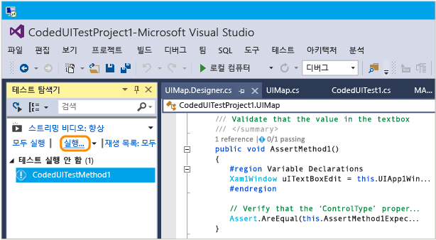

     UWP 앱이 시작되고 단추 탭하기 작업이 완료되며 assert 메서드를 사용하여 텍스트 상자의 텍스트 속성이 채워지고 확인됩니다.

     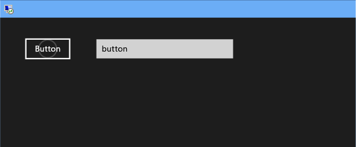

     테스트를 완료하면 테스트 탐색기에는 테스트를 통과했음이 표시됩니다.

     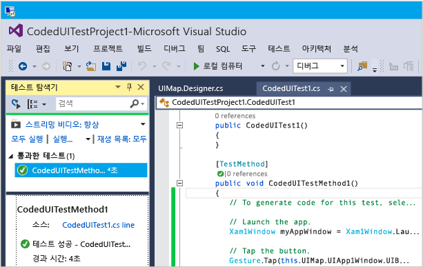

## <a name="q--a"></a>Q&A

### <a name="q-why-dont-i-see-the-option-to-record-my-coded-ui-test-in-the-generate-code-for-a-coded-ui-test-dialog"></a>Q: [코딩된 UI 테스트용으로 코드 생성] 대화 상자에 나의 코딩된 UI 테스트를 기록할 수 있는 옵션이 표시되지 않는 이유는 무엇인가요?

**A**: UWP 앱의 경우 기록 옵션이 지원되지 않습니다.

### <a name="q-can-i-create-a-coded-ui-test-for-my-uwp-apps-based-on-winjs"></a>Q: WinJS를 기반으로 UWP 스토어 앱용 코딩된 UI 테스트를 만들 수 있나요?

**A**: 아니요, XAML 기반 앱만 지원됩니다.

### <a name="q-can-i-create-coded-ui-tests-for-my-uwp-apps-on-a-system-that-is-not-running-windows-81-or-windows-10"></a>Q: Windows 8.1 또는 Windows 10이 실행되고 있지 않은 시스템에서 UWP 앱을 위한 코딩된 UI 테스트를 만들 수 있나요?

**A**: 아니요, 코딩된 UI 테스트 프로젝트 템플릿은 Windows 8.1 및 Windows 10에서만 사용할 수 있습니다. UWP(유니버설 Windows 플랫폼) 앱에 대한 자동화를 만들려면 Windows 10이 필요합니다.

<a name="uwpapps"></a>
### <a name="q-how-do-i-create-coded-ui-tests-for-universal-windows-platform-uwp-apps"></a>Q: UWP(유니버설 Windows 플랫폼) 앱을 위한 코딩된 UI 테스트를 만들려면 어떻게 하나요?

**A**: UWP 앱을 테스트하는 플랫폼에 따라 다음 중 한 가지 방법으로 코딩된 UI 테스트 프로젝트를 만듭니다.

- 로컬 컴퓨터에서 실행 중인 UWP 앱이 UWP 앱으로 실행되는 경우. 이를 테스트하려면 **코딩된 UI 테스트 프로젝트(Windows)** 템플릿을 사용해야 합니다. 새 프로젝트를 만들 때 이 템플릿을 찾으려면 **Windows**, **범용** 노드로 이동합니다. 또는 **Windows**, **Windows 8**, **Windows** 노드로 이동합니다.

- 모바일 장치 또는 에뮬레이터에서 실행 중인 UWP 앱이 휴대폰 앱으로 실행되는 경우. 이를 테스트하려면 **코딩된 UI 테스트 프로젝트(Windows Phone)** 템플릿을 사용해야 합니다. 새 프로젝트를 만들 때 이 템플릿을 찾으려면 **Windows**, **범용** 노드로 이동합니다. 또는 **Windows**, **Windows 8**, **Windows Phone** 노드로 이동합니다.

프로젝트를 만든 후의 테스트 작성은 이전과 동일합니다.

### <a name="q-why-cant-i-modify-the-code-in-the-uimapdesigner-file"></a>Q: UIMap.Designer 파일에서 코드를 수정할 수 없는 이유는 무엇인가요?

**A**: UIMap - 코딩된 UI 테스트 빌더를 사용하여 코드를 생성할 때마다 UIMapDesigner.cs 파일에서 수정된 코드 변경 내용을 덮어씁니다. 기록된 메서드를 수정해야 하는 경우에는 해당 메서드를 UIMap.cs 파일에 복사한 후 이름을 바꾸어야 합니다. UIMap.cs 파일을 사용하여 UIMapDesigner.cs 파일의 메서드와 속성을 재정의할 수 있습니다. 코딩된 UITest.cs 파일에서 원래 메서드에 대한 참조를 제거하고 이름을 바꾼 메서드 이름으로 바꾸어야 합니다.

## <a name="see-also"></a>참고 항목

- [UI 자동화를 사용하여 코드 테스트](../test/use-ui-automation-to-test-your-code.md)
- [테스트를 위해 UWP 컨트롤에 대한 고유 자동화 속성 설정](../test/set-a-unique-automation-property-for-windows-store-controls-for-testing.md)
