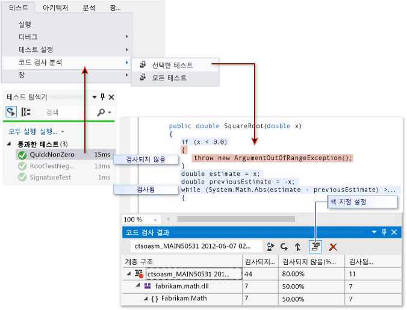

# 코드 검사 문제 해결

Visual Studio의 코드 검사 분석 도구는 네이티브 및 관리되는 어셈블리(.dll 또는 .exe 파일)에 대한 데이터를 수집합니다. 그러나 코드 검사 결과 창에 "빈 결과 작성됨: ..."과 유사한 오류가 표시될 수 있습니다. 빈 결과를 얻을 수 있는 이유는 여러 가지가 있습니다. 이 아티클을 사용하면 이러한 문제를 해결해줍니다.

## 표시 내용

테스트 메뉴의 **코드 검사 분석** 명령을 선택하고 빌드 및 테스트가 성공적으로 실행될 경우 코드 검사 창에 결과 목록이 표시됩니다. 자세한 내용을 보려면 항목을 확장해야 합니다.

자세한 내용은 [코드 검사를 사용하여 테스트할 코드 범위 결정](../test/using-code-coverage-to-determine-how-much-code-is-being-tested.md)을 참조하세요.

## 결과가 없거나 오래된 결과가 표시되는 이유

### Visual Studio가 올바른 버전입니까?
 Visual Studio Enterprise가 필요합니다.

### 테스트를 실행하지 않은 경우

분석&mdash;출력 창을 확인하십시오. **다음에서 출력 보기** 드롭다운 목록에서 **테스트**를 선택합니다. 로깅된 경고나 오류가 있는지 확인하십시오.

설명&mdash;테스트를 실행하는 동안 코드 검사 분석이 수행됩니다. 테스트가 실행될 때 메모리에 로드된 어셈블리만 포함됩니다. 실행된 테스트가 없을 경우 코드 검사에서 보고할 내용이 없습니다.

해결&mdash;테스트 탐색기에서 **모두 실행**을 선택하여 테스트가 성공적으로 실행되었는지 확인합니다. **코드 검사 분석**을 사용하기 전에 모든 문제를 해결합니다.

### 이전 결과가 표시된 상태

테스트를 수정하고 다시 실행하면 이전 실행의 코드 강조를 포함한 이전 코드 검사 결과가 계속 표시될 수 있습니다.

1.  코드 검사 분석을 실행합니다.

2.  코드 분석 결과 창에서 최근 결과 집합을 선택했는지 확인하십시오.

### .pdb(기호) 파일을 사용할 수 없습니다

분석&mdash;컴파일 대상 폴더(일반적으로 bin\debug)를 열고 각 어셈블리에 대해 .dll 또는 .exe 파일과 동일한 디렉터리에 .pdb 파일이 있는지 확인하십시오.

설명&mdash;코드 검사 엔진은 테스트 실행 중 모든 어셈블리가 관련 .pdb 파일에 액세스할 수 있어야 합니다. 특정 어셈블리에 대한 .pdb 파일이 없는 경우 어셈블리가 분석되지 않습니다.

.pdb 파일은 .dll 또는 .exe 파일과 같은 빌드에서 생성되어야 합니다.

해결&mdash;빌드 설정에서 .pdb 파일이 생성되는지 확인하십시오. 프로젝트가 빌드될 때 .pdb 파일이 업데이트되지 않을 경우 프로젝트 속성을 열고 **빌드** 페이지를 선택한 다음, **고급**을 선택하고 **디버그 정보**를 검사합니다.

.pdb 및 .dll 또는 .exe 파일이 다른 위치에 있는 경우 .pdb 파일을 동일한 디렉터리로 복사합니다. 코드 검사 엔진을 구성하여 다른 위치에서 .pdb 파일을 검색할 수도 있습니다. 자세한 내용은 [코드 검사 분석 사용자 지정](../test/customizing-code-coverage-analysis.md)을 참조하세요.

### 계측 또는 최적화된 이진 파일 사용

분석&mdash;이진 파일이 프로필 기반 최적화와 같은 고급 최적화가 실행되었는지 여부 또는 vsinstr.exe 또는 vsperfmon.exe와 같은 프로파일링 도구로 계측되었는지 여부를 확인합니다.

설명&mdash;어셈블리가 이미 다른 프로파일링 도구로 계측 또는 최적화된 경우 해당 어셈블리는 코드 검사 분석에서 생략됩니다. 이러한 어셈블리에서는 코드 검사 분석을 수행할 수 없습니다.

해결&mdash;최적화를 해제하고 새 빌드를 사용하십시오.

### 코드가 관리(.NET) 또는 네이티브(C++) 코드가 아닙니다.

분석&mdash;테스트를 관리 또는 C++ 코드에서 실행하고 있는지 확인하십시오.

설명&mdash;Visual Studio의 코드 검사 분석은 관리 및 네이티브(C++) 코드에서만 사용할 수 있습니다. 타사 도구를 사용하는 경우 코드의 일부나 전부를 다른 플랫폼에서 실행할 수 있습니다.

해결&mdash;사용 가능한 항목이 없습니다.

### 어셈블리가 NGen에 의해 설치되었습니다.

분석&mdash;어셈블리가 네이티브 이미지 캐시에서 로드되지 않았는지 확인합니다.

설명&mdash;성능 상의 이유로 네이티브 이미지 어셈블리는 분석되지 않습니다. 자세한 내용은 [Ngen.exe(네이티브 이미지 생성기)](/dotnet/framework/tools/ngen-exe-native-image-generator)를 참조하세요.

해결&mdash;어셈블리의 MSIL 버전을 사용합니다. NGen으로 처리하지 않습니다.

### 잘못된 구문의 사용자 지정 .runsettings 파일

분석&mdash;사용자 지정 *.runsettings* 파일을 사용하는 경우 구문 오류가 있을 수 있습니다. 코드 검사가 실행되지 않으면 테스트 실행이 종료된 후 코드 검사 창이 열리지 않거나 기존 결과가 표시됩니다.

설명&mdash;사용자 지정 .runsettings 파일로 단위 테스트를 실행하여 코드 검사 옵션을 구성할 수 있습니다. 옵션을 사용하여 실행 파일을 포함하거나 제외할 수 있습니다. 자세한 내용은 [코드 검사 분석 사용자 지정](../test/customizing-code-coverage-analysis.md)을 참조하세요.

해결&mdash;두 가지 유형의 오류가 있습니다.

-   **XML 오류**

     Visual Studio XML 편집기에서 .runsettings 파일을 엽니다. 오류 표시를 찾습니다.

-   **정규식 오류**

     파일의 각 문자열은 정규식입니다. 오류별로 정규식 오류를 검토하고 특히 다음 항목이 있는지 찾아 보십시오.

    -   짝이 맞지 않는 괄호 (...) 또는 이스케이프되지 않은 괄호 \\(...\\). 검색 문자열에서 괄호를 일치시키려면 이스케이프 처리해야 합니다. 예를 들어 함수를 일치시키려면 `.*MyFunction\(double\)`을 사용합니다.

    -   식의 시작 부분의 별표 또는 더하기 문자열을 일치시키려면 점과 별표, `.*`를 사용합니다.

### 제외를 잘못 지정한 사용자 지정 .runsettings 파일

분석&mdash;사용자 지정 *.runsettings* 파일을 사용하는 경우, 사용자의 어셈블리를 포함하는지 확인합니다.

설명&mdash;사용자 지정 .runsettings 파일로 단위 테스트를 실행하여 코드 검사 옵션을 구성할 수 있습니다. 옵션을 사용하여 실행 파일을 포함하거나 제외할 수 있습니다. 자세한 내용은 [코드 검사 분석 사용자 지정](../test/customizing-code-coverage-analysis.md)을 참조하세요.

해결&mdash;.runsettings 파일에서 모든 `Include` 노드를 제거한 다음, 모든 `Exclude` 노드를 제거합니다. 이것으로 문제가 해결되는 경우 스테이지로 되돌립니다.

DataCollectors 노드에서 코드 검사를 지정하는지 확인합니다. [코드 검사 분석 사용자 지정](../test/customizing-code-coverage-analysis.md)의 샘플과 비교합니다.

## 일부 코드는 항상 검사되지 않은 것으로 표시됩니다.

### 네이티브 DLL의 초기화 코드는 계측 전에 실행됩니다.

분석&mdash;정적으로 링크된 네이티브 코드에서 초기화 함수 **DllMain**과 이 함수가 호출하는 코드는 코드가 실행된 경우에도 검사되지 않은 것으로 표시될 수 있습니다.

설명&mdash;코드 검사 도구는 응용 프로그램이 실행을 시작하기 바로 전에 어셈블리에 계측을 삽입하여 작동합니다. 사전에 로드된 모든 어셈블리에서, **DllMain**의 초기화 코드는 어셈블리가 로드되는 즉시, 그리고 응용 프로그램이 실행되기 전에 실행됩니다. 해당 코드는 검사되지 않은 것으로 나타납니다. 일반적으로, 이 경우는 정적으로 로드된 어셈블리에 적용됩니다.

해결&mdash;없음.

## 참고 항목

- [코드 검사를 사용하여 테스트할 코드 범위 결정](../test/using-code-coverage-to-determine-how-much-code-is-being-tested.md)