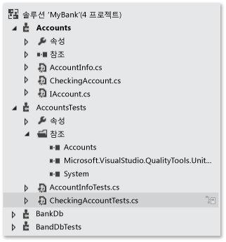
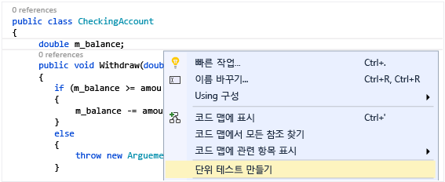
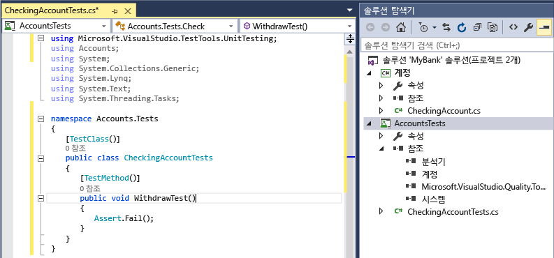
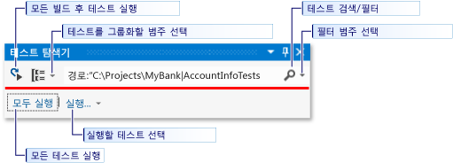
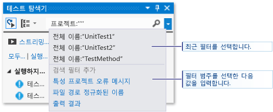
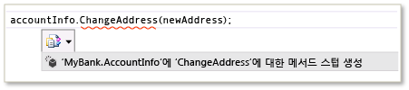
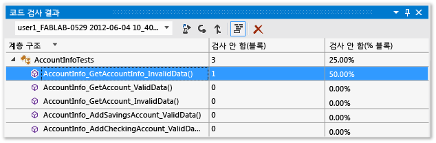

# <a name="unit-test-basics"></a>단위 테스트 기본 사항
단위 테스트를 만들고 실행하여 코드가 예상대로 작동하는지 확인합니다. 프로그램의 기능을 개별적인 *단위*로 테스트할 수 있는 고유한 테스트 가능 동작으로 구분하므로 이를 단위 테스트라고 합니다. Visual Studio 테스트 탐색기는 Visual Studio에서 단위 테스트를 실행하고 결과를 볼 수 있는 유연하고 효율적인 방법을 제공합니다. Visual Studio에는 관리 코드 및 네이티브 코드에 대한 Microsoft 단위 테스트 프레임워크가 설치됩니다. *단위 테스트 프레임워크* 를 사용하여 단위 테스트를 만들고, 실행하고, 이러한 테스트 결과를 보고합니다. 변경 시 단위 테스트를 다시 실행하여 코드가 여전히 제대로 작동하는지 테스트합니다. Visual Studio Enterprise를 사용하는 경우 빌드할 때마다 테스트를 자동으로 실행할 수 있습니다.  
  
 단위 테스트는 소프트웨어 개발 워크플로의 핵심 요소로 사용될 때 코드 품질에 대한 효과가 가장 큽니다. 함수 또는 다른 응용 프로그램 코드 블록을 작성하는 즉시 표준, 경계, 잘못된 입력 데이터 사례에 맞게 코드 동작을 확인하고 코드가 가진 모든 명시적 또는 암시적 가정을 확인하는 단위 테스트를 만듭니다. *테스트 기반 개발*을 사용하여 코드를 작성하기 전에 단위 테스트를 만들고, 이러한 단위 테스트를 기능 사양 및 디자인 설명서로 사용합니다.  
  
 코드에서 테스트 프로젝트 및 테스트 메서드를 빠르게 생성하거나, 필요에 따라 테스트를 수동으로 만들 수 있습니다. IntelliTest를 사용하여 .NET 코드를 탐색하는 경우 테스트 데이터 및 단위 테스트 도구 모음을 생성할 수 있습니다. 코드의 모든 문에 대해 해당 문을 실행할 테스트 입력이 생성됩니다. [코드에 대한 단위 테스트를 생성](http://msdn.microsoft.com/library/dn823749.aspx)하는 방법을 알아봅니다.  
  
 테스트 탐색기에서는 또한 테스트 탐색기 추가 기능 인터페이스가 구현된 타사 및 오픈 소스 방식의 단위 테스트 프레임워크도 실행할 수 있습니다. 이러한 여러 프레임워크는 Visual Studio 확장 관리자 및 Visual Studio 갤러리를 통해 추가할 수 있습니다. [타사 단위 테스트 프레임워크 설치](../test/install-third-party-unit-test-frameworks.md)를 참조하세요.  
  
-   [빠른 시작](#BKMK_Quick_starts)  
  
-   [MyBank 솔루션 예제](#BKMK_The_MyBank_Solution_example)  
  
-   [단위 테스트 프로젝트 및 테스트 메서드 만들기](#BKMK_Creating_the_unit_test_projects)  
  
-   [테스트 작성](#BKMK_Writing_your_tests)  
  
-   [테스트 탐색기에서 테스트 실행](#BKMK_Running_tests_in_Test_Explorer)  
  
-   [테스트 실행 및 보기](#BKMK_Running_and_viewing_tests_from_the_Test_Explorer_toolbar)  
  
##  <a name="BKMK_Unit_testing_overview"></a> 유닛 테스트 개요  
  
###  <a name="BKMK_Quick_starts"></a> 빠른 시작  
 코딩으로 직접 이동하는 단위 테스트에 대한 설명을 보려면 다음 항목 중 하나를 참조하세요.  
  
-   [연습: 관리 코드에 대한 단위 테스트 만들기 및 실행](../test/walkthrough-creating-and-running-unit-tests-for-managed-code.md)  
  
-   [빠른 시작: 테스트 탐색기를 사용한 테스트 기반 개발](../test/quick-start-test-driven-development-with-test-explorer.md)  
  
-   [테스트 탐색기를 사용하여 네이티브 코드 유닛 테스트](http://msdn.microsoft.com/en-us/8a09d6d8-3613-49d8-9ffe-11375ac4736c)  
  
##  <a name="BKMK_The_MyBank_Solution_example"></a> MyBank 솔루션 예제  
 이 항목에서는 `MyBank` 라는 가상의 응용 프로그램 개발이 예제로 사용됩니다. 이 항목의 설명을 이해하는 데에는 실제 코드가 필요하지 않습니다. 테스트 메서드는 C#으로 작성되고 관리 코드에 대한 Microsoft 단위 테스트 프레임워크를 사용하여 제공됩니다. 하지만 이러한 개념은 다른 언어 및 프레임워크에서도 쉽게 적용할 수 있습니다.  
  
   
  
 `MyBank` 응용 프로그램을 설계할 때의 첫 번째 작업에는 개별 계좌 및 은행과의 트랜잭션을 나타내는 계좌 구성 요소와 개별 계좌를 집계하고 관리하는 기능을 나타내는 데이터베이스 구성 요소가 포함됩니다.  
  
 여기서 만드는 `MyBank` 솔루션에는 다음 두 가지 프로젝트가 포함됩니다.  
  
-   `Accounts`  
  
-   `BankDb`  
  
 `Accounts` 프로젝트를 설계할 때의 첫 번째 작업에는 계좌에 대한 기본 정보를 저장하는 클래스, 계좌에서 자산을 맡기거나 인출하는 것과 같이 모든 유형의 계좌가 공통적으로 갖고 있는 기능을 지정하는 인터페이스, 입출금 계좌(checking account)를 나타내는 인터페이스에서 파생된 클래스가 포함됩니다. Accounts 프로젝트는 다음과 같은 소스 파일을 만드는 것으로 시작됩니다.  
  
-   `AccountInfo.cs`는 계좌에 대한 기본 정보를 정의합니다.  
  
-   `IAccount.cs`는 계좌에서 자산을 맡기거나 인출하는 메서드 및 계좌 잔액을 가져오는 메서드를 포함해서 계좌에 대한 표준 `IAccount` 인터페이스를 정의합니다.  
  
-   `CheckingAccount.cs`는 입출금 계좌에 대한 `CheckingAccount` 인터페이스를 구현하는 `IAccounts` 클래스를 포함합니다.  
  
 입출금 계좌에서 금액을 인출할 때는 인출 금액이 계좌 잔액보다 작은지 확인해야 합니다. 따라서 여기에서는 `IAccount.Withdaw` 에서 `CheckingAccount` 메서드를 이러한 조건을 확인할 수 있는 메서드로 재정의합니다. 이 메서드는 다음과 같을 수 있습니다.  
  
```c#  
  
public void Withdraw(double amount)  
{  
    if(m_balance >= amount)  
    {  
        m_balance -= amount;  
    }  
    else  
    {  
        throw new ArgumentException(amount, "Withdrawal exceeds balance!")  
    }  
}  
  
```  
  
 이제 코드가 작성되었으므로 테스트할 시간입니다.  
  
##  <a name="BKMK_Creating_the_unit_test_projects"></a> 단위 테스트 프로젝트 및 테스트 메서드 만들기  
 코드에서 단위 테스트 프로젝트와 단위 테스트 스텁을 생성하는 것이 더 빠를 수 있습니다. 또는 요구 사항에 따라 단위 테스트 프로젝트 및 테스트를 수동으로 만들도록 선택할 수 있습니다.  
  
 **단위 테스트 프로젝트 및 단위 테스트 스텁 생성**  
  
1.  코드 편집기 창에서 마우스 오른쪽 단추를 클릭하고 상황에 맞는 메뉴에서 **단위 테스트 만들기** 를 선택합니다.  
  
       
  
2.  확인을 클릭하여 단위 테스트를 만드는 기본값을 그대로 사용하거나, 단위 테스트 프로젝트와 단위 테스트를 만들고 이름을 지정하는 데 사용되는 값을 변경합니다. 단위 테스트 메서드에 기본적으로 추가되는 코드를 선택할 수 있습니다.  
  
     ![편집기에서 마우스 오른쪽 단추를 클릭하고 [단위 테스트 만들기]를 선택](../test/media/createunittestsdialog.png "CreateUnitTestsDialog")  
  
3.  단위 테스트 스텁은 클래스의 모든 메서드에 대한 새 단위 테스트 프로젝트에서 만들어집니다.  
  
       
  
4.  이제 [단위 테스트 메서드에 코드를 추가](#BKMK_Writing_your_tests) 하여 단위 테스트에 의미를 부여하는 방법과 코드를 철저히 테스트하기 위해 추가할 수 있는 추가 단위 테스트에 대해 알아보겠습니다.  
  
 **수동으로 단위 테스트 프로젝트 및 단위 테스트 만들기**  
  
 단위 테스트 프로젝트에는 일반적으로 단일 코드 프로젝트의 구조가 반영됩니다. MyBank 예제에서는 `AccountsTests` 및 `BankDbTests` 라는 2개의 단위 테스트 프로젝트를 `MyBanks` 솔루션에 추가합니다. 테스트 프로젝트 이름은 임의로 지정할 수 있지만 표준 명명 규칙을 채택해서 사용하는 것이 좋습니다.  
  
 **솔루션에 단위 테스트 프로젝트를 추가하려면**  
  
1.  **파일** 메뉴에서 **새로 만들기** 를 선택한 후 **프로젝트** 를 선택합니다(키보드 Ctrl+Shift+N).  
  
2.  새 프로젝트 대화 상자에서 **설치됨** 노드를 확장하고 테스트 프로젝트에 사용하려는 언어를 선택한 후 **테스트**를 선택합니다.  
  
3.  Microsoft 단위 테스트 프레임워크 중 하나를 사용하려면 프로젝트 템플릿 목록에서 **단위 테스트 프로젝트** 를 선택합니다. 그렇지 않으면 사용하려는 단위 테스트 프레임워크의 프로젝트 템플릿을 선택합니다. 예제에 사용된 `Accounts` 프로젝트를 테스트하려면 프로젝트 이름을 `AccountsTests`로 지정해야 합니다.  
  
    > [!WARNING]
    >  모든 타사 및 오픈 소스 단위 테스트 프레임워크에서 Visual Studio 프로젝트 템플릿이 제공되지는 않습니다. 프로젝트 만들기에 대한 정보는 해당 프레임워크 설명서를 참조하세요.  
  
4.  단위 테스트 프로젝트에서 이 예제에서 테스트하려는 코드 프로젝트에 대한 참조를 Accounts 프로젝트에 추가합니다.  
  
     코드 프로젝트에 대한 참조를 만들려면:  
  
    1.  솔루션 탐색기에서 프로젝트를 선택합니다.  
  
    2.  **프로젝트** 메뉴에서 **참조 추가**를 선택합니다.  
  
    3.  참조 관리자 대화 상자에서 **솔루션** 노드를 열고 **프로젝트**를 선택합니다. 코드 프로젝트 이름을 선택하고 대화 상자를 닫습니다.  
  
 각 단위 테스트 프로젝트에는 코드 프로젝트에 있는 클래스 이름과 동일한 클래스가 포함됩니다. 이 예제의 경우 `AccountsTests` 프로젝트에는 다음과 같은 클래스가 포함됩니다.  
  
-   `AccountInfoTests` 클래스에는 `AccountInfo` 프로젝트의 `BankAccount` 클래스에 대한 단위 테스트 메서드가 포함됩니다.  
  
-   `CheckingAccountTests` 클래스는 `CheckingAccount` 클래스에 대한 단위 테스트 메서드가 포함됩니다.  
  
##  <a name="BKMK_Writing_your_tests"></a> 테스트 작성  
 사용 중인 단위 테스트 프레임워크 및 Visual Studio IntelliSense에서는 코드 프로젝트에 대해 단위 테스트에 대한 코드를 작성하는 방법이 안내됩니다. 테스트 탐색기에서 실행할 수 있으려면, 대부분의 프레임워크의 경우, 단위 테스트 메서드를 식별할 수 있는 특정 특성을 추가해야 합니다. 프레임워크는 또한 일반적으로 어설션 문 또는 메서드 특성을 통해 테스트 메서드가 통과 또는 실패했는지 여부를 나타내는 방법을 제공합니다. 다른 특성들은 클래스 초기화 시에 그리고 각 테스트 메서드 이전에 사용되는 선택적인 설정 메서드와 각 테스트 메서드 다음에 그리고 클래스가 삭제되기 전에 실행되는 해체 메서드를 식별합니다.  
  
 AAA(정렬, 동작, 어설션) 패턴은 테스트 중인 메서드에 대한 단위 테스트를 작성하는 일반적인 방법입니다.  
  
-   단위 테스트 메서드의 **정렬** 섹션은 객체를 초기화하고 테스트 중인 메서드에 전달되는 데이터의 값을 설정합니다.  
  
-   **동작** 섹션은 정렬된 매개 변수를 사용하여 테스트 중인 메서드를 호출합니다.  
  
-   그 **어설션** 섹션은 테스트 중인 메서드의 작업이 예상한 대로 작동하는지 확인합니다.  
  
 이 예제에서 `CheckingAccount.Withdraw` 메서드를 테스트하려면 두 가지 테스트를 작성할 수 있습니다. 하나는 메서드의 표준 동작을 확인하는 테스트이고, 다른 하나는 잔액 이상의 출금이 실패하는지 확인하는 메서드입니다. `CheckingAccountTests` 클래스에서는 다음 메서드를 추가합니다.  
  
```c#  
[TestMethod]  
public void Withdraw_ValidAmount_ChangesBalance()  
{  
    // arrange  
    double currentBalance = 10.0;  
    double withdrawal = 1.0;  
    double expected = 9.0;  
    var account = new CheckingAccount("JohnDoe", currentBalance);  
    // act  
    account.Withdraw(withdrawal);  
    double actual = account.Balance;  
    // assert  
    Assert.AreEqual(expected, actual);  
}  
  
[TestMethod]  
[ExpectedException(typeof(ArgumentException))]  
public void Withdraw_AmountMoreThanBalance_Throws()  
{  
    // arrange  
    var account = new CheckingAccount("John Doe", 10.0);  
    // act  
    account.Withdraw(20.0);  
    // assert is handled by the ExpectedException  
}  
  
```  
  
 `Withdraw_ValidAmount_ChangesBalance` 는 명시적인 `Assert` 문을 사용해서 테스트 메서드가 통과되거나 실패하는지 확인하지만 `Withdraw_AmountMoreThanBalance_Throws` 는 `ExpectedException` 특성을 사용해서 테스트 메서드의 성공을 확인합니다. 내부적으로 단위 테스트 프레임워크는 try/catch 문으로 테스트 메서드를 래핑합니다. 대부분의 경우, 예외가 catch되면 테스트 메서드가 실패하고 예외가 무시됩니다. `ExpectedException` 특성은 지정된 예외가 throw될 경우 테스트 메서드가 통과되도록 만듭니다.  
  
 Microsoft 단위 테스트 프레임워크에 대한 자세한 내용은 다음 항목 중 하나를 참조하세요.  
  
-   [관리 코드용 Microsoft 단위 테스트 프레임워크를 사용하여 .NET Framework용 단위 테스트 작성](../test/writing-unit-tests-for-the-dotnet-framework-with-the-microsoft-unit-test-framework-for-managed-code.md)  
  
-   [C++용 Microsoft 유닛 테스트 프레임워크를 사용하여 C/C++용 유닛 테스트 작성](../test/writing-unit-tests-for-c-cpp-with-the-microsoft-unit-testing-framework-for-cpp.md)  
  
## <a name="set-timeouts-for-unit-tests"></a>단위 테스트에 대한 시간 제한 설정  
 개별 테스트 메서드에 대해 제한 시간을 설정하려면  
  
```c#  
[TestMethod]  
[Timeout(2000)]  // Milliseconds  
public void My_Test()  
{ ...  
}  
```  
  
```vb  
  
```  
  
 제한 시간을 허용되는 최대 시간으로 설정하려면  
  
```c#  
[TestMethod]  
[Timeout(TestTimeout.Infinite)]  // Milliseconds  
public void My_Test ()  
{ ...  
}  
```  
  
##  <a name="BKMK_Running_tests_in_Test_Explorer"></a> 테스트 탐색기에서 테스트 실행  
 테스트 프로젝트를 빌드하면 테스트가 테스트 탐색기에 나타납니다. 테스트 탐색기가 표시되지 않는 경우 Visual Studio 메뉴에서 **테스트** 를 선택하고 **Windows**를 선택한 다음 **테스트 탐색기**를 선택합니다.  
  
   
  
 테스트를 실행, 작성 및 다시 실행할 때 테스트 탐색기의 기본 보기에는 **실패한 테스트**, **통과한 테스트**, **건너뛴 테스트** 및 **실행하지 않은 테스트**그룹으로 결과를 표시합니다. 그룹 제목을 선택하면 해당 그룹의 모든 테스트를 표시하는 보기를 열 수 있습니다.  
  
 또한 어떤 보기에서든 전역 수준에서 검색 상자에 텍스트를 입력하거나 미리 정의된 필터 중 하나를 선택하여 테스트를 필터링할 수 있습니다. 언제든지 원하는 테스트를 선택해서 실행할 수 있습니다. 테스트 실행 결과는 탐색기 창 맨 위에 있는 통과/실패 표시줄에 즉시 표시됩니다. 테스트를 선택하면 테스트 메서드 결과에 대한 세부 정보가 표시됩니다.  
  
###  <a name="BKMK_Running_and_viewing_tests_from_the_Test_Explorer_toolbar"></a> 테스트 실행 및 보기  
 테스트 탐색기 도구 모음을 사용하면 원하는 테스트를 검색, 구성 및 실행할 수 있습니다.  
  
   
  
 사용자는 **모두 실행** 을 선택해서 모든 테스트를 실행하거나 **실행** 을 선택해서 실행할 테스트 하위 집합을 선택할 수 있습니다. 일련의 테스트들을 실행한 다음에는 테스트 탐색기 창의 맨 아래에 테스트 실행의 요약이 나타납니다. 테스트를 선택하면 아래쪽 창에 해당 테스트의 세부 정보가 표시됩니다. 컨텍스트 메뉴에서 **테스트 열기** 선택하여(키보드: F12) 선택된 테스트에 대한 소스 코드를 표시합니다.  
  
 개별 테스트에 종속성이 없어 임의 순서로 실행할 수 있는 경우 도구 모음의  토글 단추를 사용하여 병렬 테스트 실행을 켭니다. 이렇게 하면 모든 테스트를 실행하는 데 걸리는 시간을 훨씬 줄일 수 있습니다.  
  
###  <a name="BKMK_Running_tests_after_every_build"></a> 각 빌드 후 테스트 실행  
  
> [!WARNING]
>  각 빌드 후 단위 테스트 실행은 Visual Studio Enterprise에서만 지원됩니다.  
  
|||  
|-|-|  
||각 로컬 빌드 후 단위 테스트를 실행하려면 표준 메뉴에서 **테스트** 를 선택한 후 테스트 탐색기 도구 모음에서 **빌드 후 테스트 실행** 을 선택합니다.|  
  
###  <a name="BKMK_Filtering_and_grouping_the_test_list"></a> 테스트 목록 필터링 및 그룹화  
 많은 수의 테스트가 있으면 테스트 탐색기 검색 상자에 입력하여 지정된 문자열로 목록을 필터링할 수 있습니다. 필터 목록에서 선택하여 필터 이벤트를 더 제한할 수 있습니다.  
  
   
  
|||  
|-|-|  
||범주에 따라 테스트를 그룹화하려면 **그룹화 방법** 단추를 선택합니다.|  
  
 자세한 내용은 [테스트 탐색기를 사용하여 단위 테스트 실행](../test/run-unit-tests-with-test-explorer.md)을 참조하세요.  
  
## <a name="qa"></a>Q&A  
 **Q: 단위 테스트를 디버그하려면 어떻게 해야 하나요?**  
  
 **A:** 테스트 탐색기를 사용하여 테스트에 대한 디버깅 세션을 시작할 수 있습니다. Visual Studio 디버거에서 코드를 단계별로 실행하면 단위 테스트 및 테스트 중인 프로젝트 간을 앞뒤로 매끄럽게 이동할 수 있습니다. 디버깅을 시작하려면  
  
1.  Visual Studio 편집기에서 디버그하려는 하나 이상의 테스트 메서드에서 중단점을 설정합니다.  
  
    > [!NOTE]
    >  테스트 메서드는 순서에 관계 없이 실행할 수 있기 때문에 디버그하려는 모든 테스트 메서드에 중단점을 설정합니다.  
  
2.  테스트 탐색기에서 테스트 메서드를 선택한 다음 바로 가기 메뉴에서 **선택한 테스트 디버그** 를 선택합니다.  
  
 자세한 내용은 [단위 테스트 디버그](../debugger/debugging-in-visual-studio.md)를 참조하세요.  
  
 **Q: TDD를 사용 중인 경우 테스트에서 코드를 생성하려면 어떻게 해야 하나요?**  
  
 **A:** IntelliSense를 사용해서 프로젝트 코드에서 클래스 및 메서드를 생성합니다. 테스트 메서드에서 생성하려는 클래스 또는 메서드를 호출하는 문을 작성한 후 해당 호출에서 IntelliSense 메뉴를 엽니다. 새 클래스의 생성자에 대한 호출인 경우에는 메뉴에서 **새 형식 생성** 을 선택하고 마법사에 따라 코드 프로젝트에 클래스를 삽입합니다. 메서드에 대한 호출인 경우에는 IntelliSense 메뉴에서 **새 메서드 생성** 을 선택합니다.  
  
   
  
 **Q: 테스트를 실행하기 위한 입력으로 여러 데이터 집합을 사용하는 단위 테스트를 만들 수 있나요?**  
  
 **A:** 예. *데이터 기반 테스트 메서드* 를 사용하면 단일 단위 테스트 메서드에서 값 범위를 확인할 수 있습니다. 테스트하려는 변수 값이 포함된 데이터 소스 및 테이블을 지정하는 테스트 메서드에 대한 `DataSource` 특성을 사용합니다.  메서드 본문에서 `TestContext.DataRow[`*ColumnName*`]` 인덱서를 사용하여 변수에 행 값을 할당합니다.  
  
> [!NOTE]
>  이러한 절차는 관리 코드에 대한 Microsoft 단위 테스트 프레임워크를 사용하여 작성하는 테스트 메서드에만 적용됩니다. 다른 프레임워크를 사용하는 경우에는 동일한 기능에 대한 해당 프레임워크 설명서를 참조하세요.  
  
 예를 들어 `CheckingAccount`라는 `AddIntegerHelper` 클래스에 불필요한 메서드를 추가한다고 가정해보세요. `AddIntegerHelper`는 두 개의 정수를 추가합니다.  
  
 `AddIntegerHelper` 메서드에 대해 데이터 기반 테스트를 만들려면 먼저 `AccountsTest.accdb`라는 Access 데이터베이스와 `AddIntegerHelperData`라는 테이블을 만듭니다. `AddIntegerHelperData` 표는 추가에 대한 첫 번째 및 두 번째 피연산자를 지정하는 열과 예상 결과를 지정하기 위한 열을 정의합니다. 여러 행에 적절한 값을 채웁니다.  
  
```c#  
  
[DataSource(  
    @"Provider=Microsoft.ACE.OLEDB.12.0;Data Source=C:\Projects\MyBank\TestData\AccountsTest.accdb",   
    "AddIntegerHelperData"  
)]  
[TestMethod()]  
public void AddIntegerHelper_DataDrivenValues_AllShouldPass()  
{  
    var target = new CheckingAccount();  
    int x = Convert.ToInt32(TestContext.DataRow["FirstNumber"]);  
    int y = Convert.ToInt32(TestContext.DataRow["SecondNumber"]);   
    int expected = Convert.ToInt32(TestContext.DataRow["Sum"]);  
    int actual = target.AddIntegerHelper(x, y);  
    Assert.AreEqual(expected, actual);  
}  
  
```  
  
 특성을 사용하는 메서드는 테이블의 각 행에 대해 한 번만 실행됩니다. 테스트 탐색기는 반복이 실패할 경우 메서드에 대해 테스트 실패를 보고합니다. 메서드에 대한 테스트 결과 정보 창에는 각 데이터의 행에 대한 통과/실패 상태 메서드가 표시됩니다.  
  
 자세한 내용은 [데이터 기반 단위 테스트](../test/how-to-create-a-data-driven-unit-test.md)를 참조하세요.  
  
 **Q: 단위 테스트에서 테스트되는 코드의 양을 확인할 수 있나요?**  
  
 **A:** 예. Visual Studio 코드 검사 도구를 사용하여 실제로 단위 테스트를 통해 테스트되는 코드의 양을 결정할 수 있습니다. 네이티브 및 관리 언어 그리고 단위 테스트 프레임워크에서 실행할 수 있는 모든 단위 테스트 프레임워크가 지원됩니다.  
  
 솔루션의 선택된 테스트 또는 모든 테스트에 대해 코드 검사를 실행할 수 있습니다. 코드 검사 결과 창에는 실행된 제품 코드 블록의 백분율이 줄, 함수, 클래스, 네임스페이스 및 모듈별로 표시됩니다.  
  
 솔루션에서 테스트 메서드에 대한 코드 검사를 실행하려면 Visual Studio 메뉴에서 **테스트** 를 선택한 다음 **코드 검사 분석**을 선택합니다.  
  
 검사 결과는 코드 검사 결과 창에 나타납니다.  
  
   
  
 자세한 내용은 [코드 검사](../test/using-code-coverage-to-determine-how-much-code-is-being-tested.md)를 참조하세요.  
  
 **Q: 외부 종속성이 있는 코드에서 메서드를 테스트하려면 어떻게 해야 하나요?**  
  
 **A:** 예. Visual Studio Enterprise를 사용할 경우 Microsoft Fakes는 관리 코드에 대해 단위 테스트 프레임워크를 사용하여 작성하는 테스트 메서드에서 사용할 수 있습니다.  
  
 Microsoft Fakes는 외부 종속성에 대한 대체 클래스를 만들기 위해 두 가지 방법을 사용합니다.  
  
1.  *스텁* 은 대상 종속성 클래스의 부모 인터페이스로부터 파생된 대체 클래스를 생성합니다. 스텁 메서드는 대상 클래스의 공용 가상 메서드 대신 사용될 수 있습니다.  
  
2.  *Shim* 은 런타임 계측을 사용하여 대상 메서드에 대한 호출을 비가상 메서드에 대한 대체 shim 메서드로 전환합니다.  
  
 두 방법 모두, 테스트 메서드에서 원하는 동작을 지정하기 위해 종속 메서드에 대한 호출의 생성된 대리자를 사용합니다.  
  
 자세한 내용은 [Microsoft Fakes를 사용하여 단위 테스트 메서드 격리](../test/isolating-code-under-test-with-microsoft-fakes.md)를 참조하세요.  
  
 **Q: 다른 단위 테스트 프레임워크를 사용하여 단위 테스트를 만들 수 있나요?**  
  
 **A:** 예, 다음 단계에 따라 [다른 프레임워크를 찾아서 설치](../test/install-third-party-unit-test-frameworks.md)합니다. Visual Studio를 다시 시작한 후 솔루션을 다시 열어 단위 테스트를 만들고 여기서 설치된 프레임워크를 선택합니다.  
  
   
  
 선택한 프레임워크를 사용하여 단위 테스트 스텁이 생성됩니다.

