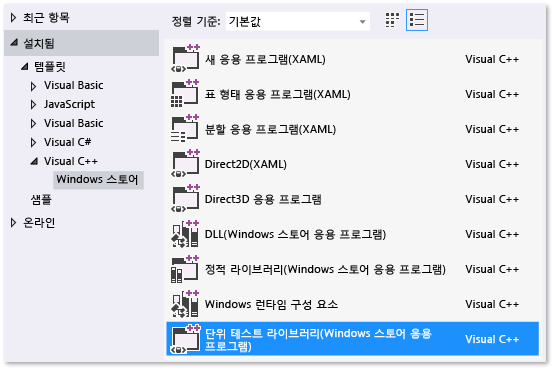
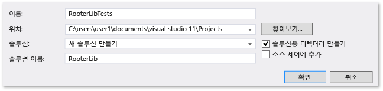
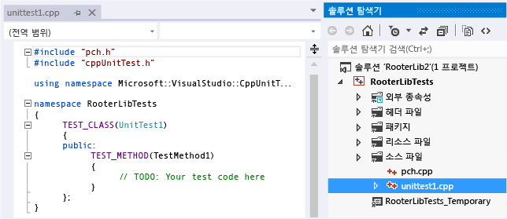
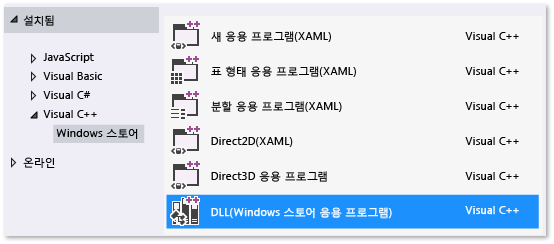
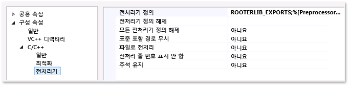

# <a name="how-to-test-a-visual-c-dll-for-uwp-apps"></a>UWP 앱의 Visual C++ DLL 테스트 방법 
이 문서에서는 C++용 Microsoft 테스트 프레임워크를 사용하여 UWP(유니버설 Windows 플랫폼) 앱용 C++ DLL에 대한 단위 테스트를 만드는 한 가지 방법을 설명합니다. RooterLib DLL은 지정된 숫자의 제곱근 예상 값을 계산하는 함수를 구현하여 미적분법의 한계 이론에 대한 희미한 기억을 보여 줍니다. DLL은 UWP 앱에 포함하여 사용자에게 수학으로 할 수 있는 재밌는 것을 보여줄 수 있습니다.  
  
 이 항목에서는 개발의 첫 단계로 단위 테스트를 사용하는 방법을 보여 줍니다. 이 방법에서는 먼저 테스트하고 있는 시스템에서 특정 동작을 확인하는 테스트 메서드를 작성한 다음 테스트를 통과하는 코드를 작성합니다. 다음 절차의 순서를 변경함으로써 이 전략을 반대로 적용하여 먼저 테스트할 코드를 작성한 다음 단위 테스트를 작성할 수 있습니다.  
  
 또한 이 항목에서는 단일 Visual Studio 솔루션과 테스트할 DLL 및 단위 테스트에 대한 별도의 프로젝트를 만듭니다. DLL 프로젝트에 직접 단위 테스트를 포함하거나 단위 테스트 및 .DLL에 대한 별도의 솔루션을 만들 수도 있습니다. 사용할 구조에 대한 팁은 [기존 C++ 응용 프로그램에 단위 테스트 추가](../test/unit-testing-existing-cpp-applications-with-test-explorer.md)를 참조하세요.  
  
##  <a name="In_this_topic"></a> 항목 내용  

 [솔루션 및 단위 테스트 프로젝트 만들기](#Create_the_solution_and_the_unit_test_project)  
  
 [테스트 탐색기에서 테스트가 실행되는지 확인](#Verify_that_the_tests_run_in_Test_Explorer)  
  
 [솔루션에 DLL 프로젝트 추가](#Add_the_DLL_project_to_the_solution)  
  
 [DLL 함수가 테스트 코드에 표시되도록 설정](#make_the_dll_functions_visible_to_the_test_code)  
  
 [반복적으로 테스트를 확장하고 통과하도록 만들기](#Iteratively_augment_the_tests_and_make_them_pass)  
  
 [실패한 테스트 디버그](#Debug_a_failing_test)  
  
 [테스트를 변경하지 않고 코드 리팩터링](#Refactor_the_code_without_changing_tests)  
  
##  <a name="Create_the_solution_and_the_unit_test_project"></a> 솔루션 및 단위 테스트 프로젝트 만들기  
  
1.  **파일** 메뉴에서 **새로 만들기**를 선택하고 **새 프로젝트**를 선택합니다.  
  
2.  새 프로젝트 대화 상자에서 **설치됨**, **Visual C++**를 차례로 확장하고 **UWP**를 선택합니다. 그런 다음 프로젝트 템플릿 목록에서 **단위 테스트 라이브러리(UWP 앱)**를 선택합니다.  
  
       
  
3.  프로젝트 이름을 `RooterLibTests`로 지정하고 위치를 지정합니다. 솔루션 이름을 `RooterLib`로 지정하고 **솔루션용 디렉터리 만들기**가 선택되어 있는지 확인합니다.  
  
       
  
4.  새 프로젝트에서 **unittest1.cpp**를 엽니다.  
  
       
  
     다음 사항에 유의합니다.  
  
    -   각 테스트는 `TEST_METHOD(YourTestName){...}`를 사용하여 정의됩니다.  
  
         기존의 함수 시그니처는 작성할 필요가 없습니다. 시그니처는 TEST_METHOD 매크로에 의해 생성됩니다. 이 매크로는 void를 반환하는 인스턴스 함수를 생성합니다. 또한 테스트 메서드에 대한 정보를 반환하는 정적 함수를 생성합니다. 이 정보를 통해 테스트 탐색기에서 메서드를 찾을 수 있습니다.  
  
    -   테스트 메서드는 `TEST_CLASS(YourClassName){...}`를 사용해서 클래스로 그룹화됩니다.  
  
         테스트를 실행하면 각 테스트 클래스의 인스턴스가 생성됩니다. 테스트 메서드는 지정되지 않은 순서로 호출됩니다. 각 모듈, 클래스 또는 메서드의 전/후에 호출되는 특별한 메서드를 정의할 수 있습니다. 자세한 내용은 MSDN 라이브러리의 [Microsoft.VisualStudio.TestTools.CppUnitTestFramework 사용](../test/using-microsoft-visualstudio-testtools-cppunittestframework.md)을 참조하세요.  
  
##  <a name="Verify_that_the_tests_run_in_Test_Explorer"></a> 테스트 탐색기에서 테스트가 실행되는지 확인  
  
1.  일부 테스트 코드를 삽입합니다.  
  
    ```cpp  
    TEST_METHOD(TestMethod1)  
    {  
        Assert::AreEqual(1,1);  
    }  
    ```  
  
     `Assert` 클래스는 테스트 메서드의 결과를 확인하는 데 사용할 수 있는 몇 가지 정적 메서드를 제공합니다.  
  
2.  **테스트** 메뉴에서 **실행**을 선택하고 **모두 실행**을 선택합니다.  
  
     테스트 프로젝트가 빌드되고 실행됩니다. 테스트 탐색기 창이 나타나고 테스트가 **통과한 테스트** 아래에 나열됩니다. 창의 아래쪽에 있는 요약 창은 선택된 테스트에 대한 추가 정보를 제공합니다.  
  
       
  
##  <a name="Add_the_DLL_project_to_the_solution"></a> 솔루션에 DLL 프로젝트 추가  
  
1.  솔루션 탐색기에서 솔루션 이름을 선택합니다. 바로 가기 메뉴에서 **추가**를 선택한 다음 **새 프로젝트 추가**를 선택합니다.  
  
       
  
2.  **새 프로젝트 추가** 대화 상자에서 **DLL(UWP 앱)**을 선택합니다.  
  
3.  **RooterLib.h** 파일에 다음 코드를 추가합니다.  
  
    ```cpp  
    // The following ifdef block is the standard way of creating macros which make exporting   
    // from a DLL simpler. All files within this DLL are compiled with the ROOTERLIB_EXPORTS  
    // symbol defined on the command line. This symbol should not be defined on any project  
    // that uses this DLL. This way any other project whose source files include this file see   
    // ROOTERLIB_API functions as being imported from a DLL, whereas this DLL sees symbols  
    // defined with this macro as being exported.  
    #ifdef ROOTERLIB_EXPORTS  
    #define ROOTERLIB_API  __declspec(dllexport)  
    #else  
    #define ROOTERLIB_API __declspec(dllimport)  
    #endif //ROOTERLIB_EXPORTS  
  
    class ROOTERLIB_API CRooterLib {  
    public:  
        CRooterLib(void);  
        double SquareRoot(double v);  
    };  
    ```  
  
     주석에서는 dll의 개발자뿐만 아니라 해당 프로젝트에서 DLL을 참조하는 모든 사용자에게 ifdef 블록을 설명합니다. DLL의 프로젝트 속성을 사용하여 명령줄에 ROOTERLIB_EXPORTS 기호를 추가할 수 있습니다.  
  
     `CRooterLib` 클래스는 생성자와 `SqareRoot` 평가자 메서드를 선언합니다.  
  
4.  명령줄에 ROOTERLIB_EXPORTS 기호를 추가합니다.  
  
    1.  솔루션 탐색기에서 **RooterLib** 프로젝트를 선택한 다음 바로 가기 메뉴에서 **속성**을 선택합니다.  
  
           
  
    2.  RooterLib 속성 페이지 대화 상자에서 **구성 속성**, **C++**를 차례로 확장하고 **전처리기**를 선택합니다.  
  
    3.  **전처리기 정의** 목록에서 **\<편집...>**을 선택하고 전처리기 정의 대화 상자에서 `ROOTERLIB_EXPORTS`를 추가합니다.  
  
5.  선언된 함수의 최소 구현을 추가합니다. **RooterLib.cpp**를 열고 다음 코드를 추가합니다.  
  
    ```  
    // constructor  
    CRooterLib::CRooterLib()  
    {  
    }  
  
    // Find the square root of a number.  
    double CRooterLib::SquareRoot(double v)  
    {  
        return 0.0;  
    }  
  
    ```  
  
##  <a name="make_the_dll_functions_visible_to_the_test_code"></a> dll 함수가 테스트 코드에 표시되도록 설정  
  
1.  RooterLibTests 프로젝트에 RooterLib를 추가합니다.  
  
    1.  솔루션 탐색기에서 **RooterLibTests** 프로젝트를 선택한 다음 바로 가기 메뉴에서 **참조...**를 선택합니다.  
  
    2.  RooterLib 프로젝트 속성 대화 상자에서 **공용 속성**을 확장하고 **프레임워크 및 참조**를 선택합니다.  
  
    3.  **새 참조 추가...**를 선택합니다.  
  
    4.  **참조 추가** 대화 상자에서 **솔루션**을 확장한 다음 **프로젝트**를 선택합니다. 그런 다음 **RouterLib** 항목을 선택합니다.  
  
2.  **unittest1.cpp**에 RooterLib 헤더 파일을 포함합니다.  
  
    1.  **unittest1.cpp**를 엽니다.  
  
    2.  다음 코드를 `#include "CppUnitTest.h"` 줄 아래에 추가합니다.  
  
        ```cpp  
        #include "..\RooterLib\RooterLib.h"  
        ```  
  
3.  가져온 함수를 사용하는 테스트를 추가합니다. **unittest1.cpp**에 다음 코드를 추가합니다.  
  
    ```  
    TEST_METHOD(BasicTest)  
    {  
        CRooterLib rooter;  
        Assert::AreEqual(  
            // Expected value:  
            0.0,   
            // Actual value:  
            rooter.SquareRoot(0.0),   
            // Tolerance:  
            0.01,  
            // Message:  
            L"Basic test failed",  
            // Line number - used if there is no PDB file:  
            LINE_INFO());  
    }  
  
    ```  
  
4.  솔루션을 빌드합니다.  
  
     새 테스트가 테스트 탐색기의 **실행하지 않은 테스트** 노드에 표시됩니다.  
  
5.  테스트 탐색기에서 **모두 실행**을 선택합니다.  
  
       
  
 테스트 및 코드 프로젝트를 설정하고 코드 프로젝트에서 함수를 실행하는 테스트를 실행할 수 있는지 확인했습니다. 이제 실제 테스트 및 코드 작성을 시작할 수 있습니다.  
  
##  <a name="Iteratively_augment_the_tests_and_make_them_pass"></a> 반복적으로 테스트를 확장하고 통과하도록 만들기  
  
1.  새 테스트 추가:  
  
    ```  
    TEST_METHOD(RangeTest)  
    {  
        CRooterLib rooter;  
        for (double v = 1e-6; v < 1e6; v = v * 3.2)  
        {  
            double expected = v;  
            double actual = rooter.SquareRoot(v*v);  
            double tolerance = expected/1000;  
            Assert::AreEqual(expected, actual, tolerance);  
        }  
    };  
  
    ```  
  
    > [!TIP]
    >  통과된 테스트는 변경하지 않는 것이 좋습니다. 대신, 새 테스트를 추가하고, 테스트가 통과하도록 코드를 업데이트하고, 다시 다른 테스트를 추가하는 방식을 반복합니다.  
    >   
    >  사용자가 요구 사항을 변경할 경우, 더 이상 올바르지 않은 테스트는 비활성화합니다. 새 테스트를 작성하고, 동일한 증분 방식으로 한 번에 하나씩 작동합니다.  
  
2.  테스트 탐색기에서 **모두 실행**을 선택합니다.  
  
3.  테스트가 실패합니다.  
  
       
  
    > [!TIP]
    >  테스트 작성 후 즉시 각 테스트가 실패하는지 확인합니다. 이렇게 하면 결코 실패하지 않는 테스트를 작성하게 되는 간단한 실수를 방지하는 데 도움이 됩니다.  
  
4.  새 테스트가 통과하도록 테스트 중인 코드를 개선합니다. **RooterLib.cpp**에 다음을 추가합니다.  
  
    ```cpp  
    #include <math.h>  
    ...  
    // Find the square root of a number.  
    double CRooterLib::SquareRoot(double v)  
    {  
        double result = v;  
        double diff = v;  
        while (diff > result/1000)  
        {  
            double oldResult = result;  
            result = result - (result*result - v)/(2*result);  
            diff = abs (oldResult - result);  
        }  
        return result;  
    }  
  
    ```  
  
5.  솔루션을 빌드한 다음 테스트 탐색기에서 **모두 실행**을 선택합니다.  
  
     두 테스트가 모두 통과합니다.  
  
> [!TIP]
>  한 번에 하나씩 테스트를 추가하여 코드를 개발합니다. 각 반복 후 모든 테스트가 통과하는지 확인합니다.  
  
##  <a name="Debug_a_failing_test"></a> 실패한 테스트 디버그  
  
1.  **unittest1.cpp**에 다른 테스트를 추가합니다.  
  
    ```  
    // Verify that negative inputs throw an exception.  
     TEST_METHOD(NegativeRangeTest)  
     {  
       wchar_t message[200];  
       CRooterLib rooter;  
       for (double v = -0.1; v > -3.0; v = v - 0.5)  
       {  
         try   
         {  
           // Should raise an exception:  
           double result = rooter.SquareRoot(v);  
  
           swprintf_s(message, L"No exception for input %g", v);  
           Assert::Fail(message, LINE_INFO());  
         }  
         catch (std::out_of_range ex)  
         {  
           continue; // Correct exception.  
         }  
         catch (...)  
         {  
           swprintf_s(message, L"Incorrect exception for %g", v);  
           Assert::Fail(message, LINE_INFO());  
         }  
       }  
    };  
  
    ```  
  
2.  테스트 탐색기에서 **모두 실행**을 선택합니다.  
  
     테스트가 실패합니다. 테스트 탐색기에서 테스트 이름을 선택합니다. 실패한 어설션이 강조 표시됩니다. 오류 메시지는 테스트 탐색기의 세부 정보 창에 표시됩니다.  
  
       
  
3.  테스트가 실패한 이유를 확인하려면 함수를 단계별로 실행합니다.  
  
    1.  `SquareRoot` 함수의 시작 부분에 중단점을 설정합니다.  
  
    2.  실패한 테스트의 바로 가기 메뉴에서 **선택한 테스트 디버그**를 선택합니다.  
  
         중단점에서 실행이 중지되면 코드를 단계별로 실행합니다.  
  
    3.  예외를 catch하는 코드를 **RooterLib.cpp**에 추가합니다.  
  
        ```  
        #include <stdexcept>  
        ...  
        double CRooterLib::SquareRoot(double v)  
        {  
            //Validate the input parameter:  
            if (v < 0.0)   
            {  
              throw std::out_of_range("Can't do square roots of negatives");  
            }  
        ...  
  
        ```  
  
    1.  테스트 탐색기에서 **모두 실행**을 선택하여 수정된 메서드를 테스트하고 실패가 재발하지 않는지 확인합니다.  
  
 이제 모든 테스트가 통과합니다.  
  
   
  
##  <a name="Refactor_the_code_without_changing_tests"></a> 테스트를 변경하지 않고 코드 리팩터링  
  
1.  `SquareRoot` 함수에서 중앙 계산을 단순화합니다.  
  
    ```  
    // old code  
    //result = result - (result*result - v)/(2*result);  
    // new code  
    result = (result + v/result) / 2.0;  
  
    ```  
  
2.  **모두 실행**을 선택하여 리팩터링된 메서드를 테스트하고 실패가 재발하지 않는지 확인합니다.  
  
    > [!TIP]
    >  훌륭한 단위 테스트의 안정적인 집합은 코드를 변경할 때 버그를 만들지 않았다는 확신을 줍니다.  
    >   
    >  리팩터링은 다른 변경 사항과 구분해서 관리합니다.
