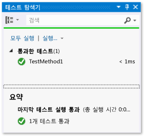
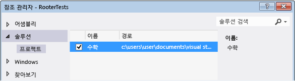
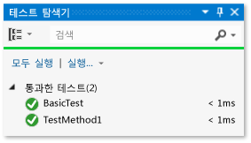
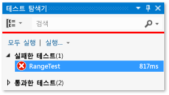
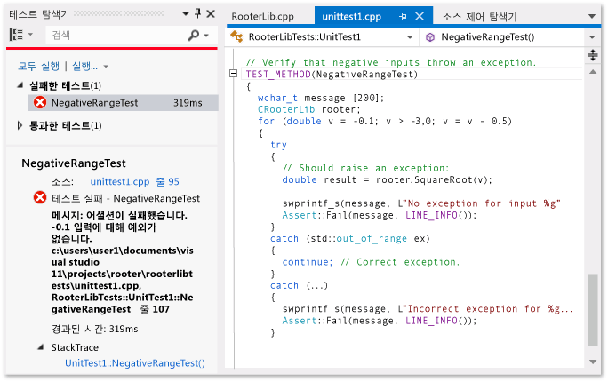
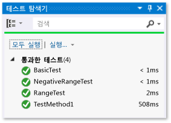

# <a name="unit-testing-visual-c-code"></a>Visual C# 코드 유닛 테스트

이 항목에서는 UWP 앱에서 Visual C# 클래스에 대한 단위 테스트를 만드는 한 가지 방법에 대해 설명합니다. Rooter 클래스는 지정된 숫자의 제곱근 예상 값을 계산하는 함수를 구현하여 미적분법의 극한 이론을 보여줍니다. Maths 응용 프로그램은 이 함수를 사용하여 수학으로 할 수 있는 재미있는 작업을 사용자에게 보여줄 수 있습니다.

이 항목에서는 개발의 첫 단계로 단위 테스트를 사용하는 방법을 보여줍니다. 이 방법에서는 먼저 테스트하고 있는 시스템에서 특정 동작을 확인하는 테스트 메서드를 작성한 다음 테스트를 통과하는 코드를 작성합니다. 다음 절차의 순서를 변경함으로써 이 전략을 반대로 적용하여 먼저 테스트할 코드를 작성한 다음 단위 테스트를 작성할 수 있습니다.

또한 이 항목에서는 단일 Visual Studio 솔루션과 테스트할 DLL 및 단위 테스트에 대한 별도의 프로젝트를 만듭니다. DLL 프로젝트에 직접 단위 테스트를 포함하거나 단위 테스트 및 DLL에 대한 별도의 솔루션을 만들 수도 있습니다.

## <a name="create-the-solution-and-the-unit-test-project"></a>솔루션 및 단위 테스트 프로젝트 만들기

1. **파일** 메뉴에서 **새로 만들기** > **프로젝트...**를 선택합니다.

2. **새 프로젝트** 대화 상자에서 **설치됨** > **Visual C#**을 확장하고 **Windows 유니버설**을 선택합니다. 그런 다음 프로젝트 템플릿 목록에서 **새 응용 프로그램**을 선택합니다.

3. 프로젝트의 이름을 `Maths`로 지정하고 **솔루션용 디렉터리 만들기**가 선택되어 있는지 확인합니다.

4. 솔루션 탐색기에서 솔루션 이름을 선택하고 바로 가기 메뉴에서 **추가**를 선택한 다음 **새 프로젝트**를 선택합니다.

5. **새 프로젝트** 대화 상자에서 **설치됨** 및 **Visual C#**을 확장하고 **Windows Universal**을 선택합니다. 그런 다음 프로젝트 템플릿 목록에서 **유닛 테스트 앱(유니버설 Windows)**을 선택합니다.

6. Visual Studio 편집기에서 *UnitTest1.cs*를 엽니다.

   ```csharp
   using System;
   using System.Collections.Generic;
   using System.Linq;
   using System.Text;
   using Microsoft.VisualStudio.TestTools.UnitTesting;
   using Maths;

   namespace RooterTests
   {
       [TestClass]
       public class UnitTest1

           [TestMethod]
           public void TestMethod1()
           {

           }
   ```

   다음 사항에 유의합니다.

   - 각 테스트는 <xref:Microsoft.VisualStudio.TestTools.UnitTesting.TestMethodAttribute> 특성을 사용하여 정의됩니다. 테스트 메서드는 void를 반환해야 하고 매개 변수를 사용할 수 없습니다.

   - 테스트 메서드는 <xref:Microsoft.VisualStudio.TestTools.UnitTesting.TestClassAttribute> 특성으로 데코레이팅된 클래스에 있어야 합니다.

        테스트가 실행될 때 각 테스트 클래스의 인스턴스가 만들어집니다. 테스트 메서드는 지정되지 않은 순서로 호출됩니다.

   - 각 모듈, 클래스 또는 메서드의 전/후에 호출되는 특별한 메서드를 정의할 수 있습니다. 자세한 내용은 [단위 테스트에서 MSTest 프레임워크 사용](../test/using-microsoft-visualstudio-testtools-unittesting-members-in-unit-tests.md)을 참조하세요.

## <a name="verify-that-the-tests-run-in-test-explorer"></a>테스트가 테스트 탐색기에서 실행되는지 확인

1. **UnitTest1.cs** 파일의 TestMethod1에 테스트 코드를 삽입합니다.

   ```csharp
   [TestMethod]
   public void TestMethod1()
   {
       Assert.AreEqual(0, 0);
   }
   ```

   <xref:Microsoft.VisualStudio.TestTools.UnitTesting.Assert> 클래스는 테스트 메서드의 결과를 확인하는 데 사용할 수 있는 몇 가지 정적 메서드를 제공합니다.

2. **테스트** 메뉴에서 **실행**을 선택하고 **모두 실행**을 선택합니다.

   테스트 프로젝트가 빌드되고 실행됩니다. 테스트 탐색기 창이 나타나고 테스트가 **통과한 테스트** 아래에 나열됩니다. 창의 아래쪽에 있는 요약 창은 선택된 테스트에 대한 추가 정보를 제공합니다.

   

## <a name="add-the-rooter-class-to-the-maths-project"></a>Maths 프로젝트에 Rooter 클래스 추가

1. 솔루션 탐색기에서 **Maths** 프로젝트 이름을 선택합니다. 바로 가기 메뉴에서 **추가**를 선택한 다음 **클래스**를 선택합니다.

2. 클래스 파일의 이름을 *Rooter.cs*로 지정합니다.

3. 다음 코드를 Rooter 클래스 *Rooter.cs* 파일에 추가합니다.

   ```csharp
   public Rooter()
   {
   }

   // estimate the square root of a number
   public double SquareRoot(double x)
   {
       return 0.0;
   }
   ```

   `Rooter` 클래스는 생성자와 `SquareRoot` 평가자 메서드를 선언합니다.

4. `SquareRoot` 메서드는 테스트 설정의 기본 구조를 테스트할 정도의 최소 구현일 뿐입니다.

## <a name="couple-the-test-project-to-the-app-project"></a>응용 프로그램 프로젝트에 테스트 프로젝트 연결

1. Maths 응용 프로그램에 대한 참조를 RooterTests 프로젝트에 추가합니다.

    1. 솔루션 탐색기에서 **RooterTests** 프로젝트를 선택한 다음 바로 가기 메뉴에서 **참조 추가...**를 선택합니다.

    2. **참조 추가 - RooterTests** 대화 상자에서 **솔루션**을 확장하고 **프로젝트**를 선택한 다음, **Maths** 항목을 선택합니다.

        

2. *UnitTest1.cs* 파일에 using 문을 추가합니다.

    1. *UnitTest1.cs*를 엽니다.

    2. `using Microsoft.VisualStudio.TestTools.UnitTesting;` 줄 아래에 다음 코드를 추가합니다.

       ```csharp
       using Maths;
       ```

3. Rooter 함수를 사용하는 테스트를 추가합니다. *UnitTest1.cs*에 다음 코드를 추가합니다.

   ```csharp
   [TestMethod]
   public void BasicTest()
   {
       Maths.Rooter rooter = new Rooter();
       double expected = 0.0;
       double actual = rooter.SquareRoot(expected * expected);
       double tolerance = .001;
       Assert.AreEqual(expected, actual, tolerance);
   }
   ```

4. 솔루션을 빌드합니다.

   새 테스트가 테스트 탐색기의 **실행하지 않은 테스트** 노드에 표시됩니다.

5. 테스트 탐색기에서 **모두 실행**을 선택합니다.

   

테스트 및 코드 프로젝트를 설정하고 코드 프로젝트에서 함수를 실행하는 테스트를 실행할 수 있는지 확인했습니다. 이제 실제 테스트 및 코드 작성을 시작할 수 있습니다.

## <a name="iteratively-augment-the-tests-and-make-them-pass"></a>반복적으로 테스트를 확장하고 통과하도록 만들기

1. 새 테스트 추가:

   ```csharp
   [TestMethod]
   public void RangeTest()
   {
       Rooter rooter = new Rooter();
       for (double v = 1e-6; v < 1e6; v = v * 3.2)
       {
           double expected = v;
           double actual = rooter.SquareRoot(v*v);
           double tolerance = ToleranceHelper(expected);
           Assert.AreEqual(expected, actual, tolerance);
       }
   }
   ```

   > [!TIP]
   > 통과된 테스트는 변경하지 않는 것이 좋습니다. 대신, 새 테스트를 추가하고, 테스트가 통과하도록 코드를 업데이트하고, 다시 다른 테스트를 추가하는 방식을 반복합니다.
   >
   > 사용자가 요구 사항을 변경할 경우, 더 이상 올바르지 않은 테스트는 비활성화합니다. 새 테스트를 작성하고, 동일한 증분 방식으로 한 번에 하나씩 작동합니다.

2. 테스트 탐색기에서 **모두 실행**을 선택합니다.

3. 테스트가 실패합니다.

   

   > [!TIP]
   > 테스트를 작성한 후 즉시 각 테스트가 실패하는지 확인합니다. 이렇게 하면 결코 실패하지 않는 테스트를 작성하게 되는 간단한 실수를 방지하는 데 도움이 됩니다.

4. 새 테스트가 통과하도록 테스트 중인 코드를 개선합니다. *Rooter.cs*에서 `SquareRoot` 함수를 다음과 같이 변경합니다.

   ```csharp
   public double SquareRoot(double x)
   {
       double estimate = x;
       double diff = x;
       while (diff > estimate / 1000)
       {
           double previousEstimate = estimate;
           estimate = estimate - (estimate * estimate - x) / (2 * estimate);
           diff = Math.Abs(previousEstimate - estimate);
       }
       return estimate;
   }
   ```

5. 솔루션을 빌드한 다음, **테스트 탐색기**에서 **모두 실행**을 선택합니다.

   이제 세 테스트가 모두 통과합니다.

> [!TIP]
> 한 번에 하나씩 테스트를 추가하여 코드를 개발합니다. 각 반복 후 모든 테스트가 통과하는지 확인합니다.

## <a name="debug-a-failing-test"></a>실패한 테스트 디버그

1. *UnitTest1.cs*

    ```csharp
    // Verify that negative inputs throw an exception.
    [TestMethod]
    public void NegativeRangeTest()
    {
        string message;
        Rooter rooter = new Rooter();
        for (double v = -0.1; v > -3.0; v = v - 0.5)
        {
            try
            {
                // Should raise an exception:
                double actual = rooter.SquareRoot(v);

                message = String.Format("No exception for input {0}", v);
                Assert.Fail(message);
            }
            catch (ArgumentOutOfRangeException ex)
            {
                continue; // Correct exception.
            }
            catch (Exception e)
            {
                message = String.Format("Incorrect exception for {0}", v);
                Assert.Fail(message);
            }
        }
    }
    ```

2. **테스트 탐색기**에서 **모두 실행**을 선택합니다.

   테스트가 실패합니다. **테스트 탐색기**에서 테스트 이름을 선택합니다. 실패한 어설션이 강조 표시됩니다. 오류 메시지는 **테스트 탐색기**의 세부 정보 창에 표시됩니다.

   

3. 테스트가 실패한 이유를 확인하려면 함수를 단계별로 실행합니다.

    1. `SquareRoot` 함수의 시작 부분에 중단점을 설정합니다.

    2. 실패한 테스트의 바로 가기 메뉴에서 **선택한 테스트 디버그**를 선택합니다.

        중단점에서 실행이 중지되면 코드를 단계별로 실행합니다.

    3. 예외를 catch하기 위해 코드를 Rooter 메서드에 추가합니다.

        ```csharp
        public double SquareRoot(double x)
        {
            if (x < 0.0)
            {
                throw new ArgumentOutOfRangeException();
        }
        ```

4. 테스트 탐색기에서 **모두 실행**을 선택하여 수정된 메서드를 테스트하고 실패가 재발하지 않는지 확인합니다.

이제 모든 테스트가 통과합니다.



## <a name="refactor-the-code"></a>코드 리팩터링

**SquareRoot 함수에서 중앙 계산을 간소화합니다.**

1. 결과 구현을 변경합니다.

    ```csharp
    // old code
    //result = result - (result*result - v)/(2*result);
    // new code
    result = (result + v/result) / 2.0;
    ```

2. **모두 실행**을 선택하여 리팩터링된 메서드를 테스트하고 실패가 재발하지 않는지 확인합니다.

> [!TIP]
> 훌륭한 단위 테스트의 안정적인 집합은 코드를 변경할 때 버그를 만들지 않았다는 확신을 줍니다.

**테스트 코드를 리팩터링하여 중복 코드를 제거합니다.**

`RangeTest` 메서드는 <xref:Microsoft.VisualStudio.TestTools.UnitTesting.Assert> 메서드에 전달되는 `tolerance` 변수의 분모를 하드 코드합니다. 동일한 허용 오차 계산을 사용하는 추가 테스트를 추가할 계획인 경우 여러 위치에서 하드 코드된 값을 사용하면 오류가 발생할 수 있습니다.

1. 허용 오차 값을 계산하기 위해 전용 메서드를 Unit1Test 클래스에 추가한 다음, 이 메서드를 대신 호출합니다.

    ```csharp
    private double ToleranceHelper(double expected)
    {
        return expected / 1000;
    }

    ...

    [TestMethod]
    public void RangeTest()
    {
        ...
        // old code
        // double tolerance = expected/1000;
        // new code
        double tolerance = ToleranceHelper(expected);
        Assert.AreEqual(expected, actual, tolerance);
    }
    ...
    ```

2. **모두 실행**을 선택하여 리팩터링된 메서드를 테스트하고 오류가 없는지 확인합니다.

> [!NOTE]
> **테스트 탐색기**에 표시하지 않으려는 도우미 메서드를 테스트 클래스에 추가하는 경우, 이 메서드에 <xref:Microsoft.VisualStudio.TestTools.UnitTesting.TestMethodAttribute> 특성을 추가하지 마세요.
