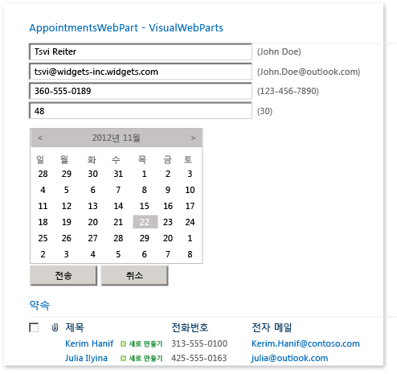
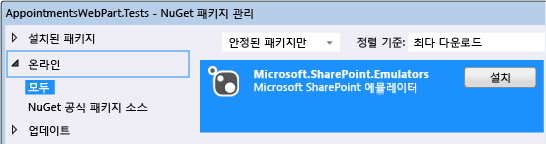
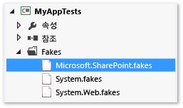
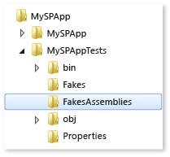

# <a name="using-emulators-to-isolate-unit-tests-for-sharepoint-2010-applications"></a>에뮬레이터를 사용하여 Sharepoint 2010 응용 프로그램용 단위 테스트 격리
Microsoft.SharePoint.Emulators 패키지는 Microsoft SharePoint 2010 응용 프로그램에 대한 격리된 단위 테스트를 만들도록 도와주는 라이브러리 집합을 제공합니다. 에뮬레이터는 [Microsoft Fakes](../test/isolating-code-under-test-with-microsoft-fakes.md) 격리 프레임워크의 [shim](../test/using-shims-to-isolate-your-application-from-other-assemblies-for-unit-testing.md)을 사용하여 SharePoint API의 가장 일반적인 개체 및 메서드를 가장하는 간단한 메모리 내 개체를 만듭니다. SharePoint 메서드가 에뮬레이트되지 않는 경우가 에뮬레이터의 기본 동작을 변경하려면 Fakes shim을 만들어서 원하는 결과를 제공할 수 있습니다.  
  
 기존 테스트 메서드 및 클래스는 에뮬레이터 컨텍스트에서 실행되도록 쉽게 변환될 수 있습니다. 이 기능을 통해 이중 사용 테스트를 만들 수 있습니다. 이중 사용 테스트는 실제 SharePoint API에 대한 통합 테스트와 에뮬레이터를 사용하는 격리된 단위 테스트 간에 전환할 수 있습니다.  
  
##  <a name="BKMK_In_this_topic"></a> 항목 내용  
 [Requirements](#BKMK_Requirements)  
  
 [AppointmentsWebPart 예제](#BKMK_The_AppointmentsWebPart_example)  
  
 [기존 테스트 변환](#BKMK_Converting_an_existing_test)  
  
-   [테스트 프로젝트에 에뮬레이터 패키지 추가](#BKMK_Adding_the_Emulators_package_to_a_test_project)  
  
-   [에뮬레이션을 통해 테스트 메서드 실행](#BKMK__Running_a_test_method_in_the_emulation_context)  
  
 [이중 사용할 클래스 및 메서드 만들기](#BKMK_Creating_dual_use_classes_and_methods)  
  
 [TestInitialize 및 TestCleanup 특성을 사용하여 이중 사용 테스트 클래스 만들기](#BKMK_Using_TestInitialize_and_TestCleanup_attributes_to_create_a_dual_use_test_class)  
  
 [에뮬레이트되지 않은 SharePoint 메서드 처리](#BKMK_Handling_non_emulated_SharePoint_methods)  
  
 [에뮬레이션 테스트를 처음부터 다시 작성하고 요약 작성](#BKMK_Writing_emulation_tests_from_scratch__and_a_summary)  
  
 [예](#BKMK_Example)  
  
 [에뮬레이트된 SharePoint 형식](#BKMK_Emulated_SharePoint_types)  
  
##  <a name="BKMK_Requirements"></a> 요구 사항  
  
-   Microsoft SharePoint 2010(SharePoint 2010 Server 또는 SharePoint 2010 Foundation)  
  
-   Microsoft Visual Studio Enterprise  
  
-   Microsoft SharePoint Emulators NuGet 패키지  
  
 [Visual Studio의 유닛 테스트에 대한 기본 사항](../test/unit-test-basics.md)과 [Microsoft Fakes](../test/isolating-code-under-test-with-microsoft-fakes.md)를 잘 알고 있어야 합니다.  
  
##  <a name="BKMK_The_AppointmentsWebPart_example"></a> AppointmentsWebPart 예제  
 AppointmentsWebPart를 사용하여 약속의 SharePoint 목록을 보고 관리할 수 있습니다.  
  
   
  
 이 예제에서는 웹 파트의 두 가지 메서드를 테스트해 보겠습니다.  
  
-   `ScheduleAppointment` 메서드는 메서드에 전달되는 목록 항목 값의 유효성을 검사하고 지정된 SharePoint 웹에서 목록에 새 항목을 만듭니다.  
  
-   `GetAppointmentsForToday` 메서드는 오늘 약속의 세부 정보를 반환합니다.  
  
 [항목 내용](#BKMK_In_this_topic)  
  
##  <a name="BKMK_Converting_an_existing_test"></a> 기존 테스트 변환  
 SharePoint 구성 요소의 일반적인 메서드 테스트에서 테스트 메서드는 SharePoint Foundation에서 임시 사이트를 만들고 테스트 중인 코드에 필요한 SharePoint 구성 요소를 사이트에 추가합니다. 그다음에 테스트 메서드는 구성 요소 인스턴스를 만들고 실행합니다. 테스트가 끝나면 사이트가 삭제됩니다.  
  
 테스트 중인 코드의 `ScheduleAppointment` 메서드는 구성 요소에 대해 작성된 첫 번째 메서드의 하나일 수 있습니다.  
  
```  
// method under test  
public bool ScheduleAppointment(SPWeb web, string listName, string name,   
    string phone, string email, string age, DateTime date, out string errorMsg)  
{  
    errorMsg = string.Empty;  
    var badFormat = this.checkInput(name, phone, email, age);  
    if (badFormat)  
    {  
        errorMsg = "Bad Format";  
        return false;  
    }  
    var exists = this.CheckDuplicate(listName, web, name, phone, email, age, date);  
    if (exists)  
    {  
        errorMsg = "Item already exists";  
        return false;  
    }  
    SPListItemCollection items = web.Lists[listName].Items;  
    // create item and populate fields  
    SPListItem item = items.Add();  
    item["Name"] = name;  
    item["Phone"] = phone;  
    item["Email"] = email;  
    item["Age"] = age;  
    item["Date"] = date.ToString("D");  
    item.Update();  
    return true;  
}  
  
```  
  
 `ScheduleAppointment`의 첫 번째 기능 테스트는 다음과 같이 표시됩니다.  
  
```csharp  
  
[TestMethod]  
public void ScheduleAppointmentReturnsTrueWhenNewAppointmentIsCreated()  
{  
    using( var site = new SPSite("http://localhost"))  
    using (var webPart = new BookAnAppointmentWebPart())  
    {  
        // Arrange  
        string errorMsg = string.Empty;  
        DateTime date = DateTime.Now;  
        SPList list = AddListToSiteHelper(site);  
  
        // Act  
        bool success = webPart.ScheduleAppointment(site.RootWeb, list.Title,  
            "Raisa Pokrovskaya", "425-555-0163", "raisa@outlook.com", "55", date,   
            out errorMsg);  
        list.Delete();  
  
        // Assert  
        Assert.IsTrue(success);  
    }  
}  
```  
  
 이 테스트 메서드는 `ScheduleAppointment` 메서드가 목록에 새 항목을 제대로 추가하는지 확인하지만, 코드의 특정 동작에 대한 테스트보다 더 통합적인 웹 파트 테스트입니다. `ScheduleAppointment` 메서드의 사용자 코드 이외의 이유로 SharePoint 및 SharePoint API에 대한 외부 종속성 때문에 테스트가 실패할 수 있습니다. SharePoint 사이트를 만들고 배포할 때 발생하는 오버헤드로 인해 테스트가 너무 느려져서 코딩 프로세스의 일반 파트로 실행될 수 없습니다. 모든 테스트 메서드에 대한 사이트 설정 및 제거를 수행하면 효율적인 개발자 단위 테스트를 만들 때 문제가 악화됩니다.  
  
 Microsoft SharePoint 에뮬레이터에서는 가장 일반적인 SharePoint API의 동을 가장하는 개체 및 메서드 "doubles" 집합을 제공합니다. 에뮬레이트된 메서드는 SharePoint를 실행할 필요가 없는 SharePoint API의 간단한 구현입니다. Microsoft Fakes를 사용하여 SharePoint API에 대한 호출을 SharePoint 에뮬레이터의 메서드 doubles로 우회하면 테스트를 격리하고 원하는 코드를 테스트하고 있는지 확인합니다. 에뮬레이트되지 않는 SharePoint 메서드를 호출할 때 Fakes를 직접 사용하여 원하는 동작을 만들 수 있습니다.  
  
 [항목 내용](#BKMK_In_this_topic)  
  
###  <a name="BKMK_Adding_the_Emulators_package_to_a_test_project"></a> 테스트 프로젝트에 에뮬레이터 패키지 추가  
 테스트 프로젝트에 SharePoint 에뮬레이터를 추가하려면  
  
1.  솔루션 탐색기에서 테스트 프로젝트를 선택합니다.  
  
2.  바로 가기 메뉴에서 **NuGet 패키지 관리...**를 선택합니다.  
  
3.  `Microsoft.SharePoint.Emulators`에 대한 **온라인** 범주를 검색한 다음 **설치**를 선택합니다.  
  
   
  
 [항목 내용](#BKMK_In_this_topic)  
  
###  <a name="BKMK__Running_a_test_method_in_the_emulation_context"></a> 에뮬레이션을 통해 테스트 메서드 실행  
 패키지를 설치하면 필요한 라이브러리에 대한 참조가 프로젝트에 추가됩니다. 기존 테스트 클래스에서 에뮬레이터를 쉽게 사용하려면 네임스페이스 `Microsoft.SharePoint.Emulators` 및 `Microsoft.QualityTools.Testing.Emulators`를 추가합니다.  
  
 테스트 메서드에서 에뮬레이션을 사용하려면 `SharePointEmulationScope` 개체를 만드는 `using` 문으로 메서드 본문을 래핑합니다. 예:  
  
```csharp  
  
[TestMethod]  
public void ScheduleAppointmentReturnsTrueWhenNewAppointmentIsCreated()  
{  
    // create the emulation scope with a using statement  
    using (new SharePointEmulationScope())  
    using( var site = new SPSite("http://localhost"))  
    using (var webPart = new BookAnAppointmentWebPart())  
    {  
        // Arrange  
        string errorMsg = string.Empty;  
        DateTime date = DateTime.Now;  
        SPList list = AddListToSiteHelper(site);  
  
        // Act  
        bool success = webPart.ScheduleAppointment(site.RootWeb, list.Title,  
            "Raisa Pokrovskaya", "425-555-0163", "raisa@outlook.com", "55", date,   
            out errorMsg);  
        list.Delete();  
  
        // Assert  
        Assert.IsTrue(success);  
    }  
}  
  
```  
  
 테스트 메서드가 실행되면 에뮬레이터 런타임에서는 Microsoft Fakes를 호출하여 SharePoint 메서드에 코드를 동적으로 주입하고 이들 메서드에 대한 호출을 Microsoft.SharePoint.Fakes.dll에 선언된 대리자로 전환합니다. Microsoft.SharePoint.Emulators.dll은 에뮬레이트된 메서드에 대한 대리자를 구현하여 실제 SharePoint 동작을 매우 비슷하게 가장합니다. 테스트 중인 구성 요소 또는 테스트 메서드가 SharePoint 메서드를 호출하면 에뮬레이션의 동작이 생성됩니다.  
  
   
  
 [항목 내용](#BKMK_In_this_topic)  
  
##  <a name="BKMK_Creating_dual_use_classes_and_methods"></a> 이중 사용할 클래스 및 메서드 만들기  
 실제 SharePoint API에 대한 통합 테스트 및 에뮬레이터를 사용하는 격리된 단위 테스트에 둘 다 사용할 수 있는 메서드를 만들려면 오버로드된 생성자 `SharePointEmulationScope(EmulationMode)`를 사용하여 테스트 메서드 코드를 래핑합니다. `EmulationMode` 열거형의 두 값은 범위에서 에뮬레이터를 사용할지 여부(`EmulationMode.Enabled`) 또는 범위에서 SharePoint API를 사용할지 여부(`EmulationMode.Passthrough`)를 지정합니다.  
  
 예를 들어 다음은 이전 테스트를 이중 사용으로 수정하는 방법입니다.  
  
```csharp  
  
// class level field specifies emulation mode  
private const EmulationMode emulatorMode = EmulationMode.Enabled;  
  
[TestMethod]  
public void ScheduleAppointmentReturnsTrueWhenNewAppointmentIsCreated()  
{  
    // emulation scope determined by emulatorMode  
    using( SharePointEmulationScope(emulatorMode))  
    using( var site = new SPSite("http://localhost"))  
    using (var webPart = new BookAnAppointmentWebPart())  
    {  
        // Arrange  
        string errorMsg = string.Empty;  
        DateTime date = DateTime.Now;  
        SPList list = AddListToSiteHelper(site);  
  
        // Act  
        bool success = webPart.ScheduleAppointment(site.RootWeb, list.Title,  
            "Raisa Pokrovskaya", "425-555-0163", "raisa@outlook.com", "55", date,   
            out errorMsg);  
        list.Delete();  
  
        // Assert  
        Assert.IsTrue(success);  
    }  
}  
```  
  
 [항목 내용](#BKMK_In_this_topic)  
  
##  <a name="BKMK_Using_TestInitialize_and_TestCleanup_attributes_to_create_a_dual_use_test_class"></a> TestInitialize 및 TestCleanup 특성을 사용하여 이중 사용 테스트 클래스 만들기  
 `SharePointEmulationScope`를 사용하여 클래스의 모든 또는 대부분 테스트를 실행하면 클래스 수준 방법을 사용하여 에뮬레이션 모드를 설정할 수 있습니다.  
  
-   <xref:Microsoft.VisualStudio.TestTools.UnitTesting.TestInitializeAttribute> 및 <xref:Microsoft.VisualStudio.TestTools.UnitTesting.TestCleanupAttribute> 특성을 사용하는 테스트 클래스 메서드는 범위를 만들고 제거할 수 있습니다.  
  
-   클래스 수준에서 `EmulationMode`를 설정하면 `EmulationMode.Enabled`와 `EmulationMode.Passthrough` 간의 모드 변경을 자동화할 수 있습니다.  
  
 `[TestInitialize]` 특성이 사용된 클래스 메서드는 각 테스트 메서드가 시작될 때 실행되고 `[TestCleanup]` 특성이 사용된 메서드는 각 테스트 메서드가 종료될 때 실행됩니다. 클래스 수준에서 `SharePointEmulationScope` 개체에 대한 전용 필드를 선언하고, `TestInitialize` 특성 사용 메서드에서 초기화하고, `TestCleanup` 특성 사용 메서드에서 개체를 삭제할 수 있습니다.  
  
 선택한 메서드를 사용하여 `EmulationMode` 선택을 자동화할 수 있습니다. 한 가지 방법은 전처리기 지시문을 사용하여 기호가 있는지 확인하는 것입니다. 예를 들어 에뮬레이터를 사용하여 클래스에서 테스트 메서드를 실행하려면 테스트 프로젝트 파일이나 빌드 명령줄에서 `USE_EMULATION`과 같은 기호를 정의하면 됩니다. 기호가 정의되면 클래스 수준 `EmulationMode` 상수가 선언되고 `Enabled`로 설정됩니다. 그렇지 않으면 상수가 `Passthrough`로 설정됩니다.  
  
 다음은 전처리기 지시문과 `TestInitialize` 및 `TestCleanup` 특성 사용 메서드를 사용하여 에뮬레이션 모드를 설정하는 방법을 보여 주는 테스트 클래스의 예제입니다.  
  
```csharp  
//namespace declarations  
...  
  
namspace MySPAppTests   
{  
    [TestClass]  
    public class BookAnAppointmentWebPartTests  
    {  
  
        // emulationScope is a class level field  
        private SharePointEmulationScope emulationScope;  
  
        // preprocessor directives determine the value of emulatorMode  
        #if USE_EMULATIONprivate const EmulationMode emulatorMode = EmulationMode.Enabled;#elseprivate const EmulationMode emulatorMode = EmulationMode.Passthrough;#endif  
  
        // InitializeTest sets the emulation scope at the beginning of each test method  
        [TestInitialize]public void InitializeTest(){this.emulationScope = new SharePointEmulationScope(emulatorMode);}  
  
        // CleanupTest disposes the emulation scope at the end of each test method  
        [TestCleanup]public void CleanupTest(){this.emulationScope.Dispose();}  
  
        [TestMethod]  
        public void ScheduleAppointmentReturnsTrueWhenNewAppointmentIsCreated()  
        {  
            // remove the SharePointEmulationScope using statement from the method  
            using( var site = new SPSite("http://localhost"))  
            using (var webPart = new BookAnAppointmentWebPart())  
            {  
                // Arrange  
                string errorMsg = string.Empty;  
                DateTime date = DateTime.Now;  
                SPList list = AddListToSiteHelper(site);  
  
                // Act  
                bool success = webPart.ScheduleAppointment(site.RootWeb, list.Title,  
                    "Raisa Pokrovskaya", "425-555-0163", "raisa@outlook.com", "55", date,   
                    out errorMsg);  
                list.Delete()  
  
                // Assert  
                Assert.IsTrue(success);  
            }  
        }  
  
        ...// More tests  
  
    }  
}  
  
```  
  
 [항목 내용](#BKMK_In_this_topic)  
  
##  <a name="BKMK_Handling_non_emulated_SharePoint_methods"></a> 에뮬레이트되지 않은 SharePoint 메서드 처리  
 일부 SharePoint 형식이 에뮬레이트되지 않고 일부 에뮬레이트된 형식의 일부 메서드는 에뮬레이트되지 않습니다. 테스트 중인 코드가 에뮬레이트되지 않은 SharePoint 메서드를 호출하면 메서드는 `NotSupportedException` 예외를 throw합니다. 예외가 발생하면 SharePoint 메서드에 대한 Fakes shim을 추가합니다.  
  
 **SharePoint Fakes 설정**  
  
 Microsoft Fakes shim을 명시적으로 호출하려면:  
  
1.  에뮬레이트되지 않은 SharePoint 클래스를 shim하려면 Microsoft.SharePoint.fakes 파일을 편집하고 shim된 클래스 목록에 클래스를 추가합니다. [Microsoft Fakes의 코드 생성, 컴파일 및 명명 규칙](../test/code-generation-compilation-and-naming-conventions-in-microsoft-fakes.md)의 [스텁 및 shim의 코드 생성 구성](http://msdn.microsoft.com/library/hh708916.aspx#bkmk_configuring_code_generation_of_stubs) 섹션을 참조하세요.  
  
       
  
2.  Microsoft SharePoint Emulators 패키지를 설치한 후와 Microsoft.SharePoint.Fakes 파일을 편집한 경우 테스트 프로젝트를 한 번 이상 다시 빌드해야 합니다. 프로젝트를 빌드하면 디스크에 있는 프로젝트 루트 폴더에 **FakesAssembly** 폴더가 만들어지고 채워집니다.  
  
       
  
3.  **FakesAssembly** 폴더에 위치한 **Microsoft.SharePoint.14.0.0.0.Fakes.dll**에 대한 참조를 추가합니다.  
  
4.  (선택 사항) `Microsoft.QualityTools.Testing.Fakes`, `Microsoft.SharePoint.Fakes` 및 사용할 `Microsoft.SharePoint.Fakes`의 모든 중첩된 네임스페이스에 대한 테스트 클래스에 네임스페이스 지시문을 추가합니다.  
  
 **SharePoint 메서드에 대한 shim 대리자 구현**  
  
 이 예제 프로젝트에서 `GetAppointmentsForToday` 메서드는 [SPList.GetItems(SPQuery)](http://msdn.microsoft.com/library/ms457534.aspx) SharePoint API 메서드를 호출합니다.  
  
```csharp  
// method under test  
public string GetAppointmentsForToday(string listName, SPWeb web)  
{  
    SPList list = web.Lists[listName];  
    DateTime today = DateTime.Now;  
    var listQuery = new SPQuery{Query = String.Format("<Where><Eq><FieldRef Name='Date'/>" +"<Value Type='Text'>{0}</Value>" +"</Eq></Where>", today.ToString("D"))};  
    var result = new System.Text.StringBuilder();  
    foreach (SPListItem item in list.GetItems(listQuery))  
    {  
        result.AppendFormat("Name: {0}, Phone: {1}, Email: {2}, Age: {3}, Date: {4}\n",   
            item["Name"], item["Phone"], item["Email"], item["Age"], item["Date"]);  
    }  
    return result.ToString();  
}  
  
```  
  
 오버로드된 `GetItems` 메서드의 `SPList.GetItems(SPQuery)` 버전은 에뮬레이트되지 않습니다. 따라서 `SharePoint.Emulation.Scope`에서 `GetAppointmentsForToday`에 대한 기존 테스트를 래핑하는 작업은 실패합니다. 작업 테스트를 만들려면 테스트 기준으로 사용할 결과를 반환하는 Fakes 대리자 `ShimSPList.GetItemsSPQuery`의 구현을 작성해야 합니다.  
  
 다음은 Fakes 대리자를 구현하는 기존 테스트 메서드 `GetAppointmentsForTodayReturnsOnlyTodaysAppointments`를 수정한 결과입니다. 필요한 변경 내용은 주석으로 설명됩니다.  
  
> [!IMPORTANT]
>  Fakes shim을 명시적으로 만드는 테스트 메서드는 테스트가 `EmulationMode.Passthrough` 컨텍스트에서 실행될 때 `ShimNotSupported` 예외를 throw합니다. 이 문제를 방지하려면 변수를 사용하여 `EmulationMode` 값을 설정하고 값을 테스트하는 `if` 문으로 Fakes 코드를 래핑합니다.  
  
```csharp  
// class level field to set emulation mode  
private const EmulationMode emulatorMode = EmulationMode.Enabled  
  
[TestMethod]  
public void GetAppointmentsForTodayReturnsOnlyTodaysAppointments()  
{  
  
    // create the emulation scope with a using statement  
    using (var emulationScope = new SharePointEmulationScope(emulatorMode))  
    using( var site = new SPSite("http://localhost"))  
    using (var webPart = new BookAnAppointmentWebPart())  
    {  
        // Arrange  
        DateTime date = DateTime.Now;  
        SPList list = AddListToSiteHelper(site);  
        // insert 2 items into list  
        AddItemsToListHelper(list, new string[] {"Raisa Pokrovskaya", "425-555-0163",  
            "raisa@outlook.com", "55", date.ToString("D") });  
        AddItemsToListHelper(list, new string[] {"Francis Totten", "313-555-0100",  
            "francis@contoso.com", "42", date.AddDays(1).ToString("D") });  
  
        // use Fakes shims only if emulation is enabled  
        if (emulatorMode == EmulationMode.Enabled){var sList = new ShimSPList(list);sList.GetItemsSPQuery = (query) =>{var shim = new ShimSPListItemCollection();shim.Bind(new[] { list.Items[0] });return shim.Instance;}}  
  
        // Act  
        string result = webPart.GetAppointmentsForToday(list.Title, site.RootWeb);  
        list.Delete();  
  
        // Assert  
        Assert.IsTrue(result.Contains(String.Format(  
            "Name: Raisa Pokrovskaya, Phone: 425-555-0163, Email: raisa@outlook.com," +  
            "Age: 55, Date: {0}", date.ToString("D"))));  
        Assert.IsFalse(result.Contains("Name: Francis Totten"));  
    }  
}  
  
```  
  
 이 메서드에서는 먼저 에뮬레이션이 사용하도록 설정되었는지 테스트합니다. 사용하도록 설정되었으면 `SPList` 목록에 대한 Fakes shim 개체를 만들고 해당 `GetItemsSPQuery` 대리자에 메서드를 할당합니다. 대리자는 Fakes `Bind` 메서드를 사용하여 호출자에게 반환되는 `ShimSPListItemCollection`에 올바른 목록 항목을 추가합니다.  
  
 [항목 내용](#BKMK_In_this_topic)  
  
##  <a name="BKMK_Writing_emulation_tests_from_scratch__and_a_summary"></a> 에뮬레이션 테스트를 처음부터 다시 작성하고 요약 작성  
 이전 섹션에 설명된 에뮬레이션 및 이중 사용 테스트를 만드는 방법에서는 기존 테스트를 변환한다고 가정하지만 테스트를 처음부터 작성하는 방법을 사용할 수도 있습니다. 다음 목록에서는 이들 방법을 요약하여 보여 줍니다.  
  
-   테스트 프로젝트에서 에뮬레이터를 사용하려면 Microsoft.SharePoint.Emulators NuGet 패키지를 프로젝트에 추가합니다.  
  
-   테스트 메서드에서 에뮬레이터를 사용하려면 메서드의 시작 부분에서 `SharePointEmulationScope` 개체를 만듭니다. 지원되는 모든 SharePoint API는 범위가 삭제될 때까지 에뮬레이트됩니다.  
  
-   실제 SharePoint API에 대해 작성한 것처럼 테스트 코드를 작성합니다. 에뮬레이션 컨텍스트는 자동으로 SharePoint 메서드에 대한 호출을 해당 에뮬레이터로 우회합니다.  
  
-   일부 SharePoint 개체가 에뮬레이트되지 않고 일부 에뮬레이트된 개체의 일부 메서드는 에뮬레이트되지 않습니다. 에뮬레이트되지 않은 개체 또는 메서드를 사용하면 `NotSupportedException` 예외가 throw됩니다. 이 예외가 발생하면 메서드에 대한 Fakes shim 대리자를 명시적으로 만들어서 필요한 동작을 반환합니다.  
  
-   이중 사용 테스트를 만들려면 `SharePointEmulationScope(EmulationMode)` 생성자를 사용하여 에뮬레이션 범위 개체를 만듭니다. `EmulationMode` 값은 SharePoint 호출이 실제 SharePoint 사이트에 대해 에뮬레이트 또는 실행되는지를 지정합니다.  
  
-   테스트 클래스의 모든 또는 대부분 테스트 메서드가 에뮬레이션 컨텍스트에서 실행되면 클래스 수준 `TestInitialize` 특성 사용 메서드를 사용하여 `SharePointEmulationScope` 개체를 만들고 클래스 수준 필드를 사용하여 에뮬레이션 모드를 설정할 수 있습니다. 이렇게 하면 에뮬레이션 모드의 변경을 자동화할 수 있습니다. 그다음에 `TestCleanup` 특성 사용 메서드를 사용하여 범위 개체를 삭제합니다.  
  
 [항목 내용](#BKMK_In_this_topic)  
  
##  <a name="BKMK_Example"></a> 예제  
 다음은 위에 설명된 SharePoint 에뮬레이터 방법을 통합하는 마지막 예제입니다.  
  
```csharp  
using System;   
//other namespace declarations  
...   
// code under test  
using MySPApps;  
using Microsoft.SharePoint;  
// unit testing and emulators  
using Microsoft.VisualStudio.TestTools.UnitTesting;  
using Microsoft.QualityTools.Testing.Emulators;  
using Microsoft.SharePoint.Emulators;  
// explicit Fakes shims  
using Microsoft.QualityTools.Testing.Fakes;  
using Microsoft.SharePoint.Fakes  
  
namspace MySPAppTests   
{  
    [TestClass]  
    public class BookAnAppointmentWebPartTests  
    {  
  
        // emulationScope is a class level field  
        private SharePointEmulationScope emulationScope;  
  
        // preprocessor directives determine the value of emulatorMode  
        #if USE_EMULATION  
            private const EmulationMode emulatorMode = EmulationMode.Enabled;  
        #else  
            private const EmulationMode emulatorMode = EmulationMode.Passthrough;  
        #endif  
  
        // InitializeTest sets the emulation scope at the beginning of each test method  
        [TestInitialize]  
        public void InitializeTest()  
        {  
            this.emulationScope = new SharePointEmulationScope(emulatorMode);  
        }  
  
        // CleanupTest disposes the emulation scope at the end of each test method  
        [TestCleanup]  
        public void Cleanup()  
        {  
            this.emulationScope.Dispose();  
        }  
  
        [TestMethod]  
        public void ScheduleAppointmentReturnsTrueWhenNewAppointmentIsCreated()  
        {  
            // remove the SharePointEmulationScope using statement from the method  
            using( var site = new SPSite("http://localhost"))  
            using (var webPart = new BookAnAppointmentWebPart())  
            {  
                // Arrange  
                string errorMsg = string.Empty;  
                DateTime date = DateTime.Now;  
                SPList list = AddListToSiteHelper(site);  
  
                // Act  
                bool success = webPart.ScheduleAppointment(site.RootWeb, list.Title,  
                    "Raisa Pokrovskaya", "425-555-0163", "raisa@outlook.com", "55", date,   
                    out errorMsg);  
                list.Delete()  
  
                // Assert  
                Assert.IsTrue(success);  
            }  
        }  
  
        [TestMethod]  
        public void GetAppointmentsForTodayReturnsOnlyTodaysAppointments()  
        {  
  
            // remove the SharePointEmulationScope using statement from the method  
            using( var site = new SPSite("http://localhost"))  
            using (var webPart = new BookAnAppointmentWebPart())  
            {  
                // Arrange  
                DateTime date = DateTime.Now;  
                SPList list = AddListToSiteHelper(site);  
                // insert 2 items into list  
                AddItemsToListHelper(list, new string[] {"Raisa Pokrovskaya", "425-555-0163",  
                    "raisa@outlook.com", "55", date.ToString("D") });  
                AddItemsToListHelper(list, new string[] {"Francis Totten", "313-555-0100",  
                    "francis@contoso.com", "42", date.AddDays(1).ToString("D") });  
  
                // use Fakes shims only if emulation is enabled  
                if (emulatorMode == EmulationMode.Enabled)  
                {  
                    var sList = new ShimSPList(list);  
  
                    sList.GetItemsSPQuery = (query) =>  
                    {  
                        var shim = new ShimSPListItemCollection();  
                        shim.Bind(new[] { list.Items[0] });  
                        return shim.Instance;  
                    }  
                }  
  
                // Act  
                string result = webPart.GetAppointmentsForToday(list.Title, site.RootWeb);  
                list.Delete();  
  
                // Assert  
                Assert.IsTrue(result.Contains(String.Format(  
                    "Name: Raisa Pokrovskaya, Phone: 425-555-0163, Email: raisa@outlook.com," +  
                    "Age: 55, Date: {0}", date.ToString("D"))));  
                Assert.IsFalse(result.Contains("Name: Francis Totten"));  
            }  
        }  
  
        ...// More tests  
  
    }  
}  
  
```  
  
##  <a name="BKMK_Emulated_SharePoint_types"></a> 에뮬레이트된 SharePoint 형식  
 [Microsoft.SharePoint.SPField](http://msdn.microsoft.com/library/Microsoft.SharePoint.SPField)  
  
 [Microsoft.SharePoint.SPFieldIndex](http://msdn.microsoft.com/library/Microsoft.SharePoint.SPFieldIndex)  
  
 [Microsoft.SharePoint.SPFieldIndexCollection](http://msdn.microsoft.com/library/Microsoft.SharePoint.SPFieldIndexCollection)  
  
 [Microsoft.SharePoint.SPFieldLink](http://msdn.microsoft.com/library/Microsoft.SharePoint.SPFieldLink)  
  
 [Microsoft.SharePoint.SPFieldLinkCollection](http://msdn.microsoft.com/library/Microsoft.SharePoint.SPFieldLinkCollection)  
  
 [Microsoft.SharePoint.SPFieldUrlValue](http://msdn.microsoft.com/library/Microsoft.SharePoint.SPFieldUrlValue)  
  
 [Microsoft.SharePoint.SPFile](http://msdn.microsoft.com/library/Microsoft.SharePoint.SPFile)  
  
 [Microsoft.SharePoint.SPFileCollection](http://msdn.microsoft.com/library/Microsoft.SharePoint.SPFileCollection)  
  
 [Microsoft.SharePoint.SPFolder](http://msdn.microsoft.com/library/Microsoft.SharePoint.SPFolder)  
  
 [Microsoft.SharePoint.SPFolderCollection](http://msdn.microsoft.com/library/Microsoft.SharePoint.SPFolderCollection)  
  
 [Microsoft.SharePoint.SPItem](http://msdn.microsoft.com/library/Microsoft.SharePoint.SPItem)  
  
 [Microsoft.SharePoint.SPItemEventDataCollection](http://msdn.microsoft.com/library/Microsoft.SharePoint.SPItemEventDataCollection)  
  
 [Microsoft.SharePoint.SPItemEventProperties](http://msdn.microsoft.com/library/Microsoft.SharePoint.SPItemEventProperties)  
  
 [Microsoft.SharePoint.SPList](http://msdn.microsoft.com/library/Microsoft.SharePoint.SPList)  
  
 [Microsoft.SharePoint.SPListCollection](http://msdn.microsoft.com/library/Microsoft.SharePoint.SPListCollection)  
  
 [Microsoft.SharePoint.SPListEventProperties](http://msdn.microsoft.com/library/Microsoft.SharePoint.SPListEventProperties)  
  
 [Microsoft.SharePoint.SPListItem](http://msdn.microsoft.com/library/Microsoft.SharePoint.SPListItem)  
  
 [Microsoft.SharePoint.SPListItemCollection](http://msdn.microsoft.com/library/Microsoft.SharePoint.SPListItemCollection)  
  
 [Microsoft.SharePoint.SPQuery](http://msdn.microsoft.com/library/Microsoft.SharePoint.SPQuery)  
  
 [Microsoft.SharePoint.SPRoleAssignment](http://msdn.microsoft.com/library/Microsoft.SharePoint.SPRoleAssignment)  
  
 [Microsoft.SharePoint.SPRoleAssignmentCollection](http://msdn.microsoft.com/library/Microsoft.SharePoint.SPRoleAssignmentCollection)  
  
 [Microsoft.SharePoint.SPSecurableObject](http://msdn.microsoft.com/library/Microsoft.SharePoint.SPSecurableObject)  
  
 [Microsoft.SharePoint.SPSecurity](http://msdn.microsoft.com/library/Microsoft.SharePoint.SPSecurity)  
  
 [Microsoft.SharePoint.SPSite](http://msdn.microsoft.com/library/Microsoft.SharePoint.SPSite)  
  
 [Microsoft.SharePoint.SPUser](http://msdn.microsoft.com/library/Microsoft.SharePoint.SPUser)  
  
 [Microsoft.SharePoint.SPUserCollection](http://msdn.microsoft.com/library/Microsoft.SharePoint.SPUserCollection)  
  
 [Microsoft.SharePoint.SPView](http://msdn.microsoft.com/library/Microsoft.SharePoint.SPView)  
  
 [Microsoft.SharePoint.SPViewCollection](http://msdn.microsoft.com/library/Microsoft.SharePoint.SPViewCollection)  
  
 [Microsoft.SharePoint.SPViewContext](http://msdn.microsoft.com/library/Microsoft.SharePoint.SPViewContext)  
  
 [Microsoft.SharePoint.SPWeb](http://msdn.microsoft.com/library/Microsoft.SharePoint.SPWeb)  
  
 [Microsoft.SharePoint.SPWebCollection](http://msdn.microsoft.com/library/Microsoft.SharePoint.SPWebCollection)  
  
 [항목 내용](#BKMK_In_this_topic)  
  
## <a name="see-also"></a>참고 항목  
 [코드 단위 테스트](../test/unit-test-your-code.md)   
 [코딩된 UI 테스트를 사용하여 SharePoint 2010 응용 프로그램 테스트](../test/testing-sharepoint-2010-applications-with-coded-ui-tests.md)   
 [SharePoint 2010 및 2013 응용 프로그램 웹 성능 및 부하 테스트](/devops-test-docs/test/web-performance-and-load-testing-sharepoint-2010-and-2013-applications)   
 [SharePoint 솔루션 개발](/office-dev/office-dev/developing-sharepoint-solutions)

