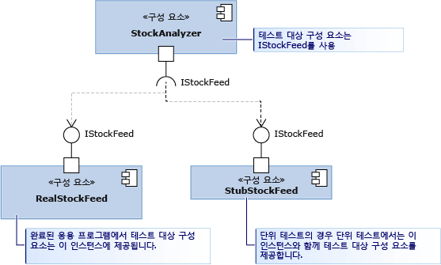

# <a name="use-stubs-to-isolate-parts-of-your-application-from-each-other-for-unit-testing"></a>스텁을 사용하여 단위 테스트를 위한 응용 프로그램의 여러 부분을 서로 격리

*스텁 유형*은 테스트하는 구성 요소를 이러한 구성 요소가 호출하는 다른 구성 요소에서 쉽게 격리할 수 있도록 Microsoft Fakes 프레임워크에서 제공하는 두 가지 기술 중 하나입니다. 스텁은 테스트 중 다른 구성 요소의 자리를 차지하는 작은 코드입니다. 스텁을 사용하는 이점은 일관적 결과를 반환하기 때문에 테스트를 더 쉽게 작성할 수 있다는 점입니다. 또한 아직 다른 구성 요소가 작동하지 않을 경우에도 테스트를 실행할 수 있습니다.

 Fakes의 개요 및 빠른 시작 가이드를 보려면 [Microsoft Fakes를 사용하여 테스트 대상 코드 격리](../test/isolating-code-under-test-with-microsoft-fakes.md)를 참조하세요.

 스텁을 사용하려면 클래스가 아닌 인터페이스만 사용하여 애플리케이션의 다른 부분을 참조하도록 구성 요소를 작성해야 합니다. 이 경우 한 부분을 변경하더라도 다른 부분을 변경해야 할 가능성이 적기 때문에 좋은 설계 습관입니다. 테스트를 위해 스텁을 실제 구성 요소로 대체할 수 있습니다.

 다이어그램에서 StockAnalyzer 구성 요소가 테스트하려는 대상입니다. 이 구성 요소는 일반적으로 다른 구성 요소인 RealStockFeed를 사용합니다. 하지만 RealStockFeed는 해당 메서드가 호출될 때마다 다른 결과를 반환하기 때문에 StockAnalyzer를 테스트하기가 어렵습니다.  테스트하는 동안 StubStockFeed라는 다른 클래스로 대체하겠습니다.

 

 스텁은 사용자가 이러한 방식으로 코드를 구성할 수 있어야 사용 가능하므로 일반적으로 응용 프로그램의 다른 부분에서 한 부분을 격리하는 데 사용합니다. System.dll과 같이 사용자가 제어하지 않는 다른 어셈블리에서 일부를 격리하려면 일반적으로 shim을 사용합니다. [shim을 사용하여 유닛 테스트를 위한 다른 어셈블리에서 응용 프로그램 격리](../test/using-shims-to-isolate-your-application-from-other-assemblies-for-unit-testing.md)를 참조하세요.

 **요구 사항**

-   Visual Studio Enterprise

## <a name="how-to-use-stubs"></a>스텁 사용 방법

###  <a name="Dependency"></a> 종속성 주입을 위한 디자인
 스텁을 사용하려면 다른 구성 요소가 서로 종속되지 않도록 하고 인터페이스 정의에만 종속되도록 응용 프로그램을 설계해야 합니다. 구성 요소는 컴파일 타임에 결합되지 않고, 런타임에 연결됩니다. 이러한 패턴에서는 변경 내용이 구성 요소 경계를 넘어 전파되지 않으므로 견고하고 업데이트가 간편한 소프트웨어를 만들 수 있습니다. 스텁을 사용하지 않는 경우에도 다음을 권장합니다. 새 코드를 작성하는 경우 [종속성 삽입](http://en.wikipedia.org/wiki/Dependency_injection) 패턴을 따르는 것이 쉽습니다. 기존 소프트웨어에 대한 테스트를 작성하는 경우 리팩터링해야 할 수 있습니다. 실무적으로 어려운 경우에는 대신 shim을 사용해 보세요.

 다이어그램의 흥미로운 예제로 이 토론을 시작하겠습니다. StockAnalyzer 클래스는 주식 가격을 읽고 몇 가지 흥미로운 결과를 생성합니다. 여기에는 우리가 테스트하려는 몇 가지 공용 메서드가 있습니다. 간단히 특정 주식의 현재 가격만 보고하는 간단한 메서드만 살펴보겠습니다. 이 메서드의 단위 테스트를 작성하려고 합니다. 다음은 테스트의 첫 번째 초안입니다.

```csharp
[TestMethod]
public void TestMethod1()
{
    // Arrange:
    var analyzer = new StockAnalyzer();
    // Act:
    var result = analyzer.GetContosoPrice();
    // Assert:
    Assert.AreEqual(123, result); // Why 123?
}
```

```vb
<TestMethod()> Public Sub TestMethod1()
    ' Arrange:
    Dim analyzer = New StockAnalyzer()
    ' Act:
    Dim result = analyzer.GetContosoPrice()
    ' Assert:
    Assert.AreEqual(123, result) ' Why 123?
End Sub
```

 이 테스트의 한 가지 문제는 바로 알 수 있습니다. 주식 가격이 달라지기 때문에 어설션은 일반적으로 실패합니다.

 또 다른 문제는 StockAnalyzer에서 사용하는 StockFeed 구성 요소가 아직 개발 중이라는 점입니다. 테스트 중인 메서드의 첫 번째 코드 초안은 다음과 같습니다.

```csharp
public int GetContosoPrice()
{
    var stockFeed = new StockFeed(); // NOT RECOMMENDED
    return stockFeed.GetSharePrice("COOO");
}
```

```vb
Public Function GetContosoPrice()
    Dim stockFeed = New StockFeed() ' NOT RECOMMENDED
    Return stockFeed.GetSharePrice("COOO")
End Function
```

 이 상태에서는 StockFeed 클래스에 대한 작업이 아직 완료되지 않았기 때문에 이 메서드가 컴파일되지 않거나 예외를 throw할 수 있습니다.

 인터페이스 삽입은 이러한 문제를 모두 해결합니다.

 인터페이스 삽입은 다음과 같은 규칙을 적용합니다.

-   응용 프로그램의 구성 요소 코드는 선언 또는 `new` 문에서 다른 구성 요소의 클래스를 명시적으로 참조하면 안 됩니다. 대신, 변수 및 매개 변수는 인터페이스를 사용하여 선언해야 합니다. 구성 요소 인스턴스는 구성 요소 컨테이너로만 만들 수 있습니다.

     이 경우 "구성 요소"란 함께 개발하고 업데이트하는 클래스 또는 클래스의 그룹을 의미합니다. 일반적으로 구성 요소는 Visual Studio 프로젝트의 코드입니다. 한 구성 요소 안에 있는 클래스는 동시에 업데이트되므로 결합을 해제하는 것은 그보다 중요하지 않습니다.

     또한 System.dll과 같이 비교적 안정적 플랫폼의 클래스에서 구성 요소를 분리하는 것도 그렇게 중요하지 않습니다. 이러한 모든 클래스의 인터페이스를 작성할 경우 코드가 복잡해집니다.

 따라서 StockAnalyzer 코드는 다음과 같은 인터페이스로 StockFeed에서 연결을 해제하여 개선할 수 있습니다.

```csharp
public interface IStockFeed
{
    int GetSharePrice(string company);
}

public class StockAnalyzer
{
    private IStockFeed stockFeed;
    public Analyzer(IStockFeed feed)
    {
        stockFeed = feed;
    }
    public int GetContosoPrice()
    {
        return stockFeed.GetSharePrice("COOO");
    }
}
```

```vb
Public Interface IStockFeed
    Function GetSharePrice(company As String) As Integer
End Interface

Public Class StockAnalyzer
    ' StockAnalyzer can be connected to any IStockFeed:
    Private stockFeed As IStockFeed
    Public Sub New(feed As IStockFeed)
        stockFeed = feed
    End Sub
    Public Function GetContosoPrice()
        Return stockFeed.GetSharePrice("COOO")
    End Function
End Class

```

 이 예제에서 StockAnalyzer는 생성될 때 IStockFeed의 구현으로 전달됩니다. 완성된 응용 프로그램에서 초기화 코드는 연결을 수행합니다.

```
analyzer = new StockAnalyzer(new StockFeed())
```

 이 연결을 수행하는 더 유연한 방법이 있습니다. 예를 들어, StockAnalyzer는 다른 조건에서 IStockFeed의 다른 구현을 인스턴스화할 수 있는 팩터리 개체를 수용할 수 있습니다.

###  <a name="GeneratingStubs"></a> 스텁 생성
 테스트하려는 클래스를 이 클래스가 사용하는 다른 구성 요소에서 분리했습니다. 분리하면 응용 프로그램을 더 견고하고 유연하게 만들 수 있을 뿐만 아니라, 테스트 중인 구성 요소를 테스트 목적용 인터페이스의 스텁 구현에 연결할 수 있습니다.

 스텁을 일반적인 방법으로 클래스로 간단하게 작성할 수 있습니다. 하지만 Microsoft Fakes는 모든 테스트에 가장 적절한 스텁을 만들 수 있는 더욱 동적인 방법을 제공합니다.

 스텁을 사용하려면 우선 인터페이스 정의에서 스텁 유형을 만들어야 합니다.

##### <a name="adding-a-fakes-assembly"></a>Fakes 어셈블리 추가

1.  솔루션 탐색기에서 단위 테스트 프로젝트의 **참조**를 확장합니다.

    -   Visual Basic에서 작업하는 경우 참조 목록을 보려면 솔루션 탐색기 도구 모음에서 **모든 파일 표시**를 선택해야 합니다.

2.  스텁을 만들 인터페이스 정의가 포함된 어셈블리를 선택합니다.

3.  바로 가기 메뉴에서 **Fakes 어셈블리 추가**를 선택합니다.

###  <a name="WriteTest"></a> 스텁을 사용하여 테스트 작성

```csharp
[TestClass]
class TestStockAnalyzer
{
    [TestMethod]
    public void TestContosoStockPrice()
    {
      // Arrange:

        // Create the fake stockFeed:
        IStockFeed stockFeed =
             new StockAnalysis.Fakes.StubIStockFeed() // Generated by Fakes.
                 {
                     // Define each method:
                     // Name is original name + parameter types:
                     GetSharePriceString = (company) => { return 1234; }
                 };

        // In the completed application, stockFeed would be a real one:
        var componentUnderTest = new StockAnalyzer(stockFeed);

      // Act:
        int actualValue = componentUnderTest.GetContosoPrice();

      // Assert:
        Assert.AreEqual(1234, actualValue);
    }
    ...
}
```

```vb
<TestClass()> _
Class TestStockAnalyzer

    <TestMethod()> _
    Public Sub TestContosoStockPrice()
        ' Arrange:
        ' Create the fake stockFeed:
        Dim stockFeed As New StockAnalysis.Fakes.StubIStockFeed
        With stockFeed
            .GetSharePriceString = Function(company)
                                       Return 1234
                                   End Function
        End With
        ' In the completed application, stockFeed would be a real one:
        Dim componentUnderTest As New StockAnalyzer(stockFeed)
        ' Act:
        Dim actualValue As Integer = componentUnderTest.GetContosoPrice
        ' Assert:
        Assert.AreEqual(1234, actualValue)
    End Sub
End Class

```

 여기에서 특별한 부분은 `StubIStockFeed` 클래스입니다. Microsoft Fakes는 참조된 어셈블리의 모든 공용 형식에 대해 스텁 클래스를 생성합니다. 스텁 클래스의 이름은 인터페이스의 이름에서 파생되며 "`Fakes.Stub`"가 접두사가 되고 매개 변수 형식 이름이 추가됩니다.

 스텁은 속성, 이벤트 및 제네릭 메서드의 getter와 setter에 대해서도 생성됩니다.

###  <a name="mocks"></a> 매개 변수 값 확인
 구성 요소가 다른 구성 요소를 호출할 때 올바른 값을 전달하는지 확인할 수 있습니다. 스텁에 어설션을 추가하거나 값을 저장한 다음 테스트 본문에서 확인할 수 있습니다. 예:

```csharp
[TestClass]
class TestMyComponent
{

    [TestMethod]
    public void TestVariableContosoPrice()
    {
     // Arrange:
        int priceToReturn;
        string companyCodeUsed;
        var componentUnderTest = new StockAnalyzer(new StubIStockFeed()
            {
               GetSharePriceString = (company) =>
                  {
                     // Store the parameter value:
                     companyCodeUsed = company;
                     // Return the value prescribed by this test:
                     return priceToReturn;
                  };
            };
        // Set the value that will be returned by the stub:
        priceToReturn = 345;

     // Act:
        int actualResult = componentUnderTest.GetContosoPrice();

     // Assert:
        // Verify the correct result in the usual way:
        Assert.AreEqual(priceToReturn, actualResult);

        // Verify that the component made the correct call:
        Assert.AreEqual("COOO", companyCodeUsed);
    }
...}

```

```vb
<TestClass()> _
Class TestMyComponent
    <TestMethod()> _
    Public Sub TestVariableContosoPrice()
        ' Arrange:
        Dim priceToReturn As Integer
        Dim companyCodeUsed As String = ""
        Dim stockFeed As New StockAnalysis.Fakes.StubIStockFeed()
        With stockFeed
            ' Implement the interface's method:
            .GetSharePriceString = _
                Function(company)
                    ' Store the parameter value:
                    companyCodeUsed = company
                    ' Return a fixed result:
                    Return priceToReturn
                End Function
        End With
        ' Create an object to test:
        Dim componentUnderTest As New StockAnalyzer(stockFeed)
        ' Set the value that will be returned by the stub:
        priceToReturn = 345

        ' Act:
        Dim actualResult As Integer = componentUnderTest.GetContosoPrice()

        ' Assert:
        ' Verify the correct result in the usual way:
        Assert.AreEqual(priceToReturn, actualResult)
        ' Verify that the component made the correct call:
        Assert.AreEqual("COOO", companyCodeUsed)
    End Sub
...
End Class
```

##  <a name="BKMK_Stub_basics"></a> 다양한 형식 멤버에 대한 스텁

###  <a name="BKMK_Methods"></a> 메서드
 예제에서 설명한 대로, 대리자를 스텁 클래스 인스턴스에 연결하여 메서드를 스텁할 수 있습니다. 스텁 형식의 이름은 메서드 및 매개 변수 이름에서 파생됩니다. 예를 들어, 다음 `IMyInterface` 인터페이스와 `MyMethod` 메서드가 있는 경우를 가정합니다.

```csharp
// application under test
interface IMyInterface
{
    int MyMethod(string value);
}
```

 항상 1을 반환하는 `MyMethod`에 스텁을 연결합니다.

```csharp
// unit test code
  var stub = new StubIMyInterface ();
  stub.MyMethodString = (value) => 1;

```

 함수에 스텁을 제공하지 않으면 Fakes에서 반환 형식의 기본값을 반환하는 함수를 생성합니다. 숫자의 경우 기본값은 0이며 클래스 형식의 경우 `null`(C#) 또는 `Nothing`(Visual Basic)입니다.

###  <a name="BKMK_Properties"></a> 속성
 getter 및 setter 속성은 별도 대리자로 노출되고 별도로 스텁할 수 있습니다. 예를 들어, `Value`의 `IMyInterface` 속성을 고려합니다.

```csharp
// code under test
interface IMyInterface
{
    int Value { get; set; }
}

```

 자동 속성을 시뮬레이트하기 위해 `Value`의 getter 및 setter에 대리자를 연결합니다.

```csharp
// unit test code
int i = 5;
var stub = new StubIMyInterface();
stub.ValueGet = () => i;
stub.ValueSet = (value) => i = value;

```

 속성의 setter 또는 getter에 스텁 메서드를 제공하지 않을 경우 스텁 속성이 간단한 변수처럼 작동하도록 Fakes에서 값을 저장하는 스텁을 생성합니다.

###  <a name="BKMK_Events"></a> 이벤트
 이벤트는 대리자 필드로 노출됩니다. 그 결과, 스텁된 이벤트는 이벤트 지원 필드만 호출하여 발생시킬 수 있습니다. 예를 들어, 스텁할 다음과 같은 인터페이스를 생각해 볼 수 있습니다.

```csharp
// code under test
interface IWithEvents
{
    event EventHandler Changed;
}
```

 `Changed` 이벤트를 발생시키려면 지원 대리자만 호출하면 됩니다.

```csharp
// unit test code
  var withEvents = new StubIWithEvents();
  // raising Changed
  withEvents.ChangedEvent(withEvents, EventArgs.Empty);

```

###  <a name="BKMK_Generic_methods"></a> 제네릭 메서드
 메서드의 원하는 각 인스턴스화에 대한 대리자를 제공하여 제네릭 메서드를 스텁할 수 있습니다. 예를 들어, 제네릭 메서드가 포함된 다음 인터페이스가 있는 경우를 가정합니다.

```csharp
// code under test
interface IGenericMethod
{
    T GetValue<T>();
}
```

 `GetValue<int>` 인스턴스화를 스텁하는 테스트를 작성할 수 있습니다.

```csharp
// unit test code
[TestMethod]
public void TestGetValue()
{
    var stub = new StubIGenericMethod();
    stub.GetValueOf1<int>(() => 5);

    IGenericMethod target = stub;
    Assert.AreEqual(5, target.GetValue<int>());
}
```

 코드가 기타 인스턴스화를 사용하여 `GetValue<T>`를 호출하는 경우 스텁이 동작만 호출합니다.

###  <a name="BKMK_Partial_stubs"></a> 가상 클래스의 스텁
 위 예제에서는 인터페이스에서 스텁이 생성되었습니다. 또한 가상 또는 추상 멤버가 있는 클래스에서 스텁을 생성할 수 있습니다. 예:

```csharp
// Base class in application under test
    public abstract class MyClass
    {
        public abstract void DoAbstract(string x);
        public virtual int DoVirtual(int n)
        { return n + 42; }
        public int DoConcrete()
        { return 1; }
    }
```

 이 클래스에서 생성한 스텁에서, DoAbstract() 및 DoVirtual()에 대한 대리자를 설정할 수 있지만 DoConcrete()에 대한 대리자는 설정할 수 없습니다.

```csharp
// unit test
  var stub = new Fakes.MyClass();
  stub.DoAbstractString = (x) => { Assert.IsTrue(x>0); };
  stub.DoVirtualInt32 = (n) => 10 ;

```

 가상 메서드에 대한 대리자를 제공하지 않는 경우 Fakes는 기본 동작을 제공하거나 기본 클래스의 메서드를 호출할 수 있습니다. 기본 메서드를 호출하려면 `CallBase` 속성을 설정합니다.

```csharp
// unit test code
var stub = new Fakes.MyClass();
stub.CallBase = false;
// No delegate set - default delegate:
Assert.AreEqual(0, stub.DoVirtual(1));

stub.CallBase = true;
//No delegate set - calls the base:
Assert.AreEqual(43,stub.DoVirtual(1));
```

##  <a name="BKMK_Debugging_stubs"></a> 스텁 디버그
 스텁 형식은 부드러운 디버깅 환경을 제공하도록 설계되었습니다. 기본적으로 디버거는 생성된 코드를 건너뛰도록 지정되어 있으므로 스텁에 연결된 사용자 지정 멤버 구현으로 직접 건너뜁니다.

##  <a name="BKMK_Stub_limitation"></a> 스텁 제한

1.  포인터가 포함된 메서드 시그니처는 지원되지 않습니다.

2.  스텁 형식은 가상 메서드 디스패치에 의존하므로 봉인 클래스 또는 정적 메서드는 스텁할 수 없습니다. 이러한 경우 [shim을 사용하여 유닛 테스트를 위한 다른 어셈블리에서 응용 프로그램 격리](../test/using-shims-to-isolate-your-application-from-other-assemblies-for-unit-testing.md)에서 설명한 대로 shim 형식을 사용합니다.

##  <a name="BKMK_Changing_the_default_behavior_of_stubs"></a> 스텁의 기본 동작 변경
 생성된 각 스텁 유형에는 `IStubBehavior` 인터페이스의 인스턴스가 포함됩니다(`IStub.InstanceBehavior` 속성을 통해). 이 동작은 클라이언트가 사용자 지정 대리자가 연결되지 않은 멤버를 호출할 때마다 호출됩니다. 동작이 설정되지 않은 경우 `StubsBehaviors.Current` 속성에서 반환한 인스턴스를 사용합니다. 기본적으로 이 속성은 `NotImplementedException` 예외를 throw하는 동작을 반환합니다.

 이 동작은 스텁 인스턴스의 `InstanceBehavior` 속성을 설정하여 언제든지 변경할 수 있습니다. 예를 들어, 다음 코드 조각은 아무 작업을 하지 않거나 반환 형식의 기본 값 `default(T)`를 반환하는 동작을 변경합니다.

```csharp
// unit test code
var stub = new StubIFileSystem();
// return default(T) or do nothing
stub.InstanceBehavior = StubsBehaviors.DefaultValue;
```

 이 동작은 또한 `StubsBehaviors.Current` 속성을 설정하여 동작을 설정하지 않은 모든 스텁 개체에 대해 전역적으로 변경할 수 있습니다.

```csharp
// unit test code
//change default behavior for all stub instances
//where the behavior has not been set
StubBehaviors.Current =
    BehavedBehaviors.DefaultValue;
```

## <a name="see-also"></a>참고 항목

- [Microsoft Fakes를 사용하여 테스트 중인 코드 격리](../test/isolating-code-under-test-with-microsoft-fakes.md)