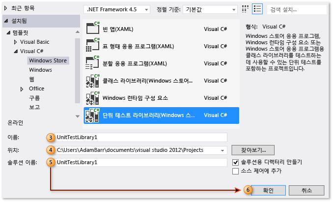
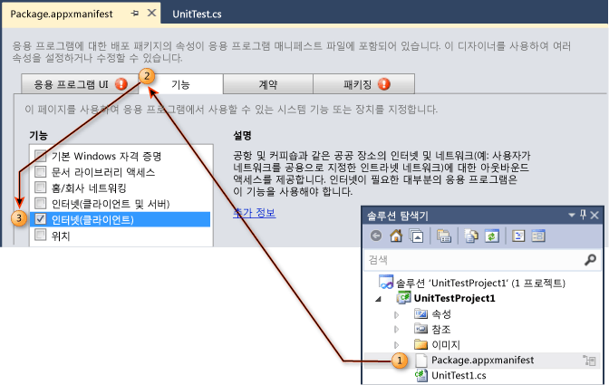
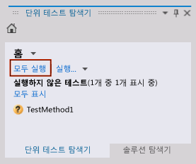
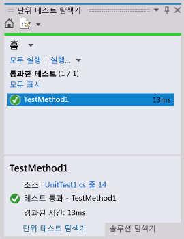

# 연습: UWP 앱에 대한 단위 테스트 만들기 및 실행
Visual Studio에는 관리되는 [!INCLUDE[win8_appname_long](../debugger/includes/win8_appname_long_md.md)] 응용 프로그램에 대한 단위 테스트 지원이 포함되어 있으며, Visual C#, Visual Basic 및 Visual C++에 대한 단위 테스트 라이브러리 템플릿이 포함되어 있습니다.  
  
> [!TIP]
>  [!INCLUDE[win8_appname_long](../debugger/includes/win8_appname_long_md.md)] 앱 개발에 대한 자세한 내용은 [UWP 앱 시작하기](http://go.microsoft.com/fwlink/?LinkID=241410)를 참조하세요.  
  
 Visual Studio는 다음과 같은 유닛 테스트 기능을 제공합니다.  
  
-   [단위 테스트 프로젝트 만들기](#CreateAndRunUnitTestWin8Tailored_Create)  
  
-   [단위 테스트 프로젝트에 대한 매니페스트 편집](#CreateAndRunUnitTestWin8Tailored_Manifest)  
  
-   [단위 테스트 코딩](#CreateAndRunUnitTestWin8Tailored_Code)  
  
-   [단위 테스트 실행](#CreateAndRunUnitTestWin8Tailored_Run)  
  
 다음 절차에서는 관리되는 Windows 8 [!INCLUDE[win8_appname_long](../debugger/includes/win8_appname_long_md.md)] 응용 프로그램에 대한 단위 테스트를 작성, 실행 및 디버깅하는 단계를 설명합니다.  
  
## 필수 구성 요소  
 Visual Studio  
  
##   단위 테스트 프로젝트 만들기  
  
#### UWP 앱에 대한 단위 테스트 프로젝트를 만들려면  
  
1.  **파일** 메뉴에서 **새 프로젝트**를 선택합니다.  
  
     새 프로젝트 대화 상자가 표시됩니다.  
  
2.  템플릿에서 단위 테스트를 만들 프로그래밍 언어를 선택하고 연결된 [!INCLUDE[win8_appname_long](../debugger/includes/win8_appname_long_md.md)] 단위 테스트 라이브러리를 선택합니다. 예를 들면 **Visual C#**를 선택하고 **Windows 유니버셜**을 선택한 다음 **단위 테스트 라이브러리(유니버셜 Windows)**를 선택합니다.  
  
    > [!NOTE]
    >  Visual Studio에는 Visual C#, Visual Basic 및 Visual C++에 대한 단위 테스트 라이브러리 템플릿이 포함되어 있습니다.  
  
3.  (선택 사항) **이름** 텍스트 상자에 [!INCLUDE[win8_appname_long](../debugger/includes/win8_appname_long_md.md)]단위 테스트 프로젝트에 사용할 이름을 입력합니다.  
  
4.  (선택 사항) **위치** 텍스트 상자에 입력하거나 **찾아보기** 단추를 선택하여 프로젝트를 만들 경로를 수정합니다.  
  
5.  (선택 사항) **솔루션** 이름 텍스트 상자에 솔루션에 사용할 이름을 입력합니다.  
  
6.  **솔루션용 디렉터리 만들기** 옵션을 선택한 상태에서 **확인** 단추를 선택합니다.  
  
       
  
     솔루션 탐색기는 새로운 [!INCLUDE[win8_appname_long](../debugger/includes/win8_appname_long_md.md)] 단위 테스트 프로젝트로 채워지며 코드 편집기에는 UnitTest1이라는 제목의 기본 단위 테스트가 표시됩니다.  
  
       
  
##   단위 테스트 프로젝트에 대한 매니페스트 편집  
 단위 테스트 프로젝트가 필요한 기능을 제공하여 응용 프로그램을 실행하려면 매니페스트를 편집해야 할 수 있습니다.  
  
#### 단위 테스트 프로젝트의 UWP 앱 매니페스트 파일을 편집하려면  
  
1.  솔루션 탐색기의 새 [!INCLUDE[win8_appname_long](../debugger/includes/win8_appname_long_md.md)] 단위 테스트 프로젝트에서 Package.appxmanifest 파일을 마우스 오른쪽 단추로 클릭하고 **열기**를 선택합니다.  
  
     편집하기 위해 매니페스트 디자이너를 표시합니다.  
  
2.  매니페스트 디자이너에서 **기능** 탭을 선택합니다.  
  
3.  **기능**의 목록에서 단위 테스트와 테스트하는 코드에 필요한 기능을 선택합니다. 예를 들어, 단위 테스트에 필요하고 테스트하려는 코드에 인터넷 액세스 기능이 있어야 하는 경우 **인터넷** 확인란을 선택합니다.  
  
    > [!NOTE]
    >  선택하는 기능에는 [!INCLUDE[win8_appname_long](../debugger/includes/win8_appname_long_md.md)] 단위 테스트가 제대로 작동하는 데 필요한 기능만 포함되어야 합니다. 기능은 테스트되는 [!INCLUDE[win8_appname_long](../debugger/includes/win8_appname_long_md.md)] 응용 프로그램의 일부가 아닌 기능을 포함할 필요가 전혀 없으며 일반적으로 테스트 중인 [!INCLUDE[win8_appname_long](../debugger/includes/win8_appname_long_md.md)] 응용 프로그램에 대해 지정된 기능의 하위 집합이어야 합니다.  
  
     매니페스트 디자이너에 대한 자세한 내용은 [매니페스트 디자이너를 사용하여 Windows 8.1 앱 패키지 구성](http://msdn.microsoft.com/Library/24c58b7f-9c6d-41c3-b385-c1e8497d5b2d)을 참조하세요.  
  
       
  
##   단위 테스트 코딩  
  
#### UWP 앱에 대한 단위 테스트를 코딩하려면  
  
1.  코드 편집기에서, 단위 테스트를 편집하고 테스트에 필요한 어설션과 논리를 추가합니다.  
  
     자세한 내용은 MSDN 라이브러리에서 [어설션 클래스 사용](http://go.microsoft.com/fwlink/?LinkID=224991) 을 참조하세요.  
  
##   단위 테스트 실행  
  
#### 솔루션을 빌드하고 테스트 탐색기를 사용하여 단위 테스트를 실행하려면  
  
1.  **테스트** 메뉴에서 **창**을 선택한 다음 **테스트 탐색기**를 선택합니다.  
  
     테스트 탐색기가 테스트 목록 없이 표시됩니다.  
  
2.  **빌드** 메뉴에서 **솔루션 빌드**를 선택합니다.  
  
     단위 테스트가 지금 나열됩니다.  
  
    > [!NOTE]
    >  테스트 탐색기에서 단위 테스트 목록을 업데이트하는 솔루션을 빌드해야 합니다.  
  
    > [!WARNING]
    >  Visual Studio의 알려진 문제: 테스트 프로젝트를 빌드하기 전에 테스트 탐색기를 열어야 합니다.  
  
3.  테스트 탐색기에서 만든 단위 테스트를 선택합니다.  
  
    > [!TIP]
    >  테스트 탐색기는 **소스:**옆의 소스 코드에 대한 링크를 제공합니다.  
  
4.  **모두 실행**을 선택합니다.  
  
       
  
    > [!TIP]
    >  탐색기에 나열된 하나 이상의 단위 테스트를 선택하고 마우스 오른쪽 단추를 클릭한 다음 **선택한 테스트 실행**을 선택합니다.  
    >   
    >  또한 **선택한 테스트 디버그**, **테스트 열기**를 선택하고 **속성** 옵션을 사용할 수 있습니다.  
    >   
    >    
  
     단위 테스트가 실행됩니다. 완료되면, 테스트 탐색기는 테스트 상태와 경과된 시간을 표시하고 소스에 대한 링크를 제공합니다.  
  
       
  
## 외부 리소스  
  
### 비디오  
 [채널 9: XAML을 사용하여 빌드한 UWP 앱 유닛 테스트](http://go.microsoft.com/fwlink/?LinkId=226285)  
  
### 포럼  
 [Visual Studio 유닛 테스트](http://go.microsoft.com/fwlink/?LinkId=224477)  
  
### MSDN 라이브러리  
 [MSDN Library - Creating and Running Unit Tests for Existing Code (Visual Studio 2010)](http://go.microsoft.com/fwlink/?LinkID=223683)(MSDN Library – 기존 코드에 대한 단위 테스트 만들기 및 실행(Visual Studio 2010))  
  
## 참고 항목  
 [Visual Studio로 UWP 앱 테스트](../test/testing-store-apps-with-visual-studio.md)   
 [Team Foundation Build를 사용하여 UWP 앱 빌드 및 테스트](http://msdn.microsoft.com/Library/d0ca17bb-deae-4f3d-a18d-1a99bebceaa9)
