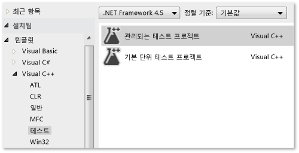
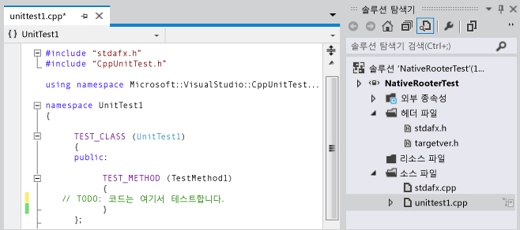
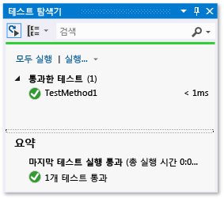
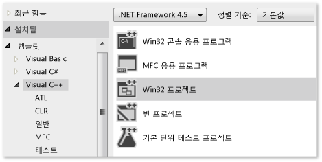
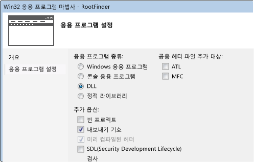
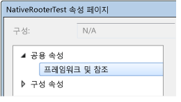
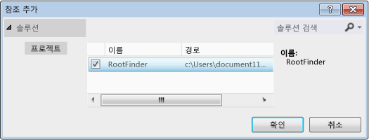
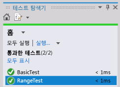

# <a name="how-to-write-unit-tests-for-c-dlls"></a>C/C++ DLL에 대한 단위 테스트 작성
이 연습에서는 테스트 우선 방법론을 사용하여 기본 C++ DLL을 개발하는 방법을 설명합니다. 기본 단계는 다음과 같습니다.  
  
1.  [기본 테스트 프로젝트 만들기](#create_test_project). 테스트 프로젝트는 DLL 프로젝트와 동일한 솔루션에 있습니다.  
  
2.  [DLL 프로젝트 만들기](#create_dll_project). 이 연습에서는 새 DLL을 만들지만 기존 DLL 테스트 절차와 비슷합니다.  
  
3.  [DLL 함수가 테스트에 표시되도록 설정](#make_functions_visible).  
  
4.  [반복적으로 테스트 보강](#iterate). 테스트를 위주로 코드를 개발하는 "빨간색-녹색-리팩터링" 주기를 사용하는 것이 좋습니다.  
  
5.  [실패한 테스트 디버그](#debug). 디버그 모드에서 테스트를 실행할 수 있습니다.  
  
6.  [테스트를 변경하지 않고 리팩터링](#refactor). 리팩터링 시에는 해당 외부 동작을 변경하지 않고 코드 구조를 향상시킬 수 있습니다. 이러한 작업은 코드의 성능, 확장성 및 가독성 향상을 위해 수행할 수 있습니다. 이 절차의 목적은 동작을 변경하기 위한 것이 아니기 때문에 리팩터링 변경만 코드에 적용하고 테스트는 변경하지 않습니다. 이 테스트를 사용하면 리팩터링 중에 버그가 발생하지 않도록 보장할 수 있습니다.
  
7.  [검사 확인](using-code-coverage-to-determine-how-much-code-is-being-tested.md). 단위 테스트는 코드에 더 많이 사용할수록 유용성이 커집니다. 코드 중 테스트에 사용된 부분을 확인할 수 있습니다.  
  
8.  [외부 리소스로부터 단위 격리](using-stubs-to-isolate-parts-of-your-application-from-each-other-for-unit-testing.md). 일반적으로 DLL은 다른 DLL, 데이터베이스 또는 원격 하위 시스템 등 개발 중인 시스템의 다른 구성 요소에 종속됩니다. 종속 항목과 격리된 상태에서 각 단위를 테스트하는 것이 좋습니다. 외부 구성 요소는 테스트 실행을 느리게 만들 수 있습니다. 개발 중에는 다른 구성 요소가 완전하지 않을 수 있습니다.  
  
##  <a name="create_test_project"></a> 기본 단위 테스트 프로젝트 만들기  
  
1.  **파일** 메뉴에서 **새로 만들기 | 프로젝트**를 차례로 선택합니다.  
  
     대화 상자에서 **설치됨 | 템플릿 | Visual C++ | 테스트**를 차례로 확장합니다.  
  
     **기본 단위 테스트 프로젝트** 템플릿을 선택하거나, 원하는 설치된 프레임워크를 선택합니다. Google Test나 Boost.Test 같은 다른 템플릿을 선택해도 기본 원칙은 같고 세부 정보가 일부 달라집니다.
  
     이 연습에서 테스트 프로젝트 이름은 `NativeRooterTest`입니다.  
  
       
  
2.  새 프로젝트에서 **unittest1.cpp**를 조사합니다.  
  
       
  
     다음 사항을 참고하세요.  
  
    -   각 테스트는 `TEST_METHOD(YourTestName){...}`를 사용하여 정의됩니다.  
  
         기존의 함수 시그니처는 작성할 필요가 없습니다. 시그니처는 TEST_METHOD 매크로에 의해 생성됩니다. 이 매크로는 void를 반환하는 인스턴스 함수를 생성합니다. 또한 테스트 메서드에 대한 정보를 반환하는 정적 함수를 생성합니다. 이 정보를 통해 테스트 탐색기에서 메서드를 찾을 수 있습니다.  
  
    -   테스트 메서드는 `TEST_CLASS(YourClassName){...}`를 사용해서 클래스로 그룹화됩니다.  
  
         테스트를 실행하면 각 테스트 클래스의 인스턴스가 생성됩니다. 테스트 메서드는 지정되지 않은 순서로 호출됩니다. 각 모듈, 클래스 또는 메서드의 전/후에 호출되는 특별한 메서드를 정의할 수 있습니다.  
  
3.  테스트 탐색기에서 테스트가 실행되는지 확인합니다.  
  
    1.  일부 테스트 코드를 삽입합니다.  
  
        ```cpp  
        TEST_METHOD(TestMethod1)  
        {  
            Assert::AreEqual(1,1);  
        }  
        ```  
  
         `Assert` 클래스는 테스트 메서드의 결과를 확인하는 데 사용할 수 있는 몇 가지 정적 메서드를 제공합니다.  
  
    2.  **테스트** 메뉴에서 **실행 | 모든 테스트**를 선택합니다.  
  
         테스트가 빌드되고 실행됩니다.  
  
         테스트 탐색기가 나타납니다.  
  
         **테스트에 통과함**아래에 테스트가 나타납니다.  
  
           
  
##  <a name="create_dll_project"></a> DLL 프로젝트 만들기  
  
1.  **Win32 프로젝트** 템플릿을 사용해서 **Visual C++** 프로젝트를 만듭니다.  
  
     이 연습에서 프로젝트 이름은 `RootFinder`입니다.  
  
       
  
2.  Win32 응용 프로그램 마법사에서 **DLL** 및 **내보내기 기호** 를 선택합니다.  
  
     **내보내기 기호** 옵션은 내보낸 메서드를 선언하는 데 사용할 수 있는 편리한 매크로를 생성합니다.  
  
       
  
3.  주 .h 파일에서 내보낸 함수를 선언합니다.  
  
       
  
     `__declspec(dllexport)` 선언자는 클래스의 공용 및 보호되는 멤버가 DLL 외부에 표시되도록 만듭니다. 자세한 내용은 [Using dllimport and dllexport in C++ Classes](/cpp/cpp/using-dllimport-and-dllexport-in-cpp-classes)을 참조하세요.  
  
4.  주 .cpp 파일에서 함수에 대한 최소한의 본문을 추가합니다.  
  
    ```cpp  
        // Find the square root of a number.  
        double CRootFinder::SquareRoot(double v)  
        {  
            return 0.0;  
        }  
    ```  
  
##  <a name="make_functions_visible"></a> DLL 프로젝트에 테스트 프로젝트 연결  
  
1.  DLL 프로젝트를 테스트 프로젝트의 프로젝트 참조에 추가합니다.  
  
    1.  테스트 프로젝트의 속성을 열고 **공용 속성**, **프레임워크 및 참조**를 선택합니다.  
  
           
  
    2.  **새 참조 추가**를 선택합니다.  
  
         **참조 추가** 대화 상자에서 DLL 프로젝트를 선택하고 **추가**를 선택합니다.  
  
           
  
2.  주 단위 테스트 .cpp 파일에서 DLL 코드의 .h 파일을 포함합니다.  
  
    ```cpp  
    #include "..\RootFinder\RootFinder.h"  
    ```  
  
3.  내보낸 함수를 사용하는 기본 테스트를 추가합니다.  
  
    ```cpp  
    TEST_METHOD(BasicTest)  
    {  
       CRootFinder rooter;  
       Assert::AreEqual(  
          // Expected value:  
          0.0,   
          // Actual value:  
          rooter.SquareRoot(0.0),   
          // Tolerance:  
          0.01,  
         // Message:  
         L"Basic test failed",  
         // Line number - used if there is no PDB file:  
         LINE_INFO());  
    }  
    ```  
  
4.  솔루션을 빌드합니다.  
  
     새 테스트가 테스트 탐색기에 나타납니다.  
  
5.  테스트 탐색기에서 **모두 실행**을 선택합니다.  
  
       
  
 테스트 및 코드 프로젝트를 설정하고 코드 프로젝트에서 함수를 실행하는 테스트를 실행할 수 있는지 확인했습니다. 이제 실제 테스트 및 코드 작성을 시작할 수 있습니다.  
  
##  <a name="iterate"></a> 반복적으로 테스트를 확장하고 통과하도록 만들기  
  
1.  새 테스트 추가:  
  
    ```cpp  
    TEST_METHOD(RangeTest)  
    {  
      CRootFinder rooter;  
      for (double v = 1e-6; v < 1e6; v = v * 3.2)  
      {  
        double actual = rooter.SquareRoot(v*v);  
        Assert::AreEqual(v, actual, v/1000);  
      }  
    }  
    ```  
  
    > [!TIP]
    >  통과된 테스트는 변경하지 않는 것이 좋습니다. 대신, 새 테스트를 추가하고, 테스트가 통과하도록 코드를 업데이트하고, 다시 다른 테스트를 추가하는 방식을 반복합니다.  
    >   
    >  사용자가 요구 사항을 변경할 경우, 더 이상 올바르지 않은 테스트는 비활성화합니다. 새 테스트를 작성하고, 동일한 증분 방식으로 한 번에 하나씩 작동합니다.  
  
2.  솔루션을 빌드한 다음 테스트 탐색기에서 **모두 실행**을 선택합니다.  
  
     새 테스트가 실패합니다.  
  
       
  
    > [!TIP]
    >  테스트 작성 후 즉시 각 테스트가 실패하는지 확인합니다. 이렇게 하면 결코 실패하지 않는 테스트를 작성하게 되는 간단한 실수를 방지하는 데 도움이 됩니다.  
  
3.  새 테스트가 통과하도록 DLL 코드를 개선합니다.  
  
    ```cpp  
    #include <math.h>  
    ...  
    double CRootFinder::SquareRoot(double v)  
    {  
      double result = v;  
      double diff = v;  
      while (diff > result/1000)  
      {  
        double oldResult = result;  
        result = result - (result*result - v)/(2*result);  
        diff = abs (oldResult - result);  
      }  
      return result;  
    }  
    ```  
  
4.  솔루션을 빌드한 다음 테스트 탐색기에서 **모두 실행**을 선택합니다.  
  
     두 테스트가 모두 통과합니다.  
  
       
  
    > [!TIP]
    >  한 번에 하나씩 테스트를 추가하여 코드를 개발합니다. 각 반복 후 모든 테스트가 통과하는지 확인합니다.  
  
##  <a name="debug"></a> 실패한 테스트 디버그  
  
1.  다른 테스트 추가:  
  
    ```cpp    
    #include <stdexcept>  
    ...  
    // Verify that negative inputs throw an exception.  
    TEST_METHOD(NegativeRangeTest)  
    {  
      wchar_t message[200];  
      CRootFinder rooter;  
      for (double v = -0.1; v > -3.0; v = v - 0.5)  
      {  
        try   
        {  
          // Should raise an exception:  
          double result = rooter.SquareRoot(v);  
  
          _swprintf(message, L"No exception for input %g", v);  
          Assert::Fail(message, LINE_INFO());  
        }  
        catch (std::out_of_range ex)  
        {  
          continue; // Correct exception.  
        }  
        catch (...)  
        {  
          _swprintf(message, L"Incorrect exception for %g", v);  
          Assert::Fail(message, LINE_INFO());  
        }  
      }  
    }  
    ```  
  
2.  솔루션을 빌드하고 **모두 실행**을 선택합니다.  
  
3.  실패한 테스트를 엽니다(또는 두 번 클릭).  
  
     실패한 어설션이 강조 표시됩니다. 오류 메시지는 테스트 탐색기의 세부 정보 창에 표시됩니다.  
  
       
  
4.  테스트가 실패한 이유를 확인하려면 함수를 단계별로 실행합니다.  
  
    1.  SquareRoot 함수의 시작 부분에 중단점을 설정합니다.  
  
    2.  실패한 테스트의 바로 가기 메뉴에서 **선택한 테스트 디버그**를 선택합니다.  
  
         중단점에서 실행이 중지되면 코드를 단계별로 실행합니다.  
  
5.  개발 중인 함수에 코드를 삽입합니다.  
  
    ```cpp  
  
    #include <stdexcept>  
    ...  
    double CRootFinder::SquareRoot(double v)  
    {  
        // Validate parameter:  
        if (v < 0.0)   
        {  
          throw std::out_of_range("Can't do square roots of negatives");  
        }  
  
    ```  
  
6.  이제 모든 테스트가 통과합니다.  
  
       
  
> [!TIP]
>  개별 테스트에 종속성이 없어 임의 순서로 실행할 수 있는 경우 도구 모음의  토글 단추를 사용하여 병렬 테스트 실행을 켭니다. 이렇게 하면 모든 테스트를 실행하는 데 걸리는 시간을 훨씬 줄일 수 있습니다.  
  
##  <a name="refactor"></a> 테스트를 변경하지 않고 코드 리팩터링  
  
1.  SquareRoot 함수에서 중앙 계산을 간소화합니다.  
  
    ```  
    // old code:  
    //   result = result - (result*result - v)/(2*result);  
    // new code:  
         result = (result + v/result)/2.0;  
  
    ```  
  
2.  솔루션을 빌드하고 **모두 실행**을 선택하여 오류가 발생하지 않았는지 확인합니다.  
  
    > [!TIP]
    >  단위 테스트 집합이 올바르면 코드 변경으로 인해 오류가 발생하지 않는다는 확신을 얻을 수 있습니다.  
    >   
    >  리팩터링은 다른 변경 사항과 구분해서 관리합니다.  
  
## <a name="next-steps"></a>다음 단계  
  
-   **격리.** 대부분의 DLL은 데이터베이스 및 기타 DLL과 같은 하위 시스템에 의존합니다. 이러한 다른 구성 요소는 종종 병렬로 개발됩니다. 다른 구성 요소를 아직 사용할 수 없을 때 단위 테스트를 수행할 수 있도록 하려면 대체 모의 항목이 필요합니다.  
  
-   **확인 테스트 빌드.** 설정된 간격으로 팀의 빌드 서버에서 테스트를 수행할 수 있습니다. 이렇게 하면 여러 팀 멤버의 작업을 통합할 때 버그가 유입되지 않도록 보장됩니다.  
  
-   **테스트 체크 인.** 각 팀 멤버가 코드를 소스 제어에 체크 인하기 전에 일부 테스트가 수행되도록 지정할 수 있습니다. 일반적으로 이러한 테스트는 빌드 확인 테스트의 전체 집합 중 일부입니다.  
  
     또한 최소한의 코드 검사 수준을 강제로 지정할 수도 있습니다.  
  
## <a name="see-also"></a>참고 항목  
 [기존 C++ 응용 프로그램에 단위 테스트 추가](../test/unit-testing-existing-cpp-applications-with-test-explorer.md)   
 [Microsoft.VisualStudio.TestTools.CppUnitTestFramework 사용](../test/using-microsoft-visualstudio-testtools-cppunittestframework.md)   
 [네이티브 코드 디버그](../debugger/debugging-native-code.md)   
 [연습: 동적 연결 라이브러리 만들기 및 사용(C++)](/cpp/build/walkthrough-creating-and-using-a-dynamic-link-library-cpp)   
 [가져오기 및 내보내기](/cpp/build/importing-and-exporting)
