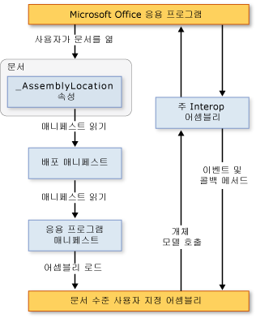

# 문서 수준 사용자 지정 아키텍처
  [!INCLUDE[vs_dev12](../vsto/includes/vs-dev12-md.md)] 에는 Microsoft Office Word 및 Microsoft Office Excel용 문서 수준 사용자 지정을 만드는 프로젝트가 포함되어 있습니다. 이 항목에서는 다음과 같은 문서 수준 사용자 지정의 측면에 대해 설명합니다.  
  
-   [사용자 지정 이해](#UnderstandingCustomizations)  
  
-   [사용자 지정 구성 요소](#Components)  
  
-   [사용자 지정이 Microsoft Office 응용 프로그램과 작동하는 방식](#HowCustomizationsWork)  
  
 [!INCLUDE[appliesto_alldoc](../vsto/includes/appliesto-alldoc-md.md)]  
  
 문서 수준 사용자 지정 만들기에 대 한 일반 정보를 참조 하십시오. [Office 솔루션 개발 개요 &#40;VSTO&#41;](../vsto/office-solutions-development-overview-vsto.md), [Word용문서수준사용자지정프로그래밍시작](../vsto/getting-started-programming-document-level-customizations-for-word.md), 및 [Excel 용 문서 수준 사용자 지정 프로그래밍 시작](../vsto/getting-started-programming-document-level-customizations-for-excel.md)합니다.  
  
##   사용자 지정 이해  
 Visual Studio에서 Office 개발자 도구를 사용하여 문서 수준 사용자 지정을 만들 때 특정 문서와 연결된 관리 코드 어셈블리를 만듭니다. 연결된 어셈블리가 있는 문서 또는 통합 문서를 관리 코드 확장이 있다고 말합니다. 자세한 내용은 참조 [디자인 Office 솔루션을 만들 및](../vsto/designing-and-creating-office-solutions.md)합니다.  
  
 사용자가 문서를 열면 Microsoft Office 응용 프로그램에서 해당 어셈블리가 로드됩니다. 어셈블리가 로드되고 나면 문서가 열려있는 동안 사용자 지정이 이벤트에 응답할 수 있습니다. 사용자 지정은 문서가 열려 있는 동안 응용 프로그램을 자동화하고 확장하기 위해 개체 모델을 호출할 수도 있으며 [!INCLUDE[dnprdnshort](../sharepoint/includes/dnprdnshort-md.md)]의 클래스 중 하나를 사용할 수 있습니다.  
  
 어셈블리는 응용 프로그램의 주 interop 어셈블리를 통해 응용 프로그램의 COM 구성 요소와 통신합니다. 자세한 내용은 참조 [Office 주 interop 어셈블리](../vsto/office-primary-interop-assemblies.md) 및 [Office 솔루션 개발 개요 &#40;VSTO&#41;](../vsto/office-solutions-development-overview-vsto.md)합니다.  
  
 사용자가 동시에 여러 개의 문서 수준 사용자 지정을 여는 경우 각 어셈블리는 서로 다른 응용 프로그램 도메인에 로드됩니다. 즉, 한 솔루션이 잘못 동작해도 다른 솔루션이 실패할 수 없습니다. 문서 수준 사용자 지정은 단일 응용 프로그램 도메인의 단일 문서에서 작동하도록 설계된 것으로 문서 간 통신을 위해 설계되지 않았습니다. 응용 프로그램 도메인에 대 한 자세한 내용은 참조 [응용 프로그램 도메인](/dotnet/framework/app-domains/application-domains)합니다.  
  
> [!NOTE]  
>  Visual Studio에서 Office 개발자 도구를 사용하여 만든 문서 수준 사용자 지정은 최종 사용자가 응용 프로그램을 시작할 때만 사용할 수 있도록 설계되었습니다. 응용 프로그램이 프로그래밍 방식으로 시작되는 경우(예: 자동화를 사용하여 시작) 사용자 지정은 예상대로 작동하지 않을 수도 있습니다.  
  
### 디자인 타임 및 런타임 환경  
 문서 수준 사용자 지정의 아키텍처를 이해하기 위해 솔루션을 디자인하고 실행하는 환경을 이해하는 것이 좋습니다.  
  
#### 디자인 타임  
 디자인 타임 환경에는 다음 단계가 포함됩니다.  
  
1.  개발자가 [!INCLUDE[vsprvs](../sharepoint/includes/vsprvs-md.md)]에서 문서 수준 프로젝트를 만듭니다. 프로젝트에는 문서 및 문서 뒤에서 실행되는 어셈블리가 포함됩니다. 문서는 이미 존재하고 있을 수도 있고(아마도 디자이너가 만들었음) 프로젝트와 함께 새 문서를 만들 수도 있습니다.  
  
2.  디자이너(프로젝트를 만드는 개발자 또는 다른 사람)가 최종 사용자를 위한 문서의 최종 모양과 느낌을 만듭니다.  
  
#### 런타임  
 런타임 환경은 다음 단계가 포함됩니다.  
  
1.  최종 사용자가 관리 코드 확장이 있는 문서 또는 통합 문서를 엽니다.  
  
2.  문서 또는 통합 문서가 컴파일된 어셈블리를 로드합니다.  
  
3.  사용자가 문서 또는 통합 문서에서 작업할 때 어셈블리가 이벤트에 응답합니다.  
  
#### 개발자와 최종 사용자의 관점 비교  
 개발자는 주로 [!INCLUDE[vsprvs](../sharepoint/includes/vsprvs-md.md)]에서 작업을 하고 최종 사용자는 Word 또는 Excel에서 작업을 하기 때문에 두 가지 방법으로 문서 수준 사용자 지정을 이해할 수 있습니다.  
  
|개발자 관점|최종 사용자 관점|  
|-----------------------------|----------------------------|  
|[!INCLUDE[vsprvs](../sharepoint/includes/vsprvs-md.md)]를 사용하여 개발자는 Word 및 Excel에 액세스할 수 있는 코드를 작성합니다.   비록 개발자가 Word나 Excel을 실행하는 실행 파일을 만드는 것처럼 보이기는 하지만 실제로 프로세스가 작동하는 방식은 그와 반대입니다. 문서는 어셈블리와 연결되어 있고 해당 어셈블리에 대한 포인터를 포함하고 있습니다. 문서가 열리면 Word나 Excel이 어셈블리를 찾고, 처리된 모든 이벤트에 대한 응답으로 코드를 실행합니다.|솔루션을 사용하는 사용자는 단지 다른 Microsoft Office 파일을 여는 것처럼 문서 또는 통합 문서를 열거나 아니면 템플릿에서 새 문서를 만듭니다.   어셈블리는 문서나 통합 문서에서 사용자 지정(예: 자동으로 현재 데이터를 채우거나 정보를 요청하는 대화 상자 보여 주기)을 제공합니다.|  
  
### 문서 수준 사용자 지정에 대 한 지원 되는 문서 형식  
 사용자 지정 프로젝트를 만들 때 프로젝트에서 사용할 문서 형식을 선택할 수 있습니다. 자세한 내용은 참조 [하는 방법: Visual Studio에서 Office 만들기 프로젝트](../vsto/how-to-create-office-projects-in-visual-studio.md)합니다.  
  
 다음 표에서는 Excel 및 Word의 문서 수준 사용자 지정에서 사용할 수 있는 문서 형식을 보여 줍니다.  
  
|Excel|단어|  
|-----------|----------|  
|Excel 통합 문서 (*.xlsx*)   Excel 매크로 사용 통합 문서 (*.xlsm*)   Excel 바이너리 통합 문서 (*.xlsb*)   Excel 97-2003 통합 문서 (*.xls*)   Excel 서식 파일 (*.xltx*)   Excel 매크로 사용 서식 파일 (*.xltm*)   Excel 97-2003 서식 파일 (*.xlt*)|Word 문서 (*.docx*)   Word 매크로 사용 문서 (*.docm*)   Word 97-2003 문서 (*.doc*)   Word 서식 파일 (*.dotx*)   Word 매크로 사용 서식 파일 (*.dotm*)   Word 97-2003 서식 파일 (*.dot*)|  
  
 지원되는 형식의 문서에 대해서만 관리 코드 확장을 디자인해야 합니다. 그렇지 않으면 응용 프로그램에서 문서가 열릴 때 특정 이벤트가 발생하지 않을 수 있습니다. 예를 들어는 <xref:Microsoft.Office.Tools.Excel.Workbook.Open> Excel XML 스프레드시트 형식이 나 웹 페이지에 저장 하는 통합 문서를 관리 코드 확장을 사용 하면 이벤트가 발생 하지 않습니다 (*.htm*; *.html*) 형식입니다.  
  
### .Xml 파일 이름 확장명을 가진 Word 문서에 대 한 지원  
 문서 수준 프로젝트 템플릿에서는 다음과 같은 파일 형식을 기반으로 프로젝트를 만드는 것을 허용하지 않습니다.  
  
-   Word XML 문서 (*\*xml*).  
  
-   Word 2003 XML 문서 (*\*xml*).  
  
 최종 사용자가 이러한 파일 형식으로 사용자 지정을 사용하도록 하려면 위의 표에 지정된 지원되는 파일 형식 중 하나를 사용하는 사용자 지정을 빌드하고 배포합니다. 사용자 지정을 설치한 후 최종 사용자가 문서를 저장할 수는 Word XML 문서에서 (*\*xml*) 형식 또는 Word 2003 XML 문서 (*\*xml*) 형식으로 및 사용자 지정은 계속 예상 대로 작동 합니다.  
  
##   사용자 지정 구성 요소  
 사용자 지정의 주요 구성 요소는 문서와 어셈블리입니다. 이러한 구성 요소 외에 Microsoft Office 응용 프로그램이 사용자 지정을 검색하고 로드하는 방식에서 중요한 역할을 하는 몇 가지 다른 부분이 있습니다.  
  
### 배포 매니페스트 및 응용 프로그램 매니페스트  
 사용자 지정은 배포 매니페스트와 응용 프로그램 매니페스트를 사용하여 최신 버전의 사용자 지정 어셈블리를 식별하고 로드합니다. 배포 매니페스트는 현재 응용 프로그램 매니페스트를 가리킵니다. 응용 프로그램 매니페스트는 사용자 지정 어셈블리를 가리키고 어셈블리에서 실행할 진입점 클래스를 지정합니다. 자세한 내용은 참조 [Office 솔루션에서 응용 프로그램 및 배포 매니페스트](../vsto/application-and-deployment-manifests-in-office-solutions.md)합니다.  
  
### Visual Studio Tools for Office Runtime  
 Visual Studio에서 Office 개발자 도구를 사용하여 만든 문서 수준 사용자 지정을 실행하려면 최종 사용자 컴퓨터에 [!INCLUDE[vsto_runtime](../vsto/includes/vsto-runtime-md.md)] 이 설치되어 있어야 합니다. [!INCLUDE[vsto_runtime](../vsto/includes/vsto-runtime-md.md)] 은 사용자 지정 어셈블리를 로드하는 관리되지 않는 구성 요소뿐만 아니라 관리되는 어셈블리 집합도 포함합니다. 관리되는 어셈블리는 사용자 지정 코드에서 호스트 응용 프로그램을 자동화하고 확장하는 데 사용하는 개체 모델을 제공합니다.  
  
 자세한 내용은 참조 [Visual Studio tools for Office runtime 개요](../vsto/visual-studio-tools-for-office-runtime-overview.md)합니다.  
  
##   사용자 지정 Microsoft Office 응용 프로그램과 작동 하는 방법  
 사용자가 Microsoft Office 사용자 지정의 일부인 문서를 열 때 응용 프로그램은 문서와 연결된 배포 매니페스트를 사용하여 최신 버전의 사용자 지정 어셈블리를 찾아 로드합니다. 배포 매니페스트의 위치 라는 사용자 지정 문서 속성에 저장 됩니다 **AssemblyLocation**합니다. 솔루션을 빌드할 때 이 위치를 식별하는 문자열이 속성에 삽입됩니다.  
  
 배포 매니페스트는 응용 프로그램 매니페스트를 가리키며 그때 가장 최신 어셈블리를 가리킵니다. 자세한 내용은 참조 [Office 솔루션에서 응용 프로그램 및 배포 매니페스트](../vsto/application-and-deployment-manifests-in-office-solutions.md)합니다.  
  
 다음 그림에서는 문서 수준 사용자 지정의 기본 아키텍처를 보여 줍니다.  
  
   
  
> [!NOTE]  
>  [!INCLUDE[net_v40_short](../sharepoint/includes/net-v40-short-md.md)]를 대상으로 하는 Office 솔루션에서 솔루션은 PIA(주 interop 어셈블리)를 직접 호출하는 대신 솔루션 어셈블리에 포함된 PIA 형식 정보를 사용하여 호스트 응용 프로그램의 개체 모델을 호출합니다. 자세한 내용은 참조 [디자인 Office 솔루션을 만들 및](../vsto/designing-and-creating-office-solutions.md)합니다.  
  
### 로드 프로세스  
 다음 단계는 사용자가 Microsoft Office 솔루션의 일부인 문서를 열 때 발생합니다.  
  
1.  Microsoft Office 응용 프로그램은 사용자 지정 문서 속성에서 문서와 연결된 관리 코드 확장이 있는지 여부를 확인합니다. 자세한 내용은 참조 [사용자 지정 문서 속성 개요](../vsto/custom-document-properties-overview.md)합니다.  
  
2.  관리 코드 확장이 있으면 응용 프로그램이 로드 *VSTOEE.dll*, 어떤 로드 *VSTOLoader.dll*합니다. 이러한 관리 되지 않는 Visual Studio 2010 Tools for Office 런타임의 로더 구성 요소는 Dll입니다. 자세한 내용은 참조 [Visual Studio Tools for Office runtime 개요](../vsto/visual-studio-tools-for-office-runtime-overview.md)합니다.  
  
3.  *VSTOLoader.dll* 로드는 [!INCLUDE[dnprdnshort](../sharepoint/includes/dnprdnshort-md.md)] 의 관리 되는 부분을 시작 하 고는 [!INCLUDE[vsto_runtime](../vsto/includes/vsto-runtime-md.md)]합니다.  
  
4.  문서가 로컬 컴퓨터와 다른 위치에서 열리면 [!INCLUDE[vsto_runtime](../vsto/includes/vsto-runtime-md.md)] 이 문서의 위치가 특정 Office 응용 프로그램에 대한 **보안 센터 설정** 의 **신뢰할 수 있는 위치** 목록에 있는지 확인합니다. 문서가 신뢰할 수 있는 위치에 없는 경우 사용자 지정을 신뢰할 수 없기 때문에 로드 프로세스가 여기서 중지됩니다.  
  
5.  [!INCLUDE[vsto_runtime](../vsto/includes/vsto-runtime-md.md)] 은 솔루션이 아직 설치되지 않은 경우 솔루션을 설치하고 최신 응용 프로그램 및 배포 매니페스트를 다운로드하여 일련의 보안 검사를 수행합니다. 자세한 내용은 참조 [Secure Office 솔루션](../vsto/securing-office-solutions.md)합니다.  
  
6.  사용자 지정을 실행하도록 신뢰할 수 있는 경우 [!INCLUDE[vsto_runtime](../vsto/includes/vsto-runtime-md.md)] 은 배포 매니페스트와 응용 프로그램 매니페스트를 사용하여 어셈블리 업데이트를 확인합니다. 새 버전의 어셈블리를 사용할 수 있는 경우 런타임은 새 버전의 어셈블리를 클라이언트 컴퓨터의 [!INCLUDE[ndptecclick](../vsto/includes/ndptecclick-md.md)] 캐시에 다운로드합니다. 자세한 내용은 참조 [Office 솔루션 배포](../vsto/deploying-an-office-solution.md)합니다.  
  
7.  [!INCLUDE[vsto_runtime](../vsto/includes/vsto-runtime-md.md)] 은 사용자 지정 어셈블리를 로드할 새로운 응용 프로그램 도메인을 만듭니다.  
  
8.  [!INCLUDE[vsto_runtime](../vsto/includes/vsto-runtime-md.md)] 은 사용자 지정 어셈블리를 응용 프로그램 도메인에 로드합니다.  
  
9. [!INCLUDE[vsto_runtime](../vsto/includes/vsto-runtime-md.md)] 호출은 **시작** 사용자 지정 어셈블리의 이벤트 처리기입니다. 자세한 내용은 참조 [Office 프로젝트의 이벤트](../vsto/events-in-office-projects.md)  
  
## 참고자료  
 [Visual Studio에서 Office 솔루션의 아키텍처](../vsto/architecture-of-office-solutions-in-visual-studio.md)   
 [VSTO 추가 기능 아키텍처](../vsto/architecture-of-vsto-add-ins.md)   
 [Visual Studio Tools for Office 런타임 개요](../vsto/visual-studio-tools-for-office-runtime-overview.md)   
 [Office 솔루션 보안](../vsto/securing-office-solutions.md)   
 [디자인 하 고 Office 솔루션을 만들려면](../vsto/designing-and-creating-office-solutions.md)   
 [사용자 지정 문서 속성 개요](../vsto/custom-document-properties-overview.md)   
 [문서 수준 사용자 지정의 캐시 된 데이터](../vsto/cached-data-in-document-level-customizations.md)  
  
  