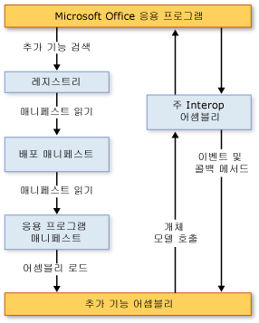

# VSTO 추가 기능의 아키텍처
  Visual Studio에서 Office 개발자 도구를 사용하여 만든 VSTO 추가 기능에는 안정성과 보안을 강조하고 Microsoft Office와 긴밀하게 작업할 수 있도록 하는 아키텍처 기능이 있습니다. 이 항목에서는 다음과 같은 VSTO 추가 기능의 측면에 대해 설명합니다.  
  
-   [VSTO 추가 기능 이해](#UnderstandingAddIns)  
  
-   [VSTO 추가 기능의 구성 요소](#AddinComponents)  
  
-   [VSTO 추가 기능이 Microsoft Office 응용 프로그램과 작동하는 방식](#HowAddinsWork)  
  
 [!INCLUDE[appliesto_allapp](../vsto/includes/appliesto-allapp-md.md)]  
  
 VSTO 추가 기능 만들기에 대 한 일반 정보를 참조 하십시오. [Office 솔루션 개발 개요 &#40; VSTO &#41; ](../vsto/office-solutions-development-overview-vsto.md) 및 [시작 VSTO 추가 기능 프로그래밍](../vsto/getting-started-programming-vsto-add-ins.md)합니다.  
  
##   VSTO 추가 기능 이해  
 Visual Studio에서 Office 개발자 도구를 사용하여 VSTO 추가 기능을 만들 때 Microsoft Office 응용 프로그램에 의해 로드되는 관리 코드 어셈블리를 만듭니다. 어셈블리가 로드된 후 VSTO 추가 기능은 응용 프로그램에서 발생하는 이벤트(예: 사용자가 메뉴 항목을 클릭할 때)에 응답할 수 있습니다. VSTO 추가 기능은 응용 프로그램을 자동화하고 확장하기 위해 개체 모델을 호출할 수도 있으며 [!INCLUDE[dnprdnshort](../sharepoint/includes/dnprdnshort-md.md)]의 클래스 중 하나를 사용할 수 있습니다.  
  
 어셈블리는 응용 프로그램의 주 interop 어셈블리를 통해 응용 프로그램의 COM 구성 요소와 통신합니다. 자세한 내용은 참조 [Office 주 Interop 어셈블리](../vsto/office-primary-interop-assemblies.md) 및 [Office 솔루션 개발 개요 &#40; VSTO &#41; ](../vsto/office-solutions-development-overview-vsto.md).  
  
 여러 VSTO 추가 기능이 한 응용 프로그램에 대해 설치된 경우 각 VSTO 추가 기능은 서로 다른 응용 프로그램 도메인에서 로드됩니다. 즉, 한 VSTO 추가 기능이 잘못 동작해도 다른 VSTO 추가 기능이 실패할 수 없습니다. 이는 응용 프로그램이 닫힐 때 모든 VSTO 추가 기능 어셈블리가 메모리에서 언로드되도록 하는 데도 도움이 됩니다. 응용 프로그램 도메인에 대 한 자세한 내용은 참조 [응용 프로그램 도메인](/dotnet/framework/app-domains/application-domains)합니다.  
  
> [!NOTE]  
>  Visual Studio에서 Office 개발자 도구를 사용하여 만든 VSTO 추가 기능은 최종 사용자가 호스트 Microsoft Office 응용 프로그램을 시작할 때만 사용할 수 있도록 설계되었습니다. 응용 프로그램이 프로그래밍 방식으로 시작되는 경우(예를 들어 자동화를 사용하여 시작) VSTO 추가 기능은 예상대로 작동하지 않을 수도 있습니다.  
  
##   VSTO 추가 기능의 구성 요소  
 VSTO 추가 기능 어셈블리가 주 구성 요소이지만, Microsoft Office 응용 프로그램이 VSTO 추가 기능을 검색하고 로드하는 방식에서 중요한 역할을 수행하는 몇 가지 다른 구성 요소가 있습니다.  
  
### 레지스트리 항목  
 Microsoft Office 응용 프로그램은 레지스트리 항목 집합을 검색하여 VSTO 추가 기능을 검색합니다. VSTO 추가 기능에서 사용 하는 레지스트리 항목의 전체 목록은 참조 하십시오. [VSTO 추가 기능에 대 한 레지스트리 항목](../vsto/registry-entries-for-vsto-add-ins.md)합니다.  
  
 솔루션을 빌드할 때 Visual Studio에서는 필요한 모든 레지스트리 항목을 개발 컴퓨터에 만들기 때문에 VSTO 추가 기능을 디버그하고 실행할 수 있습니다. 자세한 내용은 참조 [Office 솔루션 빌드](../vsto/building-office-solutions.md)합니다.  
  
 ClickOnce를 사용하여 솔루션을 배포하는 경우 게시 프로세스에 의해 생성된 설치 프로그램은 자동으로 최종 사용자 컴퓨터에 레지스트리 키를 만듭니다. 자세한 내용은 참조 [ClickOnce를 사용 하 여 Office 솔루션 배포](../vsto/deploying-an-office-solution-by-using-clickonce.md)합니다.  
  
### 배포 매니페스트 및 응용 프로그램 매니페스트  
 VSTO 추가 기능은 배포 매니페스트와 응용 프로그램 매니페스트를 사용하여 최신 버전의 VSTO 추가 기능 어셈블리를 식별하고 로드합니다. 배포 매니페스트는 현재 응용 프로그램 매니페스트를 가리킵니다. 응용 프로그램 매니페스트는 VSTO 추가 기능 어셈블리를 가리키고 어셈블리에서 실행할 진입점 클래스를 지정합니다. 자세한 내용은 [Application and Deployment Manifests in Office Solutions](../vsto/application-and-deployment-manifests-in-office-solutions.md)을 참조하십시오.  
  
### Visual Studio Tools for Office Runtime  
 Visual Studio에서 Office 개발자 도구를 사용하여 만든 VSTO 추가 기능을 실행하려면 최종 사용자 컴퓨터에 [!INCLUDE[vsto_runtime](../vsto/includes/vsto-runtime-md.md)] 이 설치되어 있어야 합니다. 런타임에는 관리되지 않는 구성 요소와 관리되는 어셈블리 집합이 포함되어 있습니다. 관리되지 않는 구성 요소는 VSTO 추가 기능 어셈블리를 로드합니다. 관리되는 어셈블리는 VSTO 추가 기능 코드에서 호스트 응용 프로그램을 자동화하고 확장하는 데 사용하는 개체 모델을 제공합니다.  
  
 자세한 내용은 [Visual Studio Tools for Office Runtime Overview](../vsto/visual-studio-tools-for-office-runtime-overview.md)을 참조하십시오.  
  
##   How VSTO Add-ins Work with Microsoft Office Applications  
 사용자가 Microsoft Office 응용 프로그램을 시작할 때 응용 프로그램은 배포 매니페스트와 응용 프로그램 매니페스트를 사용하여 최신 버전의 VSTO 추가 기능 어셈블리를 찾고 로드합니다. 다음 그림에서는 이러한 VSTO 추가 기능의 기본 아키텍처를 보여 줍니다.  
  
   
  
> [!NOTE]  
>  [!INCLUDE[net_v40_short](../sharepoint/includes/net-v40-short-md.md)] 또는 [!INCLUDE[net_v45](../vsto/includes/net-v45-md.md)]를 대상으로 하는 Office 솔루션에서 솔루션은 PIA를 직접 호출하는 대신 솔루션 어셈블리에 포함된 PIA 형식 정보를 사용하여 호스트 응용 프로그램의 개체 모델을 호출합니다. 자세한 내용은 [Designing and Creating Office Solutions](../vsto/designing-and-creating-office-solutions.md)을 참조하세요.  
  
### 로드 프로세스  
 다음 단계는 사용자가 응용 프로그램을 시작할 때 발생합니다.  
  
1.  응용 프로그램은 Visual Studio에서 Office 개발자 도구를 사용하여 만든 VSTO 추가 기능을 식별하는 항목에 대한 레지스트리를 확인합니다.  
  
2.  응용 프로그램은 이러한 레지스트리 항목을 찾는 경우 VSTOEE.dll을 로드하고, 이 DLL은 VSTOLoader.dll을 로드합니다. 이러한 DLL은 Visual Studio 2010 Tools for Office Runtime의 로더 구성 요소인 관리되지 않는 DLL입니다. 자세한 내용은 [Visual Studio Tools for Office Runtime Overview](../vsto/visual-studio-tools-for-office-runtime-overview.md)을 참조하십시오.  
  
3.  VSTOLoader.dll은 [!INCLUDE[dnprdnshort](../sharepoint/includes/dnprdnshort-md.md)] 를 로드하고 [!INCLUDE[vsto_runtime](../vsto/includes/vsto-runtime-md.md)]의 관리되는 부분을 시작합니다.  
  
4.  [!INCLUDE[vsto_runtime](../vsto/includes/vsto-runtime-md.md)] 은 매니페스트 업데이트를 확인하고 최신 응용 프로그램 및 배포 매니페스트를 다운로드합니다.  
  
5.  [!INCLUDE[vsto_runtime](../vsto/includes/vsto-runtime-md.md)] 은 일련의 보안 검사를 수행합니다. 자세한 내용은 [Securing Office Solutions](../vsto/securing-office-solutions.md)을 참조하세요.  
  
6.  VSTO 추가 기능을 실행하도록 신뢰할 수 있는 경우 [!INCLUDE[vsto_runtime](../vsto/includes/vsto-runtime-md.md)] 은 배포 매니페스트와 응용 프로그램 매니페스트를 사용하여 어셈블리 업데이트를 확인합니다. 새 버전의 어셈블리를 사용할 수 있는 경우 런타임은 새 버전의 어셈블리를 클라이언트 컴퓨터의 [!INCLUDE[ndptecclick](../vsto/includes/ndptecclick-md.md)] 캐시에 다운로드합니다. 자세한 내용은 참조 [Office 솔루션 배포](../vsto/deploying-an-office-solution.md)합니다.  
  
7.  [!INCLUDE[vsto_runtime](../vsto/includes/vsto-runtime-md.md)] 은 VSTO 추가 기능 어셈블리를 로드할 새로운 응용 프로그램 도메인을 만듭니다.  
  
8.  [!INCLUDE[vsto_runtime](../vsto/includes/vsto-runtime-md.md)] 은 VSTO 추가 기능 어셈블리를 응용 프로그램 도메인에 로드합니다.  
  
9. [!INCLUDE[vsto_runtime](../vsto/includes/vsto-runtime-md.md)] 은 VSTO 추가 기능에서 <xref:Microsoft.Office.Tools.AddInBase.RequestComAddInAutomationService%2A> 메서드를 호출합니다(메서드를 재정의한 경우).  
  
     필요에 따라 이 메서드를 재정의하여 VSTO 추가 기능의 개체를 다른 Microsoft Office 솔루션에 노출할 수 있습니다. 자세한 내용은 [Calling Code in VSTO Add-ins from Other Office Solutions](../vsto/calling-code-in-vsto-add-ins-from-other-office-solutions.md)을 참조하세요.  
  
10. [!INCLUDE[vsto_runtime](../vsto/includes/vsto-runtime-md.md)] 은 VSTO 추가 기능에서 <xref:Microsoft.Office.Tools.AddInBase.RequestService%2A> 메서드를 호출합니다(메서드를 재정의한 경우).  
  
     필요에 따라 이 메서드를 재정의하여 확장성 인터페이스를 구현하는 개체의 반환을 통해 Microsoft Office 기능을 확장할 수 있습니다. 자세한 내용은 [Customizing UI Features By Using Extensibility Interfaces](../vsto/customizing-ui-features-by-using-extensibility-interfaces.md)을 참조하십시오.  
  
    > [!NOTE]  
    >  [!INCLUDE[vsto_runtime](../vsto/includes/vsto-runtime-md.md)] 은 호스트 응용 프로그램에서 지원하는 각 확장성 인터페이스에 대해 <xref:Microsoft.Office.Tools.AddInBase.RequestService%2A> 메서드를 별도로 호출합니다. 첫 번째 <xref:Microsoft.Office.Tools.AddInBase.RequestService%2A> 메서드 호출은 대개 `ThisAddIn_Startup` 메서드 호출 전에 발생하지만 VSTO 추가 기능은 <xref:Microsoft.Office.Tools.AddInBase.RequestService%2A> 메서드가 호출될 시기나 횟수에 대해 어떠한 가정도 해서는 안 됩니다.  
  
11. [!INCLUDE[vsto_runtime](../vsto/includes/vsto-runtime-md.md)] 은 VSTO 추가 기능에서 `ThisAddIn_Startup` 메서드를 호출합니다. 이 메서드는 <xref:Microsoft.Office.Tools.AddInBase.Startup> 이벤트의 기본 이벤트 처리기입니다. 자세한 내용은 [Events in Office Projects](../vsto/events-in-office-projects.md)을 참조하세요.  
  
## 참고 항목  
 [Visual Studio에서 Office 솔루션의 아키텍처](../vsto/architecture-of-office-solutions-in-visual-studio.md)   
 [문서 수준 사용자 지정 아키텍처](../vsto/architecture-of-document-level-customizations.md)   
 [Visual Studio Tools for Office Runtime Overview](../vsto/visual-studio-tools-for-office-runtime-overview.md)   
 [Programming VSTO Add-Ins](../vsto/programming-vsto-add-ins.md)   
 [Office 솔루션 개발](../vsto/developing-office-solutions.md)   
 [Office 솔루션 보안](../vsto/securing-office-solutions.md)   
 [Office 솔루션 배포](../vsto/deploying-an-office-solution.md)  
  
  