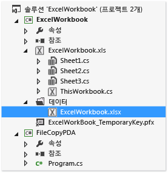
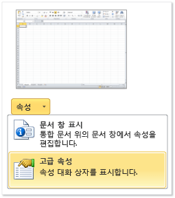
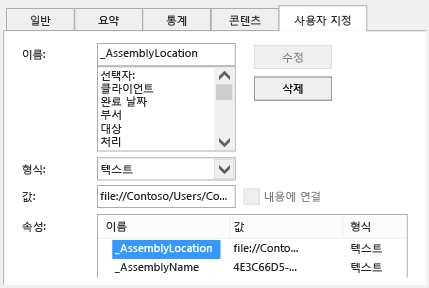

# ClickOnce를 사용하여 Office 솔루션 배포
  ClickOnce를 사용하면 Office 솔루션을 더 적은 단계로 배포할 수 있습니다.  업데이트를 게시하는 경우 솔루션에서 자동으로 이를 감지하여 설치합니다.  그러나 ClickOnce에서는 컴퓨터의 각 사용자에 대해 별도로 솔루션을 설치하도록 합니다.  따라서 둘 이상의 사용자가 같은 컴퓨터에서 솔루션을 실행하는 경우 Windows Installer\(.msi\)를 사용하는 것이 좋습니다.  
  
## 항목 내용  
  
-   [솔루션 게시](#Publish)  
  
-   [솔루션에 신뢰를 부여하는 방법 결정](#Trust)  
  
-   [사용자의 솔루션 설치 지원](#Helping)  
  
-   [최종 사용자의 컴퓨터에 솔루션 문서 저장(문서 수준 사용자 지정에만 해당)](#Put)  
  
-   [SharePoint 실행 서버에 솔루션 문서 저장(문서 수준 사용자 지정에만 해당)](#SharePoint)  
  
-   [사용자 지정 설치 관리자 만들기](#Custom)  
  
-   [업데이트 게시](#Update)  
  
-   [솔루션의 설치 위치 변경](#Location)  
  
-   [이전 버전으로 솔루션 롤백](#Roll)  
  
 Windows Installer 파일을 만들어 Office 솔루션을 배포하는 방법에 대한 자세한 내용은 [Windows Installer를 사용하여 Office 솔루션 배포](../vsto/deploying-an-office-solution-by-using-windows-installer.md)를 참조하세요.  
  
##  <a name="Publish"></a> 솔루션 게시  
 **게시 마법사** 또는 **프로젝트 디자이너**를 사용하여 솔루션을 게시할 수 있습니다.  이 절차에서는 게시 옵션의 전체 집합을 제공하도록 **프로젝트 디자이너**를 사용합니다.  [게시 마법사&#40;Visual Studio에서는 Office 개발&#41;](../vsto/publish-wizard-office-development-in-visual-studio.md)를 참조하세요.  
  
#### 솔루션을 게시하려면  
  
1.  **솔루션 탐색기**에서 프로젝트의 이름에 해당하는 노드를 선택합니다.  
  
2.  메뉴 모음에서 **프로젝트**, *ProjectName* **속성**을 선택합니다.  
  
3.  **프로젝트 디자이너**에서 다음 그림과 같이 **게시** 탭을 선택합니다.  
  
       
  
4.  **폴더 위치 게시\(ftp 서버 또는 파일 경로\)** 상자에 **프로젝트 디자이너**에서 솔루션 파일을 복사할 폴더의 경로를 입력합니다.  
  
     다음과 같은 형식의 경로를 입력할 수 있습니다.  
  
    -   로컬 경로\(예: *C:\\FolderName\\FolderName*\)  
  
    -   네트워크 폴더에 대한 UNC\(Uniform Naming Convention\) 경로\(예: *\\\\ServerName\\FolderName*\)  
  
    -   상대 경로\(예: 기본적으로 프로젝트가 게시되는 폴더, *PublishFolder\\*\)  
  
5.  **설치 폴더 URL** 상자에 최종 사용자가 솔루션을 찾을 위치의 정규화된 경로를 입력합니다.  
  
     위치를 아직 모를 경우 이 필드에 아무 값도 입력하지 마세요.  기본적으로 ClickOnce에서는 사용자가 솔루션을 설치한 폴더에서 업데이트를 찾습니다.  
  
6.  **필수 구성 요소** 단추를 선택합니다.  
  
7.  **필수 구성 요소** 대화 상자에서 **필수 구성 요소를 설치하기 위한 설치 프로그램 만들기** 확인란이 선택되어 있는지 확인합니다.  
  
8.  **설치할 필수 구성 요소 선택** 목록에서 **Windows Installer 4.5** 및 적절한 .NET Framework 패키지에 대한 확인란을 선택합니다.  
  
     예를 들어 솔루션의 대상이 [!INCLUDE[net_v45](../vsto/includes/net-v45-md.md)]일 경우 **Windows Installer 4.5** 및 **Microsoft .NET Framework 4.5 Full** 확인란을 선택합니다.  
  
9. .NET Framework 4.5를 대상으로 하는 솔루션의 경우 **Visual Studio 2010 Tools for Office Runtime** 확인란도 선택합니다.  
  
    > [!NOTE]  
    >  기본적으로 이 확인란은 표시되지 않습니다.  이 확인란을 표시하려면 부트스트래퍼 패키지를 만들어야 합니다.  [Visual Studio 2012에서 Office 2013 VSTO 추가 기능용 부트스트래퍼 패키지 만들기](http://blogs.msdn.com/b/vsto/archive/2012/12/21/creating-a-bootstrapper-package-for-an-office-2013-vsto-add-in-with-visual-studio-2012.aspx)를 참조하세요.  
  
10. **필수 구성 요소의 설치 위치를 지정하세요.** 아래에 나타나는 옵션 중 하나를 선택하고 **확인** 단추를 선택합니다.  
  
     다음 표는 각 옵션에 대해 설명합니다.  
  
    |옵션|설명|  
    |--------|--------|  
    |**구성 요소 공급업체의 웹 사이트에서 필수 구성 요소 다운로드**|사용자에게 공급업체로부터 이러한 필수 구성 요소를 다운로드하여 설치하라는 메시지가 나타납니다.|  
    |**내 응용 프로그램과 동일한 위치에서 필수 구성 요소 다운로드**|필수 구성 요소 소프트웨어가 솔루션과 함께 설치되어 있습니다.  이 옵션을 선택하면 자동으로 모든 필수 구성 요소 패키지가 게시 위치에 복사됩니다.  이 옵션이 작동하려면 필수 구성 요소 패키지가 개발 컴퓨터에 있어야 합니다.|  
    |**다음 위치에서 필수 구성 요소 다운로드**|모든 필수 구성 요소 패키지가 지정한 위치에 복사되고 솔루션을 사용하여 설치됩니다.|  
  
     [필수 조건 대화 상자](../ide/reference/prerequisites-dialog-box.md)를 참조하세요.  
  
11. **업데이트** 단추를 선택하고, 각 최종 사용자의 VSTO 추가 기능 또는 사용자 지정의 업데이트를 확인할 빈도를 지정한 다음 **확인** 단추를 선택합니다.  
  
    > [!NOTE]  
    >  CD 또는 이동식 드라이브를 사용하여 배포하려면 **업데이트 확인 안 함** 옵션 단추를 선택합니다.  
  
     업데이트를 게시하는 방법은 [업데이트 게시](#Update)를 참조하세요.  
  
12. **옵션** 단추를 선택하고 **옵션** 대화 상자에서 옵션을 검토한 다음 **확인** 단추를 선택합니다.  
  
13. **지금 게시** 단추를 선택합니다.  
  
     이 절차의 앞부분에서 지정한 게시 폴더에 다음과 같은 폴더 및 파일이 추가됩니다.  
  
    -   **응용 프로그램 파일** 폴더  
  
    -   설치 프로그램  
  
    -   최신 버전의 배포 매니페스트를 가리키는 배포 매니페스트  
  
     **응용 프로그램 파일** 폴더에는 게시하는 각 버전별 하위 폴더가 있습니다.  각 버전별 하위 폴더에는 다음 파일이 들어 있습니다.  
  
    -   응용 프로그램 매니페스트  
  
    -   배포 매니페스트  
  
    -   사용자 지정 어셈블리  
  
     다음 그림에서는 Outlook VSTO 추가 기능용 게시 폴더의 구조를 보여 줍니다.  
  
       
  
    > [!NOTE]  
    >  ClickOnce에서는 안전하지 않은 확장명 때문에 IIS\(인터넷 정보 서비스\)의 보안 설치에서 파일을 차단하지 않도록 어셈블리에 .deploy 확장명이 추가됩니다.  사용자가 솔루션을 설치하면 .deploy 확장명이 제거됩니다.  
  
14. 이 절차의 앞부분에서 지정한 설치 위치에 솔루션 파일을 복사합니다.  
  
##  <a name="Trust"></a> 솔루션에 신뢰를 부여하는 방법 결정  
 사용자 컴퓨터에서 솔루션을 실행하려면 먼저 관리자가 신뢰를 부여하거나 사용자가 솔루션을 설치할 때 신뢰 프롬프트에 응답해야 합니다.  솔루션에 신뢰를 부여하려면 신뢰할 수 있고 확인된 게시자를 식별하는 인증서를 사용하여 매니페스트에 서명합니다.  [응용 프로그램 및 배포에 서명 하 여 솔루션에 신뢰를 매니페스트합니다](../vsto/granting-trust-to-office-solutions.md#Signing)를 참조하세요.  
  
 문서 수준 사용자 지정을 배포할 경우, 사용자 컴퓨터의 폴더에 문서를 저장하거나 SharePoint 사이트에서 문서를 사용할 수 있도록 하려면 Office에서 문서의 위치를 신뢰해야 합니다.  [문서에 신뢰 부여](../vsto/granting-trust-to-documents.md)를 참조하세요.  
  
##  <a name="Helping"></a> 사용자의 솔루션 설치 지원  
 사용자는 설치 프로그램을 실행하고 배포 매니페스트를 열거나 문서 수준 사용자 지정의 경우 문서를 직접 열어 솔루션을 설치할 수 있습니다.  가장 좋은 방법은 사용자가 설치 프로그램을 사용하여 솔루션을 설치하는 것입니다.  다른 두 가지 방법으로는 필수 구성 요소 소프트웨어가 설치되었음을 보장할 수 없습니다.  사용자가 설치 위치에서 문서를 열려는 경우, Office 응용 프로그램의 보안 센터에서 신뢰할 수 있는 위치 목록에 이 문서를 추가해야 합니다.  
  
### 문서 수준 사용자 지정의 문서 열기  
 사용자는 문서 수준 사용자 지정의 문서를 설치 위치에서 바로 열거나 문서를 자신의 로컬 컴퓨터로 복사한 다음 이 복사본을 열 수 있습니다.  
  
 가장 좋은 방법은 여러 사용자가 동시에 동일한 복사본을 열려고 시도하지 않도록 사용자가 자신의 컴퓨터에서 문서의 복사본을 여는 것입니다.  이 방법을 적용하려면 사용자 컴퓨터에 문서를 복사하도록 설치 프로그램을 구성하면 됩니다.  [최종 사용자의 컴퓨터에 솔루션 문서 저장(문서 수준 사용자 지정에만 해당)](#Put)을 참조하세요.  
  
### IIS 웹 사이트에서 배포 매니페스트를 열어서 솔루션 설치  
 사용자는 웹에서 배포 매니페스트를 열어 Office 솔루션을 설치할 수 있습니다.  그러나 IIS\(인터넷 정보 서비스\)의 보안 설치 기능에서는 확장명이 .vsto인 파일을 차단합니다.  따라서 IIS를 사용하여 Office 솔루션을 배포하려면 먼저 IIS에서 MIME 형식을 정의해야 합니다.  
  
##### IIS 6.0에 .vsto MIME 형식을 추가하려면  
  
1.  IIS 6.0을 실행하는 서버에서 **시작**, **모든 프로그램**, **관리 도구**, **IIS\(인터넷 정보 서비스\) 관리자**를 차례로 선택합니다.  
  
2.  컴퓨터 이름을 선택하고 **웹 사이트** 폴더 또는 구성하려는 웹 사이트를 선택합니다.  
  
3.  메뉴 모음에서 **작업**, **속성**을 선택합니다.  
  
4.  **HTTP 헤더** 탭에서 **MIME 형식** 단추를 선택합니다.  
  
5.  **MIME 형식** 창에서 **새로 만들기** 단추를 선택합니다.  
  
6.  **MIME 형식** 창에서 확장명으로 **.vsto**를 입력하고 MIME 형식으로 **application\/x\-ms\-vsto**를 입력한 다음 새로운 설정을 적용합니다.  
  
    > [!NOTE]  
    >  변경 내용이 적용되려면 World Wide Web Publishing 서비스를 다시 시작하거나 작업자 프로세스가 재생될 때까지 기다려야 합니다.  그런 다음 브라우저의 디스크 캐시를 플러시하고 .vsto 파일을 다시 열어 봅니다.  
  
##### IIS 7.0에 .vsto MIME 형식을 추가하려면  
  
1.  IIS 7.0을 실행하는 서버에서 **시작**, **모든 프로그램**, **보조프로그램**을 차례로 선택합니다.  
  
2.  **명령 프롬프트**의 바로 가기 메뉴를 열고 **관리자 권한으로 실행**을 선택합니다.  
  
3.  **열기** 상자에 다음 경로를 입력하고 **확인** 단추를 선택합니다.  
  
    ```  
    %windir%\system32\inetsrv   
    ```  
  
4.  다음 명령을 입력한 다음 새로운 설정을 적용합니다.  
  
    ```  
    set config /section:staticContent /+[fileExtension='.vsto',mimeType='application/x-ms-vsto']  
    ```  
  
    > [!NOTE]  
    >  변경 내용이 적용되려면 World Wide Web Publishing 서비스를 다시 시작하거나 작업자 프로세스가 재생될 때까지 기다려야 합니다.  그런 다음 브라우저의 디스크 캐시를 플러시하고 .vsto 파일을 다시 열어 봅니다.  
  
##  <a name="Put"></a> 최종 사용자의 컴퓨터에 솔루션 문서 저장\(문서 수준 사용자 지정에만 해당\)  
 배포 후 작업을 만들어 최종 사용자의 컴퓨터에 솔루션의 문서를 복사할 수 있습니다.  이렇게 하면 사용자가 솔루션을 설치한 후에 수동으로 설치 위치에서 자신의 컴퓨터로 문서를 복사할 필요가 없습니다.  배포 후 작업을 정의하는 클래스를 만들고, 솔루션을 빌드 및 게시하고, 응용 프로그램 매니페스트를 수정하고, 응용 프로그램 및 배포 매니페스트에 다시 서명해야 합니다.  
  
 다음 절차에서는 프로젝트 이름이 **ExcelWorkbook**이고 솔루션을 컴퓨터의 **C:\\publish** 디렉터리에 게시한다고 가정합니다.  
  
### 배포 후 작업을 정의하는 클래스를 만듭니다.  
  
1.  메뉴 모음에서 **파일**, **추가**, **새 프로젝트**를 차례로 선택합니다.  
  
2.  **새 프로젝트 추가** 대화 상자의 **설치된 템플릿** 창에서 **Windows** 폴더를 선택합니다.  
  
3.  **템플릿** 창에서 **클래스 라이브러리** 템플릿을 선택합니다.  
  
4.  **이름** 필드에 **FileCopyPDA**를 입력한 후 **확인** 단추를 선택합니다.  
  
5.  **솔루션 탐색기**에서 **FileCopyPDA** 프로젝트를 선택합니다.  
  
6.  메뉴 모음에서 **프로젝트**, **참조 추가**를 선택합니다.  
  
7.  **.NET** 탭에서 Microsoft.VisualStudio.Tools.Applications.Runtime 및 Microsoft.VisualStudio.Tools.Applications.ServerDocument에 대한 참조를 추가합니다.  
  
8.  클래스 이름을 `FileCopyPDA`로 바꾼 다음 파일의 내용을 이 코드로 바꿉니다.  이 코드는 다음 작업을 수행합니다.  
  
    -   사용자의 바탕 화면에 문서를 복사합니다.  
  
    -   \_AssemblyLocation 속성을 배포 매니페스트의 상대 경로에서 정규화된 경로로 변경합니다.  
  
    -   사용자가 솔루션을 제거한 경우 파일을 삭제합니다.  
  
     [!code-csharp[Trin_ExcelWorkbookPDA#7](../snippets/csharp/VS_Snippets_OfficeSP/trin_excelworkbookpda/cs/filecopypda/class1.cs#7)]
     [!code-vb[Trin_ExcelWorkbookPDA#7](../snippets/visualbasic/VS_Snippets_OfficeSP/trin_excelworkbookpda/vb/filecopypda/class1.vb#7)]  
  
### 솔루션을 빌드하고 게시합니다.  
  
1.  **솔루션 탐색기**에서 **FileCopyPDA** 프로젝트의 바로 가기 메뉴를 열고 **빌드**를 선택합니다.  
  
2.  **ExcelWorkbook** 프로젝트에 대한 바로 가기 메뉴를 열고 **빌드**를 선택합니다.  
  
3.  **ExcelWorkbook** 프로젝트에 대한 바로 가기 메뉴를 열고 **참조 추가**를 선택합니다.  
  
4.  **참조 추가** 대화 상자에서 **프로젝트** 탭을 선택하고 **FileCopyPDA**를 선택한 다음 **확인** 단추를 선택합니다.  
  
5.  **솔루션 탐색기**에서 **ExcelWorkbook** 프로젝트를 선택합니다.  
  
6.  메뉴 모음에서 **프로젝트**, **새 폴더**를 선택합니다.  
  
7.  Data를 입력한 다음 Enter 키를 선택합니다.  
  
8.  **솔루션 탐색기**에서 **Data** 폴더를 선택합니다.  
  
9. 메뉴 모음에서 **프로젝트**, **기존 항목 추가**를 선택합니다.  
  
10. **기존 항목 추가** 대화 상자에서 **ExcelWorkbook** 프로젝트의 출력 디렉터리로 이동하여 **ExcelWorkbook.xlsx** 파일을 선택한 다음 **추가** 단추를 선택합니다.  
  
11. **솔루션 탐색기**에서 **ExcelWorkbook.xlsx** 파일을 선택합니다.  
  
12. **속성** 창에서 **빌드 작업** 속성을 **내용**으로 변경하고 **출력 디렉터리에 복사** 속성을 **변경된 내용만 복사**로 변경합니다.  
  
     이러한 단계를 완료한 경우 프로젝트는 다음 그림과 같습니다.  
  
       
  
13. **ExcelWorkbook** 프로젝트를 게시합니다.  
  
### 응용 프로그램 매니페스트 수정  
  
1.  **파일 탐색기**를 사용하여 **c:\\publish** 디렉터리를 엽니다.  
  
2.  **Application Files** 폴더를 열고, 솔루션의 가장 최근에 게시된 버전에 해당하는 폴더를 엽니다.  
  
3.  메모장 등의 텍스트 편집기에서 **ExcelWorkbook.dll.manifest** 파일을 엽니다.  
  
4.  `</vstav3:update>` 요소 뒤에 다음 코드를 추가합니다.  `<vstav3:entryPoint>` 요소의 클래스 특성으로 *NamespaceName.ClassName* 구문을 사용합니다.  다음 예제에서는 네임스페이스 및 클래스 이름이 같기 때문에 결과 진입점 이름은 `FileCopyPDA.FileCopyPDA`입니다.  
  
    ```  
    <vstav3:postActions>  
      <vstav3:postAction>  
        <vstav3:entryPoint  
          class="FileCopyPDA.FileCopyPDA">  
          <assemblyIdentity  
            name="FileCopyPDA"  
            version="1.0.0.0"  
            language="neutral"  
            processorArchitecture="msil" />  
        </vstav3:entryPoint>  
        <vstav3:postActionData>  
        </vstav3:postActionData>  
      </vstav3:postAction>  
    </vstav3:postActions>  
    ```  
  
### 응용 프로그램 및 배포 매니페스트 다시 서명  
  
1.  **%USERPROFILE%\\Documents\\Visual Studio 2013\\Projects\\ExcelWorkbook\\ExcelWorkbook** 폴더에서 **ExcelWorkbook\_TemporaryKey.pfx** 인증서 파일을 복사하여 *PublishFolder* **\\Application Files\\ExcelWorkbook***MostRecentPublishedVersion* 폴더에 붙여 넣습니다.  
  
2.  Visual Studio 명령 프롬프트를 열고 디렉터리를 **c:\\publish\\Application Files\\ExcelWorkbook***MostRecentPublishedVersion* 폴더\(예: **c:\\publish\\Application Files\\ExcelWorkbook\_1\_0\_0\_4**\)로 변경합니다.  
  
3.  다음 명령을 실행하여 수정된 응용 프로그램 매니페스트에 서명합니다.  
  
    ```  
    mage -sign ExcelWorkbook.dll.manifest -certfile ExcelWorkbook_TemporaryKey.pfx  
    ```  
  
     "ExcelWorkbook.dll.manifest에 서명했습니다"라는 메시지가 나타납니다.  
  
4.  **c:\\publish** 폴더로 변경한 후 다음 명령을 실행하여 배포 매니페스트를 업데이트 및 서명합니다.  
  
    ```  
    mage -update ExcelWorkbook.vsto -appmanifest "Application Files\Ex  
    celWorkbookMostRecentVersionNumber>\ExcelWorkbook.dll.manifest" -certfile "Application Files\ExcelWorkbookMostRecentVersionNumber>\ExcelWorkbook_TemporaryKey.pfx"  
    ```  
  
    > [!NOTE]  
    >  앞의 예제에서 MostRecentVersionNumber를 솔루션의 가장 최근에 게시된 버전에 해당하는 버전 번호\(예: **1\_0\_0\_4**\)로 바꿉니다.  
  
     "ExcelWorkbook.vsto에 서명했습니다."라는 메시지가 나타납니다.  
  
5.  ExcelWorkbook.vsto 파일을 **c:\\publish\\Application Files\\ExcelWorkbook***MostRecentVersionNumber* 디렉터리에 복사합니다.  
  
##  <a name="SharePoint"></a> SharePoint 실행 서버에 솔루션 문서 저장\(문서 수준 사용자 지정에만 해당\)  
 SharePoint를 사용하여 최종 사용자에게 문서 수준 사용자 지정을 게시할 수 있습니다.  사용자가 SharePoint 사이트에서 문서를 열면 런타임에 자동으로 공유 네트워크 폴더의 솔루션을 사용자의 로컬 컴퓨터에 설치합니다.  솔루션이 로컬로 설치된 후, 문서가 바탕 화면과 같은 다른 위치에 복사되는 경우에도 사용자 지정은 계속 작동합니다.  
  
#### SharePoint를 실행하는 서버에 문서를 저장하려면  
  
1.  SharePoint 사이트의 문서 라이브러리에 솔루션 문서를 추가합니다.  
  
2.  다음 방법 중 하나에 해당하는 단계를 수행합니다.  
  
    -   Office 구성 도구를 사용하여 모든 사용자 컴퓨터에 있는 Word 또는 Excel의 보안 센터에 SharePoint 실행 서버를 추가합니다.  
  
         [Office 2010의 보안 정책 및 설정](http://go.microsoft.com/fwlink/?LinkId=99227)을 참조하세요.  
  
    -   각 사용자는 다음 단계를 수행해야 합니다.  
  
        1.  로컬 컴퓨터에서 Word나 Excel을 열고 **파일** 탭을 선택한 다음 **옵션** 단추를 선택합니다.  
  
        2.  **보안 센터** 대화 상자에서 **신뢰할 수 있는 위치** 단추를 선택합니다.  
  
        3.  **네트워크상의 신뢰할 수 있는 위치 허용\(권장하지 않음\)** 확인란을 선택한 다음 **새 위치 추가** 단추를 선택합니다.  
  
        4.  **경로** 상자에 업로드한 문서가 있는 SharePoint 문서 라이브러리의 URL\(예: *http:\/\/SharePointServerName\/TeamName\/ProjectName\/DocumentLibraryName*\)을 입력합니다.  
  
             default.aspx나 AllItems.aspx와 같은 기본 웹 페이지의 이름은 추가하지 마세요.  
  
        5.  **이 위치의 하위 폴더도 신뢰할 수 있음** 확인란을 선택한 다음 **확인** 단추를 선택합니다.  
  
             사용자가 SharePoint 사이트에서 문서를 열면 이 문서가 열리고 사용자 지정이 설치됩니다.  사용자는 바탕 화면에 이 문서를 복사할 수 있습니다.  문서의 속성에서 문서의 네트워크 위치를 가리키므로 사용자 지정은 계속 실행됩니다.  
  
##  <a name="Custom"></a> 사용자 지정 설치 관리자 만들기  
 솔루션을 게시할 때 만들어진 설치 프로그램을 사용하는 대신 Office 솔루션용 사용자 지정 설치 관리자를 만들 수 있습니다.  예를 들어 로그온 스크립트를 사용하여 설치를 시작하거나 사용자 상호 작업 없이 배치 파일을 사용하여 솔루션을 설치할 수 있습니다.  이러한 시나리오는 최종 사용자의 컴퓨터에 필수 구성 요소가 이미 설치된 경우에 가장 적합합니다.  
  
 사용자 지정 설치 프로세스의 일부로, 다음 위치에 기본적으로 설치되어 있는 Office 솔루션용 설치 관리자 도구\(VSTOInstaller.exe\)가 호출됩니다.  
  
 %commonprogramfiles%\\microsoft shared\\VSTO\\10.0\\VSTOInstaller.exe  
  
 이 도구가 해당 위치에 없는 경우, HKEY\_LOCAL\_MACHINE\\SOFTWARE\\Microsoft\\VSTO Runtime Setup\\v4\\InstallerPath 레지스트리 키나 HKEY\_LOCAL\_MACHINE\\SOFTWARE\\Wow6432Node\\Microsoft\\VSTO Runtime Setup\\v4\\InstallerPath 레지스트리 키를 사용하여 이 도구의 경로를 찾을 수 있습니다.  
  
 VSTOinstaller.exe와 함께 다음 매개 변수를 사용할 수 있습니다.  
  
|매개 변수|정의|  
|-----------|--------|  
|\/Install 또는 \/I|솔루션을 설치합니다.  이 옵션 뒤에는 배포 매니페스트의 경로가 와야 합니다.  로컬 컴퓨터, UNC\(Universal Naming Convention\) 파일 공유에 대한 경로를 지정할 수 있습니다.  로컬 경로\(*C:\\FolderName\\PublishFolder*\), 상대 경로\(*Publish\\*\) 또는 정규화된 위치\(*\\\\ServerName\\FolderName* 또는 http:\/\/*ServerName\/FolderName*\)를 지정할 수 있습니다.|  
|\/Uninstall 또는 \/U|솔루션을 제거합니다.  이 옵션 뒤에는 배포 매니페스트의 경로가 와야 합니다.  경로를 로컬 컴퓨터의 UNC 파일 공유로 지정할 수 있습니다.  로컬 경로\(*C:\\FolderName\\PublishFolder*\), 상대 경로\(*Publish\\*\) 또는 정규화된 위치\(*\\\\ServerName\\FolderName* 또는 http:\/\/*ServerName\/FolderName*\)를 지정할 수 있습니다.|  
|\/Silent 또는 \/S|입력에 대한 메시지나 그 밖의 메시지를 사용자에게 표시하지 않고 설치 또는 제거합니다.  신뢰 프롬프트가 필요한 경우 사용자 지정이 설치 또는 업데이트되지 않습니다.|  
|\/Help 또는 \/?|도움말 정보를 표시합니다.|  
  
 VSTOinstaller.exe를 실행하면 다음과 같은 오류 코드가 나타날 수 있습니다.  
  
|오류 코드|정의|  
|-----------|--------|  
|0|솔루션이 성공적으로 설치되었거나 제거되었습니다. 또는 VSTOInstaller 도움말이 표시되었습니다.|  
|\-100|하나 이상의 명령줄 옵션이 잘못되었거나 두 번 이상 설정되었습니다.  자세한 내용은 "vstoinstaller \/?"를 입력하거나 [연습: ClickOnce Office 솔루션용 사용자 지정 설치 관리자 만들기](http://msdn.microsoft.com/ko-kr/3e5887ed-155f-485d-b8f6-3c02c074085e)를 참조하세요.|  
|\-101|하나 이상의 명령줄 옵션이 잘못되었습니다.  자세한 내용을 보려면 "vstoinstaller \/?"를 입력하세요.|  
|\-200|배포 매니페스트 URI가 잘못되었습니다.  자세한 내용을 보려면 "vstoinstaller \/?"를 입력하세요.|  
|\-201|배포 매니페스트가 잘못되었으므로 솔루션을 설치할 수 없습니다.  [Office 솔루션의 배포 매니페스트](../vsto/deployment-manifests-for-office-solutions.md)를 참조하세요.|  
|\-202|응용 프로그램 매니페스트의 Visual Studio Tools for Office 섹션이 잘못되었으므로 솔루션을 설치할 수 없습니다.  [Office 솔루션의 응용 프로그램 매니페스트](../vsto/application-manifests-for-office-solutions.md)를 참조하세요.|  
|\-203|다운로드 오류가 발생하여 솔루션을 설치할 수 없습니다.  배포 매니페스트의 URI 또는 네트워크 파일 위치를 확인한 다음 다시 시도하세요.|  
|\-300|보안 예외가 발생하여 솔루션을 설치할 수 없습니다.  [Office 솔루션 보안](../vsto/securing-office-solutions.md)을 참조하세요.|  
|\-400|솔루션을 설치할 수 없습니다.|  
|\-401|솔루션을 제거할 수 없습니다.|  
|\-500|솔루션을 설치 또는 제거할 수 없거나 배포 매니페스트를 다운로드할 수 없어 작업이 취소되었습니다.|  
  
##  <a name="Update"></a> 업데이트 게시  
 솔루션을 업데이트하려면 **프로젝트 디자이너** 또는 **게시 마법사**를 사용하여 솔루션을 다시 게시한 다음 업데이트된 솔루션을 설치 위치에 복사합니다.  설치 위치에 파일을 복사하면 이전 파일을 덮어쓰게 됩니다.  
  
 다음 번에 솔루션에서 업데이트를 검사할 때 자동으로 새 버전을 찾아 로드할 수 있습니다.  
  
##  <a name="Location"></a> 솔루션의 설치 위치 변경  
 솔루션이 게시된 후 설치 경로를 추가하거나 변경할 수 있습니다.  다음 이유 중 하나 이상으로 인해 설치 경로를 변경하려 할 수 있습니다.  
  
-   설치 경로가 알려지기 전에 설치 프로그램을 컴파일한 경우  
  
-   솔루션 파일이 다른 위치에 복사된 경우  
  
-   설치 파일이 호스팅된 서버에 새 이름 또는 위치가 있는 경우  
  
 솔루션의 설치 경로를 변경하려면 설치 프로그램을 업데이트한 다음 사용자가 이를 실행해야 합니다.  문서 수준 사용자 지정의 경우, 사용자가 문서의 속성이 새 위치를 가리키도록 업데이트해야 합니다.  
  
> [!NOTE]  
>  사용자가 문서 속성을 업데이트하지 않도록 하려면 사용자가 업데이트된 문서를 설치 위치에서 가져오도록 할 수 있습니다.  
  
#### 설치 프로그램에서 설치 경로를 변경하려면  
  
1.  **명령 프롬프트** 창을 열고 디렉터리를 설치 폴더로 변경합니다.  
  
2.  설치 프로그램을 실행하고 새 설치 경로를 문자열로 받아들이는 `/url` 매개 변수를 포함시킵니다.  
  
     다음 예제에서는 Fabrikam 웹 사이트에 있는 위치로 설치 경로를 변경하는 방법을 보여 주지만, 해당 URL을 원하는 경로로 바꿀 수 있습니다.  
  
    ```  
    setup.exe /url="http://www.fabrikam.com/newlocation"  
    ```  
  
    > [!NOTE]  
    >  메시지가 표시되어 실행 파일의 시그니처가 무효가 되었음을 알리는 경우, 솔루션 서명에 사용된 인증서는 더 이상 유효하지 않으며 게시자는 알 수 없게 됩니다.  그 결과 사용자는 솔루션의 소스를 신뢰함을 확인한 뒤에야 이를 설치할 수 있게 됩니다.  
  
    > [!NOTE]  
    >  현재 URL 값을 표시하려면 `setup.exe /url`을 실행하세요.  
  
 문서 수준 사용자 지정의 경우, 사용자는 문서를 열고 해당 \_AssemblyLocation 속성을 업데이트해야 합니다.  다음 단계에서는 사용자가 이 작업을 수행하는 방법을 설명합니다.  
  
#### 문서에서 \_AssemblyLocation 속성을 업데이트하려면  
  
1.  다음 그림과 같이 **파일** 탭에서 **정보**를 선택합니다.  
  
       
  
2.  다음 그림과 같이 **속성** 목록에서 **고급 속성**을 선택합니다.  
  
       
  
3.  다음 그림과 같이 **속성** 목록의 **사용자 지정** 탭에서 \_AssemblyLocation을 선택합니다.  
  
       
  
     **값** 상자에는 배포 매니페스트 식별자가 들어 있습니다.  
  
4.  식별자의 앞 부분에 *Path* |*Identifier* 형식으로 문서의 정규화된 경로와 세로 줄을 입력합니다\(예: *File:\/\/ServerName\/FolderName\/FileName|74744e4b\-e4d6\-41eb\-84f7\-ad20346fe2d9*\).  
  
     이 식별자의 형식을 지정하는 방법에 대한 자세한 내용은 [사용자 지정 문서 속성 개요](../vsto/custom-document-properties-overview.md)를 참조하세요.  
  
5.  **확인** 단추를 선택한 후 문서를 저장하고 닫습니다.  
  
6.  \/url 매개 변수를 사용하지 않고 설치 프로그램을 실행하여 지정한 위치에 솔루션을 설치합니다.  
  
##  <a name="Roll"></a> 이전 버전으로 솔루션 롤백  
 솔루션을 롤백하면 사용자의 해당 솔루션이 이전 버전으로 돌아갑니다.  
  
#### 솔루션을 롤백하려면  
  
1.  솔루션의 설치 위치를 엽니다.  
  
2.  최상위 게시 폴더에서 배포 매니페스트\(.vsto 파일\)를 삭제합니다.  
  
3.  롤백할 버전의 하위 폴더를 찾습니다.  
  
4.  해당 하위 폴더의 배포 매니페스트를 최상위 게시 폴더에 복사합니다.  
  
     예를 들어 **OutlookAddIn1**이라는 솔루션을 버전 1.0.0.1에서 버전 1.0.0.0으로 롤백하려면 **OutlookAddIn1\_1\_0\_0\_0** 폴더의 **OutlookAddIn1.vsto** 파일을 복사한 다음  최상위 게시 폴더에 이 파일을 붙여 넣습니다. 이렇게 하면 이 폴더에 있던 **OutlookAddIn1\_1\_0\_0\_1**의 버전별 배포 매니페스트를 덮어쓰게 됩니다.  
  
     다음 그림에서는 이 예제의 게시 폴더 구조를 보여 줍니다.  
  
       
  
     다음에 사용자가 응용 프로그램 또는 사용자 지정 문서를 열면 배포 매니페스트 변경 사항이 검색됩니다.  이전 버전의 Office 솔루션은 ClickOnce 캐시에서 실행됩니다.  
  
> [!NOTE]  
>  로컬 데이터는 이전 버전의 솔루션 하나에 대해서만 저장됩니다.  두 버전을 롤백하는 경우 로컬 데이터는 유지되지 않습니다.  로컬 데이터에 대한 자세한 내용은 [ClickOnce 응용 프로그램의 로컬 및 원격 데이터 액세스](../deployment/accessing-local-and-remote-data-in-clickonce-applications.md)를 참조하세요.  
  
## 참고 항목  
 [Office 솔루션 배포](../vsto/deploying-an-office-solution.md)   
 [Office 솔루션 게시](../vsto/deploying-an-office-solution-by-using-clickonce.md)   
 [방법: ClickOnce를 사용하여 Office 솔루션 게시](http://msdn.microsoft.com/ko-kr/2b6c247e-bc04-4ce4-bb64-c4e79bb3d5b8)   
 [방법: ClickOnce Office 솔루션 설치](http://msdn.microsoft.com/ko-kr/14702f48-9161-4190-994c-78211fe18065)   
 [방법: ClickOnce를 사용하여 SharePoint 서버에 문서 수준 Office 솔루션 게시](http://msdn.microsoft.com/ko-kr/2408e809-fb78-42a1-9152-00afa1522e58)   
 [연습: ClickOnce Office 솔루션용 사용자 지정 설치 관리자 만들기](http://msdn.microsoft.com/ko-kr/3e5887ed-155f-485d-b8f6-3c02c074085e)  
  
  