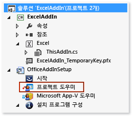
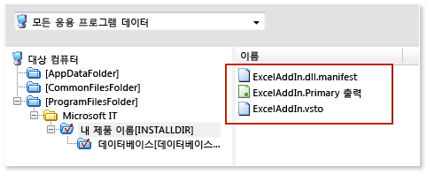
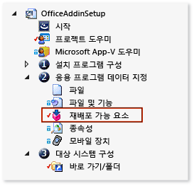

# Windows Installer를 사용하여 Office 솔루션 배포
[!INCLUDE[vs_dev12](../vsto/includes/vs-dev12-md.md)]을 사용하여 Office 솔루션에 필요한 Windows Installer를 만드는 방법을 알아봅니다.  
  
Visual Studio를 사용하여 Windows Installer를 만들면 최종 사용자의 컴퓨터에서 관리자 권한이 필요한 Office 솔루션을 배포할 수 있습니다. 예를 들어 이러한 파일을 사용하여 컴퓨터의 모든 사용자에 대해 솔루션을 한 번만 설치할 수 있습니다. ClickOnce를 사용하여 Office 솔루션을 배포할 수도 있지만 컴퓨터의 각 사용자마다 별도로 솔루션을 설치해야 합니다.  
  
  
## 항목 내용  
  
- [Download VSTO Add-in samples](#Download)  
  
- [Get InstallShield Limited Edition](#Obtain)  
  
- [Decide how to grant trust to the solution](#ApplySecurity)  
  
- [Create a setup project](#Create)  
  
- [Add the project output](#Add)  
  
- [Add the deployment and application manifests](#AddD)  
  
- [Configure the dependent components as prerequisites](#Configure)  
  
- [Specify where you want to deploy the solution on the user's computer](#Location)  
  
- [Configure an VSTO Add-in](#ConfigureRegisitry)  
  
- [Configure a document-level customization](#ConfigureDocument)  
  
- [Build the setup project](#Build)  
  
ClickOnce를 사용하여 Office 솔루션을 배포하는 방법에 대한 자세한 내용은 [ClickOnce를 사용하여 Office 솔루션 배포](../vsto/deploying-an-office-solution-by-using-clickonce.md)를 참조하세요.  
  
[!INCLUDE[vs_dev10_long](../sharepoint/includes/vs-dev10-long-md.md)]을 사용하여 Windows Installer 파일을 만드는 방법에 대한 자세한 내용은 [Windows Installer를 사용하여 Visual Studio 2010 Tools for Office 솔루션 배포](http://go.microsoft.com/fwlink/?LinkId=201807)를 참조하세요.  
  
  
## <a name="Download"></a>샘플 다운로드  
이 항목에서는 다음과 같은 다운로드 가능한 샘플을 사용합니다.  
  
  
  
|샘플<br /><br />|설명<br /><br />|  
|------|------|  
|[ExcelAddIn](http://go.microsoft.com/fwlink/?LinkID=275492)<br /><br />|32비트 또는 64비트 버전의 Office를 실행하는 컴퓨터에 설치할 수 있는 Excel VSTO 추가 기능입니다.<br /><br />|  
|[ExcelWorkbook](http://go.microsoft.com/fwlink/?LinkID=275493)<br /><br />|32비트 또는 64비트 버전의 Office를 실행하는 컴퓨터에 설치할 수 있는 Excel 문서 수준 사용자 지정입니다.<br /><br />|  
  
## <a name="ApplySecurity"></a>솔루션에 신뢰를 부여하는 방법 결정  
사용자 컴퓨터에서 솔루션을 실행하려면 먼저 관리자가 다음 방법 중 하나로 신뢰를 부여하거나 사용자가 솔루션을 설치할 때 신뢰 프롬프트에 응답해야 합니다.  
  
  
- 신뢰할 수 있고 확인된 게시자를 식별하는 인증서를 사용하여 매니페스트에 서명합니다. 자세한 내용은 [Trusting the Solution by Signing the Application and Deployment Manifests](../vsto/granting-trust-to-office-solutions.md#Signing)을 참조하세요.  
  
- 사용자 컴퓨터의 프로그램 파일 디렉터리에 솔루션을 설치합니다.  
  
> [!NOTE]  
> 문서 수준 사용자 지정에서는 문서 위치도 신뢰해야 합니다. 자세한 내용은 [문서에 신뢰 부여](../vsto/granting-trust-to-documents.md)을 참조하세요.  
  
  
## <a name="Obtain"></a>InstallShield Limited Edition 받기  
Visual Studio를 설치한 경우 무료인 ISLE(InstallShield Limited Edition)를 사용하여 Windows Installer 파일을 만들 수 있습니다. ISLE는 이전 버전의 Visual Studio에서 제공하는 설치 및 배포용 프로젝트 템플릿을 대체합니다.  
  
  
#### InstallShield Limited Edition을 받으려면  
  
1. 메뉴 모음에서 **파일**, **새로 만들기**, **프로젝트**를 차례로 선택합니다.  
    **새 프로젝트** 대화 상자가 열립니다.  
  
2. 템플릿 창에서 **기타 프로젝트 형식**을 확장한 다음 **설치 및 배포** 템플릿을 선택합니다.  
  
3. **설치 및 배포**에 대한 프로젝트 형식 목록에서 **InstallShield Limited Edition 사용**을 선택한 후 **확인** 단추를 선택합니다.  
    InstallShield Limited Edition을 받는 방법을 설명하는 페이지가 나타납니다.  
  
4. 해당 페이지에서 **다운로드 웹 사이트로 이동합니다.** 링크를 선택합니다.  
  
5. InstallShield Limited Edition 다운로드 페이지에서 해당 필드에 필수 정보를 입력한 후 **지금 다운로드** 링크를 선택합니다.  
    제품을 다운로드하여 설치하고 정품 인증을 받으면 Visual Studio에 **InstallShield Limited Edition 프로젝트** 템플릿이 나타납니다.  
  
  
## <a name="Create"></a>설치 프로젝트 만들기  
  
####   
1. [!INCLUDE[vsprvs](../sharepoint/includes/vsprvs-md.md)]에서 배포하려는 Office 프로젝트를 엽니다.  
    이 항목과 관련된 VSTO 추가 기능 샘플에는 **ExcelAddIn**이라는 프로젝트가 들어 있습니다. 문서 수준 사용자 지정 샘플에는 **ExcelWorkbook**이라는 프로젝트가 들어 있습니다. 이 항목에서는 이러한 두 가지 이름 중 하나를 사용하여 해당 솔루션의 Office 프로젝트를 나타냅니다.  
  
2. 메뉴 모음에서 **파일**, **추가**, **새 프로젝트**를 차례로 선택합니다.  
    **새 프로젝트 추가** 대화 상자가 열립니다.  
  
3. 템플릿 창에서 **기타 프로젝트 형식**을 확장한 다음 **설치 및 배포** 템플릿을 선택합니다.  
  
4. **설치 및 배포**에 대한 프로젝트 형식 목록에서 **InstallShield Limited Edition 프로젝트**를 선택하고, 프로젝트 이름을 지정한 후 **확인** 단추를 선택합니다.  
    방금 만든 InstallShield 설치 프로젝트가 솔루션에 나타납니다.  
    이 항목의 샘플에는 **OfficeAddInSetup**이라는 설치 프로젝트가 포함되어 있습니다. 이 항목에서는 동일한 이름을 사용하여 솔루션의 설치 프로젝트를 나타냅니다.  
  
  
## <a name="Add"></a>프로젝트 출력 추가  
Office 프로젝트의 출력을 포함하도록 **OfficeAddInSetup** 프로젝트를 구성합니다. VSTO 추가 기능 프로젝트에서 프로젝트 출력은 솔루션 어셈블리만 포함됩니다. 문서 수준 사용자 지정 프로젝트의 경우에는 프로젝트 출력에 솔루션 어셈블리뿐 아니라 문서 자체도 포함됩니다.  
  
  
#### 프로젝트 출력을 추가하려면  
  
1. **솔루션 탐색기**에서 **OfficeAddInSetup** 프로젝트 노드를 확장한 후 다음 그림에 표시된 대로 **Project Assistant** 파일을 선택합니다.  
      
  
2. 메뉴 모음에서 **보기**, **열기**를 선택합니다.  
  
3. 다음 그림에 나와 있는 대로 **프로젝트 도우미** 페이지 하단에서 **응용 프로그램 파일** 단추를 선택합니다.  
      
  
4. **응용 프로그램 파일** 페이지에서 **프로젝트 출력 추가** 단추를 선택합니다.  
  
5. **Visual Studio 출력 선택** 대화 상자에서 **기본 출력** 확인란을 선택한 후 **확인** 단추를 선택합니다.  
  
  
## <a name="AddD"></a>배포 및 응용 프로그램 매니페스트 추가  
  
####   
1. **응용 프로그램 파일** 페이지에서 **파일 추가** 단추를 선택합니다.  
  
2. **열기** 대화 상자에서 **ExcelAddIn** 프로젝트의 출력 디렉터리를 찾습니다.  
    일반적으로 출력 디렉터리는 선택한 빌드 구성에 따라 프로젝트 루트 디렉터리의 **bin\release** 하위 폴더입니다.  
  
3. 출력 디렉터리에서 **ExcelAddIn.vsto** 파일과 **ExcelAddIn.dll.manifest** 파일을 선택한 다음 **열기** 단추를 선택합니다.  
    다음 그림과 같이 **응용 프로그램 파일** 페이지에 이제 프로젝트 출력 파일, 배포 매니페스트, 응용 프로그램 매니페스트가 포함됩니다.  
      
  
  
## <a name="Configure"></a>종속 구성 요소를 필수 조건으로 구성  
설치 응용 프로그램에 다음 구성 요소뿐 아니라 솔루션 실행에 필요한 다른 모든 구성 요소를 포함해야 합니다.  
  
  
- Office 솔루션의 대상이 되는 .NET Framework의 버전입니다.  
  
- Microsoft Visual Studio 2010 Tools for Office Runtime.  
  
  
### .NET Framework 4 또는 .NET Framework 4.5를 필수 구성 요소로 추가  
  
#####   
1. **솔루션 탐색기**에서 **OfficeAddInSetup** 프로젝트 노드를 확장하고 **응용 프로그램 데이터 지정** 노드를 확장한 후 다음 그림에 나와 있는 대로 **Redistributables** 파일을 선택합니다.  
      
  
2. 메뉴 모음에서 **보기**, **열기**를 선택합니다.  
    **재배포 가능 패키지** 페이지가 열립니다.  
  
3. 재배포 가능한 구성 요소 목록에서 솔루션의 대상인 .NET Framework 버전의 확인란을 선택합니다.  
    예를 들어 솔루션의 대상이 [!INCLUDE[net_v45](../vsto/includes/net-v45-md.md)]일 경우 **Microsoft .NET Framework 4.5 Full** 확인란을 선택합니다. 구성 요소를 필수 구성 요소로 추가하기 위해 InstallShield에서 필요로 하는 재배포 가능 구성 요소를 설치할 것인지 묻는 대화 상자가 나타날 수 있습니다. 이 대화 상자가 나타나지 않으면 컴퓨터에 구성 요소가 이미 설치되어 있는 것입니다.  
  
4. 이 대화 상자가 나타나면 **아니요** 단추를 선택합니다.  
  
  
### <a name="AddToolsForOffice"></a>Visual Studio 2010 Tools for Office Runtime 추가  
**재배포 가능 패키지** 페이지에 **Microsoft VSTO 2010 Runtime**이라는 항목이 포함되지만 이 항목은 이전 버전의 런타임을 참조합니다. 따라서 최신 버전을 참조하는 구성 파일을 직접 만들 수도 있습니다. 그런 다음 이 파일을, **재배포 가능 요소** 페이지에 표시되는 다른 모든 항목에 대해 구성 파일과 같은 디렉터리에 넣어야 합니다.  
  
  
##### Visual Studio 2010 Tools for Office 런타임을 필수 구성 요소로 추가하려면  
  
1. 메모장을 연 후 다음 XML을 텍스트 파일에 붙여 넣습니다.  
  
    ```xml  
    <?xml version="1.0" encoding="UTF-8"?> <SetupPrereq> <conditions> <condition Type="32" Comparison="2" Path="HKEY_LOCAL_MACHINE\SOFTWARE\Microsoft\VSTO Runtime Setup\v4R" FileName="Version" ReturnValue="10.0.50903" Bits="2"></condition> <condition Type="32" Comparison="2" Path="HKEY_LOCAL_MACHINE\SOFTWARE\Wow6432Node\Microsoft\VSTO Runtime Setup\v4R" FileName="Version" ReturnValue="10.0.50903" Bits="2"></condition> </conditions> <files> <file LocalFile="<ISProductFolder>\SetupPrerequisites\VSTOR\vstor_redist.exe" URL="http://download.microsoft.com/download/C/0/0/C001737F-822B-48C2-8F6A-CDE13B4B9E9C/vstor_redist.exe" CheckSum="88b8aa9e8c90818f98c80ac4dd998b88" FileSize=" 0,40117912"></file> </files> <execute file="vstor_redist.exe" returncodetoreboot="1641,3010" requiresmsiengine="1"> </execute> <properties Id="{15965040-56BB-49B8-A88F-3525C48D9BA8}" Description="This prerequisite installs the most recent version of the Microsoft Visual Studio 2010 Tools for Office Runtime." > </properties> </SetupPrereq>  
    ```  
  
2. Visual Studio에서 GUID를 만듭니다.**도구** 메뉴에서 **GUID 만들기**를 선택합니다.  
  
3. **GUID 생성기** 프로그램에서 **레지스트리 형식** 옵션 단추를 선택하고 **복사** 단추를 선택한 후 **종료** 단추를 선택합니다.  
  
4. 메모장에서 해당 위치에 GUID를 붙여 넣어 **Your GUID goes here** 텍스트를 바꿉니다.  
    파일의 **&lt;properties&gt;** 요소는 다음 예제와 유사합니다.  
  
    ```xml  
    <properties Id="{87989B73-21DC-4403-8FD1-0C68A41A6D8C}" Description="This prerequisite installs the most recent version of the Microsoft Visual Studio 2010 Tools for Office Runtime." > </properties>  
    ```  
  
5. 메모장의 메뉴 모음에서 **파일**, **저장**을 차례로 선택합니다.  
  
6. **다른 이름으로 저장** 대화 상자에서 **바탕 화면** 폴더를 찾습니다.  
  
7. **파일 형식** 목록에서 **모든 파일(&#42;.&#42;)**을 선택합니다.  
  
8. **파일 이름** 상자에 **Visual Studio 2010 Tools for Office Runtime.prq**를 입력한 후 **저장** 단추를 선택합니다.  
    > [!NOTE]  
    >     파일을 필수 파일로 식별하기 위해 파일 이름 끝에 **.prq**를 추가합니다.  
  
9. 메모장을 닫습니다.  
  
10. **바탕 화면** 폴더의 Visual Studio 2010 Tools for Office Runtime.prq 파일을 컴퓨터의 다음 디렉터리 중 하나로 복사합니다.  
    32비트 운영 체제: %ProgramFiles%\InstallShield\2013LE\SetupPrerequisites\  
    64비트 운영 체제: %ProgramFiles(x86)%\2013LE\SetupPrerequisites\  
  
11. InstallShield 프로젝트의 **재배포 가능** 페이지에서 **새로 고침** 단추를 선택하여 다음과 같이 재배포 가능 구성 요소 목록을 새로 고칩니다.  
      
  
12. 재배포 가능 구성 요소 목록에서 **Visual Studio 2010 Tools for Office Runtime** 확인란을 선택합니다.  
    재배포 가능 구성 요소를 설치할 것인지 묻는 대화 상자가 나타날 수 있습니다. 이 대화 상자가 나타나지 않으면 이 항목의 [Specify where you want to deploy the solution on the user's computer](#Location) 섹션으로 건너뛸 수 있습니다.  
  
13. 이 대화 상자가 나타나면 **아니요** 단추를 선택합니다.  
  
  
## <a name="Location"></a>사용자 컴퓨터에서 솔루션을 설치할 위치 지정  
  
####   
1. **솔루션 탐색기**에서 **OfficeAddInSetup** 노드를 확장하고 **설정 구성** 노드를 확장한 후 **일반 정보** 파일을 선택합니다.  
  
2. 메뉴 모음에서 **보기**, **열기**를 선택합니다.  
  
3. 속성 목록에서 **INSTALLDIR** 속성 옆에 있는 **찾아보기** 단추를 선택합니다.  
  
4. **Set INSTALLDIR** 대화 상자에서 솔루션을 설치할 컴퓨터의 폴더를 선택합니다.  
    > [!NOTE]  
    >     **Set INSTALLDIR** 대화 상자에서 목록의 아무 폴더에서나 바로 가기 메뉴를 열어 하위 디렉터리를 만들 수도 있습니다.  
  
  
## <a name="ConfigureRegisitry"></a>VSTO 추가 기능 구성  
VSTO 추가 기능을 컴퓨터의 모든 사용자에 대해 설치할지(컴퓨터 단위) 아니면 설치를 수행하는 사용자에 대해서만 설치할지(사용자 단위)를 지정할 수 있습니다.  
  
컴퓨터 단위 설치를 지원하려는 경우 설치 관리자를 두 개 만듭니다. 사용자가 실행하는 Office 버전(32비트 및 64비트) 또는 Windows 버전(32비트 및 64비트)에 따라 설치 관리자를 분할할 수 있습니다.  
  
사용자 단위 설치 시 Office 버전이나 Windows 버전에 관계없이 한 개의 설치 관리자가 필요합니다.  
  
> [!NOTE]  
> 이 섹션은 VSTO 추가 기능을 배포할 경우에만 적용됩니다. 문서 수준 사용자 지정을 배포할 경우 [Configure a Document-Level Customization](#ConfigureDocument) 섹션으로 바로 이동하면 됩니다.  
  
  
#### 사용자 단위 설치 또는 컴퓨터 단위 설치를 지정하려면  
  
1. **솔루션 탐색기**에서 **OfficeAddInSetup** 프로젝트 노드를 확장하고 **설정 구성** 노드를 확장한 후 **일반 정보** 파일을 선택합니다.  
  
2. 메뉴 모음에서 **보기**, **열기**를 선택합니다.  
    설치 프로젝트의 속성이 표시됩니다.  
  
3. 목록의 **AllUSERS** 속성에서 이 솔루션을 컴퓨터의 모든 사용자를 위해 설치할 것인지 아니면 솔루션을 설치하는 사용자를 위해서만 설치할 것인지를 지정합니다.  
    현재 사용자를 위해 VSTO 추가 기능을 설치하려면 **ALLUSERS=””(사용자 단위 설치)**를 선택합니다. 컴퓨터의 모든 사용자를 위해 VSTO 추가 기능을 설치하려면 **ALLUSERS=1(컴퓨터 단위 설치)**를 선택합니다.  
    다음 절차에서는 레지스트리 키를 만들어 Office 응용 프로그램에서 VSTO 추가 기능을 검색하고 로드할 수 있도록 할 것입니다.[VSTO 추가 기능에 대한 레지스트리 항목](../vsto/registry-entries-for-vsto-add-ins.md)을 참조하세요.  
  
  
#### 레지스트리 키를 만들려면  
  
1. **솔루션 탐색기**에서 **프로젝트 도우미** 노드를 선택합니다.  
    메뉴 모음에서 **보기**, **열기**를 선택합니다.  
  
2. **프로젝트 도우미** 페이지 아래쪽에서 **응용 프로그램 레지스트리** 단추를 선택하면 다음 화면이 나타납니다.  
      
  
    **응용 프로그램 레지스트리** 페이지가 열립니다.  
  
3. **응용 프로그램에서 설치할 레지스트리 데이터를 구성하시겠습니까?**에서 **예** 옵션 단추를 선택합니다.  
  
4. **대상 컴퓨터의 레지스트리 보기** 목록에서 만들려는 형식의 설치 관리자를 사용하는 키 계층을 추가 합니다.  
    이 단원에서 구성하는 경로는 사용자 단위 설치 관리자를 만드는지 아니면 컴퓨터 단위 설치 관리자를 만드는지에 따라 다릅니다.  
    **사용자 단위 설치 관리자**  
    **HKEY_CURRENT_USER\Software\Microsoft\Office\Excel\Addins\SampleCompany.ExcelAddIn**  
    **Office 버전에 따른 컴퓨터 단위 설치 관리자**  
  
  
|Office 버전<br />|InstallShield 구성 경로<br />|  
|-----------|---------------------|  
|32비트<br />|**HKEY_LOCAL_MACHINE\SOFTWARE(32-Bit)\Microsoft\Office\Excel\Addins\SampleCompany.ExcelAddIn**<br />|  
|64비트<br />|**HKEY_LOCAL_MACHINE\SOFTWARE(64-Bit)\Microsoft\Office\Excel\Addins\SampleCompany.ExcelAddIn**<br />|  
    **Windows 버전에 다른 컴퓨터 단위 설치 관리자**  
  
  
|Windows 버전<br />|InstallShield 구성 경로<br />|  
|------------|---------------------|  
|32비트<br />|**HKEY_LOCAL_MACHINE\SOFTWARE(32-Bit)\Microsoft\Office\Excel\Addins\SampleCompany.ExcelAddIn**<br />|  
|64비트<br />|**HKEY_LOCAL_MACHINE\SOFTWARE(32-Bit)\Microsoft\Office\Excel\Addins\SampleCompany.ExcelAddIn**<br />**HKEY_LOCAL_MACHINE\SOFTWARE(64-Bit)\Microsoft\Office\Excel\Addins\SampleCompany.ExcelAddIn**<br />|  
    > [!NOTE]  
    >     사용자가 64비트 Windows를 실행하는 컴퓨터에서 32비트 버전과 64비트 버전의 Office를 실행할 수 있기 때문에 64비트 Windows용 설치 관리자에는 두 개의 레지스트리 경로가 필요합니다.  
  
    > [!NOTE]  
    >     가장 좋은 방법은 VSTO 추가 기능의 이름을 회사 이름으로 시작하는 것입니다. 이 규칙을 사용하면 키의 고유성을 보장하여 다른 공급자의 VSTO 추가 기능과 충돌할 가능성이 줄어듭니다. 예를 들어 이름이 같은 추가 기능은 서로의 등록 키를 덮어쓸 수 있습니다. 이 방법이 키의 고유성을 완전히 보장하지는 않지만 이름이 충돌할 확률을 줄일 수 있습니다.  
  
5. 키의 계층 구조를 만든 후 **SampleCompany.ExcelAddIn** 키에 대해 바로 가기 메뉴를 열고 **새로 만들기**를 선택한 후 **문자열 값**을 선택합니다.  
    새 문자열 값이 **대상 컴퓨터의 레지스트리 데이터** 목록에 나타납니다. 문자열 값의 이름은 이름을 변경할 수 있도록 강조 표시됩니다.  
  
6. 값의 이름을 **설명**으로 바꿉니다.  
  
7. 이 과정을 반복하여 다음 값을 만듭니다.  
  
  
|값 형식<br />|이름<br />|  
|------|----|  
|문자열 값<br />|**FriendlyName**<br />|  
|DWORD 값<br />|**LoadBehavior**<br />|  
|문자열 값<br />|**Manifest**<br />|  
  
8. **설명** 값에 대한 바로 가기 메뉴를 열고 **수정**을 선택합니다.  
    **데이터 편집** 대화 상자가 나타납니다.  
  
9. **값 데이터** 텍스트 상자에 **Excel 데모 추가 기능**을 입력한 후 **확인** 단추를 선택합니다.  
    이 설명은 사용자가 Office 응용 프로그램을 열고 **옵션** 대화 상자를 연 다음 **추가 기능** 창에서 VSTO 추가 기능을 선택할 때 나타납니다.  
  
10. **FriendlyName** 값에 대한 바로 가기 메뉴를 열고 **수정**을 선택합니다.  
    **데이터 편집** 대화 상자가 나타납니다.  
  
11. **값 데이터** 텍스트 상자에 **Excel 데모 추가 기능**을 입력한 후 **확인** 단추를 선택합니다.  
    이 문자열은 Office 응용 프로그램의 **COM 추가 기능** 대화 상자에 나타납니다. 기본적으로 이 문자열 값은 VSTO 추가 기능 ID입니다.  
  
12. **LoadBehavior** 값에 대한 바로 가기 메뉴를 열고 **수정**을 선택합니다.  
    **데이터 편집** 대화 상자가 나타납니다.  
  
13. **값 데이터** 텍스트 상자에 **3**을 입력한 후 **확인** 단추를 선택합니다.  
    값을 3으로 지정하면 응용 프로그램 시작 시 VSTO 추가 기능이 로드됩니다. LoadBehavior 값에 대한 자세한 내용은 [VSTO 추가 기능에 대한 레지스트리 항목](../vsto/registry-entries-for-vsto-add-ins.md)을 참조하세요.  
  
14. **Manifest** 값에 대한 바로 가기 메뉴를 열고 **수정**을 선택합니다.  
    **데이터 편집** 대화 상자가 나타납니다.  
  
15. **값 데이터** 텍스트 상자에 **file:///[INSTALLDIR]ExcelAddIn.vsto|vstolocal**을 입력한 후 **확인** 단추를 선택합니다.  
    Visual Studio 2010 Tools for Office Runtime은 이 경로를 사용하여 배포 매니페스트를 찾습니다. 이 경로에서 **[INSTALLDIR]** 부분은 InstallShield 설치 프로젝트의 **일반 정보** 속성 페이지에서 **INSTALLDIR** 속성에 매핑되는 매크로입니다. 이 속성은 VSTO 추가 기능을 설치할 대상 컴퓨터의 위치를 지정합니다.**|vstolocal** 접두사는 솔루션이 ClickOnce 캐시에서 로드되지 않고 설치 폴더에서 로드되도록 합니다.  
  
> [!IMPORTANT]  
> Outlook용 VSTO 추가 기능에 사용자 지정 양식 영역을 만들 경우 레지스트리 항목을 추가로 만들어 영역을 Outlook에 등록해야 합니다. 자세한 내용은 [Registry Entries for Outlook Form Regions](../vsto/registry-entries-for-vsto-add-ins.md#OutlookEntries)을 참조하세요.  
  
  
## <a name="ConfigureDocument"></a>문서 수준 사용자 지정 구성  
이 단원의 내용은 문서 수준 사용자 지정을 배포할 경우에만 적용됩니다. VSTO 추가 기능을 배포할 경우 [Build the Setup Project](#Build) 섹션을 참조하세요.  
  
문서 수준 사용자 지정은 레지스트리 키를 사용하지 않습니다. 대신 사용자 지정 문서 속성에 배포 매니페스트의 위치가 포함됩니다.  
  
사용자 지정 속성을 수정하려면 문서에서 문서 수준 사용자 지정을 제거하고 해당 속성을 수정한 다음 문서에 사용자 지정을 다시 연결하는 프로그램을 만듭니다. 그런 다음 프로그램을 실행하는 사용자 지정 작업을 만들고 해당 작업을 설치 프로젝트에 추가합니다.  
  
  
#### 문서 속성을 수정하는 프로그램을 만들려면  
  
1. 메뉴 모음에서 **파일**, **추가**, **새 프로젝트**를 차례로 선택합니다.  
    **새 프로젝트 추가** 대화 상자가 나타납니다.  
  
2. 템플릿 창에서 사용하려는 언어 노드 아래의 **Windows** 폴더를 선택합니다.  
  
3. **Windows**의 프로젝트 형식 목록에서 **콘솔 응용 프로그램** 템플릿을 선택합니다.  
  
4. 프로젝트 **SetExcelDocumentProperties**의 이름을 지정한 다음 **확인** 단추를 선택합니다.  
  
5. **솔루션 탐색기**에서 **모든 파일 표시** 단추를 선택하고, **SetExcelDocumentProperties** 프로젝트 노드의 바로 가기 메뉴를 연 후 **참조 추가**를 선택합니다.  
  
6. **참조 관리자** 대화 상자에서 **확장** 탭을 선택하고 다음 어셈블리 옆에 있는 확인란을 선택한 후 **확인** 단추를 선택합니다.  
  
    - Microsoft.VisualStudio.Tools.Applications.Runtime  
  
    - Microsoft.VisualStudio.Tools.Applications.ServerDocument  
  
7. **솔루션 탐색기**에서 **Program.cs** 파일(C# 응용 프로그램의 경우) 또는 **Module1.vb** 파일(Visual Basic 응용 프로그램의 경우)을 선택합니다.  
  
8. 메뉴 모음에서 **보기**, **열기**를 선택합니다.  
  
9. 전체 파일의 내용을 다음 코드로 바꿉니다.  
[!code-csharp[Trin_CustomAction#1](../snippets/csharp/VS_Snippets_OfficeSP/trin_customaction/cs/setexceldocumentproperties/program.cs#1)]
[!code-vb[Trin_CustomAction#1](../snippets/visualbasic/VS_Snippets_OfficeSP/trin_customaction/vb/setexceldocumentproperties/module1.vb#1)]  
  
10. 프로젝트를 컴파일합니다.  
  
  
#### 프로그램을 실행하는 사용자 지정 작업을 추가하려면  
  
1. **솔루션 탐색기**에서 **OfficeAddInSetup** 프로젝트 노드를 확장한 후 다음 그림에 표시된 대로 **Project Assistant** 파일을 선택합니다.  
      
  
2. 메뉴 모음에서 **보기**, **열기**를 선택합니다.  
  
3. 다음 그림에 나와 있는 대로 **프로젝트 도우미** 페이지 하단에서 **응용 프로그램 파일** 단추를 선택합니다.  
      
  
4. **응용 프로그램 파일** 페이지에서 **프로젝트 출력 추가** 단추를 선택합니다.  
    **Visual Studio 출력 선택** 대화 상자가 나타납니다.  
  
5. **SetExcelDocumentProperties** 노드에서 **기본 출력** 확인란을 선택한 다음 **확인** 단추를 선택합니다.  
  
6. **솔루션 탐색기**의 **OfficeAddInSetup** 노드 아래에서 **설치 요구 사항 및 작업 정의** 노드를 확장한 후 **사용자 지정 작업** 폴더를 선택합니다.  
  
7. 메뉴 모음에서 **보기**, **열기**를 선택합니다.  
    화면의 옆쪽 창에 이벤트 목록이 나타납니다.  
    > [!NOTE]  
    >     이 목록에 표시된 이벤트 중 몇 개만 InstallShield Limited Edition에서 사용할 수 있습니다. 이 절차에서는 **설치 완료 후 성공 대화 상자** 이벤트를 사용하여 프로그램을 실행합니다.  
  
8. 이벤트 목록에서 **설치 중 사용자 지정 작업** 아래의 **설치 완료 후 성공 대화 상자** 이벤트에 대한 바로 가기 메뉴를 열고 **새 EXE**를 선택합니다.  
    **설치 완료 후 성공 대화 상자** 아래에 **NewCustomAction1**이라는 사용자 지정 작업이 나타납니다. 이벤트 옆의 창에 사용자 지정 작업에 대한 속성 집합이 나타납니다.  
    > [!IMPORTANT]  
    >     이벤트 목록에 두 개의 **설치 완료 후 성공 대화 상자** 이벤트가 나타납니다.**설치 중 사용자 지정 작업** 노드 아래에 나타나는 **설치 완료 후 성공 대화 상자** 이벤트의 인스턴스를 선택합니다.  
  
9. **소스 위치** 속성 목록에서 **제품과 함께 설치**를 선택합니다.  
  
10. **파일 이름** 속성 옆에 있는 **찾아보기** 단추를 선택합니다.  
  
11. **대상 파일 찾아보기** 대화 상자에서 **SetExcelDocumentProperties.Primary.output** 파일을 찾아 **열기** 단추를 선택합니다.  
    이 파일의 위치는 설치 프로젝트의 **INSTALLDIR** 속성에 지정한 폴더에 따라 다릅니다. 예를 들어 이 속성을 **[PersonalFolder]DemoWorkbookApp**이라는 폴더로 지정할 경우 **[ProgramFilesFolder]\DemoWorkbookApp**로 이동하여 **SetExcelDocumentProperties.Primary.output** 파일을 찾을 수 있습니다.  
    다음 몇 단계에서는 문서의 솔루션 ID를 확인하여 콘솔 응용 프로그램에 해당 ID를 매개 변수로 전달합니다. 또한 문서 위치, 배포 매니페스트 및 문서 어셈블리 위치를 전달합니다.  
  
12. **ExcelWorkbook** 프로젝트의 바로 가기 메뉴를 열고 운영 체제에 따라 **Windows 탐색기에서 폴더 열기** 또는 **파일 탐색기에서 폴더 열기** 를 선택합니다.  
    솔루션이 들어 있는 폴더가 열립니다.  
  
13. 메모장에서 솔루션의 프로젝트 파일을 엽니다. Visual Basic 프로젝트의 경우 파일 이름이 ExcelWorkbook.csproj입니다. C# 프로젝트의 경우 파일 이름이 ExcelWorkbook.csproj입니다.  
  
14. 프로젝트 파일에서 **&lt;SolutionID&gt;** 요소를 검색하여 그 값을 클립보드에 복사한 다음 메모장을 닫습니다.  
    이 값을 콘솔 응용 프로그램에 매개 변수로 전달합니다.  
  
15. **NewCustomAction1**의 속성 페이지에서 **명령줄** 속성을 다음과 같이 설정합니다.  
  
    ```  
    /assemblyLocation="[INSTALLDIR]ExcelWorkbook.dll" /deploymentManifestLocation="[INSTALLDIR]ExcelWorkbook.vsto" /documentLocation="[INSTALLDIR]ExcelWorkbook.xlsx" /solutionID="Your Solution ID"  
    ```  
  
16. **Your Solution ID**를 클립보드에 복사한 솔루션 ID로 바꿉니다.  
    > [!IMPORTANT]  
    >     설치 관리자를 테스트하여 이 사용자 지정 작업으로 실행되는 콘솔 응용 프로그램이 [INSTALLDIR] 디렉터리의 문서에 액세스할 수 있는지 확인합니다. 사용자 컴퓨터의 일부 디렉터리에는 관리자 액세스 권한이 필요할 수 있습니다(예: 프로그램 파일 디렉터리). 관리 액세스가 필요한 디렉터리에 솔루션을 배포하는 경우, 설치 관리자를 배포하기 전에 setup.exe 파일의 **속성** 대화 상자를 열고 **호환성** 탭을 선택한 후 **이 프로그램을 관리자 권한으로 실행** 확인란을 선택합니다. 사용자가 관리자 권한으로 설치 프로그램을 실행하지 않도록 하려면 [INSTALLDIR] 속성을 **Documents** 디렉터리와 같이 사용자가 이미 액세스 권한을 가지고 있는 디렉터리로 설정합니다. 자세한 내용은 이 항목의 [Specify Where You Want to Install the Solution on the user’s computer](#Location) 섹션을 참조하세요.  
  
  
## <a name="Build"></a>설치 프로젝트 빌드  
  
####   
1. **솔루션 탐색기**에서 **릴리스 준비** 노드를 확장한 다음 **릴리스** 파일을 선택합니다.  
  
2. 메뉴 모음에서 **보기**, **열기**를 선택합니다.  
    **빌드** 탐색기가 옆 창에 열리면 만들려는 릴리스 형식을 선택할 수 있습니다.  
  
3. **빌드** 탐색기에서 **SingleImage** 폴더를 선택합니다.  
  
4. **빌드** 탐색기 옆의 창에서 **Setup.exe** 탭을 선택합니다.  
  
5. **Setup.exe** 속성 페이지의 **InstallShield 필수 구성 요소 위치** 목록에서 **웹에서 다운로드**를 선택합니다.  
  
6. 메뉴 모음에서 **빌드**, **구성 관리자**를 선택합니다.  
  
7. **활성 솔루션 구성** 목록 상자에서 **SingleImage**를 선택합니다.  
  
8. **프로젝트 컨텍스트** 테이블에서 **OfficeAddInSetup** 프로젝트의 **구성** 열에 있는 **SingleImage**를 선택한 후 **닫기** 단추를 선택합니다.  
  
9. 메뉴 모음에서 **빌드**, **OfficeAddInSetup 빌드**를 차례로 선택합니다.  
    빌드가 완료되면 *OfficeAddInSetupProjectRoot***\OfficeAddInSetup\Express\SingleImage\DiskImages\DISK1\**에서 **OfficeAddInSetup** 프로젝트의 setup.exe 파일을 찾을 수 있습니다.  
  
  
## 참고 항목  
[배포를 위한 Office 솔루션 필수 조건](http://msdn.microsoft.com/en-us/library/9f672809-43a3-40a1-9057-397ce3b5126e)  
[Office 솔루션 배포](../vsto/deploying-an-office-solution.md)  
[VSTO 추가 기능에 대한 레지스트리 항목](../vsto/registry-entries-for-vsto-add-ins.md)  
[사용자 지정 문서 속성 개요](../vsto/custom-document-properties-overview.md)  
[Office 솔루션에 신뢰 부여](../vsto/granting-trust-to-office-solutions.md)  
[문서에 신뢰 부여](../vsto/granting-trust-to-documents.md)  
[Windows Installer를 사용하여 Visual Studio 2010 Tools for Office 솔루션 배포](http://go.microsoft.com/fwlink/?LinkId=201807)  
  
