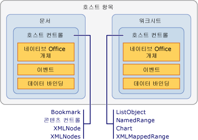

# 호스트 항목 및 호스트 컨트롤 개요
  호스트 항목과 호스트 컨트롤은 Visual Studio에서 Office 개발 도구를 사용하여 만든 Office 솔루션에 프로그래밍 모델을 제공하는 데 도움이 되는 형식입니다. 호스트 항목과 호스트 컨트롤은 COM 기반의 Microsoft Office Word 및 Microsoft Office Excel의 개체 모델과 상호 작용합니다. 이는 Windows Forms 컨트롤과 같이 관리되는 개체와 상호 작용한다고 하는 편이 더 정확합니다.  
  
 [!INCLUDE[appliesto_controls](../vsto/includes/appliesto-controls-md.md)]  
  
## 호스트 항목  
 호스트 항목은 Office 프로젝트의 개체 모델 계층에서 맨 위에 있는 형식입니다.[!INCLUDE[vsto_runtime](../vsto/includes/vsto-runtime-md.md)]은 Word 및 Excel 솔루션에 대해 다음 호스트 항목을 정의합니다.  
  
-   <xref:Microsoft.Office.Tools.Word.Document>  
  
-   <xref:Microsoft.Office.Tools.Excel.Workbook>  
  
-   <xref:Microsoft.Office.Tools.Excel.Worksheet>  
  
-   <xref:Microsoft.Office.Tools.Excel.ChartSheet>  
  
 이러한 형식은 각각 *네이티브 Office 개체*라는 Word 또는 Excel 개체 모델에 고유하게 존재하는 개체를 확장합니다. 예를 들어 <xref:Microsoft.Office.Tools.Word.Document> 호스트 항목은 <xref:Microsoft.Office.Interop.Word.Document> 개체를 확장하며 이는 Word용 주 interop 어셈블리에서 정의됩니다.  
  
 호스트 항목은 일반적으로 해당 Office 개체와 기본 기능이 같지만 다음과 같은 기능으로 더욱 향상되었습니다.  
  
-   관리되는 컨트롤을 호스트하는 기능. 호스트 컨트롤 및 Windows Forms 컨트롤 등이 있습니다.  
  
-   다기능 이벤트 모델. 네이티브 Word 및 Excel 개체 모델에서 일부 문서, 통합 문서 및 워크시트 이벤트는 응용 프로그램 수준에서만 발생합니다. 호스트 항목은 이러한 이벤트를 문서 수준에서 제공하므로 특정 문서에 대한 이벤트를 더 쉽게 처리할 수 있습니다.  
  
### 문서 수준 프로젝트의 호스트 항목 이해  
 문서 수준 프로젝트에서 호스트 항목에는 코드에 대한 진입점을 제공할 뿐만 아니라 솔루션 개발에 도움이 되는 디자이너가 있습니다.  
  
 <xref:Microsoft.Office.Tools.Word.Document> 및 <xref:Microsoft.Office.Tools.Excel.Worksheet> 호스트 항목에는 Windows Forms 디자이너와 같이 문서 또는 워크시트의 시각적 표현인 연결된 디자이너가 있습니다. 이 디자이너를 사용하면 Word 또는 Excel에서 직접 문서나 워크시트의 내용을 수정하고 컨트롤을 디자인 화면에 끌어 놓을 수 있습니다. 자세한 내용은 [문서 호스트 항목](../vsto/document-host-item.md) 및 [워크시트 호스트 항목](../vsto/worksheet-host-item.md)를 참조하세요.  
  
 <xref:Microsoft.Office.Tools.Excel.Workbook> 호스트 항목은 사용자 인터페이스가 있는 컨트롤의 컨테이너로 사용되지 않습니다. 대신 이 호스트 항목의 디자이너는 <xref:System.Data.DataSet> 같은 구성 요소를 해당 디자인 화면에 끌어 놓을 수 있는 구성 요소 트레이 기능을 수행합니다. 자세한 내용은 [통합 문서 호스트 항목](../vsto/workbook-host-item.md)을 참조하십시오.  
  
 호스트 항목은 문서 수준 프로젝트에서 프로그래밍 방식으로 만들 수 없습니다. 대신 디자인 타임에 Visual Studio가 프로젝트에서 자동으로 생성하는 `ThisDocument`, `ThisWorkbook` 또는 `Sheet`*n* 클래스를 사용합니다. 이렇게 생성된 클래스는 호스트 항목에서 파생되어 코드에 대한 진입점을 제공합니다. 자세한 내용은 [호스트 항목 및 호스트 컨트롤의 프로그래밍에 대한 제한 사항](../vsto/programmatic-limitations-of-host-items-and-host-controls.md)을 참조하세요.  
  
### VSTO 추가 기능 프로젝트의 호스트 항목 이해  
 VSTO 추가 기능을 만드는 경우 기본값으로 호스트 항목에 액세스하지 않아도 됩니다. 하지만 런타임에 Word 및 Excel VSTO 추가 기능에서 <xref:Microsoft.Office.Tools.Word.Document>, <xref:Microsoft.Office.Tools.Excel.Workbook> 및 <xref:Microsoft.Office.Tools.Excel.Worksheet> 호스트 항목을 생성할 수 있습니다.  
  
 호스트 항목을 생성한 후 문서에 컨트롤 추가와 같은 작업을 수행할 수 있습니다. 자세한 내용은 [런타임에 VSTO 추가 기능에서 Word 문서 및 Excel 통합 문서 확장](../vsto/extending-word-documents-and-excel-workbooks-in-vsto-add-ins-at-run-time.md)을 참조하세요.  
  
## 호스트 컨트롤  
 호스트 컨트롤은 Word 및 Excel 개체 모델의 다양한 UI\(사용자 인터페이스\) 개체\(예: Microsoft.Office.Interop.Word.ContentControl 및 <xref:Microsoft.Office.Interop.Excel.Range> 개체\)를 확장합니다.  
  
 다음 호스트 컨트롤은 Excel 프로젝트에 사용할 수 있습니다.  
  
-   [Chart 컨트롤](../vsto/chart-control.md)  
  
-   [ListObject 컨트롤](../vsto/listobject-control.md)  
  
-   [NamedRange 컨트롤](../vsto/namedrange-control.md)  
  
-   [XmlMappedRange 컨트롤](../vsto/xmlmappedrange-control.md)  
  
 다음 호스트 컨트롤은 Word 프로젝트에 사용할 수 있습니다.  
  
-   [책갈피 컨트롤](../vsto/bookmark-control.md)  
  
-   [콘텐츠 컨트롤](../vsto/content-controls.md)  
  
-   [XMLNode 컨트롤](../vsto/xmlnode-control.md)  
  
-   [XMLNodes 컨트롤](../vsto/xmlnodes-control.md)  
  
 Office 문서에 추가된 호스트 컨트롤은 네이티브 Office 개체처럼 동작하지만 호스트 컨트롤은 이벤트 및 데이터 바인딩 기능을 포함한 추가 기능이 있습니다. 예를 들어 Excel에서 네이티브 <xref:Microsoft.Office.Interop.Excel.Range> 개체의 이벤트를 캡처하려는 경우 워크시트의 변경 이벤트를 먼저 처리해야 합니다. 그런 다음 변경 내용이 <xref:Microsoft.Office.Interop.Excel.Range>에서 발생했는지 여부를 확인해야 합니다. 반면에 <xref:Microsoft.Office.Tools.Excel.NamedRange> 호스트 컨트롤에는 직접 처리할 수 있는 <xref:Microsoft.Office.Tools.Excel.NamedRange.Change> 이벤트가 있습니다.  
  
 호스트 항목과 호스트 컨트롤 간의 관계는 Windows Form과 Windows Forms 컨트롤 간의 관계와 매우 비슷합니다. Windows Form에 텍스트 상자 컨트롤을 배치하는 것처럼 <xref:Microsoft.Office.Tools.Excel.Worksheet> 호스트 항목에 <xref:Microsoft.Office.Tools.Excel.NamedRange> 컨트롤을 배치합니다. 다음 그림은 호스트 항목과 호스트 컨트롤 간의 관계를 보여 줍니다.  
  
   
  
 또한 Word 및 Excel 문서 화면에 직접 Windows Forms 컨트롤을 추가하여 Office 솔루션에서 사용할 수도 있습니다. 자세한 내용은 [Office 문서의 Windows Forms 컨트롤 개요](../vsto/windows-forms-controls-on-office-documents-overview.md)를 참조하세요.  
  
> [!NOTE]  
>  Word 하위 문서에 호스트 컨트롤 또는 Windows Forms 컨트롤을 추가하는 것은 지원되지 않습니다.  
  
### 문서에 호스트 컨트롤 추가  
 문서 수준 프로젝트에서 다음과 같은 방법으로 디자인 타임에 호스트 컨트롤을 Word 문서 또는 Excel 워크시트에 추가할 수 있습니다.  
  
-   네이티브 개체를 추가하는 것과 같은 방식으로 호스트 컨트롤을 디자인 타임에 문서에 추가합니다.  
  
-   호스트 컨트롤을 **도구 상자**에서 문서 및 워크시트로 끌어 놓습니다. Excel 호스트 컨트롤은 Excel 프로젝트의 **Excel 컨트롤** 탭에서 사용할 수 있으며 Word 호스트 컨트롤은 Word 프로젝트의 **Word 컨트롤** 탭에서 사용할 수 있습니다.  
  
-   호스트 컨트롤을 **데이터 원본** 창에서 문서 및 워크시트로 끌어 놓습니다. 그러면 이미 데이터에 바인딩된 컨트롤을 추가할 수 있습니다. 자세한 내용은 [Office 솔루션의 컨트롤에 데이터 바인딩](../vsto/binding-data-to-controls-in-office-solutions.md)를 참조하세요.  
  
 또한 문서 수준 및 VSTO 추가 기능 프로젝트에서 런타임에 일부 호스트 컨트롤을 문서에 추가할 수 있습니다. 자세한 내용은 [런타임에 Office 문서에 컨트롤 추가](../vsto/adding-controls-to-office-documents-at-run-time.md)을 참조하세요.  
  
 호스트 컨트롤을 문서에 추가하는 방법에 대한 자세한 내용은 다음 항목을 참조하세요.  
  
-   [방법: 워크시트에 Chart 컨트롤 추가](../vsto/how-to-add-chart-controls-to-worksheets.md)  
  
-   [방법: 워크시트에 ListObject 컨트롤 추가](../vsto/how-to-add-listobject-controls-to-worksheets.md)  
  
-   [방법: 워크시트에 NamedRange 컨트롤 추가](../vsto/how-to-add-namedrange-controls-to-worksheets.md)  
  
-   [방법: 워크시트에 XMLMappedRange 컨트롤 추가](../vsto/how-to-add-xmlmappedrange-controls-to-worksheets.md)  
  
-   [방법: Word 문서에 책갈피 컨트롤 추가](../vsto/how-to-add-bookmark-controls-to-word-documents.md)  
  
-   [방법: Word 문서에 콘텐츠 컨트롤 추가](../vsto/how-to-add-content-controls-to-word-documents.md)  
  
-   [방법: Word 문서에 XMLNode 컨트롤 추가](../vsto/how-to-add-xmlnode-controls-to-word-documents.md)  
  
-   [방법: Word 문서에 XMLNodes 컨트롤 추가](../vsto/how-to-add-xmlnodes-controls-to-word-documents.md)  
  
### 호스트 컨트롤 이름 지정  
 호스트 컨트롤을 **도구 상자**에서 문서에 끌어 놓는 경우 해당 컨트롤은 자동으로 명명되는데 이름 끝에 증분값을 붙인 컨트롤 형식을 사용합니다. 예를 들어 bookmark 이름은 **bookmark1**, **bookmark2** 등입니다. Word 또는 Excel의 본래 기능을 사용하여 컨트롤을 추가하는 경우에는 컨트롤을 만들 때 특정 이름을 지정할 수 있습니다. 또한 **속성** 창에서 **이름** 속성 값을 변경하여 컨트롤의 이름을 바꿀 수도 있습니다.  
  
> [!NOTE]  
>  예약어를 사용하여 호스트 컨트롤의 이름을 지정할 수 없습니다. 예를 들어 워크시트에 <xref:Microsoft.Office.Tools.Excel.NamedRange> 컨트롤을 추가하고 이름을 **System**으로 변경하면 프로젝트를 빌드할 때 오류가 발생합니다.  
  
### 호스트 컨트롤 삭제  
 문서 수준 프로젝트에서는 Excel 워크시트 또는 Word 문서에 있는 컨트롤을 선택하고 \<Delete\> 키를 눌러 디자인 타임에 호스트 컨트롤을 삭제할 수 있습니다. 하지만 <xref:Microsoft.Office.Tools.Excel.NamedRange> 컨트롤을 삭제하려면 Excel의 **이름 정의** 대화 상자를 사용해야 합니다.  
  
 디자인 타임에 호스트 컨트롤을 문서에 추가하는 경우 런타임에 해당 컨트롤을 프로그래밍 방식으로 제거해서는 안 됩니다. 다음에 코드의 해당 컨트롤을 사용하려고 할 때 예외가 throw되기 때문입니다. 호스트 컨트롤의 `Delete` 메서드는 런타임에 문서에 추가된 호스트 컨트롤만 제거합니다. 디자인 타임에 만들어진 호스트 컨트롤의 `Delete` 메서드를 호출하는 경우 예외가 throw됩니다.  
  
 예를 들어 프로그래밍 방식으로 호스트 컨트롤이 워크시트에 추가된 경우 <xref:Microsoft.Office.Tools.Excel.NamedRange>의 <xref:Microsoft.Office.Tools.Excel.NamedRange.Delete%2A> 메서드만 성공적으로 <xref:Microsoft.Office.Tools.Excel.NamedRange>를 삭제합니다. 이를 동적으로 호스트 컨트롤을 만든다고 합니다. 또한 동적으로 만들어진 호스트 컨트롤은 해당 컨트롤 이름을 <xref:Microsoft.Office.Tools.Excel.Worksheet.Controls%2A> 또는 <xref:Microsoft.Office.Tools.Word.Document.Controls%2A> 속성의 `Remove` 메서드에 전달함으로써 제거할 수 있습니다. 자세한 내용은 [런타임에 Office 문서에 컨트롤 추가](../vsto/adding-controls-to-office-documents-at-run-time.md)을 참조하세요.  
  
 최종 사용자가 런타임에 문서에서 호스트 컨트롤을 삭제하는 경우 솔루션이 예기치 않은 방법으로 실패할 수 있습니다. Word 및 Excel의 문서 보호 기능을 사용하여 호스트 컨트롤이 삭제되지 않도록 보호할 수 있습니다. 자세한 내용은 [Office 개발 샘플 및 연습](../vsto/office-development-samples-and-walkthroughs.md)을 참조하세요.  
  
> [!NOTE]  
>  문서 또는 워크시트의 `Shutdown` 이벤트 처리기 중에 프로그래밍 방식으로 컨트롤을 제거하지 마세요. UI 요소는 `Shutdown` 이벤트가 발생할 때 더 이상 사용할 수 없습니다. 응용 프로그램이 닫히기 전에 컨트롤을 제거하려면 `BeforeClose` 또는 `BeforeSave` 등의 다른 이벤트 처리기에 코드를 추가합니다.  
  
### 호스트 컨트롤 이벤트 프로그래밍  
 호스트 컨트롤이 Office 개체를 확장하는 한 가지 방법은 이벤트를 추가하는 것입니다. 예를 들어 Excel의 <xref:Microsoft.Office.Interop.Excel.Range> 개체 및 Word의 <xref:Microsoft.Office.Interop.Word.Bookmark> 개체에는 이벤트가 없지만 [!INCLUDE[vsto_runtime](../vsto/includes/vsto-runtime-md.md)]은 프로그래밍 가능한 이벤트를 추가하여 이러한 개체를 확장합니다. Windows Forms에서 컨트롤의 이벤트를 액세스하는 방법과 같은 방법으로\(Visual Basic의 이벤트 드롭다운 목록 및 C\#의 이벤트 속성 페이지를 통해\) 이러한 이벤트에 액세스하고 코드를 추가할 수 있습니다. 자세한 내용은 [연습: NamedRange 컨트롤의 이벤트 프로그래밍](../vsto/walkthrough-programming-against-events-of-a-namedrange-control.md)을 참조하세요.  
  
> [!NOTE]  
>  Excel에서 <xref:Microsoft.Office.Interop.Excel.Application> 개체의 <xref:Microsoft.Office.Interop.Excel._Application.EnableEvents%2A> 속성을 **false**로 설정하면 안 됩니다. 이 속성을 **false**로 설정하면 Excel에서 호스트 컨트롤의 이벤트를 비롯한 어떤 이벤트도 발생시킬 수 없습니다.  
  
## 참고 항목  
 [호스트 항목 및 호스트 컨트롤의 프로그래밍에 대한 제한 사항](../vsto/programmatic-limitations-of-host-items-and-host-controls.md)   
 [VSTO 추가 기능 프로그래밍](../vsto/programming-vsto-add-ins.md)   
 [문서 수준 사용자 지정 프로그래밍](../vsto/programming-document-level-customizations.md)   
 [확장된 개체를 사용하여 Word 자동화](../vsto/automating-word-by-using-extended-objects.md)   
 [확장된 개체를 사용하여 Excel 자동화](../vsto/automating-excel-by-using-extended-objects.md)   
 [Office 문서의 컨트롤](../vsto/controls-on-office-documents.md)   
 [Office 솔루션의 컨트롤에 데이터 바인딩](../vsto/binding-data-to-controls-in-office-solutions.md)  
  
  