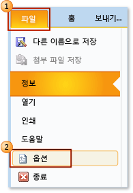
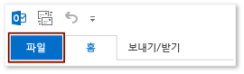
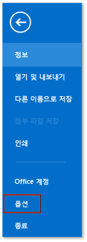
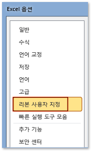
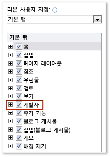

# 방법: 리본 메뉴에 개발 도구 탭 표시
  Office 응용 프로그램의 리본에 있는 **개발자** 탭에 액세스하려면 탭이 기본적으로 표시되지 않으므로 해당 탭을 표시하도록 구성해야 합니다.  예를 표시 Word의 문서 수준 사용자 지정에 <xref:Microsoft.Office.Tools.Word.GroupContentControl>을 추가하려면 해당 탭을 표시해야 합니다.  
  
> [!NOTE]  
>  이 지침은 Office 2010 또는 이상의 응용 프로그램에만 적용됩니다.  2007 Microsoft Office System에서 이 탭을 표시하려면 이 [방법: 리본에 개발자 탭 표시](http://msdn.microsoft.com/library/bb608625(v=vs.90).aspx) 항목의 다음 버전을 참조하세요.  
  
 [!INCLUDE[appliesto_ribbon](../vsto/includes/appliesto-ribbon-md.md)]  
  
> [!NOTE]  
>  Access에 **개발자** 탭이 없습니다.  
  
### 개발자 탭을 표시하려면  
  
1.  이 항목에서 지원하는 Office 응용 프로그램을 시작합니다.  이 항목의 앞 부분에서 **적용 대상:**을 참조하세요.  
  
2.  **파일** 탭에서 **옵션** 단추를 선택합니다.  
  
     다음 그림에서는 Office 2010의 **파일** 탭 및 **옵션** 단추를 보여 줍니다.  
  
       
  
     다음 그림에서는 Office 2013의 **파일** 탭을 보여 줍니다.  
  
       
  
     다음 그림에서는 Office 2013의 **옵션** 단추를 보여 줍니다.  
  
       
  
3.  *ApplicationName* **옵션** 대화 상자에서 **리본 사용자 지정** 단추를 선택합니다.  
  
     다음 그림에서는 Excel 2010의 **옵션** 대화 상자와 **리본 사용자 지정** 단추를 보여 줍니다.  이 단추의 위치는 이 항목의 위쪽 “적용 대상" 섹션에 나열된 다른 모든 응용 프로그램에서 유사합니다.  
  
       
  
4.  기본 탭 목록에서 **개발자** 확인란을 선택합니다.  
  
     다음 그림에서는 Word 2010 및 [!INCLUDE[Word_15_short](../vsto/includes/word-15-short-md.md)]의 **개발자** 확인란을 보여 줍니다.  이 확인란의 위치는 이 항목의 위쪽 “적용 대상" 섹션에 나열된 다른 모든 응용 프로그램에서 유사합니다.  
  
       
  
5.  **확인** 단추를 선택하여 **옵션** 대화 상자를 닫습니다.  
  
## 참고 항목  
 [Office UI 사용자 지정](../vsto/office-ui-customization.md)  
  
  