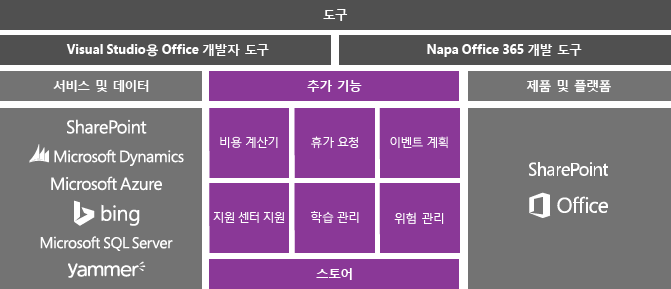
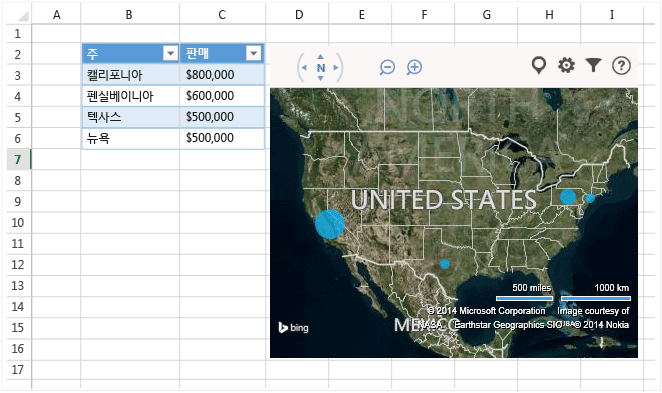

# Visual Studio에서 office 및 SharePoint 개발
  사용자가 [Office 스토어](https://store.office.com/) 또는 조직 카탈로그에서 다운로드하는 간단한 앱 또는 추가 기능이나 컴퓨터에 설치하는 .NET Framework 기반 솔루션을 만들어 Microsoft Office 및 SharePoint를 확장할 수 있습니다.  
  
 항목 내용:  
  
-   [Office 및 SharePoint용 추가 기능 만들기](#Apps)  
  
-   [VSTO 추가 기능 만들기](#Add-ins)  
  
-   [SharePoint 솔루션 만들기](#Solutions)  
  
##   Office 및 SharePoint용 추가 기능 만들기  
 Office 2013 및 SharePoint 2013에는 Office와 SharePoint를 확장하는 추가 기능을 빌드 및 배포하고 수익을 창출할 수 있는 새로운 추가 기능 모델이 도입되었습니다.  Office 또는 SharePoint Online에서 이러한 추가 기능을 실행할 수 있으며 사용자는 다양한 장치에서 추가 기능을 조작할 수 있습니다.  
  
 새 [Office 추가 기능 모델](https://msdn.microsoft.com/library/office/jj220082.aspx) 을 사용하여 사용자를 위한 Office 환경을 확장하는 방법을 알아봅니다.  
  
 이러한 추가 기능은 VSTO 추가 기능과 솔루션에 비해 차지하는 공간이 매우 적으며 HTML5, JavaScript, CSS3, XML 등 거의 모든 웹 프로그래밍 기술을 사용하여 빌드할 수 있습니다.  추가 기능 빌드를 시작하려면 Visual Studio의 Office 개발자 도구를 사용하거나 브라우저에서 프로젝트를 만들고 코드를 작성하고 추가 기능을 실행할 수 있도록 하는 간단한 웹 기반 도구인 Office 365 개발 도구(코드명 Napa)를 사용합니다.  
  
   
  
### Office 추가 기능 빌드  
 Office의 기능을 확장하려면 Office 추가 기능을 빌드합니다. 앱은 기본적으로 Excel, Word, Outlook, PowerPoint 등의 Office 응용 프로그램에서 호스팅되는 웹 페이지입니다. 문서, 워크시트, 전자 메일 메시지, 약속, 프레젠테이션 및 프로젝트에 기능을 추가할 수 있습니다.  
  
 이러한 앱은 Office 스토어에서 판매할 수 있습니다.  [Office 스토어](https://store.office.com/) 에서는 간편하게 추가 기능으로 수익을 창출하고 업데이트를 관리하고 원격 분석을 추적할 수 있습니다. 또한 SharePoint의 앱 카탈로그나 Exchange Server에서 앱을 사용자에게 게시할 수도 있습니다.  
  
 아래의 Office용 앱은 Bing 지도에서 워크시트 데이터를 표시합니다.  
  
   
  
 **자세히**  
  
|대상|보기|  
|--------|---------|  
|Office 추가 기능에 대해 자세히 알아보고 앱 빌드해 보기|[Office 추가 기능](http://msdn.microsoft.com/office/dn448457)|  
|Office를 확장할 수 있는 다양한 방식을 비교하고 앱을 사용할지 아니면 Office 추가 기능을 사용할지 결정|[Office 추가 기능, VSTO 및 VBA에 대한 로드맵](http://blogs.msdn.com/b/officeapps/archive/2013/06/18/roadmap-for-apps-for-office-vsto-and-vba.aspx)|  
  
### SharePoint 추가 기능 빌드  
 사용자를 위해 SharePoint를 확장하려면 SharePoint 추가 기능을 빌드합니다. 사용자 또는 비즈니스에 대 한 필요성을 해결 하는 소규모, 사용 하기 쉬운, 독립 실행형 응용 프로그램은 기본적으로 합니다.  
  
 [Office 스토어](https://store.office.com/)에서 SharePoint용 앱을 판매할 수 있습니다. SharePoint의 추가 기능 카탈로그를 통해 사용자에게 추가 기능을 게시할 수도 있습니다.  사이트 소유자는 팜 서버 또는 사이트 모음 관리자의 도움 없이도 SharePoint 사이트에서 추가 기능을 설치, 업그레이드 및 제거할 수 있습니다.  
  
 사용자가 고객사 연락처를 관리할 수 있도록 SharePoint 용 응용 프로그램의 예를 들면 다음과 같습니다.  
  
   
  
 **자세히**  
  
|대상|보기|  
|--------|---------|  
|SharePoint 추가 기능에 대해 자세히 알아보고 앱 빌드해 보기|[SharePoint 추가 기능](https://msdn.microsoft.com/library/office/fp179930.aspx)|  
|SharePoint용 추가 기능과 기존 SharePoint 솔루션 비교|[SharePoint 솔루션과 SharePoint 추가 기능 비교](http://msdn.microsoft.com/library/office/jj163114.aspx)|  
|SharePoint 추가 기능을 빌드할지 SharePoint 솔루션을 빌드할지 선택|[SharePoint 솔루션과 SharePoint 추가 기능을 사용할지 결정](https://msdn.microsoft.com/library/office/jj163114.aspx)|
  
##   VSTO 추가 기능 만들기  
 VSTO 추가 기능을 Office 2007 또는 Office 2010을 대상으로 하거나 Office 추가 기능 가능한 수준을 Office 2013 및 Office 2016을 확장 하 만듭니다. VSTO 추가 기능은 데스크톱에서만 실행되며 사용자는 배포 및 지원 하기가 대개 더 어렵습니다 있도록 VSTO 추가 기능을 설치 해야 합니다.  그러나 VSTO 추가 기능은 Office와 보다 긴밀하게 통합할 수 있습니다. 예를 들어 추가 기능을 통해 Office 리본 메뉴에 탭과 컨트롤을 추가하고 문서 병합, 차트 수정 등의 고급 자동화 작업을 수행할 수 있습니다. .NET Framework와 C# 및 Visual Basic을 사용하여 Office 개체와 상호 작용할 수 있습니다.  
  
 다음은 어떤 VSTO 추가 기능을 수행할 수 있는 예가입니다. 이 VSTO 추가 기능은 PowerPoint에 리본 메뉴 컨트롤, 사용자 지정 작업창 및 대화 상자를 추가합니다.  
  
   
  
 **자세히**  
  
|대상|읽기|  
|--------|----------|  
|Office를 확장할 수 있는 다양한 방법을 비교하고 VSTO 추가 기능을 사용할지 또는 Office 추가 기능을 사용할지 결정|[Office 추가 기능, VSTO 및 VBA에 대한 로드맵](http://blogs.msdn.com/b/officeapps/archive/2013/06/18/roadmap-for-apps-for-office-vsto-and-vba.aspx)|  
|VSTO 추가 기능 만들기|[Visual Studio에서 VSTO 추가 기능 빌드](https://msdn.microsoft.com/library/jj620922.aspx)|  
  
##   SharePoint 솔루션 만들기  
 SharePoint Foundation 2010 및 SharePoint Server 2010을 대상으로 하거나 SharePoint 추가 기능으로 가능한 수준을 방법으로 SharePoint 2013 및 SharePoint 2016을 확장 하는 SharePoint 솔루션을 만듭니다.  
  
 SharePoint 솔루션을 사용하려면 온-프레미스 SharePoint 팜 서버가 필요합니다. SharePoint 솔루션은 관리자가 설치해야 합니다. 또한 이러한 솔루션은 SharePoint에서 실행되므로 서버 성능에 영향을 줄 수 있습니다. 그러나 솔루션을 통해 SharePoint 개체에 보다 심층적으로 액세스할 수 있습니다. 또한 SharePoint 솔루션을 빌드할 때는 .NET Framework와 C# 및 Visual Basic을 사용하여 SharePoint 개체와 상호 작용할 수 있습니다.  
  
 **자세히**  
  
|대상|보기|  
|--------|---------|  
|SharePoint 솔루션과 SharePoint 추가 기능 비교|[SharePoint 솔루션과 SharePoint 추가 기능 비교](http://msdn.microsoft.com/library/office/jj163114.aspx)|  
|SharePoint 솔루션 만들기|[SharePoint 솔루션 만들기](../sharepoint/create-sharepoint-solutions.md)|  
  
  
