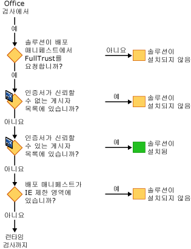
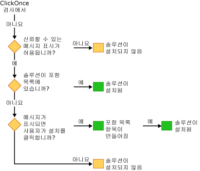

# Office 솔루션 보안
  Office 솔루션에 대 한 보안 모델에서는 여러 가지 기술을:는 [!INCLUDE[vsto_runtime](../vsto/includes/vsto-runtime-md.md)], [!INCLUDE[ndptecclick](../vsto/includes/ndptecclick-md.md)], Microsoft Office 및 Internet Explorer 제한 된 사이트 영역의 보안 센터입니다. 다음 섹션에서는 다양한 보안 기능의 작동 방식을 설명합니다.  
  
-   [Office 솔루션에 신뢰를 부여](#GrantingTrustToSolutions)  
  
-   [문서에 신뢰를 부여](#GrantingTrustToDocuments)  
  
-   [Windows Installer를 사용 하는 경우 신뢰를 부여 합니다.](#GrantingTrustWindowsInstaller)  
  
-   [Office 솔루션에 대 한 특정 보안 고려 사항](#Security)  
  
-   [개발 중 보안](#SecurityDuringDeployment)  
  
-   [Visual Studio Tools for Office 런타임](#VisualStudioToolsForOfficeRuntime)  
  
 [!INCLUDE[appliesto_all](../vsto/includes/appliesto-all-md.md)]  
  
##   Office 솔루션에 신뢰를 부여  
 Office 솔루션에 신뢰를 부여하는 것은 각 최종 사용자의 보안 정책을 수정하여 다음 증거에 따라 Office 솔루션을 신뢰하는 것입니다.  
  
-   배포 매니페스트에 서명하는 데 사용되는 인증서입니다.  
  
-   배포 매니페스트의 URL입니다.  
  
 자세한 내용은 참조 [Office 솔루션에 신뢰를 부여](../vsto/granting-trust-to-office-solutions.md)합니다.  
  
##   문서에 신뢰를 부여  
 문서 수준 사용자 지정을 사용하려면 문서가 신뢰할 수 있는 위치로 지정된 디렉터리에 있어야 합니다. 자세한 내용은 참조 [문서에 신뢰 부여](../vsto/granting-trust-to-documents.md)합니다.  
  
##   Windows Installer를 사용 하는 경우 신뢰를 부여 합니다.  
 Windows Installer를 사용하여 MSI 파일을 만들고 Office 솔루션을 Program Files 디렉터리에 설치합니다. 이 작업에는 관리자 권한이 필요합니다. Program Files 디렉터리에 Office 솔루션에 대 한 Visual Studio 2010 Tools for Office 런타임에서 신뢰할 수 있도록 이러한 Office 솔루션을 고려 하 고 ClickOnce 신뢰 프롬프트는 표시 되지 않습니다.  
  
##   Office 솔루션에 대 한 특정 보안 고려 사항  
 [!INCLUDE[net_v40_short](../sharepoint/includes/net-v40-short-md.md)], [!INCLUDE[net_v45](../vsto/includes/net-v45-md.md)] 및 Microsoft Office에서 제공된 보안 기능을 통해 Office 솔루션에서 다양한 보안 위협을 방지할 수 있습니다. 자세한 내용은 참조 [Office 솔루션에 대 한 특정 보안 고려 사항](../vsto/specific-security-considerations-for-office-solutions.md)합니다.  
  
##   개발 중 보안  
 개발 프로세스를 간소화할 수 있도록 Visual Studio는 프로젝트를 빌드할 때마다 컴퓨터에서 솔루션을 실행 및 디버그하는 데 필요한 보안 정책을 설정합니다. 일부 시나리오에서는 프로젝트를 개발하기 위해 추가적인 보안 조치를 취해야 할 수 있습니다.  
  
### 문서 수준 솔루션  
 다음 유형의 프로젝트를 개발하고 있다면 Microsoft Office 응용 프로그램의 신뢰할 수 있는 위치 목록에 문서의 정규화된 경로를 추가해야 합니다.  
  
-   문서 수준 솔루션에 있는 네트워크 파일 공유와 같은  *\\\servername\sharename*합니다.  
  
-   솔루션을 사용 하는 Word 용 문서 수준 *.doc* 또는 *.docm* 파일입니다.  
  
 신뢰할 수 있는 위치 목록에 문서 위치를 추가할 때 하위 디렉터리를 포함하거나, 특히 디버그 및 빌드 폴더를 포함합니다. 자세한 내용은 Microsoft Office Online 도움말 문서를 참조 하십시오. [만들기, 제거 또는 변경 프로그램 파일에 대 한 신뢰할 수 있는 위치](https://support.office.com/en-au/article/Create-remove-or-change-a-trusted-location-for-your-files-f5151879-25ea-4998-80a5-4208b3540a62)합니다.  
  
### 임시 인증서  
 서명 인증서가 없는 경우 Visual Studio가 임시 인증서를 만듭니다. 이 임시 인증서는 배포하는 동안에만 사용하고 배포를 위해 공식 인증서를 구입해야 합니다.  
  
 임시 인증서는 Office 프로젝트가 처음 빌드된 후에 생성됩니다. 다음 누를 때 **F5**, 프로젝트는 인증서를 추가할 때 변경 된 것으로 표시 되기 때문에 프로젝트가 다시 빌드됩니다.  
  
 잠시 후에 많은 임시 인증서가 생성되었을 수 있으므로 때때로 임시 인증서를 지워야 합니다.  
  
##   Visual Studio Tools for Office 런타임  
 [!INCLUDE[vsto_runtime](../vsto/includes/vsto-runtime-md.md)] 사용자 지정에 부여 된 권한과 게시자의 id를 확인 하는 기능이 있습니다. 이 기능은 보안 검사 시퀀스를 통해 이들 권한을 확인합니다.  
  
### 사용자 지정을 로드 하는 동안 보안  
 문서 수준 사용자 지정이 로드 되는 [!INCLUDE[vsto_runtime](../vsto/includes/vsto-runtime-md.md)] 항상 문서가 신뢰할 수 있는 위치 목록에 있는지 여부를 검사 합니다. 또한 런타임은 솔루션이 응용 프로그램 매니페스트의 FullTrust를 요청 하는지 여부를 확인 합니다. 사용자 지정이 로드되는 동안 추가적인 보안 검사를 수행합니다.  
  
### 설치 하는 동안 보안 검사 시퀀스  
 Office 솔루션이 설치되거나 업데이트될 때 [!INCLUDE[vsto_runtime](../vsto/includes/vsto-runtime-md.md)]에서는 일련의 보안 검사를 특정 시퀀스로 수행하여 신뢰에 대한 결정을 내립니다. 솔루션이 신뢰할 수 있음을 런타임이 결정한 경우에만 솔루션이 설치 또는 업데이트됩니다.  
  
 네 가지 방법 중 하나로 설치 프로세스를 시작할 수 있습니다: 설치 프로그램을 실행 하 여, 배포 매니페스트, Microsoft Office 응용 프로그램 호스트를 열어 또는 실행 하 여 *VSTOInstaller.exe*합니다.  
  
 첫 번째 보안 검사는 문서 수준 솔루션에만 적용됩니다. 문서 수준 솔루션의 문서는 신뢰할 수 있는 위치에 있어야 합니다. 문서가 원격 네트워크 파일 공유에 있거나에 *.doc* 또는 *.docm* 파일 이름 확장명을 신뢰할 수 있는 위치 목록에 문서 위치를 추가 해야 합니다. 자세한 내용은 참조 [문서에 신뢰 부여](../vsto/granting-trust-to-documents.md)합니다.  
  
   
  
 다음 보안 검사 집합은 [!INCLUDE[vsto_runtime](../vsto/includes/vsto-runtime-md.md)] 및 ClickOnce에서 시작됩니다. 이러한 검사를 전달 하려면 Office 솔루션 FullTrust 권한을 요청 해야, 신뢰할 수 없는 게시자 목록에 나열 되어 있지 않은 인증서로 서명 되어야 및 Internet Explorer 제한 된 영역에 없는 위치에 있어야 합니다. 인증서가 신뢰할 수 있는 게시자 목록에 솔루션이 즉시 설치 됩니다. 그러지 않으면 검사의 하나가 실패하지 않았을 경우 솔루션은 계속해서 마지막 검사 집합으로 진행됩니다.  
  
   
  
 경우는 [!INCLUDE[ndptecclick](../vsto/includes/ndptecclick-md.md)] 신뢰 프롬프트가 허용 되 고 솔루션에 아직 신뢰가 부여 되지, 런타임은 최종 사용자가 신뢰 결정을 내리도록 허용 합니다. 사용자가 솔루션에 신뢰를 부여하면 항목이 사용자 포함 목록에 추가됩니다. 사용자 포함 목록의 모든 솔루션에는 완전 신뢰가 있고 설치 및 실행될 수 있습니다.  
  
 Visual Studio 2010부터 Windows Installer(MSI)를 사용하여 Office 솔루션을 Program Files 디렉터리에 설치하면 포함 목록이 무시됩니다. 자세한 내용은 참조 [포함 목록을 사용 하 여 신뢰 하는 Office 솔루션](../vsto/trusting-office-solutions-by-using-inclusion-lists.md)합니다.  
  
   
  
## 참고자료  
 [Office 솔루션에 신뢰를 부여](../vsto/granting-trust-to-office-solutions.md)   
 [문서에 신뢰를 부여](../vsto/granting-trust-to-documents.md)   
 [포함 목록을 사용 하 여 Office 솔루션 신뢰](../vsto/trusting-office-solutions-by-using-inclusion-lists.md)   
 [방법: 포함 목록 보안 구성](../vsto/how-to-configure-inclusion-list-security.md)   
 [방법: Office 솔루션에 서명](../vsto/how-to-sign-office-solutions.md)   
 [Office 솔루션 보안 문제 해결](../vsto/troubleshooting-office-solution-security.md)   
 [Office 솔루션에 대 한 응용 프로그램 매니페스트](../vsto/application-manifests-for-office-solutions.md)   
 [Office 솔루션의 배포 매니페스트](../vsto/deployment-manifests-for-office-solutions.md)   
 [ClickOnce 참조](/visualstudio/deployment/clickonce-reference)   
 [Office 솔루션 배포](../vsto/deploying-an-office-solution.md)  
  
  