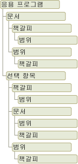

# Word 개체 모델 개요
  Visual Studio에서 Word 솔루션을 개발하는 경우 Word 개체 모델을 조작합니다. 이 개체 모델은 Word용 주 interop 어셈블리에 제공되고 <xref:Microsoft.Office.Interop.Word> 네임스페이스에서 제공되는 클래스 및 인터페이스로 구성됩니다.  
  
 [!INCLUDE[appliesto_wdalldocapp](../vsto/includes/appliesto-wdalldocapp-md.md)]  
  
 이 항목에서는 Word 개체 모델에 대한 간략한 개요를 제공합니다. 전체 Word 개체 모델에 대해 자세히 알아볼 수 있는 리소스는 [Word 개체 모델 설명서 사용](#WordOMDocumentation)을 참조하세요.  
  
 Word 개체 모델을 사용하여 특정 작업을 수행하는 방법에 대한 자세한 내용은 다음 항목을 참조하세요.  
  
-   [문서 작업](../vsto/working-with-documents.md)  
  
-   [문서 텍스트 작업](../vsto/working-with-text-in-documents.md)  
  
-   [표 작업](../vsto/working-with-tables.md)  
  
##   Word 개체 모델 이해  
 Word는 조작할 수 있는 수백 개의 개체를 제공합니다. 이러한 개체는 사용자 인터페이스와 유사한 계층 구조로 구성됩니다. 계층 구조의 맨 위에는 <xref:Microsoft.Office.Interop.Word.Application> 개체가 있습니다. 이 개체는 Word의 현재 인스턴스를 나타냅니다. <xref:Microsoft.Office.Interop.Word.Application> 개체에는 <xref:Microsoft.Office.Interop.Word.Document>, <xref:Microsoft.Office.Interop.Word.Selection>, <xref:Microsoft.Office.Interop.Word.Bookmark>및 <xref:Microsoft.Office.Interop.Word.Range> 개체가 포함되어 있습니다. 이러한 각 개체에는 개체를 조작하고 상호 작용하기 위해 액세스할 수 있는 여러 메서드와 속성이 있습니다.  
  
 다음 그림에서는 Word 개체 모델의 계층 구조에서 이러한 개체 보기 중 하나를 보여 줍니다.  
  
   
  
 처음에는 개체가 겹쳐 보입니다. 예를 들어 <xref:Microsoft.Office.Interop.Word.Document> 및 <xref:Microsoft.Office.Interop.Word.Selection> 개체가 모두 <xref:Microsoft.Office.Interop.Word.Application> 개체의 멤버이지만 <xref:Microsoft.Office.Interop.Word.Document> 개체는 <xref:Microsoft.Office.Interop.Word.Selection> 개체의 멤버이기도 합니다. <xref:Microsoft.Office.Interop.Word.Document> 및 <xref:Microsoft.Office.Interop.Word.Selection> 개체에 모두 <xref:Microsoft.Office.Interop.Word.Bookmark> 및 <xref:Microsoft.Office.Interop.Word.Range> 개체가 포함되어 있습니다. 여러 가지 방법으로 동일한 형식의 개체에 액세스할 수 있으므로 겹침이 존재합니다. 예를 들어 <xref:Microsoft.Office.Interop.Word.Range> 개체에 서식을 적용하지만 현재 선택 영역, 특정 단락, 섹션 또는 전체 문서의 범위에 액세스할 수도 있습니다.  
  
 다음 섹션에서는 최상위 개체 및 최상위 개체가 서로 상호 작용하는 방식을 간략하게 설명합니다. 이러한 개체에는 다음 다섯 가지가 있습니다.  
  
-   Application 개체  
  
-   Document 개체  
  
-   Selection 개체  
  
-   Range 개체  
  
-   Bookmark 개체  
  
 Word 개체 모델 외에도 Visual Studio의 Office 프로젝트는 Word 개체 모델에서 일부 개체를 확장하는 *호스트 항목* 및 *호스트 컨트롤* 을 제공합니다. 호스트 항목 및 호스트 컨트롤은 확장되는 Word 개체처럼 동작하지만 데이터 바인딩 기능과 같은 추가 기능 및 추가 이벤트도 제공합니다. 자세한 내용은 [Automating Word by Using Extended Objects](../vsto/automating-word-by-using-extended-objects.md) 및 [Host Items and Host Controls Overview](../vsto/host-items-and-host-controls-overview.md)를 참조하세요.  
  
### 응용 프로그램 개체입니다.  
 <xref:Microsoft.Office.Interop.Word.Application> 개체는 Word 응용 프로그램을 나타내며 다른 모든 개체의 부모입니다. 멤버는 일반적으로 전체 Word에 적용됩니다. 속성 및 메서드를 사용하여 Word 환경을 제어할 수 있습니다.  
  
 VSTO 추가 기능 프로젝트에서 <xref:Microsoft.Office.Interop.Word.Application> 클래스의 `Application` 필드를 사용하여 `ThisAddIn` 개체에 액세스할 수 있습니다. 자세한 내용은 [Programming VSTO Add-Ins](../vsto/programming-vsto-add-ins.md)를 시작합니다.  
  
 문서 수준 프로젝트에서 <xref:Microsoft.Office.Interop.Word.Application> 클래스의 <xref:Microsoft.Office.Tools.Word.Document.Application%2A> 속성을 사용하여 `ThisDocument` 개체에 액세스할 수 있습니다.  
  
### Document 개체  
 <xref:Microsoft.Office.Interop.Word.Document> 개체는 Word 프로그래밍의 핵심입니다. 문서와 모든 콘텐츠를 나타냅니다. 문서를 열거나 새 문서를 만드는 경우 <xref:Microsoft.Office.Interop.Word.Document> 개체의 <xref:Microsoft.Office.Interop.Word.Documents> 컬렉션에 추가되는 새로운 <xref:Microsoft.Office.Interop.Word.Application> 개체를 만듭니다. 포커스가 있는 문서를 활성 문서라고 합니다. <xref:Microsoft.Office.Interop.Word._Application.ActiveDocument%2A> 개체의 <xref:Microsoft.Office.Interop.Word.Application> 속성으로 표현됩니다.  
  
 Visual Studio의 Office 개발 도구는 <xref:Microsoft.Office.Interop.Word.Document> 형식을 제공하여 <xref:Microsoft.Office.Tools.Word.Document> 개체를 확장합니다. 이 형식은 *개체의 모든 기능에 대한 액세스를 제공하고 추가 이벤트와 관리되는 컨트롤을 추가하는 기능을 추가하는* 호스트 항목 <xref:Microsoft.Office.Interop.Word.Document> 입니다.  
  
 문서 수준 프로젝트를 만드는 경우 프로젝트에서 생성된 <xref:Microsoft.Office.Tools.Word.Document> 클래스를 사용하여 `ThisDocument` 멤버에 액세스할 수 있습니다. 멤버에 액세스할 수 있습니다는 <xref:Microsoft.Office.Tools.Word.Document> 를 사용 하 여 호스트 항목의 **Me** 또는 **이** 의 코드에서 키워드는 `ThisDocument` 클래스 또는 사용 하 여 `Globals.ThisDocument` 외부 코드에서의 `ThisDocument` 클래스입니다. 자세한 내용은 [Programming Document-Level Customizations](../vsto/programming-document-level-customizations.md)을 참조하십시오. 예를 들어 문서의 첫 번째 단락을 선택하려면 다음 코드를 사용합니다.  
  
 [!code-vb[Trin_VstcoreWordAutomation#120](../vsto/codesnippet/VisualBasic/Trin_VstcoreWordAutomationVB/ThisDocument.vb#120)]
 [!code-csharp[Trin_VstcoreWordAutomation#120](../vsto/codesnippet/CSharp/Trin_VstcoreWordAutomationCS/ThisDocument.cs#120)]  
  
 VSTO 추가 기능 프로젝트에서 런타임에 <xref:Microsoft.Office.Tools.Word.Document> 호스트 항목을 생성할 수 있습니다. 생성된 호스트 항목을 사용하여 연결된 문서에 컨트롤을 추가할 수 있습니다. 자세한 내용은 [Extending Word Documents and Excel Workbooks in VSTO Add-ins at Run Time](../vsto/extending-word-documents-and-excel-workbooks-in-vsto-add-ins-at-run-time.md)을 참조하세요.  
  
### Selection 개체  
 <xref:Microsoft.Office.Interop.Word.Selection> 개체는 현재 선택된 영역을 나타냅니다. 텍스트 굵게 표시 등 Word 사용자 인터페이스에서 작업을 수행하는 경우 텍스트를 선택하거나 강조 표시하고 서식을 적용합니다. <xref:Microsoft.Office.Interop.Word.Selection> 개체는 항상 문서에 있습니다. 선택 내용이 없는 경우 삽입 지점을 나타냅니다. 또한 선택 영역에 인접하지 않은 여러 텍스트 블록이 포함될 수 있습니다.  
  
### Range 개체  
 <xref:Microsoft.Office.Interop.Word.Range> 개체는 문서에서 인접한 영역을 나타내며 시작 문자 위치와 끝 문자 위치로 정의됩니다. 단일 <xref:Microsoft.Office.Interop.Word.Range> 개체로 제한되지 않습니다. 같은 문서에서 여러 <xref:Microsoft.Office.Interop.Word.Range> 개체를 정의할 수 있습니다. <xref:Microsoft.Office.Interop.Word.Range> 개체에는 다음과 같은 특징이 있습니다.  
  
-   삽입 지점만으로 구성되거나 텍스트 범위 또는 전체 문서로 구성될 수 있습니다.  
  
-   공백, 탭 문자 및 단락 표시와 같은 인쇄할 수 없는 문자가 포함됩니다.  
  
-   현재 선택 영역이 나타내는 영역이거나 현재 선택 영역과 다른 영역을 나타낼 수 있습니다.  
  
-   항상 표시되는 선택 영역과 달리 문서에 표시되지 않습니다.  
  
-   문서와 함께 저장되지 않고 코드가 실행되는 동안에만 존재합니다.  
  
 범위의 끝에 텍스트를 삽입하면 Word에서 자동으로 범위를 확장하여 삽입된 텍스트를 포함합니다.  
  
### 콘텐츠 컨트롤 개체  
 <xref:Microsoft.Office.Interop.Word.ContentControl> 은 Word 문서에서 텍스트 및 다른 콘텐츠 형식의 입력 및 프레젠테이션을 제어할 수 있는 방법을 제공합니다. <xref:Microsoft.Office.Interop.Word.ContentControl> 은 서식 있는 텍스트 컨트롤, 날짜 선택, 콤보 상자 등 Word 문서에서 사용하도록 최적화된 여러 형식의 UI를 표시할 수 있습니다. <xref:Microsoft.Office.Interop.Word.ContentControl> 을 사용하여 사용자가 문서 또는 템플릿의 섹션을 편집하지 못하도록 할 수도 있습니다.  
  
 Visual Studio는 <xref:Microsoft.Office.Interop.Word.ContentControl> 개체를 여러 다른 호스트 컨트롤로 확장합니다. <xref:Microsoft.Office.Interop.Word.ContentControl> 개체는 콘텐츠 컨트롤에 사용할 수 있는 여러 형식의 UI를 표시할 수 있지만 Visual Studio는 각 콘텐츠 컨트롤에 대해 다른 형식을 제공합니다. 예를 들어 <xref:Microsoft.Office.Tools.Word.RichTextContentControl> 을 사용하여 서식 있는 텍스트 컨트롤을 만들거나 <xref:Microsoft.Office.Tools.Word.DatePickerContentControl> 을 사용하여 날짜 선택을 만들 수 있습니다. 이러한 호스트 컨트롤은 네이티브 <xref:Microsoft.Office.Interop.Word.ContentControl>처럼 동작하지만 추가 이벤트 및 데이터 바인딩 기능이 있습니다. 자세한 내용은 [Content Controls](../vsto/content-controls.md)을 참조하세요.  
  
### Bookmark 개체  
 <xref:Microsoft.Office.Interop.Word.Bookmark> 개체는 시작 위치와 끝 위치를 사용하여 문서에서 인접한 영역을 나타냅니다. 책갈피를 사용하여 문서의 한 위치를 표시하거나 문서의 텍스트에 대한 컨테이너로 사용할 수 있습니다. <xref:Microsoft.Office.Interop.Word.Bookmark> 개체는 삽입 지점으로 구성되거나 전체 문서만큼 클 수 있습니다. <xref:Microsoft.Office.Interop.Word.Bookmark> 에는 <xref:Microsoft.Office.Interop.Word.Range> 개체와 차별화하는 다음과 같은 특징이 있습니다.  
  
-   디자인 타임에 책갈피에 이름을 지정할 수 있습니다.  
  
-   <xref:Microsoft.Office.Interop.Word.Bookmark> 개체는 문서와 함께 저장되므로 코드 실행이 중지되거나 문서를 닫을 때 삭제되지 않습니다.  
  
-   책갈피를 숨기 거 나 설정 하 여 볼 수 있습니다는 <xref:Microsoft.Office.Interop.Word.View.ShowBookmarks%2A> 의 속성은 <xref:Microsoft.Office.Interop.Word.View> 개체를 **false** 또는 **true**합니다.  
  
 Visual Studio는 <xref:Microsoft.Office.Interop.Word.Bookmark> 호스트 컨트롤을 제공하여 <xref:Microsoft.Office.Tools.Word.Bookmark> 개체를 확장합니다. <xref:Microsoft.Office.Tools.Word.Bookmark> 호스트 컨트롤은 네이티브 <xref:Microsoft.Office.Interop.Word.Bookmark>처럼 동작하지만 추가 이벤트 및 데이터 바인딩 기능이 있습니다. Windows Form의 텍스트 상자 컨트롤에 데이터를 바인딩하는 것과 동일한 방식으로 문서의 책갈피 컨트롤에 데이터를 바인딩할 수 있습니다. 자세한 내용은 [Bookmark Control](../vsto/bookmark-control.md)을 참조하세요.  
  
##   Word 개체 모델 설명서 사용  
 Word 개체 모델에 대한 자세한 내용은 Word PIA(주 interop 어셈블리) 참조 및 VBA(Visual Basic for Applications) 개체 모델 참조를 참조할 수 있습니다.  
  
### 주 interop 어셈블리 참조  
 Word PIA 참조 설명서에서는 Word에 대한 주 interop 어셈블리의 형식에 대해 설명합니다. 이 설명서는 [Word 2010 주 Interop 어셈블리 참조](http://go.microsoft.com/fwlink/?LinkId=189588)에서 사용할 수 있습니다.  
  
 PIA에서 클래스와 인터페이스의 차이점, PIA의 이벤트 구현 방식 등 Word PIA의 디자인에 대한 자세한 내용은 [Office 주 Interop 어셈블리의 클래스 및 인터페이스 개요](http://go.microsoft.com/fwlink/?LinkId=189592)를 참조하세요.  
  
### VBA 개체 모델 참조  
 VBA 개체 모델 참조에서는 VBA 코드로 표시되는 Word 개체 모델에 대해 설명합니다. 자세한 내용은 [Word 2010 개체 모델 참조](http://go.microsoft.com/fwlink/?LinkId=199772)를 참조하세요.  
  
 VBA 개체 모델 참조의 모든 개체 및 멤버는 Word PIA의 형식 및 멤버에 해당합니다. VBA 개체 모델 참조에서 문서 개체에 해당 하는 예를 들어는 <xref:Microsoft.Office.Interop.Word.Document> 는 Word PIA의 개체입니다. VBA 개체 모델 참조에서는 대부분의 속성, 메서드 및 이벤트에 대한 코드 예제를 제공하지만 Visual Studio를 사용하여 만든 Word 프로젝트에서 사용하려면 이 참조의 VBA 코드를 Visual Basic 또는 Visual C#으로 변환해야 합니다.  
  
## 참고 항목  
 [Office 주 Interop 어셈블리](../vsto/office-primary-interop-assemblies.md)   
 [확장 된 개체를 사용 하 여 Word 자동화](../vsto/automating-word-by-using-extended-objects.md)   
 [문서 작업](../vsto/working-with-documents.md)   
 [문서 텍스트 작업](../vsto/working-with-text-in-documents.md)   
 [테이블 작업](../vsto/working-with-tables.md)   
 [Host Items and Host Controls Overview](../vsto/host-items-and-host-controls-overview.md)   
 [Programmatic Limitations of Host Items and Host Controls](../vsto/programmatic-limitations-of-host-items-and-host-controls.md)   
 [Office 솔루션의 선택적 매개 변수](../vsto/optional-parameters-in-office-solutions.md)  
  
  