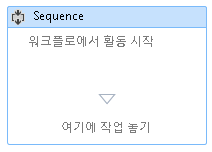
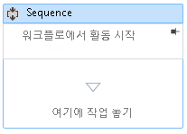

# 방법: Workflow Designer에서 워크플로에 주석 추가
더 크고 더 복잡한 워크플로를 쉽게 만들기 위해 [!INCLUDE[net_v45](../ide/includes/net_v45_md.md)]를 사용하여 개발자는 디자이너에서 다음 유형의 항목에 주석을 추가할 수 있습니다.  
  
-   <xref:System.Activities.Activity>  
  
-   <xref:System.Activities.Statements.State>  
  
-   <xref:System.Activities.Statements.Transition>  
  
-   <xref:System.Activities.Statements.FlowNode>에서 파생된 클래스  
  
-   <xref:System.Activities.Variable>  
  
-   <xref:System.Activities.Argument>  
  
> [!IMPORTANT]
>  주석 내용은 워크플로와 관련된 XAML 파일에 일반 텍스트로 저장되며 다른 사용자가 읽을 수 있습니다.민감한 정보를 주석에 입력할 때는 주의하십시오.  
  
### 디자이너의 활동에 주석 추가  
  
1.  워크플로 디자이너에서 워크플로 디자이너의 항목을 마우스 오른쪽 단추로 클릭하고 **주석**, **주석 추가**를 선택합니다.  
  
2.  제공된 공란에 주석 텍스트를 추가합니다.  
  
3.  항목은 주석 아이콘을 표시합니다.주석 아이콘을 가리키면 주석 텍스트가 표시됩니다.  
  
       
  
### 활동 디자이너에 주석 표시  
  
1.  활동 외부에 표시되는 주석이 있는 활동 디자이너에서 주석 표시기의 **고정** 아이콘을 클릭합니다.  
  
2.  활동 디자이너에 주석이 표시됩니다.아래의 스크린샷에서 활동 디자이너에 "워크플로에서 활동 시작" 주석이 표시됩니다.  
  
       
  
3.  활동 디자이너 외부에 주석을 표시하려면 활동 디자이너의 주석 영역을 마우스로 가리키고 **고정 해제** 아이콘을 클릭합니다  
  
       
  
### 모든 주석 표시 또는 숨기기  
  
1.  주석이 있는 활동을 마우스 오른쪽 단추로 클릭합니다.**주석**, **모든 주석 표시**를 선택합니다.  
  
2.  활동 디자이너에 모든 주석이 표시됩니다.  
  
3.  활동 디자이너 외부에 모든 주석을 표시하려면 활동을 마우스 오른쪽 단추로 클릭하고 **주석**, **모든 주석 숨기기**를 선택합니다.  
  
### 활동 주석 편집 또는 삭제  
  
1.  주석이 있는 활동을 마우스 오른쪽 단추로 클릭합니다.  
  
2.  **주석**, **주석 편집** 또는 **주석 삭제**를 선택합니다.  
  
3.  편집 또는 삭제할 주석이 열립니다.  
  
4.  즉시 모든 주석을 삭제하려면 워크플로 디자이너를 마우스 오른쪽 단추로 클릭하고 **주석**, **모든 주석 삭제**를 선택합니다.  
  
### 변수 또는 인수에 대한 주석 추가, 편집 및 삭제  
  
1.  변수 또는 인수를 마우스 오른쪽 단추로 클릭하고 주석 추가를 선택합니다.  
  
2.  주석의 텍스트를 입력합니다.변수 또는 인수에 주석 아이콘이 표시됩니다.  
  
3.  주석이 있는 변수 또는 인수를 마우스 오른쪽 단추로 클릭합니다.주석 편집을 선택합니다.  
  
4.  편집할 주석이 열립니다.  
  
5.  주석이 있는 변수 또는 인수를 마우스 오른쪽 단추로 클릭합니다.주석 삭제를 선택합니다.  
  
6.  주석이 삭제됩니다.