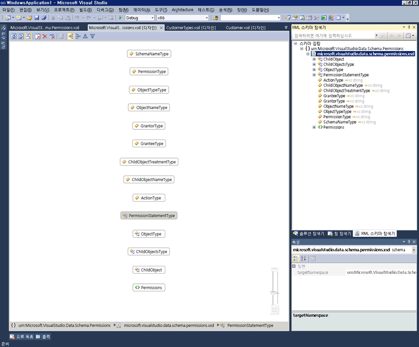
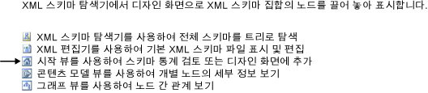

# 그래프 보기

그래프 뷰에서는 전역 스키마 노드 및 노드 간 관계를 그래픽으로 표현합니다. 그래프 뷰에서는 디자인 화면에서 스키마 집합의 레이아웃을 변경할 수 없습니다. 그래프 뷰에는 XML 스키마 디자이너 도구 모음과 이동 경로 탐색 막대도 들어 있습니다.

 다음 이미지에서는 디자인 화면에서 전역 노드가 6개인 그래프 뷰를 보여 줍니다.

 

## 디자인 화면

 그래프 뷰의 디자인 화면의 내용을 표시는 [XML 스키마 디자이너 작업 영역](../xml-tools/xml-schema-designer-workspace.md)합니다. 작업 영역에 스키마 집합의 전역 노드가 포함되어 있는 경우 해당 노드는 그래프 뷰 디자인 화면에 표시되고 관계가 설정된 노드 사이에 화살표가 그려져 있습니다.

 그래프 뷰에서 노드를 두 번 클릭하면 XML 편집기가 표시됩니다.

 작업 영역에서 선택한 노드를 삭제 하려면 XSD 디자이너 도구 모음을 사용 하 여 또는 **삭제** 키입니다.

 디자인 화면 비어 있으면 XML 편집기는 **XML 스키마 탐색기**, 및 워터 마크가 표시 됩니다. *워터 마크* 는 모든 XSD 디자이너 뷰에 대 한 링크 목록이 나와 있습니다.

 

 스키마 집합에 오류가 있는 경우 목록 끝에 "오류 목록을 사용하여 스키마 집합의 오류 표시 및 수정"이라는 텍스트가 표시됩니다.

## 이동 경로 탐색 막대

 그래프 뷰의 하단에 있는 이동 경로 탐색 막대에서는 스키마 집합에서 선택한 노드가 위치한 곳을 보여 줍니다. 여러 항목을 선택하면 이동 경로 탐색 막대가 비게 됩니다.

## 상황에 맞는 메뉴

 다음 표에서는 그래프 뷰 디자인 화면의 모든 노드에 사용할 수 있는 옵션에 대해 설명합니다.

|옵션|설명|
|------------|-----------------|
|**XML 스키마 탐색기에 표시**|스키마 탐색기에 포커스를 두고 스키마 집합 노드를 강조 표시합니다.|
|**그래프 뷰로 표시**|회색으로 표시된 그래프 뷰로 전환합니다.|
|**샘플 XML 생성**|전역 요소에만 사용할 수 있습니다. 전역 요소를 위한 샘플 XML 파일을 생성합니다.|
|**작업 영역 지우기**|작업 영역 및 디자인 화면을 지웁니다.|
|**작업 영역에서 제거**|작업 영역 및 디자인 화면에서 선택한 노드를 제거합니다.|
|**작업 영역에서 선택을 제외한 모든 필드 제거**|작업 영역 및 디자인 화면에서 선택하지 않은 노드를 제거합니다.|
|**다이어그램을 이미지로 내보내기**|디자인 화면을 XPS 파일에 저장합니다.|
|**모두 선택**|디자인 화면에서 모든 노드를 선택합니다.|
|**코드 보기**|XML 편집기에서 선택된 노드가 포함된 파일을 엽니다. 선택한 항목의 **XML 스키마 탐색기** 도 XML 편집기에서 선택 합니다.|
|**속성 창**|열립니다는 **속성** 창 (아직 열지 않은) 하는 경우. 이 창에서 노드에 대한 정보를 표시합니다.|

 전역 요소에 대한 상황에 맞는 메뉴에는 위에서 설명한 일반 옵션 이외에도 다음 옵션이 있습니다.

|옵션|설명|
|------------|-----------------|
|**형식 정의 추가**|기본 형식을 다이어그램에 추가합니다.|
|**모든 참조를 추가 합니다.**|요소를 참조하는 모든 노드를 추가하고 이러한 노드 간 관계를 나타내는 화살표를 그립니다.|
|**대체 그룹 멤버 추가**|모든 대체 그룹 멤버를 추가합니다. 요소가 대체 그룹의 헤드 또는 멤버인 경우 이 옵션이 뷰에 나타납니다.|
|**샘플 XML 생성**|전역 요소를 위한 샘플 XML 파일을 생성합니다.|

 전역 단순 형식 및 전역 복합 형식에 대한 상황에 맞는 메뉴에는 위에서 설명한 일반 옵션 이외에도 다음 옵션이 있습니다.

|옵션|설명|
|------------|-----------------|
|**기본 형식 추가**|선택한 형식이 전역 형식에서 파생된 경우 선택한 형식의 기본 형식을 추가합니다.|
|**모든 참조를 추가 합니다.**|선택한 형식의 모든 참조를 추가합니다. 여기에는 선택한 형식의 요소 및 특성과 선택한 형식에서 파생된 형식이 포함됩니다.|
|**모든 파생된 형식 추가**|선택한 형식에서 직간접적으로 파생된 모든 형식을 추가합니다.|
|**모든 상위 항목 추가**|모든 부모(기본) 형식을 추가합니다.|

 전역 그룹 및 특성 그룹에 대한 상황에 맞는 메뉴에는 위에서 설명한 일반 옵션 이외에도 다음 옵션이 있습니다.

|옵션|설명|
|------------|-----------------|
|**모든 참조를 추가 합니다.**|그룹을 참조하는 모든 노드를 추가하고 이러한 노드 간 관계를 나타내는 화살표를 그립니다.|
|**모든 멤버를 추가 합니다.**|그룹의 모든 멤버를 추가하고 이러한 노드 간 관계를 나타내는 화살표를 그립니다.|

 전역 특성에 대한 상황에 맞는 메뉴에는 위에서 설명한 일반 옵션 이외에도 다음 옵션이 있습니다.

|옵션|설명|
|------------|-----------------|
|**모든 참조를 추가 합니다.**|그룹을 참조하는 모든 노드를 추가하고 이러한 노드 간 관계를 나타내는 화살표를 그립니다.|

## 속성 창

 상황에 맞는 메뉴를 사용 하 여 처음으로 엽니다는 **속성** 창. 기본적으로는 **속성** 창이 Visual Studio의 오른쪽 아래에 나타납니다. 콘텐츠 모델 뷰에 렌더링 된 노드를 클릭 하면 해당 노드의 속성이에 표시 됩니다는 **속성** 창.

## XSD 도구 모음

 그래프 뷰가 활성화되면 다음 XSD 도구 모음 단추를 사용할 수 있습니다.

 

|옵션|설명|
|------------|-----------------|
|**시작 뷰 표시**|전환 하는 [보기 시작](../xml-tools/start-view.md)합니다. 바로 가기 키를 사용 하 여이 뷰에 액세스할 수 있습니다: **Ctrl**+**1**합니다.|
|**콘텐츠 모델 뷰 표시**|전환 하는 [콘텐츠 모델 뷰](../xml-tools/content-model-view.md)합니다. 바로 가기 키를 사용 하 여이 뷰에 액세스할 수 있습니다: **Ctrl**+**2**합니다.|
|**그래프 뷰 표시**|전환 하는 [그래프 보기](../xml-tools/graph-view.md)합니다. 바로 가기 키를 사용 하 여이 뷰에 액세스할 수 있습니다: **Ctrl**+**3**합니다.|
|**작업 영역 지우기**|작업 영역 및 디자인 화면을 지웁니다.|
|**작업 영역에서 제거**|작업 영역 및 디자인 화면에서 선택한 노드를 제거합니다.|
|**작업 영역에서 선택을 제외한 모든 필드 제거**|작업 영역 및 디자인 화면에서 선택하지 않은 노드를 제거합니다. 이 옵션은 콘텐츠 모델 뷰 및 그래프 뷰에서 사용됩니다.|
|**왼쪽에서 오른쪽**|그래프 뷰의 레이아웃을 노드의 왼쪽에서 오른쪽 계층적 표현으로 변경합니다. 바로 가기 키를 사용 하 여이 옵션에 액세스할 수 있습니다: **Alt**+**오른쪽 화살표**합니다.|
|**오른쪽에서 왼쪽**|그래프 뷰의 레이아웃을 노드의 오른쪽에서 왼쪽 계층적 표현으로 변경합니다. 바로 가기 키를 사용 하 여이 옵션에 액세스할 수 있습니다: **Alt**+**왼쪽된 화살표**합니다.|
|**위쪽에서 아래쪽**|그래프 뷰의 레이아웃을 노드의 위쪽에서 아래쪽 계층적 표현으로 변경합니다. 바로 가기 키를 사용 하 여이 옵션에 액세스할 수 있습니다: **Alt**+**아래쪽 화살표**합니다.|
|**아래쪽에서 위쪽**|그래프 뷰의 레이아웃을 노드의 아래쪽에서 위쪽 계층적 표현으로 변경합니다. 바로 가기 키를 사용 하 여이 옵션에 액세스할 수 있습니다: **Alt**+**위쪽 화살표**합니다.|

## 이동/스크롤

 스크롤 막대를 사용 하 여 또는 눌러 디자인 화면을 이동할 수는 **Ctrl** 키를 클릭 하 고 마우스를 끕니다. 클릭하여 끌기를 통해 디자인 화면을 이동할 때 커서는 네 방향을 가리키는 네 개의 교차 화살표로 변경됩니다.

## 실행 취소/다시 실행

 그래프 뷰에서 다음 작업에 대한 실행 취소/다시 실행 기능이 사용됩니다.

-   끌어서 놓기를 통해 단일 노드 추가

-   스키마 탐색기 또는 시작 뷰 쿼리의 검색 결과 창에서 여러 노드 추가

-   단일 또는 여러 노드 삭제

## 확대/축소

 그래프 뷰의 오른쪽 아래 모퉁이에서 확대/축소를 사용할 수 있습니다.

 확대/축소는 다음 방법으로 제어할 수 있습니다.

-   얻고자 하는 **Ctrl** 키 및 회전 마우스 휠 마우스가 마우스가 그래프 뷰 화면 위를 가리킬 때.

-   슬라이더 컨트롤 사용. 슬라이더에서는 현재 확대/축소 수준을 보여 줍니다.

선택, 위로 마우스를 가져가고 하거나 사용 하 여 확대/축소 슬라이더는 불투명 **Ctrl** 확대/축소를 마우스 휠과 함께; 다른 모든 시간에는 투명 합니다.

## XML 편집기 통합

 노드를 클릭하고 코드 보기의 상황에 맞는 메뉴를 사용하여 그래프 뷰와 XML 편집기 사이를 전환할 수 있습니다.

 XML 편집기에서 스키마 집합을 변경하면 해당 변경 내용이 그래프 뷰에서 동기화됩니다. 자세한 내용은 참조 [XML 편집기와의 통합](../xml-tools/integration-with-xml-editor.md)합니다.

## 참고자료

- [디자인 화면](../xml-tools/xml-schema-designer-workspace.md)