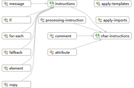

# 방법: 그래프 뷰를 사용하여 스키마 집합의 개요 가져오기
이 항목에서는 사용 하는 방법을 설명는 [그래프 보기](../xml-tools/graph-view.md) 노드 간 관계 및 스키마 집합에 있는 노드의 상위 수준으로 볼 수 있습니다.  
  
### 콘텐츠 모델 뷰에서 새 XSD 파일을 만들고 루트 요소를 표시하려면  
  
1.  새 XML 스키마 파일을 만들고 파일을 Relationships.xsd로 저장합니다.  
  
2.  클릭는 **기본 XML 스키마 파일 표시 및 편집 하려면 XML 편집기를 사용 하 여** 시작 보기에서 링크 합니다.  
  
3.  XML 스키마 샘플 코드를 복사 [샘플 XML 스키마: 관계](../xml-tools/sample-xsd-file-relationships.md) 기본적으로 새 XSD 파일에 추가 된 코드를 붙여 넣습니다.  
  
4.  XML 편집기에서 마우스 오른쪽 단추로 클릭 하 고 선택 **뷰 디자이너**합니다.  
  
5.  XSD 도구 모음에서 그래프 뷰를 선택합니다.  
  
6.  선택 **스키마 집합** XML 스키마 탐색기 및 노드 드래그 뷰의 그래프 뷰의 디자인 화면에서 노드. 모든 전역 노드 및 관계가 설정된 노드를 연결하는 화살표를 볼 수 있어야 합니다.  
  
       
  
7.  디자인 화면의 노드를 클릭하고 이동 경로 탐색 막대를 확인하여 스키마 집합에서 선택한 노드가 위치한 곳을 봅니다.  
  
8.  요소 노드를 선택 하 고 화면의 디자인 단추로 클릭 **샘플 XML 생성** XML 인스턴스 문서를 볼 수 있습니다.