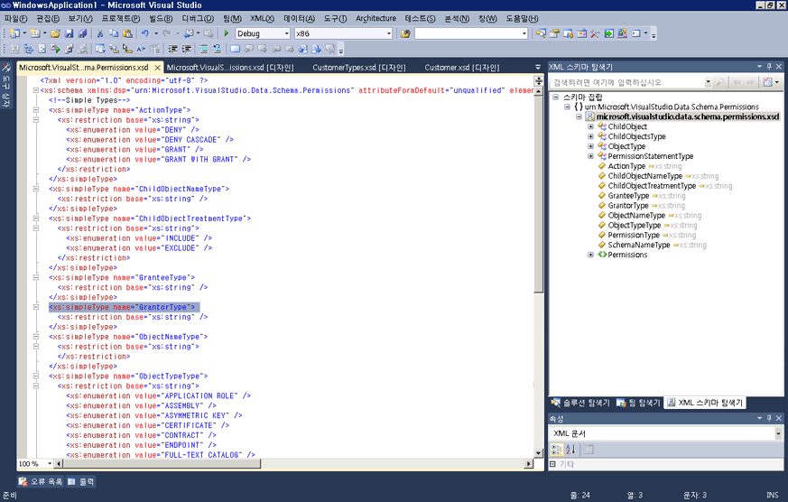
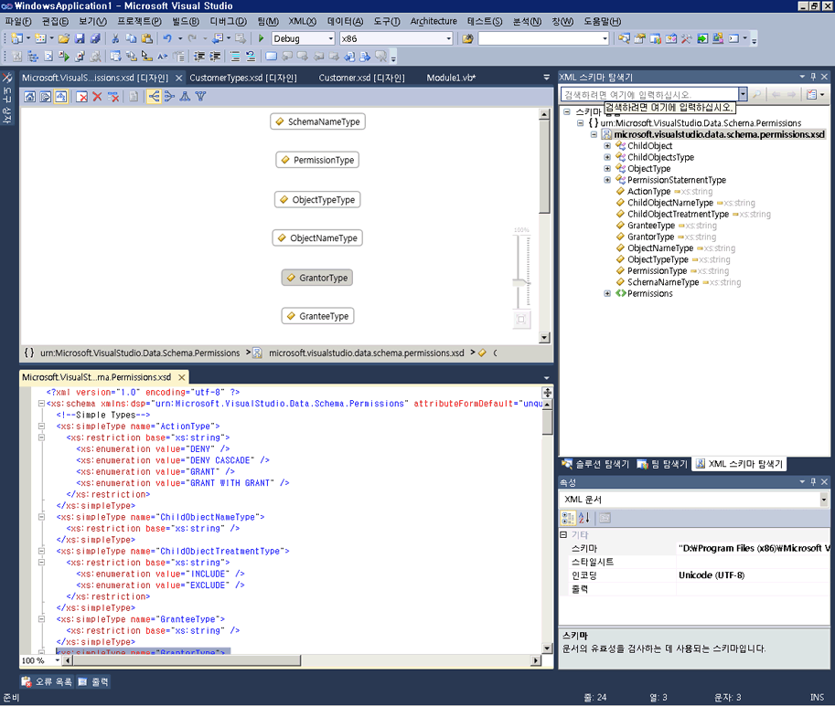

# XML 편집기와의 통합
XML 스키마 디자이너는 XML 편집기와 통합되었습니다. XML 편집기에서 XSD 파일을 수정 하면 변경에 반영 됩니다는 [XML 스키마 탐색기](../xml-tools/xml-schema-explorer.md)합니다. 있는 경우는 [그래프 보기](../xml-tools/graph-view.md) 또는 [콘텐츠 모델 뷰](../xml-tools/content-model-view.md) 열려 변경도 내용이 있습니다. 다음 방법을 사용하여 XML 스키마 디자이너와 XML 편집기 간을 탐색할 수 있습니다.  
  
-   XML 편집기에서 노드를 마우스 오른쪽 단추로 클릭 하 고 선택 **XML 스키마 탐색기에 표시**합니다.  
  
-   그래프 뷰 및 XML 스키마 탐색기에서 노드를 두 번 클릭 하거나 노드를 마우스 오른쪽 단추로 클릭 하 고 선택 **코드 보기**합니다. 콘텐츠 모델 뷰에서 노드를 마우스 오른쪽 단추로 클릭 하 고 선택 **코드 보기**합니다.  
  
다음 스크린 샷에서는 XML 스키마 탐색기에 열린 XML 스키마를 보여 줍니다. XML 스키마 탐색기에서는 스키마 집합을 트리 뷰로 표시합니다. XML 편집기에서는 XML 스키마 탐색기에서 현재 활성화되어 있는 노드의 텍스트 뷰를 표시합니다.  
  
  
  
코드를 XML 편집기 및 그래픽 디자이너에서 나란히 보는 것이 유용한 경우도 있습니다. 두 파일을 동시에 보려면 XML 편집기에서 마우스 오른쪽 단추로 클릭 하 고 선택 **뷰 디자이너**합니다. Visual Studio 창 메뉴에서 선택 **새 가로 (또는 세로) 탭 그룹**합니다.  
  
  
  
## 참고 항목  
 [XML 스키마 탐색기](../xml-tools/xml-schema-explorer.md)