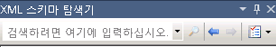
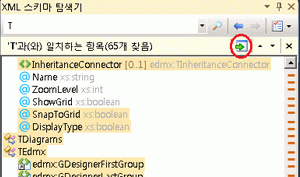

# 스키마 집합 검색

**XML 스키마 탐색기** 다음과 같은 방법으로 설정 된 스키마를 검색할 수 있습니다.

-   키워드 검색

-   스키마 관련 검색

## 키워드 검색

 하위 문자열을 입력 하 여 키워드 검색을 수행할는 **스키마 집합 검색** 텍스트 상자에는 **XML 스키마 탐색기** 도구 모음입니다.

 

 **XML 스키마 탐색기** 다음 특성에 대해 설정 된 스키마를 검색 합니다.

-   지정된 키워드와 일치하는 `name` 또는 `ref` 특성. 이름별 요소, 특성, 유형 및 등을 찾을 수 있습니다.

-   include 문의 `schemaLocation` 특성

-   import 문의 `namespace` 특성

## 스키마 관련 검색

 **XML 스키마 탐색기** 상황에 맞는 메뉴를 사용 하 여 액세스할 수 있는 기본 제공 검색 포함 되어는 **XML 스키마 탐색기**합니다. 사용할 수 있는 상황에 맞는 메뉴에 대 한 자세한 내용은 참조 [상황에 맞는 메뉴](../xml-tools/context-menus-xml-schema-explorer.md)합니다. 시작 뷰에서; 스키마 관련 검색을 실행할 수도 있습니다. 자세한 내용은 "스키마 집합 정보" 섹션을 참조 하십시오.는 [시작 뷰](../xml-tools/start-view.md) 항목입니다.

## 표시 하 고 검색 결과 탐색

 검색이 완료되면 검색 결과와 함께 요약 결과 창이 도구 모음에 추가됩니다. 검색 결과에 강조 표시 됩니다는 **XML 스키마 탐색기** 세로 스크롤 막대의 눈금 표시로 하 고 있습니다. 사용 하 여 검색 결과 탐색할 수 있습니다는 **다음 검색 결과로 이동** 및 **이전 검색 결과로 이동** 단추의 요약 결과 창에는 **XML 스키마 탐색기**삽입 됩니다. 키보드의 키를 사용 하 여 **F3** 및 **Shift**+**F3**; 스크롤 막대의 눈금 표시를 클릭 하 여 합니다.

 검색 결과 클릭 하 여 작업 영역에 추가할 수 있습니다는 **작업 영역에 선택한 노드 추가** 요약 결과 창에서 단추입니다.

 

## 검색 결과 지우기

 검색 결과 지우려면 클릭는 **x** 의 요약 결과 창에서 단추는 **XML 스키마 탐색기** 검색 도구 모음입니다.

## 참고자료

- [XML 스키마 탐색기](../xml-tools/xml-schema-explorer.md)