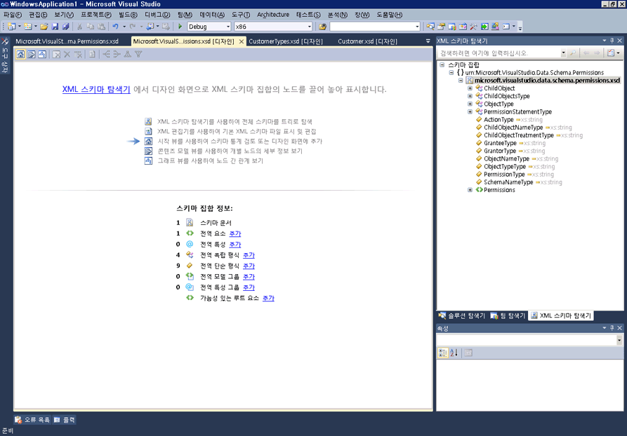

# 시작 뷰

시작 뷰는 XML 스키마(XSD) 디자이너의 시작 지점입니다. 새 XSD 파일을 만들면 처음에 시작 뷰가 보입니다.

시작 뷰에 2 개의 주 섹션의 *워터 마크* 및 **스키마 집합 정보** 창. 또한 모든 XSD 디자이너 뷰에서 사용할 수 있는 도구 모음이 있습니다.

## 워터마크

워터 마크 창에는 모든 XSD 디자이너 뷰, XML 편집기에 대 한 링크 목록을 포함 하 고 **XML 스키마 탐색기**합니다. 스키마 집합에 오류가 있는 경우 목록 끝에 "오류 목록을 사용하여 스키마 집합의 오류 표시 및 수정"이라는 텍스트가 표시됩니다.

## 스키마 집합 정보

**스키마 집합 정보** 창 전역 스키마 노드 유형을 나열 하 고 스키마에 각 형식의 인스턴스 수를 표시 합니다. 사용할 수는 **추가** 작업 영역에 새 노드를 추가할 노드 형식 옆에 있는 링크입니다.

## Toolbar

시작 뷰 간에 탐색할 수 있습니다는 [콘텐츠 모델 뷰](../xml-tools/content-model-view.md) 및 [그래프 보기](../xml-tools/graph-view.md) XML 스키마 디자이너 도구 모음에서 합니다.

시작 뷰가 활성화되면 XSD 디자이너 도구 모음에서 다음 단추가 사용됩니다.

|옵션|설명|
|------------|-----------------|
|**시작 뷰 표시**|시작 뷰로 전환합니다. 바로 가기 키를 사용 하 여이 뷰에 액세스할 수 있습니다: **Ctrl**+**1**합니다.|
|**콘텐츠 모델 뷰 표시**|콘텐츠 모델 뷰로 전환합니다. 바로 가기 키를 사용 하 여이 뷰에 액세스할 수 있습니다: **Ctrl**+**2**합니다.|
|**그래프 뷰 표시**|그래프 뷰로 전환합니다. 바로 가기 키를 사용 하 여이 뷰에 액세스할 수 있습니다: **Ctrl**+**3**합니다.|

## 참고자료

- [XML 스키마 탐색기](../xml-tools/xml-schema-explorer.md)
- [그래프 뷰](../xml-tools/graph-view.md)
- [콘텐츠 모델 뷰](../xml-tools/content-model-view.md)
- [XML 편집기](../xml-tools/xml-editor.md)