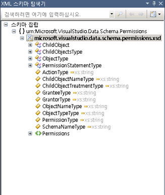

# XML 스키마 탐색기

**XML 스키마 탐색기** 는 XML 스키마 정의 언어 (XSD) 스키마를 작업할 수 있도록 Microsoft Visual Studio 및 XML 편집기와 통합 합니다. XML 스키마 파일을 열 때는 **스키마 집합** 에 표시 된 노드는 **XML 스키마 탐색기**합니다. 대상 파일을 통해 참조 되는 모든 파일에 대 한 모든 포함, 가져오기 또는 다시 정의 된 스키마는 `include` 또는 `import` 문에 표시는 **XML 스키마 탐색기**합니다.

 **XML 스키마 탐색기** 사용 하면 다음을 수행할 수 있습니다.

-   스키마 집합을 간단히 파악할 수 있습니다.

-   트리를 검색하고 탐색합니다.

-   키워드 및 스키마 관련 검색을 수행합니다. 자세한 내용은 참조 [스키마 집합 검색](../xml-tools/searching-the-schema-set.md)합니다.

-   그래프 뷰 또는 콘텐츠 모델 뷰를 검색 결과 추가 합니다.

-   문서 순서, 유형 또는 이름별로 트리를 정렬할 수 있습니다. 자세한 내용은 참조 [정렬, 필터링 및 그룹화](../xml-tools/sorting-filtering-and-grouping-xml-schema-explorer.md)합니다.

-   XML 편집기를 열고 XSD 파일의 코드 위치로 이동할 수 있습니다. 자세한 내용은 참조 [XML 편집기와 통합](../xml-tools/integration-with-xml-editor.md)합니다.

-   전역 요소를 위한 샘플 XML을 생성할 수 있습니다.

**XML 스키마 탐색기** 트리 뷰를 통해 설정 된 스키마의 계층적 뷰를 제공 합니다. **XML 스키마 탐색기** 검색, 필터링, 탐색 및 정렬을 제공 합니다. 액세스는 **XML 스키마 탐색기**, 다음 중 하나를 수행 합니다.

-   사용 중인는 [시작 뷰](../xml-tools/start-view.md), 클릭는 **XML 스키마 탐색기** 링크 합니다.

-   사용 중인는 [그래프 보기](../xml-tools/graph-view.md) 또는 [콘텐츠 모델 뷰](../xml-tools/content-model-view.md) 작업 영역에 노드를 포함할 상황에 맞는 메뉴를 사용 하 여 선택 하 고는 **XML 스키마 탐색기**합니다.

-   선택할 수도 있습니다는 **XML 스키마 탐색기** 에서 **보기** 메뉴.

-   에 액세스할 수 있습니다는 **XML 스키마 탐색기** 에서 *.vb* 와 연결 된 Visual Basic XML 리터럴이 있는 파일은 *.xsd* 파일입니다. 스키마를 보려면 설정는 **XML 스키마 탐색기**의 XML 리터럴 또는 XML 네임 스페이스 가져오기에서 XML 노드를 마우스 오른쪽 단추로 클릭 하 고 선택 된 **스키마 탐색기에 표시** 명령입니다. 자세한 내용은 참조 [XML 스키마 탐색기와 통합의 XML 리터럴을](../xml-tools/integration-of-xml-literals-with-xml-schema-explorer.md)합니다.

## 트리 뷰
 **XML 스키마 탐색기** 표시 합니다. 미리 컴파일된 스키마 트리 구조에서 정보를 설정 합니다. 트리 구조는 다음과 같이 구성됩니다.

-   최상위 수준은 스키마 집합 노드입니다.

-   두 번째 수준에는 네임스페이스가 포함됩니다.

-   세 번째 수준에는 파일이 포함됩니다.

-   네 번째 수준에는 전역 노드가 포함됩니다. 여기에는 요소, 그룹, 복합 형식, 단순 형식, 특성, 특성 그룹 및 `include`, `import` 및 `redefine` 문이 포함될 수 있습니다.

다음은 트리 구조의 예제입니다.

## 선택 및 활성화
 노드를 강조 표시하고 선택하려면 스키마 탐색기에서 한 번 클릭합니다.

 노드를 활성화 하려면 두 번 클릭 하거나 눌러 **Enter** 노드를 선택 합니다.

-   파일이 아직 열려 있지 않은 경우 노드를 활성화하면 이 노드가 정의된 파일이 열리고 파일의 노드가 선택됩니다.

-   파일이 아직 열려 있지 않은 경우 파일 노드를 활성화하면 선택된 파일이 열리고 `<schema>` 노드가 강조 표시됩니다.

-   SchemaSet 또는 네임스페이스 노드를 활성화하는 경우에는 아무 작업도 수행되지 않습니다.

## 노드 끌어서
 전역 노드, 파일 노드 및 네임스페이스 노드를 XSD 디자이너 뷰로 끌어서 놓을 수 있습니다. 현재 보기가 [시작 뷰](../xml-tools/start-view.md)는 노드를 뷰로 끌어 열립니다는 [그래프 보기](../xml-tools/graph-view.md)합니다. 현재 보기가 [콘텐츠 모델 뷰](../xml-tools/content-model-view.md) 또는 그래프 보기에 노드를 삭제 하면 뷰가 변경 되지 것입니다.

 파일 뷰에 놓으면 네임 스페이스 파일에 모든 전역 노드가 추가 [XSD 디자이너 작업 영역](../xml-tools/xml-schema-designer-workspace.md)합니다. 네임스페이스를 뷰에 놓으면 네임스페이스의 모든 전역 노드가 작업 영역에 추가됩니다. 작업 영역은 모든 뷰 간에 공유됩니다.

 로컬 노드 또는 가져오기를 끌어서 놓을 수 없습니다.

## 참고자료

- [방법: XML 스키마 탐색기에서 작업 영역에 노드 추가](../xml-tools/how-to-add-nodes-to-the-workspace-from-the-xml-schema-explorer.md)