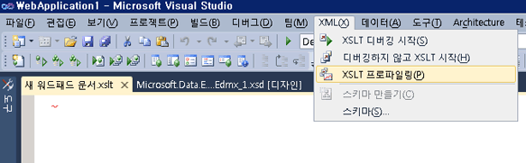

# XSLT 프로파일러
XSLT 프로파일러는 XSLT 문서를 개발하고 디버깅하는 데 도움이 되는 성능 분석 프로파일러 도구입니다. 개발자는 XSLT 프로파일러를 사용하여 자세한 XSLT 성능 보고서를 만들어 XSLT 코드의 성능 관련 문제를 측정 및 평가할 수 있습니다. XSLT 프로파일러에는 최대 성능을 요구하는 XSLT 기반 응용 프로그램에 필수적인 XSL 및 XSLT 스타일시트 최적화에 대한 유용한 힌트가 포함되어 있습니다.  
  
XSLT 프로파일러는 Visual Studio의 일부 이며에서 사용할 수는 **XML** 메뉴.  
  

  
> [!NOTE]
>  일부 화면이 나타날 수 있습니다 다르게 Visual Studio 버전에서 다음이 항목에서 보다 이러한 스크린 샷이 캡처된 이후 일부 시각적 요소가 변경 되었기 때문에.  
  
## 참고 항목  
[연습: XSLT 프로파일러](../xml-tools/walkthrough-xslt-profiler.md)