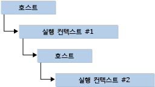

# <a name="hosting-the-javascript-runtime"></a>JavaScript 런타임 호스팅
JavaScript 런타임(JsRT) API를 사용하면 Microsoft Edge 및 Internet Explorer에서도 활용되는 표준 기반의 Chakra JavaScript 엔진을 통해 Windows 운영 체제에서 실행되는 데스크톱, Windows 스토어 및 서버 쪽 응용 프로그램이 앱에 스크립팅 기능을 추가할 수 있습니다. 이러한 API는 컴퓨터에 Internet Explorer 버전 11.0이 설치된 Windows 운영 체제의 모든 버전과 Windows 10에서 사용할 수 있습니다. 자세한 내용은 [Reference (JavaScript Runtime)](../chakra-hosting/reference-javascript-runtime.md)을 참조하십시오. Windows 스토어 앱에서 JsRT를 사용하는 방법에 대한 자세한 내용은 [JsRT and the Universal Windows Platform](#Windows)을 참조하세요.  
  
> [!NOTE]
>  이 문서는 JavaScript 언어에 대한 일반 작업 지식이 있다고 가정합니다.  
  
## <a name="concepts"></a>개념  
 JsRT API를 사용하여 JavaScript 엔진을 호스트하는 방법을 이해하려면 런타임 및 실행 컨텍스트라는 두 가지 주요 개념을 알아야 합니다.  
  
 *런타임* 은 전체 JavaScript 실행 환경을 나타냅니다. 만들어진 각 런타임은 자체 격리된 가비지 수집된 힙과, 기본적으로, 자체 JIT(Just-In-Time) 컴파일러 스레드 및 GC(가비지 수집기) 스레드를 가지고 있습니다. *실행 컨텍스트* 는 다른 모든 실행 컨텍스트와 다른 자체 JavaScript 전역 개체가 있는 JavaScript 환경을 나타냅니다. 한 런타임은 여러 실행 컨텍스트를 포함할 수 있으며, 이런 경우, 모든 실행 컨텍스트는 JIT 컴파일러 및 런타임에 연결된 GC 스레드를 공유합니다.  
  
 런타임은 단일 실행 스레드를 나타냅니다. 한 번에 한 런타임만 특정 스레드에서 활성화될 수 있고 런타임은 한 번에 한 스레드에서만 활성화될 수 있습니다. 런타임은 임대 스레드되므로 현재 스레드에서 활성화되지 않은(즉, 임의의 JavaScript 코드를 실행하지 않거나 호스트의 모든 호출에 응답하지 않는) 런타임은 이미 활성 런타임이 없는 모든 스레드에 사용할 수 있습니다.  
  
 실행 컨텍스트는 특정 런타임 연결되고 해당 런타임 내에서 코드를 실행합니다. 런타임과 달리, 여러 실행 컨텍스트는 동시에 스레드에서 활성화될 수 있습니다. 따라서 호스트는 실행 컨텍스트에 호출할 수 있고, 실행 컨텍스트는 호스트를 다시 호출할 수 있으며, 호스트는 여러 다른 실행 컨텍스트에 호출할 수 있습니다.  
  
   
  
 실제로, 호스트가 분리된 환경에서 코드를 실행해야 하는 경우가 아니면 단일 실행 컨텍스트를 사용할 수 있습니다. 마찬가지로, 호스트가 동시에 코드의 여러 부분을 실행할 필요가 없다면, 단일 런타임으로 충분합니다.  
  
## <a name="memory-management"></a>메모리 관리  
 JavaScript는 가비지 수집 언어이므로, 다른 언어에서 JsRT API를 사용하여 작업할 때 명심해야 할 몇 가지 고려 사항이 있습니다.  
  
 주요 고려 사항은 JavaScript의 가비지 수집기가 두 위치(해당 런타임의 힙 및 스택)에서 값에 대한 참조만 볼 수 있다는 점입니다. 따라서, 다른 JavaScript 값이나 스택의 지역 변수 내에 저장된 JavaScript 값에 대한 참조는 가비지 수집기에 의해 항상 표시됩니다. 그러나 호스트 또는 시스템에서 관리되는 힙과 같은 다른 위치에 저장된 참조는 가비지 수집기로 볼 수 없고 호스트에서 여전히 사용 중인 값의 중간 수집이 될 수 있습니다.  
  
> [!IMPORTANT]
>  일부 언어 컴파일러(예: Visual Studio C++ 컴파일러)에서 가능한 경우 지역 변수를 최적화합니다. JavaScript 값을 참조하는 지역 변수가 해당 값을 그대로 유지해야 할 경우 스택에 있도록 주의를 기울여야 합니다.  
  
 JavaScript 값에 대한 참조가 가비지 수집기에 표시되지 않는 위치에 저장될 경우 호스트는 JsRT API를 사용하여 참조를 수동으로 추가 및 제거해야 합니다.  
  
## <a name="exception-handling"></a>예외 처리  
 JavaScript 예외가 스크립트를 실행하는 동안 발생한다면 포함하는 런타임은 예외 상태에 들어갑니다. 예외 상태에 있는 동안, 호스가 `JsErrorInExceptionState` API를 사용하여 예외를 검색하고 지울 때까지 어떤 코드도 실행할 수 없고 모든 API 호출은 오류 코드 `JsGetAndClearException` 와 함께 실패할 것입니다. 호스트가 예외 상태에서 런타임을 지우지 않고 JavaScript 콜백에서 반환되면 JavaScript 예외는 컨트롤이 JavaScript 엔진에 다시 전달하는 즉시 다시 throw됩니다. 또한 호스트 콜백은 런타임을 예외 상태로 설정하고 호스트 콜백에서 반환되면서 JavaScript 예외를 “throw”할 수 있습니다.  
  
 호스트의 자체 내부 예외는 호스트 콜백으로 전파할 수 없으며, 모든 콜백 메서드는 런타임에 컨트롤을 반환하기 전에 모든 호스트 예외를 catch해야 합니다.  
  
## <a name="runtime-resource-usage"></a>런타임 리소스 사용  
 JsRT API는 런타임이 리소스를 사용하는 방식을 모니터링 및 수정하는 여러 방법을 보여 줍니다. 일반적으로 다음과 같은 범주로 분류합니다.  
  
-   **스레드 사용**. 기본적으로, 각 런타임은 해당 런타임을 처리하는 전용 GC 스레드 및 전용 JIT 컴파일러 스레드를 만듭니다. 런타임이 `JsRuntimeAttributeDisableBackgroundWork` 플래그로 만들어진 경우 JIT 및 GC 작업은 각각의 작업에 대한 별도의 백그라운드 스레드 대신 런타임 스레드 자체에서 수행됩니다. 호스트는 또한 `JsCreateRuntime` 호출에 스레드 서비스 콜백을 제공할 수도 있습니다. 그 결과 호스트에서 적합한 방식으로 JIT 및 GC 작업을 예약할 수 있습니다.  
  
-   **메모리 사용량**. 런타임의 메모리 사용을 모니터링 및 수정하는 데는 여러 가지 방법이 있습니다. 런타임이 오랫동안 실행된다면 호스트는 런타임을 만들 때 `JsRuntimeAttributeEnableIdleProcessing` 플래그를 지정할 수 있고 호스트가 유휴 상태에 있을 때 `JsIdle` 을 호출합니다. 이렇게 하면 엔진에서 일부 메모리 정리 및 부기 작업을 유휴 시간까지 지연할 수 있습니다.  
  
     호스트는 `JsSetRuntimeBeforeCollectCallback`을 호출하여 가비지 수집을 모니터링할 수 있습니다. 또한 `JsSetRuntimeMemoryAllocationCallback`을 호출하여 힙에서 만든 할당을 모니터링할 수도 있습니다. 런타임의 힙에 할당할 공간이 더 필요할 때 이 API는 매 JavaScript 할당을 다시 호출하지 않습니다. 메모리 할당 콜백은 요청을 거부할 수 있으며, 가비지 수집기가 트리거되고 사용할 수 있는 메모리가 없을 경우 런타임에 메모리 부족 오류가 트리거됩니다.  
  
     또한 호스트는 `JsSetRuntimeMemoryLimit` 을 호출하여 런타임이 사용할 수 있는 메모리의 양을 제한할 수도 있습니다. 런타임이 한계에 도달했을 때 가비지 수집을 트리거하고 사용할 수 있는 메모리가 없을 경우 런타임에서 메모리 부족 오류를 throw합니다.  
  
-   **스크립트 중단 및 평가**. 호스트는 `JsDisableRuntimeExecution` 을 호출하여 런타임 내 실행을 종료할 수 있습니다. 이러한 호출은 언제든지 어느 스레드에서나 이루어질 수 있습니다. 스크립트 종료 여부가 코드에 삽입된 가드 포인트의 도달에 따라 달라지기 때문에 스크립트는 정확한 시간이 아닌 아주 짧은 시간이 지난 후 종료할 것입니다. 기본적으로, 종료 가드 포인트는 생성된 코드에 최소한으로 배치되고 무한 루프 같은 모든 상황에 적용되지 않을 수 있습니다. `JsRuntimeAttributeAllowScriptInterrupt` 플래그로 런타임을 만들 경우 런타임에서 성능 오버헤드가 작아지는 대신 무한 루프에 대한 추가 검사를 삽입하게 됩니다.  
  
     호스트가 JIT 컴파일러에서 네이티브 코드의 생성을 허용하지 않고자 한다면 `JsRuntimeAttributeDisableNativeCodeGeneration` 플래그를 지정할 수 있습니다. 호스트는 또한 `JsRuntimeAttributeDisableEval` 플래그를 지정하여 스크립트에서 스크립트 자체를 동적으로 실행하도록 허용하지 않을 수도 있습니다.  
  
## <a name="debugging-and-profiling"></a>디버깅 및 프로파일링  
 JsRT API는 Active 스크립팅 기술을 통해 디버깅 및 프로파일링을 지원합니다.  
  
 Windows 10부터 Chakra JavaScript Engine은 레거시 엔진 및 Edge 엔진을 지원하므로 JsRT에서 두 엔진의 하나를 대상으로 지정할 수 있습니다(자세한 내용은 [Edge와 레거시 엔진을 대상으로 지정하는 경우 비교](../chakra-hosting/targeting-edge-vs-legacy-engines-in-jsrt-apis.md) 참조). Visual Studio의 스크립트 디버그는 레거시 엔진과 Edge 엔진에서 다르게 작동합니다. 레거시 엔진에서는 [IProcessDebugManager 인터페이스](../winscript/reference/iprocessdebugmanager-interface.md) 인스턴스에서 가져올 수 있는 [IDebugApplication 인터페이스](../winscript/reference/idebugapplication-interface.md) 포인터를 호스트에서 제공해야 합니다. Edge 엔진에서는 `IDebugApplication` 이 더 이상 사용되지 않고, Chakra 엔진에서는 사용자가 `IDebugApplication` 을 구현할 필요 없이 Visual Studio 디버거를 통해 네이티브 및 스크립트 디버깅 기능을 사용할 수 있습니다.  
  
 실행 컨텍스트에서 스크립트를 디버그 가능하게 설정하려면 Chakra 엔진이 덜 효율적인 코드 실행 메서드를 사용하도록 전환되어야 합니다. 따라서 디버깅할 수 있는 코드는 일반적으로 디버깅할 수 없는 코드보다 느리게 실행됩니다. 따라서 레거시 엔진에서 호스트는 `IDebugApplication` 를 통해 `JsCreateContext`포인터를 미리 제공하여 처음부터 실행 컨텍스트에서 디버깅을 시작하거나, 디버깅이 필요할 때까지 대기한 다음 `JsStartDebugging`을 호출할 수 있습니다. Edge 엔진에서는 `JsCreateContext` 가 더 이상 `IDebugApplication` 매개 변수를 사용하지 않으므로 `JsStartDebugging` 이 호출되고 나서야 스크립트를 디버그할 수 있습니다. Visual Studio를 사용하여 디버그하는 경우 “스크립트” 디버거 옵션을 사용해야 합니다.  
  
 실행 컨텍스트의 JavaScript 코드는 두 가지 방법 중 하나로 프로파일링할 수 있습니다. 명령줄 Visual Studio 프로파일러(vsperf.exe)를 /js 스위치와 함께 Widnows 8.1 이상 버전에서 사용하여 응용 프로그램에서 실행하는 JavaScript 코드를 중점적으로 다룬 보고서를 생성할 수 있습니다. 혹은 호스트가 직접 `JsStartProfiling` 및 `JsStopProfiling` 을 호출하고 자체 프로파일링을 수행하도록 콜백을 제공할 수 있습니다. 호스트는 `JsEnumerateHeap`API를 호출하여 가비지 수집 힙의 상태를 검사할 수도 있습니다. JsRT의 프로파일링은 레거시 엔진과 Edge 엔진에서 같은 방식으로 작동합니다. 그러나 범용 Windows 앱에서는 JsRT 프로파일링 API(`JsStartProfiling`, `JsStopProfiling`, `JsEnumerateHeap`및 `JsIsEnumeratingHeap`)를 사용할 수 없습니다.  
  
<a name="Windows"></a>   
## <a name="jsrt-and-the-universal-windows-platform"></a>JsRT and the Universal Windows Platform  
 JsRT API를 사용하여 범용 Windows 앱에 스크립팅 기능을 추가할 수 있습니다. JsRT API를 사용하는 범용 Windows 앱은 Edge JSRT API를 대상으로 지정하고, 이 API는 Edge Chakra 엔진을 대상으로 지정합니다. 자세한 내용은 [JsRT API에서 Edge 대 레거시 엔진을 대상으로 지정](../chakra-hosting/targeting-edge-vs-legacy-engines-in-jsrt-apis.md)을 참조하세요. 전체 JsRT API는 범용 프로파일링 및 힙 열거형 지원을 제외하고 Windows 앱에서 사용할 수 있습니다(`JsStartProfiling`, `JsStopProfiling`, `JsEnumerateHeap`및 `JsIsEnumeratingHeap` 은 지원되지 않음).  
  
 JsRT를 사용하면 Edge JsRT API [를 통해 API 네임스페이스를 노출하고 나서 스크립트가](https://msdn.microsoft.com/en-us/library/windows/apps/br211377.aspx) UWP(유니버설 Windows 플랫폼) API `JsProjectWinRTNamespace`에 고유하게 액세스할 수 있습니다. 범용 Windows 응용 프로그램에는 필요한 네임스페이스를 프로젝팅하는 것 외에 다른 설정이 필요하지 않지만 클래식(Win32) Windows 응용 프로그램에서는 이벤트와 비동기 API를 사용하려면 `JsSetProjectionEnqueueCallback` 을 통해 COM으로 초기화된 대리 펌핑 메커니즘을 사용하도록 설정해야 합니다. 다음 Win32 샘플에서는 비동기 UWP API를 사용하여 HTTP 클라이언트를 만들고 다음 URI에서 콘텐츠를 가져옵니다.  
  
```cpp  
typedef struct _jsCall {  
    JsProjectionCallback jsCallback;  
    JsProjectionCallbackContext jsContext;  
    HANDLE event;  
} jsCall;  
  
// Set up delegated pumping mechanism; not necessary in UWP applications.  
jsCall outstandingCall = {};  
CoInitializeEx(nullptr, COINIT_MULTITHREADED);  
JsSetProjectionEnqueueCallback([](JsProjectionCallback jsCallback,   
JsProjectionCallbackContext jsContext, void *callbackState) {  
    jsCall* call = (jsCall*)callbackState;  
    call->jsCallback = jsCallback;  
    call->jsContext = jsContext;  
    SetEvent(call->event);  
    },  
&outstandingCall);  
HANDLE event = CreateEventEx(NULL, NULL, CREATE_EVENT_MANUAL_RESET, EVENT_ALL_ACCESS);  
outstandingCall.event = event;  
  
// Project necessary namespaces.  
JsProjectWinRTNamespace(L"Windows.Foundation");  
JsProjectWinRTNamespace(L"Windows.Web");  
  
// Get content from an Uri.  
JsRunScript(L"var uri = new Windows.Foundation.Uri(\"http://somedatasource.com\"); " \  
    L"var httpClient = new Windows.Web.Http.HttpClient();" \  
    L"httpClient.getStringAsync(uri).done(function (content) { " \  
    L"    // do something with the string content " \    
    L"}, onError); " \  
    L"function onError(reason) { " \  
    L"    // error handling " \        
    L"}",   
    currentSourceContext, L"", &result);  
  
// Wait for async call to come in and then execute; not necessary in UWP applications.  
WaitForSingleObjectEx(outstandingCall.event, 10000, FALSE) == WAIT_OBJECT_0;  
outstandingCall.jsCallback(outstandingCall.jsContext);  
  
```  
  
## <a name="see-also"></a>참고 항목  
 [JavaScript 런타임 샘플 앱](http://go.microsoft.com/fwlink/p/?LinkID=306674&clcid=0x409)   
 [참조(JavaScript 런타임)](../chakra-hosting/reference-javascript-runtime.md)   
 [JavaScript 런타임 호스트](../chakra-hosting/javascript-runtime-hosting.md)
